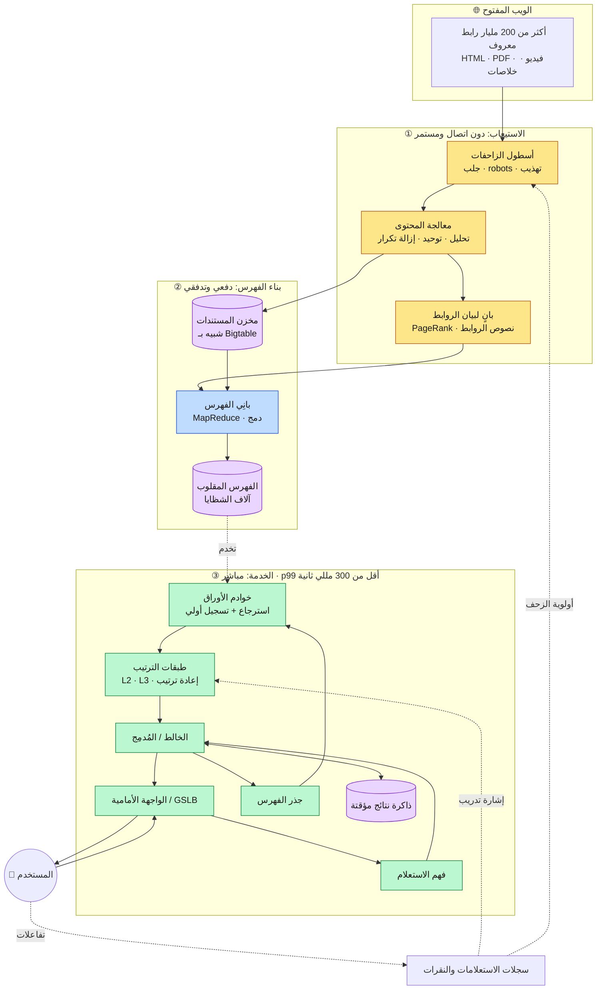
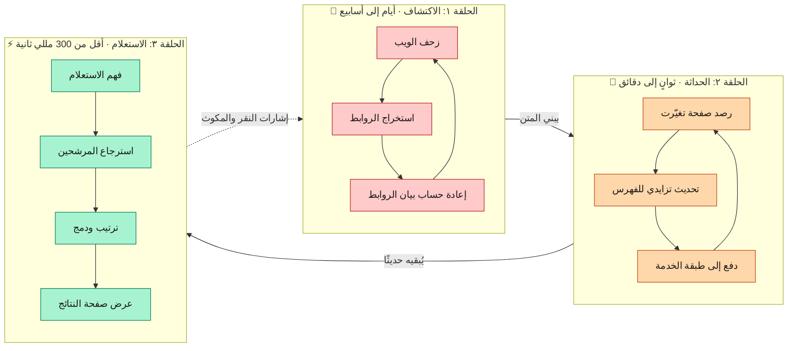
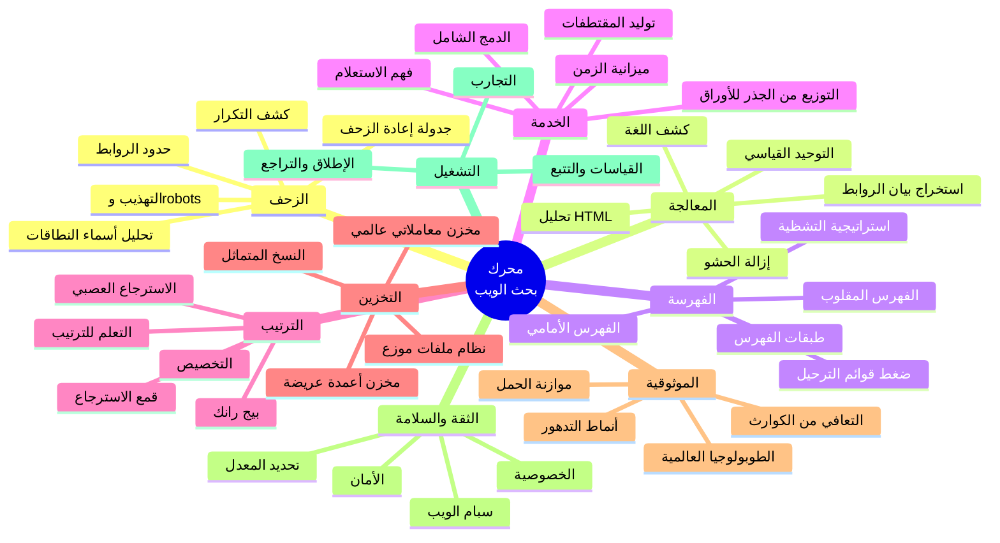
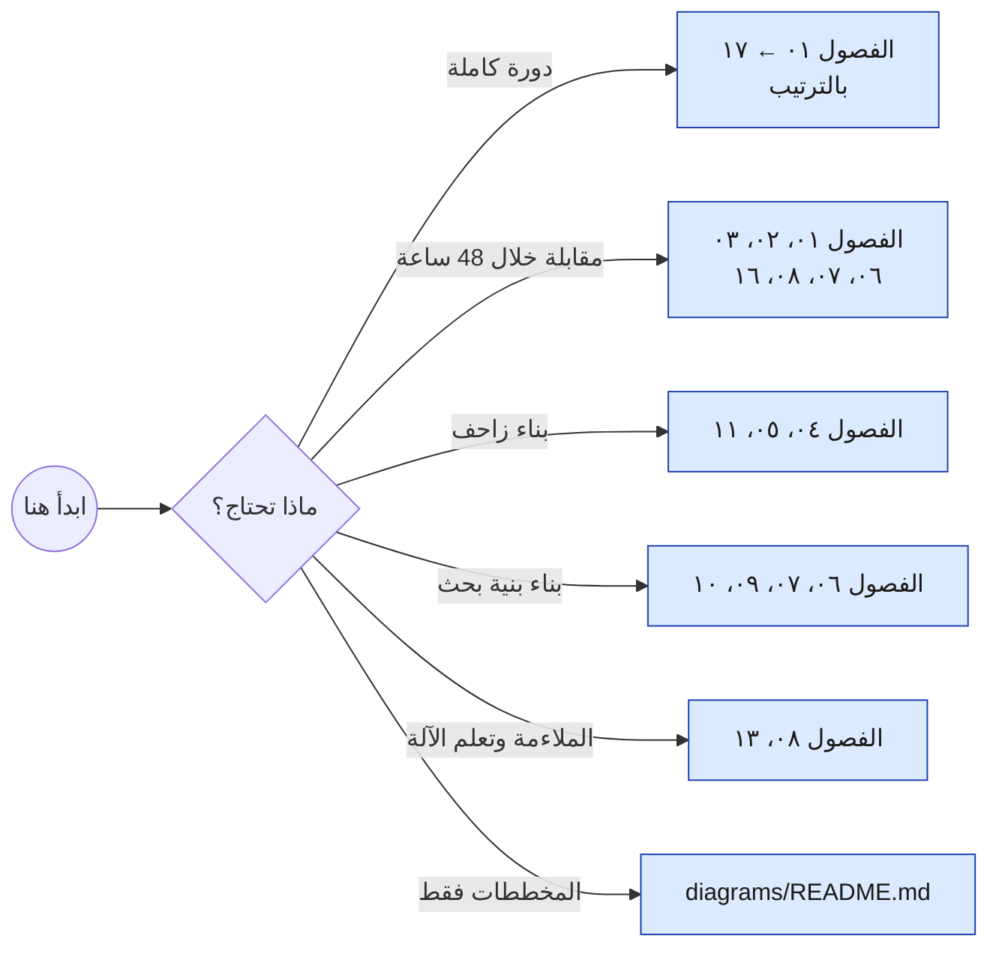

<div align="center">

# 🔍 محرك بحث جوجل: تصميم النظام والمعمارية

### شرح عميق قائم على المخططات لكيفية بناء محرك بحث بحجم الكوكب

**[🇬🇧 English](README.md) · [🇸🇦 العربية](README.ar.md)**

[](LICENSE)
[](docs/ar/01-overview.md)
[](diagrams/README.md)
[](README.md)

</div>

---

<div dir="rtl" align="right">

> **نبذة**: يعيد هذا المستودع بناء معمارية محرك بحث بحجم الويب انطلاقًا من المبادئ الأولى والأبحاث المنشورة: الزحف (Crawling)، والفهرسة (Indexing)، والترتيب (Ranking)، والخدمة (Serving)، والتخزين، والموثوقية، والدفاع ضد إساءة الاستخدام. كل نظام فرعي مشروح نصيًا **ومرسوم** بمخطط Mermaid يُعرض مباشرةً داخل GitHub دون أي أدوات إضافية.

---

## 📑 المحتويات

- [ما هذا المستودع وما ليس هو](#-ما-هذا-المستودع-وما-ليس-هو)
- [النظرة الشاملة](#-النظرة-الشاملة)
- [الحلقات الثلاث](#-الحلقات-الثلاث)
- [خريطة النظام كاملًا](#️-خريطة-النظام-كاملًا)
- [الفصول](#-الفصول)
- [الأرقام في لمحة](#-الأرقام-في-لمحة)
- [كيف تقرأ هذا المستودع](#-كيف-تقرأ-هذا-المستودع)
- [عرض المخططات محليًا](#️-عرض-المخططات-محليًا)
- [المصادر](#-المصادر)
- [المساهمة](#-المساهمة)
- [الترخيص](#-الترخيص)

---

## 🎯 ما هذا المستودع وما ليس هو

**هذا المستودع** دراسة تعليمية هندسية جادة في تصميم الأنظمة. بُني بالكامل من مواد متاحة للعموم: الأوراق البحثية التي نشرتها جوجل نفسها (GFS، MapReduce، Bigtable، Spanner، Percolator، Dapper، Borg، Maglev)، وأدبيات استرجاع المعلومات الأكاديمية، والمحاضرات الهندسية العلنية: مدموجة في معمارية واحدة متماسكة قابلة للتدريس.

**وهذا المستودع ليس** تسريبًا، ولا وثيقة داخلية، ولا ادعاءً بأن أنظمة جوجل الإنتاجية مبنية هكذا **اليوم**. البنية الداخلية الحقيقية مملوكة للشركة، وقد تطوّرت كثيرًا بعد نشر تلك الأوراق. كل رقم في هذا المستودع هو **تقدير من رتبة المقدار** يُستخدم للاستدلال على الحجم، ومُعلَّم بوضوح على هذا الأساس.

استخدمه للتعلّم، أو للاستعداد لمقابلات تصميم الأنظمة، أو للتدريس، أو كمعمارية مرجعية لبناء بنية بحث خاصة بك.

---

## 🌍 النظرة الشاملة

> **المخطط D-01 · السياق العام للنظام من طرف إلى طرف**

</div>



<div dir="rtl" align="right">

المحرك كله ثلاثة خطوط أنابيب يربط بينها نظاما تخزين. وكل ما تبقّى في هذا المستودع ما هو إلا تكبير لأحد تلك الصناديق.

---

## 🔄 الحلقات الثلاث

محرك البحث ليس خط أنابيب واحدًا، بل **ثلاث حلقات تعمل بسرعات ساعة متباينة تمامًا**. والخلط بينها هو الخطأ الأشيع في مقابلات تصميم الأنظمة.

> **المخطط D-02 · سرعات الساعة الثلاث**

</div>



<div dir="rtl" align="right">

| الحلقة | ميزانية الزمن | مُحسَّنة من أجل | تحمّل الأعطال |
|---|---|---|---|
| **الاكتشاف** | أيام ← أسابيع | الإنتاجية والتغطية | عالٍ جدًا: أعِد المحاولة غدًا |
| **الحداثة** | ثوانٍ ← دقائق | تقليل تضخيم الكتابة | عالٍ: التقادم محتمَل |
| **الاستعلام** | أقل من 300 مللي ثانية عند p99 | زمن الذيل والإتاحة | شبه معدوم: تدهور تدريجي لا فشل |

---

## 🗺️ خريطة النظام كاملًا

> **المخطط D-03 · خريطة ذهنية لكل نظام فرعي يغطيه المستودع**

</div>



<div dir="rtl" align="right">

---

## 📚 الفصول

كل فصل متوفر بالإنجليزية والعربية. اقرأها بالترتيب لتحصل على دورة كاملة، أو اقفز مباشرةً إلى النظام الفرعي الذي يهمّك.

| # | الفصل | العربية | English | المخططات |
|---|---------|:-------:|:-------:|:--------:|
| ٠١ | نظرة عامة وتأطير المشكلة | [AR](docs/ar/01-overview.md) | [EN](docs/en/01-overview.md) | ٤ |
| ٠٢ | المتطلبات وأهداف مستوى الخدمة | [AR](docs/ar/02-requirements.md) | [EN](docs/en/02-requirements.md) | ٤ |
| ٠٣ | تقدير السعة | [AR](docs/ar/03-capacity-estimation.md) | [EN](docs/en/03-capacity-estimation.md) | ٣ |
| ٠٤ | الزحف وحدود الروابط | [AR](docs/ar/04-crawling.md) | [EN](docs/en/04-crawling.md) | ٦ |
| ٠٥ | معالجة المحتوى | [AR](docs/ar/05-content-processing.md) | [EN](docs/en/05-content-processing.md) | ٥ |
| ٠٦ | الفهرسة والفهرس المقلوب | [AR](docs/ar/06-indexing.md) | [EN](docs/en/06-indexing.md) | ٧ |
| ٠٧ | مسار خدمة الاستعلام | [AR](docs/ar/07-serving.md) | [EN](docs/en/07-serving.md) | ٦ |
| ٠٨ | الترتيب والملاءمة | [AR](docs/ar/08-ranking.md) | [EN](docs/en/08-ranking.md) | ٧ |
| ٠٩ | بنية التخزين التحتية | [AR](docs/ar/09-storage.md) | [EN](docs/en/09-storage.md) | ٥ |
| ١٠ | استراتيجية التخزين المؤقت | [AR](docs/ar/10-caching.md) | [EN](docs/en/10-caching.md) | ٤ |
| ١١ | الحداثة والفهرسة اللحظية | [AR](docs/ar/11-freshness.md) | [EN](docs/en/11-freshness.md) | ٤ |
| ١٢ | الموثوقية والطوبولوجيا العالمية | [AR](docs/ar/12-reliability.md) | [EN](docs/en/12-reliability.md) | ٥ |
| ١٣ | المراقبة والتجريب | [AR](docs/ar/13-observability.md) | [EN](docs/en/13-observability.md) | ٤ |
| ١٤ | السبام وإساءة الاستخدام والأمان | [AR](docs/ar/14-security-abuse.md) | [EN](docs/en/14-security-abuse.md) | ٤ |
| ١٥ | المفاضلات والبدائل | [AR](docs/ar/15-tradeoffs.md) | [EN](docs/en/15-tradeoffs.md) | ٣ |
| ١٦ | دليل مقابلة تصميم الأنظمة | [AR](docs/ar/16-interview-guide.md) | [EN](docs/en/16-interview-guide.md) | ٣ |
| ١٧ | معجم ثنائي اللغة | [AR](docs/ar/17-glossary.md) | [EN](docs/en/17-glossary.md) | ١ |

📐 **[فهرس المخططات الكامل ←](diagrams/README.md)**

---

## 📊 الأرقام في لمحة

كل الأرقام **تقديرات من رتبة المقدار مبنية على مصادر عامة** للاستدلال على الحجم، وليست قيمًا مقيسة من جوجل. الاشتقاق الكامل في [الفصل ٠٣](docs/ar/03-capacity-estimation.md).

| الكمية | التقدير العملي | لماذا يهم |
|---|---:|---|
| الصفحات في الفهرس | ~10¹¹ (100 مليار) | يحدد عدد الشظايا وحجم الفهرس |
| الروابط المعروفة غير المفهرسة | ~10¹²+ | يجب أن تُرتّب الحدود بالأولوية لا أن تعدّها |
| متوسط نص الصفحة بعد إزالة الحشو | ~10 كيلوبايت | يحدد بصمة مخزن المستندات |
| المتن الخام مع التاريخ مضغوطًا | عشرات البيتابايت | يستلزم نظام ملفات موزعًا |
| الفهرس المقلوب الموضعي | ~225 تيرابايت | يجب أن يقيم في الذاكرة عبر أسطول |
| كل البيانات المقيمة في الخدمة، نسخة واحدة | ~600 تيرابايت | الفهرس + الفهرس الأمامي + المتجهات |
| الاستعلامات في الثانية (متوسط عالمي) | ~100 ألف | يحدد عدد نسخ الخدمة |
| نسبة الذروة إلى المتوسط | ~٣× | تخطيط الهامش |
| هدف الزمن من طرف إلى طرف | p99 أقل من 300 مللي ثانية | يفرض التوزيع المتوازي |
| خوادم الأوراق لكل استعلام | آلاف | مشكلة «الذيل عند الحجم» |
| نسبة إصابة ذاكرة النتائج | ~30–60٪ | تزيل ثلث تكلفة الخدمة |
| معدل الزحف | ~10⁹–10¹⁰ جلب/يوم | محكوم بالتهذيب لا بعرض النطاق |

---

## 🧭 كيف تقرأ هذا المستودع

</div>



<div dir="rtl" align="right">

**الاصطلاحات المستخدمة:**

- 🟨 الصناديق **الكهرمانية** = مكوّنات دون اتصال / دفعية
- 🟦 الصناديق **الزرقاء** = بناء الفهرس
- 🟩 الصناديق **الخضراء** = مسار الخدمة المباشر
- 🟪 الأسطوانات **البنفسجية** = تخزين دائم
- كل مخطط يحمل معرّفًا ثابتًا (`D-01` … `D-78`) ليمكن الإشارة إليه من أي مكان.
- كل رقم موسوم بأنه *تقدير* ما لم يأتِ من ورقة بحثية مذكورة.

---

## 🛠️ عرض المخططات محليًا

يعرض GitHub مخططات Mermaid تلقائيًا: لا تحتاج إلى أي شيء لقراءة المستودع. وإن أردت تصدير PNG/SVG (للعروض التقديمية أو الطباعة):

</div>

```bash
npm install -g @mermaid-js/mermaid-cli
```

```bash
mmdc -i diagrams/D-01-end-to-end-system-context.mmd -o assets/rendered/D-01.svg -t dark -b transparent
```

<div dir="rtl" align="right">

---

## 📖 المصادر

المعمارية مُركَّبة من مواد عامة. أهم المراجع:

| الورقة / المحاضرة | السنة | ما تؤسّسه |
|---|:--:|---|
| برين وبيدج، *تشريح محرك بحث نصي فائق واسع النطاق* | ١٩٩٨ | الزاحف والفهرس وPageRank الأصلي |
| باروسو ودين وهولزل، *بحث الويب لكوكب كامل* | ٢٠٠٣ | معمارية العناقيد وأطروحة العتاد التجاري |
| غيماوات وآخرون، *نظام ملفات جوجل* | ٢٠٠٣ | تخزين موزع موجّه للإلحاق |
| دين وغيماوات، *MapReduce* | ٢٠٠٤ | بناء الفهرس الدفعي |
| تشانغ وآخرون، *Bigtable* | ٢٠٠٦ | مخزن الزحف والمستندات ذو الأعمدة العريضة |
| بوروز، *خدمة القفل Chubby* | ٢٠٠٦ | التنسيق وانتخاب القائد |
| دين، *تحديات بناء أنظمة استرجاع معلومات ضخمة* | ٢٠٠٩ | طبقات الفهرس وتطور الخدمة |
| بينغ ودابك، *Percolator* | ٢٠١٠ | الفهرسة التزايدية والحداثة |
| سيغلمان وآخرون، *Dapper* | ٢٠١٠ | التتبع الموزع |
| كوربيت وآخرون، *Spanner* | ٢٠١٢ | بيانات وصفية متسقة عالميًا |
| دين وباروسو، *الذيل عند الحجم* | ٢٠١٣ | تخفيف زمن الذيل |
| فيرما وآخرون، *Borg* | ٢٠١٥ | جدولة العناقيد |
| سينغ وآخرون، *صعود جوبيتر* | ٢٠١٥ | نسيج شبكة مركز البيانات |
| أيزنبود وآخرون، *Maglev* | ٢٠١٦ | موازنة الحمل البرمجية |

الببليوغرافيا الكاملة: [الفصل ١٧؛ المعجم والمصادر](docs/ar/17-glossary.md).

---

## 🤝 المساهمة

التصويبات والمخططات الأفضل وتحسينات اللغة العربية كلها مرحّب بها. راجع [CONTRIBUTING.md](CONTRIBUTING.md).

إن وجدت خطأً واقعيًا (خصوصًا إن بالغتُ في الادعاء بشأن بنية جوجل الداخلية الحقيقية) فافتح Issue. الدقة فيما هو **معلن** أهم هنا من الاكتمال.

---

## 📄 الترخيص

[MIT](LICENSE) © 2026 أحمد سليم منصور. حر الاستخدام للتدريس والدراسة والمرجعية.

</div>

<div align="center">

**⭐ إن ساعدك هذا على فهم البحث عند الحجم الضخم، فالنجمة تساعد غيرك على إيجاده.**

[🇬🇧 English](README.md) · [🇸🇦 العربية](README.ar.md) · [📐 المخططات](diagrams/README.md) · [📚 ابدأ القراءة](docs/ar/01-overview.md)

</div>
