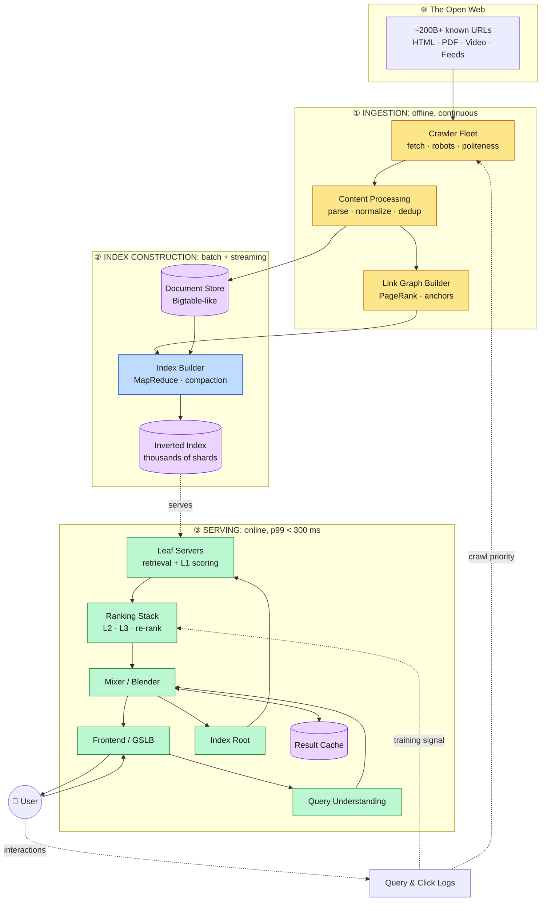
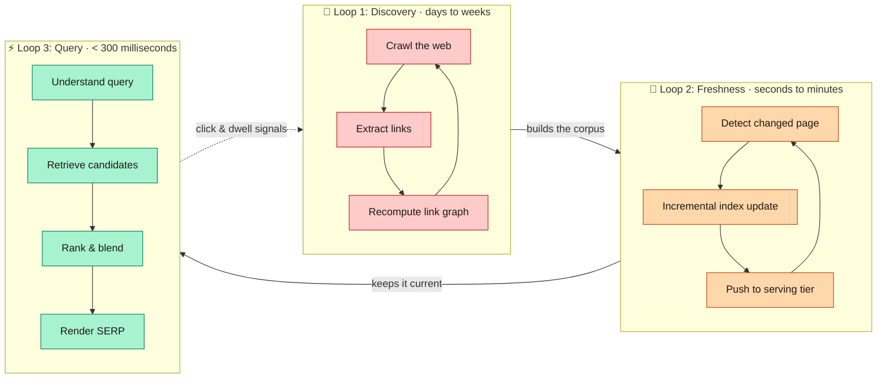
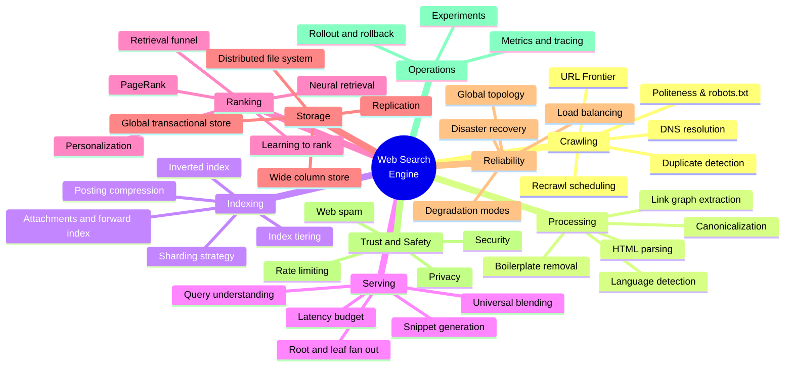
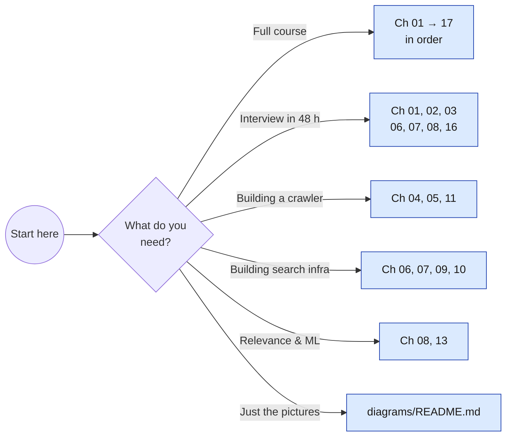

<div align="center">

# 🔍 Google Search: System Design & Architecture

### A deep, diagram-first walkthrough of how a planet-scale web search engine is built

**[🇬🇧 English](README.md) · [🇸🇦 العربية](README.ar.md)**

[](LICENSE)
[](docs/en/01-overview.md)
[](diagrams/README.md)
[](README.ar.md)
[](CONTRIBUTING.md)

</div>

---

> **English**: This repository reconstructs, from first principles and published research, the architecture of a web-scale search engine: crawling, indexing, ranking, serving, storage, reliability and abuse defence. Every subsystem is explained in prose **and** drawn as a Mermaid diagram that renders directly on GitHub.
>
> **العربية**: يعيد هذا المستودع بناء معمارية محرك بحث بحجم الويب من المبادئ الأولى والأبحاث المنشورة: الزحف، والفهرسة، والترتيب، والخدمة، والتخزين، والموثوقية، والدفاع ضد إساءة الاستخدام. كل نظام فرعي مشروح نصيًا **ومرسوم** بمخطط Mermaid يُعرض مباشرة على GitHub. 👈 [**اقرأ النسخة العربية الكاملة**](README.ar.md)

---

## 📑 Table of Contents

- [What this is (and is not)](#-what-this-is-and-is-not)
- [The 30,000-foot view](#-the-30000-foot-view)
- [The three loops](#-the-three-loops)
- [Chapters](#-chapters)
- [Diagram index](#-diagram-index)
- [Numbers at a glance](#-numbers-at-a-glance)
- [How to read this repo](#-how-to-read-this-repo)
- [Rendering the diagrams locally](#-rendering-the-diagrams-locally)
- [Sources](#-sources)
- [Contributing](#-contributing)
- [License](#-license)

---

## 🎯 What this is (and is not)

**This is** an educational, engineering-grade system design study. It is built from publicly available material: Google's own published papers (GFS, MapReduce, Bigtable, Spanner, Percolator, Dapper, Borg, Maglev), academic information-retrieval literature, and public engineering talks: combined into one coherent, teachable architecture.

**This is not** a leak, an internal document, or a claim about how Google's production systems are wired *today*. Real internals are proprietary and have evolved far beyond the published papers. Every number in this repo is an **order-of-magnitude estimate** used for capacity reasoning, clearly marked as such.

Use it to learn, to prepare for system design interviews, to teach, or as a reference architecture for building your own search infrastructure.

---

## 🌍 The 30,000-foot view

> **Diagram D-01 · End-to-end system context**



The whole engine is three pipelines glued by two storage systems. Everything else in this repository is a zoom-in on one of those boxes.

---

## 🔄 The three loops

A search engine is not one pipeline: it is **three loops running at wildly different clock speeds**. Confusing them is the single most common mistake in system design interviews.

> **Diagram D-02 · The three clock speeds**



| Loop | Latency budget | Optimised for | Failure tolerance |
|---|---|---|---|
| **Discovery** | days → weeks | throughput, coverage | very high: retry tomorrow |
| **Freshness** | seconds → minutes | low write amplification | high: stale is survivable |
| **Query** | < 300 ms p99 | tail latency, availability | ~zero: degrade, never fail |

---

## 🗺️ The whole system as one map

> **Diagram D-03 · Mindmap of every subsystem covered in this repo**



---

## 📚 Chapters

Each chapter exists in **English** and **Arabic**. Read them in order for a full course, or jump straight to the subsystem you care about.

| # | Chapter | English | العربية | Diagrams |
|---|---------|:-------:|:-------:|:--------:|
| 01 | Overview & Problem Framing | [EN](docs/en/01-overview.md) | [AR](docs/ar/01-overview.md) | 4 |
| 02 | Requirements & SLOs | [EN](docs/en/02-requirements.md) | [AR](docs/ar/02-requirements.md) | 4 |
| 03 | Capacity Estimation | [EN](docs/en/03-capacity-estimation.md) | [AR](docs/ar/03-capacity-estimation.md) | 3 |
| 04 | Crawling & the URL Frontier | [EN](docs/en/04-crawling.md) | [AR](docs/ar/04-crawling.md) | 6 |
| 05 | Content Processing | [EN](docs/en/05-content-processing.md) | [AR](docs/ar/05-content-processing.md) | 5 |
| 06 | Indexing & the Inverted Index | [EN](docs/en/06-indexing.md) | [AR](docs/ar/06-indexing.md) | 7 |
| 07 | Query Serving Path | [EN](docs/en/07-serving.md) | [AR](docs/ar/07-serving.md) | 6 |
| 08 | Ranking & Relevance | [EN](docs/en/08-ranking.md) | [AR](docs/ar/08-ranking.md) | 7 |
| 09 | Storage Infrastructure | [EN](docs/en/09-storage.md) | [AR](docs/ar/09-storage.md) | 5 |
| 10 | Caching Strategy | [EN](docs/en/10-caching.md) | [AR](docs/ar/10-caching.md) | 4 |
| 11 | Freshness & Real-Time Indexing | [EN](docs/en/11-freshness.md) | [AR](docs/ar/11-freshness.md) | 4 |
| 12 | Reliability & Global Topology | [EN](docs/en/12-reliability.md) | [AR](docs/ar/12-reliability.md) | 5 |
| 13 | Observability & Experimentation | [EN](docs/en/13-observability.md) | [AR](docs/ar/13-observability.md) | 4 |
| 14 | Web Spam, Abuse & Security | [EN](docs/en/14-security-abuse.md) | [AR](docs/ar/14-security-abuse.md) | 4 |
| 15 | Trade-offs & Alternatives | [EN](docs/en/15-tradeoffs.md) | [AR](docs/ar/15-tradeoffs.md) | 3 |
| 16 | System Design Interview Guide | [EN](docs/en/16-interview-guide.md) | [AR](docs/ar/16-interview-guide.md) | 3 |
| 17 | Bilingual Glossary | [EN](docs/en/17-glossary.md) | [AR](docs/ar/17-glossary.md) | 1 |

📐 **[Full diagram index →](diagrams/README.md)**

---

## 📊 Numbers at a glance

All figures are **public-domain order-of-magnitude estimates** for reasoning about scale, not measured Google values. Full derivations in [Chapter 03](docs/en/03-capacity-estimation.md).

| Quantity | Working estimate | Why it matters |
|---|---:|---|
| Pages in the index | ~10¹¹ (100 B) | Sets shard count and index size |
| URLs *known* but unindexed | ~10¹²+ | Frontier must prioritise, not enumerate |
| Average page text after boilerplate strip | ~10 KB | Drives document-store footprint |
| Raw corpus + history (compressed) | ~10s of PB | Needs a distributed file system |
| Positional inverted index | ~225 TB | Must be RAM-resident across a fleet |
| All serving-resident data, one copy | ~600 TB | Index + forward index + vectors |
| Queries per second (global avg) | ~100 K QPS | Sets serving replica count |
| Peak-to-average ratio | ~3× | Headroom planning |
| End-to-end latency SLO | p99 < 300 ms | Forces parallel fan-out |
| Leaf servers touched per query | 1,000s | Tail-at-scale problem |
| Result-cache hit rate | ~30–60 % | Removes a third of all serving cost |
| Crawl rate | ~10⁹–10¹⁰ fetches/day | Politeness-bounded, not bandwidth-bounded |

---

## 🧭 How to read this repo



**Conventions used throughout:**

- 🟨 **Amber** boxes = offline / batch components
- 🟦 **Blue** boxes = index construction
- 🟩 **Green** boxes = online serving path
- 🟪 **Purple** cylinders = persistent storage
- Every diagram carries a stable ID (`D-01` … `D-78`) so it can be cited from anywhere.
- Every number is labelled *estimate* unless it comes from a cited paper.

---

## 🛠️ Rendering the diagrams locally

GitHub renders Mermaid natively: you do not need to do anything to read this repo. If you want PNG/SVG exports (for slides, print, or a talk):

```bash
npm install -g @mermaid-js/mermaid-cli
```

```bash
mmdc -i docs/en/01-overview.md -o assets/rendered/01-overview.md
```

To export a single standalone diagram from the `diagrams/` folder:

```bash
mmdc -i diagrams/D-01-end-to-end-system-context.mmd -o assets/rendered/D-01.svg -t dark -b transparent
```

---

## 📖 Sources

This architecture is synthesised from public material. Primary references:

| Paper / Talk | Year | What it grounds |
|---|:--:|---|
| Brin & Page, *The Anatomy of a Large-Scale Hypertextual Web Search Engine* | 1998 | Original crawler, index and PageRank |
| Barroso, Dean, Hölzle, *Web Search for a Planet* | 2003 | Cluster architecture, commodity hardware thesis |
| Ghemawat et al., *The Google File System* | 2003 | Append-oriented distributed storage |
| Dean & Ghemawat, *MapReduce* | 2004 | Batch index construction |
| Chang et al., *Bigtable* | 2006 | Wide-column crawl and document store |
| Burrows, *The Chubby Lock Service* | 2006 | Coordination, leader election |
| Dean, *Challenges in Building Large-Scale IR Systems* | 2009 | Index tiering, serving evolution |
| Peng & Dabek, *Percolator* | 2010 | Incremental indexing, freshness |
| Sigelman et al., *Dapper* | 2010 | Distributed tracing |
| Corbett et al., *Spanner* | 2012 | Globally consistent metadata |
| Dean & Barroso, *The Tail at Scale* | 2013 | Tail latency mitigation |
| Verma et al., *Borg* | 2015 | Cluster scheduling |
| Singh et al., *Jupiter Rising* | 2015 | Datacenter network fabric |
| Eisenbud et al., *Maglev* | 2016 | Software load balancing |

Full annotated bibliography: [Chapter 17; Glossary & Sources](docs/en/17-glossary.md).

---

## 🤝 Contributing

Corrections, better diagrams and Arabic-language improvements are all welcome. See [CONTRIBUTING.md](CONTRIBUTING.md).

If you find a factual error (especially one where I have over-claimed about real Google internals) please open an issue. Accuracy about *what is public* matters more here than completeness.

---

## 📄 License

[MIT](LICENSE) © 2026 Ahmed Selim Mansor. Free to use for teaching, study and reference.

<div align="center">

**⭐ If this helped you understand search at scale, a star helps others find it.**

[🇬🇧 English](README.md) · [🇸🇦 العربية](README.ar.md) · [📐 Diagrams](diagrams/README.md) · [📚 Start reading](docs/en/01-overview.md)

</div>
