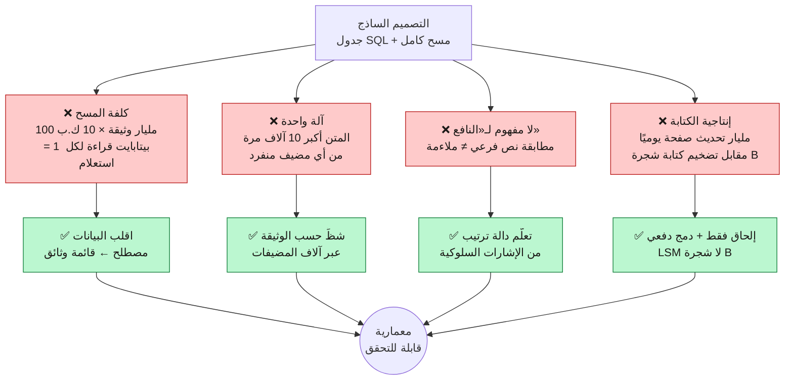
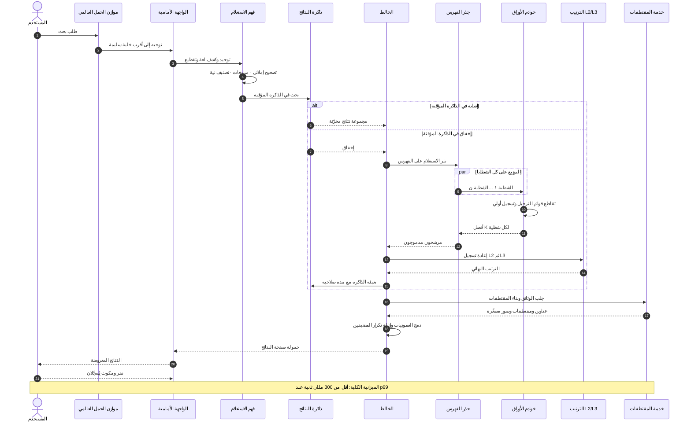
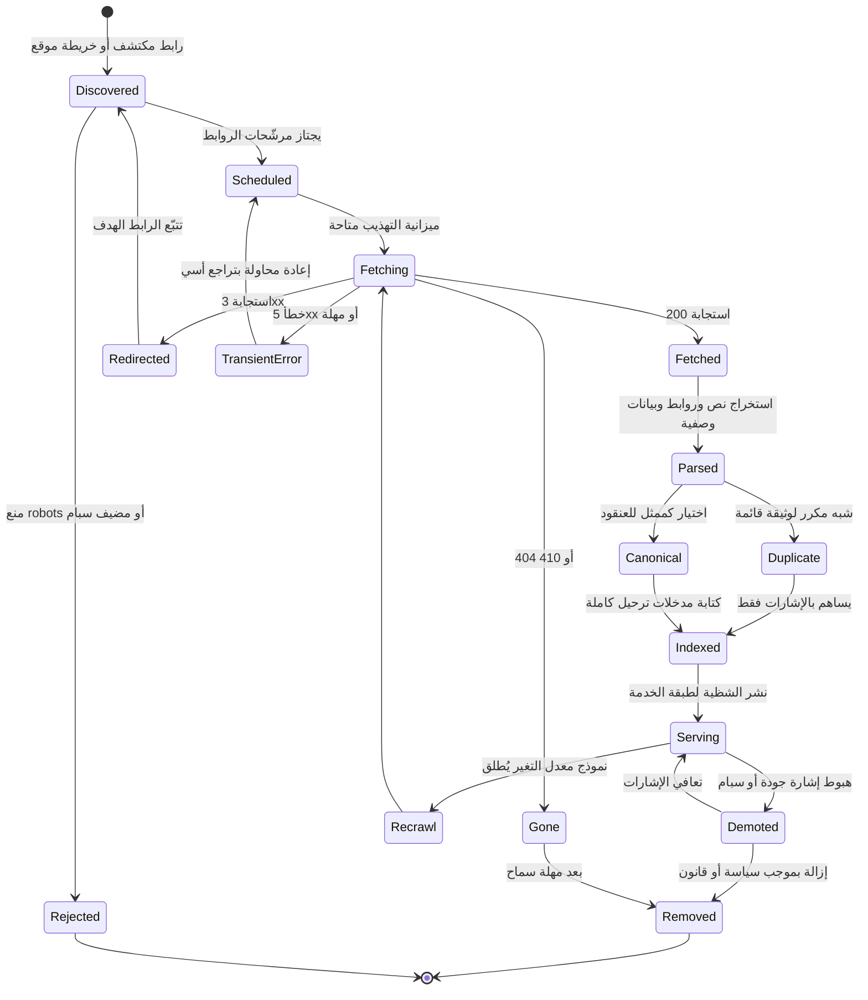
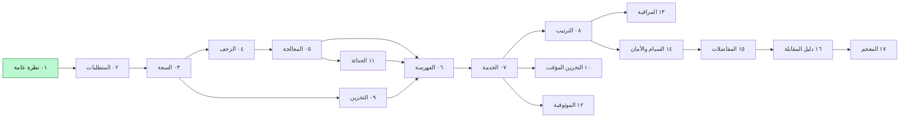

**[🇬🇧 Read in English](../en/01-overview.md)**

# الفصل ٠١ · نظرة عامة وتأطير المشكلة

[🏠 الرئيسية](../../README.ar.md) · **التالي ← [٠٢ · المتطلبات وأهداف مستوى الخدمة](02-requirements.md)**

---

## ١.١ صياغة المشكلة بصدق

> *«بالنظر إلى تتابع عشوائي من المحارف يكتبه إنسان، أعِد (خلال ربع ثانية) أنفعَ عشر وثائق من متنٍ يضم مئة مليار وثيقة؛ وذلك بينما المتن يتغيّر من تحتك، وبينما جزء من آلاتك معطّل، وبينما خصمٌ جيّد التمويل يحاول بنشاط تسميم النتائج.»*

كل جزء صعب في النظام موجود سلفًا في هذه الجملة. فلنفكّكها.

| العبارة في المشكلة | النظام الفرعي الذي تفرضه | الفصل |
|---|---|---|
| *«متن يضم مئة مليار»* | الزاحف + التخزين الموزّع | [٠٤](04-crawling.md)، [٠٩](09-storage.md) |
| *«تتابع عشوائي من المحارف»* | فهم الاستعلام والتصحيح الإملائي والمرادفات | [٠٧](07-serving.md) |
| *«أنفع عشر وثائق»* | الترتيب، وهو المنتج الحقيقي | [٠٨](08-ranking.md) |
| *«خلال ربع ثانية»* | التشظية والتوزيع والتخزين المؤقت ومعالجة زمن الذيل | [٠٦](06-indexing.md)، [٠٧](07-serving.md)، [١٠](10-caching.md) |
| *«المتن يتغيّر من تحتك»* | الفهرسة التزايدية واللحظية | [١١](11-freshness.md) |
| *«جزء من آلاتك معطّل»* | النسخ المتماثل والتدهور التدريجي والتعافي | [١٢](12-reliability.md) |
| *«خصم يحاول تسميم النتائج»* | الدفاع ضد سبام الويب وإساءة الاستخدام | [١٤](14-security-abuse.md) |

هذا هو التأطير الذي تفتتح به مقابلة تصميم الأنظمة؛ فهو يمنحك الحق في رسم الصناديق، لأن كل صندوق صار له **سبب**.

---

## ١.٢ لماذا يفشل التصميم الساذج فورًا

التصميم البديهي («ضع الويب في قاعدة بيانات ونفّذ `LIKE '%query%'`») يفشل على أربعة محاور مستقلة، وبفارق رتب مقدار عديدة في كل محور.

> **المخطط D-04 · لماذا ينهار التصميم الساذج**

الأسهم الأربعة على اليمين هي (في جوهرها) الأفكار التأسيسية الأربع للنظام بأكمله:

1. **القلب (Inversion)**: لا تمسح الوثائق أبدًا؛ امسح بنية مفتاحها المصطلح.
2. **التجزئة (Partitioning)**: لا توجد آلة واحدة تحمل المتن كله، ولا تحتاج إلى ذلك.
3. **الملاءمة المتعلَّمة**: «النافع» دالة إحصائية مُلائَمة على سلوك البشر، وليست قيمة منطقية.
4. **التخزين بالإلحاق فقط**: التعديل عند هذا الحجم يتم بكتابة بيانات جديدة والدمج لاحقًا.

---

## ١.٣ المعمارية الطبقية

بتكبير مخطط السياق من الصفحة الرئيسية، هذه هي كومة الطبقات. اقرأها من الأسفل إلى الأعلى: كل طبقة تعتمد فقط على ما دونها.

> **المخطط D-05 · المعمارية الطبقية**

```mermaid
flowchart TB
    subgraph L7["الطبقة ٧: سطح المنتج"]
        P1["عرض صفحة النتائج"]
        P2["الإكمال التلقائي"]
        P3["لوحات المعرفة والإجابات"]
        P4["العموديات: صور، أخبار، فيديو"]
    end

    subgraph L6["الطبقة ٦: الملاءمة"]
        R1["فهم الاستعلام"]
        R2["قمع الاسترجاع"]
        R3["نماذج التعلم للترتيب"]
        R4["التخصيص والمحلية"]
    end

    subgraph L5["الطبقة ٥: الخدمة"]
        S1["الخالط / المُدمِج"]
        S2["خوادم الجذر والأوراق"]
        S3["مولّدات المقتطفات"]
        S4["ذاكرات مؤقتة متعددة المستويات"]
    end

    subgraph L4["الطبقة ٤: الفهرس"]
        I1["شظايا الفهرس المقلوب"]
        I2["الفهرس الأمامي والمرفقات"]
        I3["طبقات الفهرس: ساخن ودافئ وبارد"]
        I4["خط بناء ودمج الفهرس"]
    end

    subgraph L3["الطبقة ٣: المتن"]
        C1["أسطول الزاحفات"]
        C2["معالجة المحتوى"]
        C3["بيان الروابط"]
        C4["مخزن المستندات"]
    end

    subgraph L2["الطبقة ٢: المنصة"]
        PL1["نظام ملفات موزّع"]
        PL2["مخزن أعمدة عريضة"]
        PL3["التنسيق والأقفال"]
        PL4["حوسبة دفعية وتدفقية"]
        PL5["مجدول العناقيد"]
    end

    subgraph L1["الطبقة ١: الفيزيائية"]
        H1["خوادم تجارية"]
        H2["نسيج شبكة مركز البيانات"]
        H3["العمود الفقري العالمي"]
        H4["مراكز بيانات متعددة المناطق"]
    end

    L1 --> L2 --> L3 --> L4 --> L5 --> L6 --> L7

    classDef phys fill:#e5e7eb,stroke:#4b5563,color:#1c1917
    classDef plat fill:#e9d5ff,stroke:#7e22ce,color:#1c1917
    classDef corp fill:#fde68a,stroke:#b45309,color:#1c1917
    classDef idx fill:#bfdbfe,stroke:#1d4ed8,color:#1c1917
    classDef srv fill:#bbf7d0,stroke:#15803d,color:#1c1917
    classDef rel fill:#fbcfe8,stroke:#be185d,color:#1c1917
    classDef prod fill:#fed7aa,stroke:#c2410c,color:#1c1917
    class H1,H2,H3,H4 phys
    class PL1,PL2,PL3,PL4,PL5 plat
    class C1,C2,C3,C4 corp
    class I1,I2,I3,I4 idx
    class S1,S2,S3,S4 srv
    class R1,R2,R3,R4 rel
    class P1,P2,P3,P4 prod
```

**البصيرة المعمارية الأساسية:** الطبقتان ١ و٢ **بنية تحتية عامة**؛ ليست خاصة بالبحث إطلاقًا. فأكثر أعمال جوجل المنشورة تأثيرًا (GFS وMapReduce وBigtable وBorg وSpanner) تقع كلها تقريبًا في الطبقتين ١ و٢. كان البحث هو الدافع، وكانت البنية التحتية هي الناتج الدائم.

---

## ١.٤ ماذا يحدث فعلًا حين تضغط Enter

قبل الغوص في الأنظمة الفرعية، إليك المسار المباشر كاملًا في تتابع واحد. كل سهم هنا سيحصل على فصل خاص به لاحقًا.

> **المخطط D-06 · حياة استعلام من طرف إلى طرف**

أمران في هذا المخطط يستحقان انتباهًا مبكرًا لأنهما يشكّلان كل ما بعدهما:

1. **التوزيع شامل لا انتقائي.** الجذر لا يعرف أي الشظايا تحوي تطابقات، فيسأل **كلها**. وهذا يجعل زمن الاستعلام مساويًا لزمن **أبطأ** شظية، وهي مشكلة «الذيل عند الحجم»، ونعالجها في [الفصل ١٢](12-reliability.md).

2. **الذاكرة المؤقتة تسبق العمل المكلف لا تتبعه.** نسبة إصابة ٤٠٪ لا تجعل النظام أسرع بـ٤٠٪، بل **أرخص** بنحو ٤٠٪، وهذا ما يموّل جودة الترتيب في الـ٦٠٪ الباقية.

---

## ١.٥ دورة حياة الوثيقة

كل ما يفعله النصف غير المتصل من النظام يمكن نمذجته كوثيقة واحدة تتنقل بين الحالات.

> **المخطط D-07 · آلة حالات دورة حياة الوثيقة**

لاحظ الحلقتين: `Serving ← Recrawl ← Fetching` هي **حلقة الحداثة**، و`Serving ↔ Demoted` هي **حلقة الجودة**. ولا تنتهي أي منهما أبدًا. فهرس الويب ليس شيئًا تبنيه، بل عمليةٌ تُشغّلها إلى الأبد.

---

## ١.٦ مبادئ تصميم تتكرر في كل مكان

تظهر هذه المبادئ في كل فصل. تعلّمها هنا مرة واحدة.

| المبدأ | صورته الملموسة في هذا النظام |
|---|---|
| **أنجز العمل المكلف دون اتصال** | تُحسب سمات الترتيب مسبقًا وقت الفهرسة؛ ومسار الاستعلام **يجمعها** فحسب |
| **قايض الحداثة بالإنتاجية انتقائيًا** | ٩٩٪ من الصفحات تُعاد زحفها بحلقة دفعية بطيئة، ومجموعة ساخنة ضئيلة تتدفق خلال ثوانٍ |
| **تتالَ من الرخيص إلى المكلف** | الاسترجاع يلمس 10⁹ وثيقة، وL1 يسجّل 10⁵، وL2 يسجّل 10³، وL3 يسجّل 10¹ |
| **انسخ من أجل الزمن، وشظِّ من أجل السعة** | التشظية تجعل المتن يتّسع، والنسخ يجعل الإنتاجية تتوسع ويخفي الأعطال |
| **تدهور ولا تفشل** | شظية مفقودة ← قدّم نتائج ناقصة وأشِر إلى ذلك، ولا تُعِد خطأً |
| **اجعل الحالة الشائعة سريعة والنادرة صحيحة** | خزّن الرأس مؤقتًا وأعِد حساب الذيل |
| **كل إشارة عدائية** | أي مدخل يتحكم فيه طرف خارجي سيُستغل عاجلًا أو آجلًا |

---

## ١.٧ خريطة الفصول

[🏠 الرئيسية](../../README.ar.md) · **التالي ← [٠٢ · المتطلبات](02-requirements.md)** · [🇬🇧 English](../en/01-overview.md)

