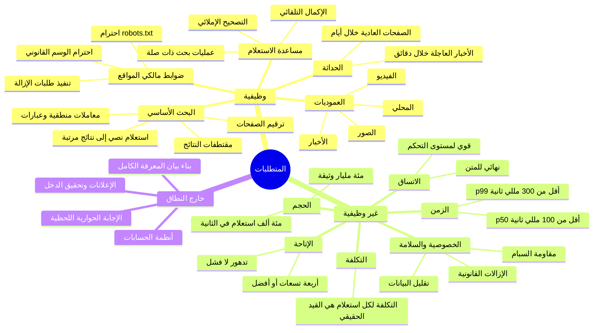
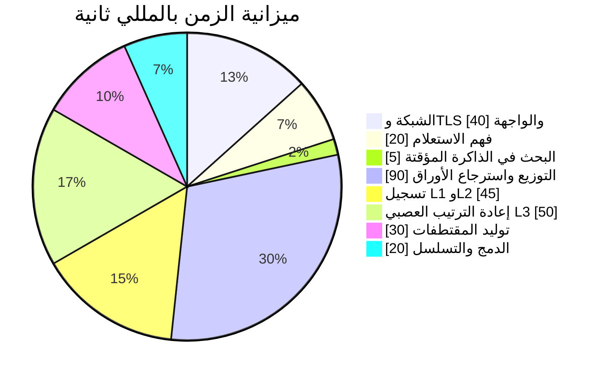
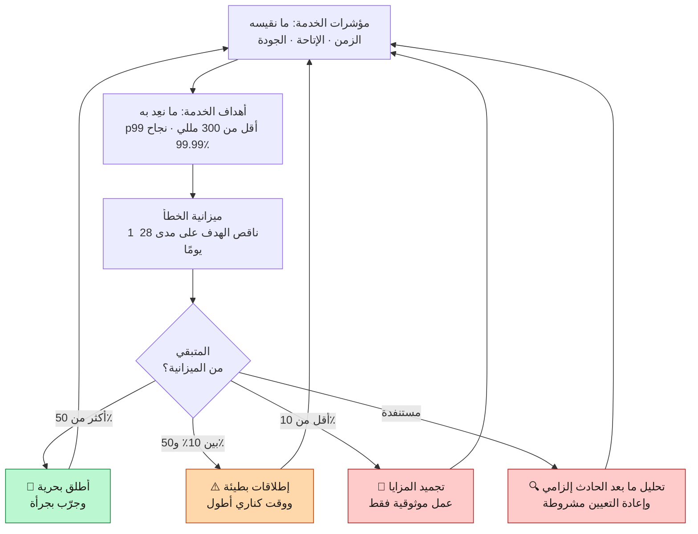
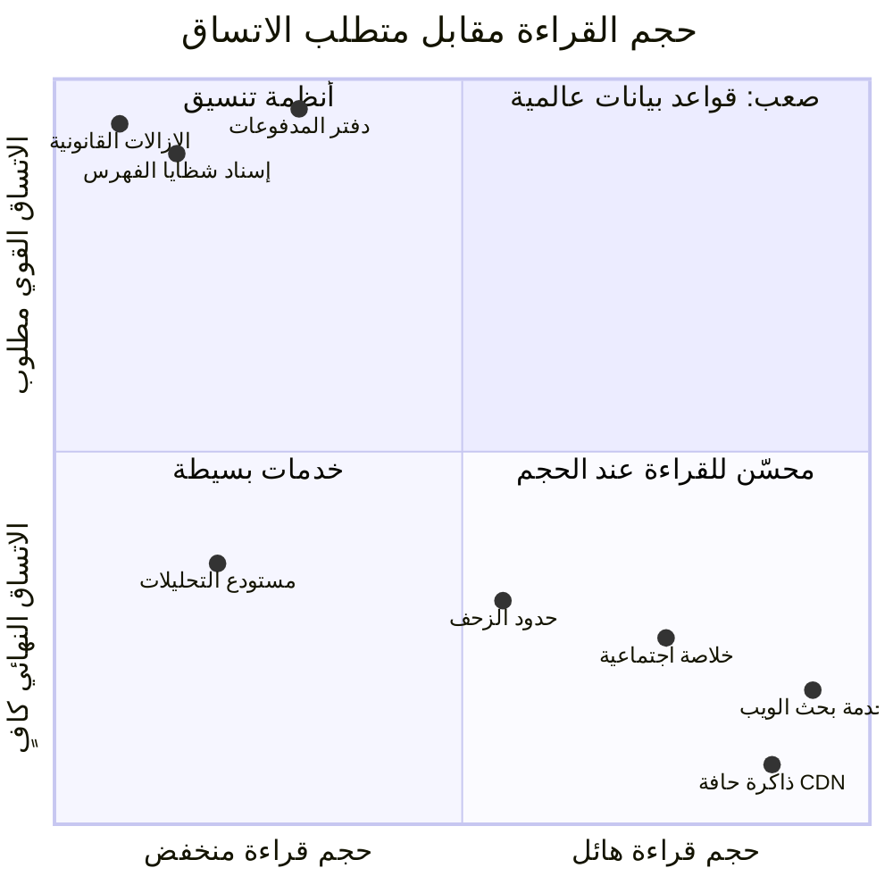

<div align="left">

**[🇬🇧 Read in English](../en/02-requirements.md)**

</div>

<div dir="rtl" align="right">

# الفصل ٠٢ · المتطلبات وأهداف مستوى الخدمة

**← [٠١ · نظرة عامة](01-overview.md)** · [🏠 الرئيسية](../../README.ar.md) · **[٠٣ · تقدير السعة](03-capacity-estimation.md) →**

---

## ٢.١ النطاق: ما الذي نبنيه وما الذي لا نبنيه

تحديد النطاق هو أول قرار تصميمي حقيقي. محرك البحث قادر على استيعاب متطلبات لا نهائية؛ والمتطلبات التي **ترفضها** هي التي تحدد ما إذا كانت المعمارية متماسكة.

> **المخطط D-08 · تفكيك المتطلبات**

</div>



<div dir="rtl" align="right">

**خارج نطاق هذه الدراسة صراحةً**، ويستحق أن يُقال بصوت عالٍ في المقابلة:

| المستبعَد | السبب |
|---|---|
| مزاد الإعلانات وتحقيق الدخل | نظام موزّع منفصل بتعقيد مماثل |
| بناء بيان المعرفة | استخراج الكيانات وتنسيقها تخصص قائم بذاته |
| الإجابات التوليدية والحوارية | تُبنى **فوق** الاسترجاع ولا تغيّر معماريته |
| حسابات المستخدمين والمزامنة والسجل | سطح منتج لا بنية بحث تحتية |

استبعاد هذه ليس كسلًا، بل يُبقي **مركز ثقل** التصميم على الاسترجاع، حيث تعيش كل مشكلات الحجم الصعبة فعلًا.

---

## ٢.٢ المتطلبات الوظيفية مرتّبة بالأولوية

| الأولوية | المتطلب | معيار القبول |
|:--:|---|---|
| **P0** | استعلام نصي حر يعيد وثائق مرتّبة وملائمة | يقيّم المحكّمون البشر الملاءمة فوق خط أساس متفق عليه |
| **P0** | تتضمن النتائج عنوانًا ورابطًا ومقتطفًا | يحتوي المقتطف على مصطلحات الاستعلام في سياقها |
| **P0** | احترام `robots.txt` وتأخير الزحف | صفر مخالفات، مع سجل زحف قابل للتدقيق |
| **P0** | يعكس الفهرس الويب العام بشكل واسع | تُقاس التغطية مقابل عيّنة من الروابط |
| **P1** | التصحيح الإملائي وإعادة كتابة الاستعلام | يُعرض الاستعلام المصحَّح أو يُطبَّق تلقائيًا |
| **P1** | الحداثة: فهرسة صفحات الأخبار خلال دقائق | وسيط زمن الفهرسة للمجموعة الساخنة أقل من ٥ دقائق |
| **P1** | نتائج شاملة: دمج الصور والأخبار والفيديو | لا تُفعَّل العمودية إلا حين تبررها النية |
| **P1** | إكمال تلقائي بزمن أقل من 100 مللي ثانية | اقتراحات تُعاد مع كل ضغطة مفتاح |
| **P2** | معاملات متقدمة: `site:` و`filetype:` والاقتباس و`-term` | تُحلَّل المعاملات وتقيّد الاسترجاع |
| **P2** | استهداف المحلية واللغة | تحترم النتائج لغة المستخدم ومنطقته |
| **P2** | التخصيص من السجل المُوافَق عليه | احترام كامل لخيار الانسحاب |

---

## ٢.٣ المتطلبات غير الوظيفية: تلك التي تشكّل المعمارية

### الزمن (Latency)

الزمن ليس رقمًا واحدًا، بل توزيعًا؛ والذيل هو ما تصمّم من أجله.

| المئين | الهدف من طرف إلى طرف | المبرر |
|---|---:|---|
| p50 | أقل من 100 مللي ثانية | يبدو فوريًا |
| p95 | أقل من 200 مللي ثانية | لا يزال دون عتبة الإدراك |
| p99 | أقل من 300 مللي ثانية | هدف صارم: يقود كل تصميم التوزيع |
| p99.9 | أقل من 800 مللي ثانية | مقبول مع نتائج متدهورة |

**لماذا يهيمن الذيل؟** إذا وُزّع الاستعلام على 1000 خادم أوراق، ولكل منها احتمال مستقل قدره ١٪ لأن يكون بطيئًا، فإن احتمال أن يكون **واحد على الأقل** بطيئًا هو `1 − 0.99¹⁰⁰⁰ ≈ 99.996٪`. أي أن كل استعلام تقريبًا يصادف خادمًا بطيئًا. هذه نتيجة دين وباروسو في *الذيل عند الحجم*، وهي سبب احتواء تصميم الخدمة في [الفصل ٠٧](07-serving.md) على الطلبات المُحوَّطة والمربوطة والمهل على مستوى الشظية.

> **المخطط D-09 · توزيع ميزانية الزمن عند p99 = 300 مللي ثانية**

</div>



<div dir="rtl" align="right">

كل مللي ثانية تُنفق في شريحة هي مللي ثانية مسروقة من جودة الترتيب. **الميزانية هي المعمارية**.

### الإتاحة (Availability)

| الطبقة | الهدف | ميزانية الخطأ شهريًا | السلوك عند التجاوز |
|---|---:|---:|---|
| خدمة الاستعلام | 99.99٪ | ~٤.٣ دقيقة | تنبيه المناوب وتجميد الإطلاقات |
| الإكمال التلقائي | 99.9٪ | ~٤٣ دقيقة | التدهور إلى بلا اقتراحات |
| خط الحداثة | 99.5٪ | ~٣.٦ ساعة | تراكم يُصرَّف، والنتائج تتقادم |
| خط الزحف | 99٪ | ~٧.٢ ساعة | زحف لاحق، بلا أثر على المستخدم |

**الإتاحة هنا تعني «أعاد صفحة نتائج نافعة» لا «أعاد HTTP 200».** استجابة تنقصها ٥٪ من الشظايا تبقى نجاحًا، بينما استجابة تعيد صفحة خطأ هي فشل. هذا التمييز هو سبب بناء النظام كله على التدهور التدريجي.

> **المخطط D-10 · تراتبية الأهداف وسياسة ميزانية الخطأ**

</div>



<div dir="rtl" align="right">

### الاتساق (Consistency)

يشغّل هذا النظام عمدًا **نظامَي اتساق مختلفين**، ومعرفة أيهما لأي بيانات قرار تصميمي حامل للأثقال.

| البيانات | النظام | المبرر |
|---|---|---|
| الوثائق المزحوفة وشظايا الفهرس | **نهائي** | لا أحد يلاحظ ظهور صفحة بعد ٩٠ ثانية |
| سجلات النقر والاستعلام | **نهائي**، مرة واحدة على الأقل | الإحصاءات التجميعية تتحمل التكرار |
| ذاكرة النتائج المؤقتة | **نهائي مع مدة صلاحية** | التقادم المحدود هو الغرض كله |
| إسناد الشظايا إلى الخوادم | **قوي** | ادّعاء خادمين لشظية واحدة خطأ في الصحة |
| نسخة الفهرس المُقدَّمة حاليًا | **قوي** | القراءات مختلطة النسخ تنتج نتائج غير متماسكة |
| الإزالات القانونية والسياسية | **قوي** | الرابط المُزال يجب أن يُزال في كل مكان وفورًا |
| تحقق مالكي المواقع وإعداداتهم | **قوي** | بيانات تفويض |

القاعدة العملية: **مستوى البيانات نهائي، ومستوى التحكم قوي.** البيتابايتات تتدفق باتساق نهائي، والكيلوبايتات من البيانات الوصفية معاملاتية. وهذا بالضبط هو الانقسام الذي يبرر وجود Bigtable (نهائي وضخم) إلى جانب Spanner/Chubby (قوي وصغير) في [الفصل ٠٩](09-storage.md).

### التكلفة

عند هذا الحجم تصبح التكلفة متطلبًا **وظيفيًا** من الدرجة الأولى، لا فكرة لاحقة.

الوحدة ذات الصلة هي **التكلفة لكل ألف استعلام**، وتُفكَّك إلى:

</div>

```
التكلفة/1000 استعلام = (معالج الخدمة + الذاكرة مُستهلكة)
                      + (تخزين الفهرس موزّعًا على حجم الاستعلامات)
                      + (الزحف والمعالجة وبناء الفهرس)
                      + (خروج الشبكة)
```

<div dir="rtl" align="right">

الحدّ المهيمن هو **الذاكرة العشوائية**. فالفهرس يجب أن يقيم في الذاكرة لبلوغ هدف الزمن، والذاكرة أغلى مورد لكل بايت في الأسطول. وتكاد كل تحسينات [الفصل ٠٦](06-indexing.md) (ضغط قوائم الترحيل، وطبقات الفهرس، وإعادة ترتيب معرّفات الوثائق) توجد لتقليل بايتات الذاكرة لكل وثيقة.

---

## ٢.٤ أين يقع البحث بين الأنظمة الموزعة

> **المخطط D-11 · خريطة الضغوط التصميمية**

</div>



<div dir="rtl" align="right">

تعيش خدمة البحث في الربع الأيمن السفلي: **حجم قراءة هائل ومتطلب اتساق ضعيف**. وهذا الموقع وحده يمنح المعمارية أثمن حرياتها: إذ يمكنك نسخ الفهرس بقدر ما تشاء، لأن النسخ لا تحتاج أبدًا إلى الاتفاق فيما بينها على أي شيء. قارن ذلك بالركن الأيسر العلوي حيث يقع إسناد الشظايا والإزالات القانونية: بيانات ضئيلة، لكنها تتطلب إجماعًا، فتحصل على نظام تخزين مختلف تمامًا.

---

## ٢.٥ مقاييس الجودة: كيف تُقاس «النتائج الجيدة»

لا يمكنك تحسين ما لا تقيسه، والملاءمة أصعب ما يُقاس بصدق في النظام.

| المقياس | ما يلتقطه | نقطة ضعفه |
|---|---|---|
| **NDCG@10** | ملاءمة متدرجة لأفضل ١٠ مع خصم الموضع | يحتاج تسميات بشرية مكلفة |
| **MRR** | موضع أول نتيجة ملائمة | يتجاهل ما دون النتيجة الأولى |
| **الدقة@k والاستدعاء** | مقاييس استرجاع معلومات كلاسيكية | الاستدعاء غير قابل للقياس على متن بحجم الويب |
| **معدل النقر** | سلوك مستخدم حقيقي، مجاني ووفير | متحيّز بشدة للموضع، والمحتوى المُثير يسجّل جيدًا |
| **معدل النقرة الطويلة** | نقرة يتبعها مكوث طويل: مؤشر رضا | يفوته ما يُجاب عنه داخل صفحة النتائج |
| **معدل الهجر** | لا نقرة إطلاقًا | غامض: أرضاه المقتطف أم فشل البحث؟ |
| **معدل إعادة الصياغة** | أعاد المستخدم كتابة الاستعلام | إشارة سلبية قوية وسريعة الرصد |
| **التقييم البشري جنبًا إلى جنب** | حكم مباشر من محكّمين مدرَّبين | بطيء ومكلف، لكنه الحقيقة الأساس |

**الصورة الصادقة:** المقاييس السلوكية رخيصة ومتحيّزة، والتقييمات البشرية مكلفة وغير متحيّزة. لذا يستخدم العمل الإنتاجي التقييم البشري لـ**المعايرة** والمقاييس السلوكية لـ**التكرار**. وأي تغيير في الترتيب يرفع معدل النقر ويخفض التقييم البشري يُعامل كانحدار لا كمكسب، وهذا هو الحاجز الذي يمنع المحرك من تحسين نفسه إلى محتوى مُثير أجوف. راجع [الفصل ١٣](13-observability.md).

---

## ٢.٦ قيود خارجية لا اختيارية

بعض المتطلبات يفرضها العالم الخارجي ولا يمكن التفاوض عليها:

- **`robots.txt` عقد صارم.** انتهاكه ليس عيبًا برمجيًا بل خرقًا للثقة مع الويب بأسره. ويفرضه الزاحف **قبل** الجلب لا بعده.
- **تهذيب الزحف محكوم بخوادم الآخرين.** لا يمكنك الزحف أسرع مما يتحمله مالكو المواقع، مهما بلغ عرض نطاقك.
- **الويب عدائي بطبعه.** نسبة معتبرة من الصفحات وُجدت لغرض وحيد هو التلاعب بالترتيب.
- **التزامات الإزالة القانونية تختلف باختلاف الولاية القضائية.** يجب أن يدعم النظام حجبًا محدود النطاق جغرافيًا باتساق قوي وأثر تدقيق.
- **المتن غير محدود وأغلبه بلا قيمة.** فضاءات الروابط اللانهائية (التقاويم، المرشّحات، معرّفات الجلسات) تعني أن الحدود يجب أن **تختار** إلى الأبد.

---

## ٢.٧ بطاقة ملخص المتطلبات

| البُعد | الهدف الملتزَم به |
|---|---|
| حجم المتن | ~10¹¹ وثيقة مفهرسة |
| حجم الاستعلامات | ~10⁵ استعلام/ثانية متوسطًا، وذروة ~٣× |
| الزمن | p50 أقل من 100 مللي · p99 أقل من 300 مللي |
| الإتاحة | 99.99٪ معدل استجابة نافعة |
| الحداثة (المجموعة الساخنة) | وسيط أقل من ٥ دقائق للفهرسة |
| الحداثة (الويب العام) | أيام إلى أسابيع، مدفوعة بمعدل التغيّر |
| الاتساق | نهائي للبيانات · قوي للتحكم |
| المتانة | لا فقدان دائم لمحتوى مزحوف |
| التكلفة | مُحسَّنة لبايتات الذاكرة لكل وثيقة |

</div>

<div align="center">

**← [٠١ · نظرة عامة](01-overview.md)** · [🏠 الرئيسية](../../README.ar.md) · **[٠٣ · تقدير السعة](03-capacity-estimation.md) →** · [🇬🇧 English](../en/02-requirements.md)

</div>
