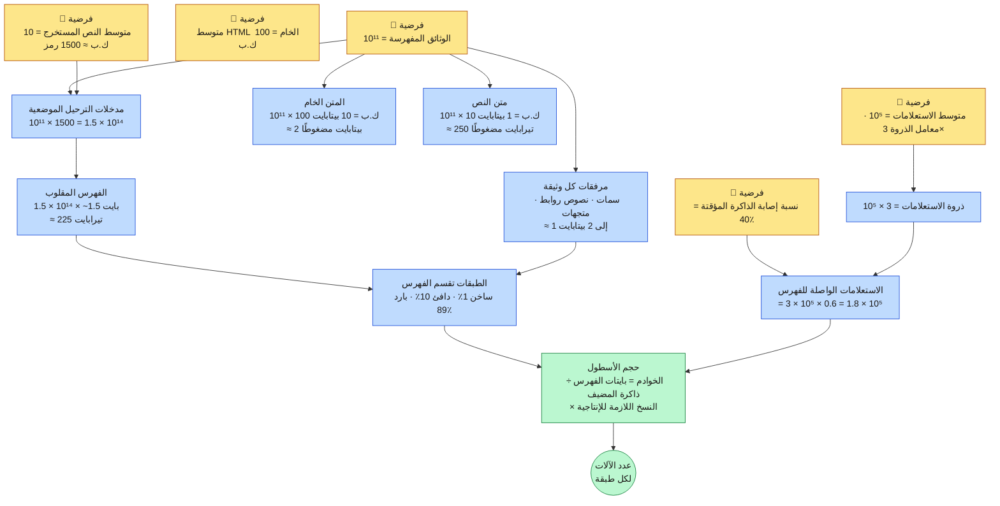
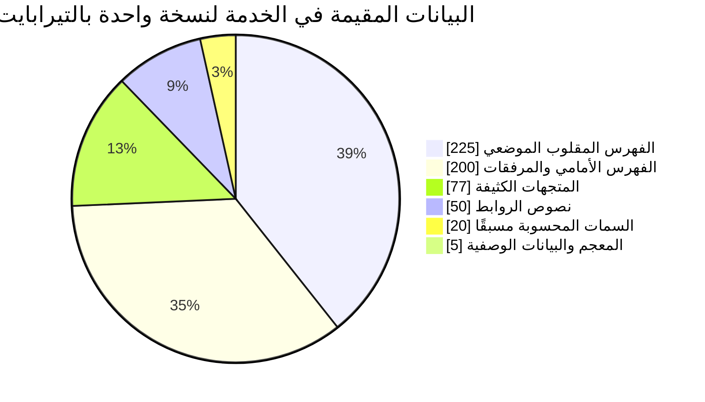
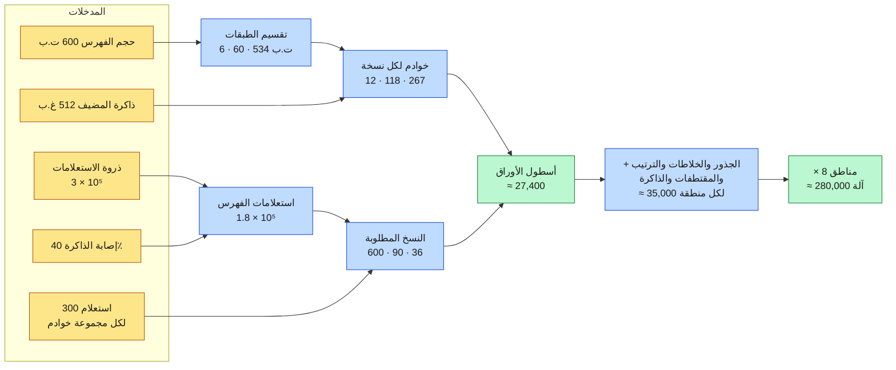

<div align="left">

**[🇬🇧 Read in English](../en/03-capacity-estimation.md)**

</div>

<div dir="rtl" align="right">

# الفصل ٠٣ · تقدير السعة

**← [٠٢ · المتطلبات](02-requirements.md)** · [🏠 الرئيسية](../../README.ar.md) · **[٠٤ · الزحف](04-crawling.md) →**

---

> ⚠️ **كل رقم في هذا الفصل تقدير من رتبة المقدار مشتق من معلومات عامة.** ولا شيء منه مقيس من أنظمة جوجل الإنتاجية. والغرض هو عرض **منهج**؛ فإن غيّرتَ فرضية، وجب أن يتبعها الحساب بوضوح. الفرضيات مكتوبة بخط عريض لتستبدلها بفرضياتك.

---

## ٣.١ المنهج

يفشل التقدير التقريبي في مقابلات التصميم بإحدى طريقتين: إما الغموض («إنها بيانات كثيرة») أو الدقة الزائفة (ستة أرقام معنوية من الخيال). والوسط النافع سلسلة قصيرة **يُشتق فيها كل رقم مما قبله وتُسمّى فيها كل فرضية**.

> **المخطط D-12 — سلسلة اعتماديات التقدير**

</div>



<div dir="rtl" align="right">

---

## ٣.٢ حجم المتن

**الفرضيات:**
- الوثائق في فهرس الخدمة: **10¹¹** (مئة مليار)
- الروابط **المعروفة** للحدود وغير المفهرسة: **10¹²+** (أغلبها نفاية ومكرر وفضاءات لا نهائية)
- متوسط HTML الخام لكل وثيقة: **100 كيلوبايت**
- متوسط نص المتن بعد إزالة الحشو: **10 كيلوبايت** ≈ 1500 رمز

| الكمية | الاشتقاق | النتيجة |
|---|---|---:|
| HTML الخام، لقطة واحدة | 10¹¹ × 100 ك.ب | **10 بيتابايت** |
| HTML الخام مضغوطًا ٥:١ | 10 ÷ 5 | **2 بيتابايت** |
| النص المستخرج غير مضغوط | 10¹¹ × 10 ك.ب | **1 بيتابايت** |
| النص المستخرج مضغوطًا ٤:١ | 1 ÷ 4 | **250 تيرابايت** |
| مع الاحتفاظ بـ٥ نسخ تاريخية | 2 × 5 | **~10 بيتابايت** |
| مع غير HTML والبيانات الوصفية للوسائط والمجلوب غير المفهرس | — | **عشرات إلى مئات البيتابايت** |

**الخلاصة:** يُقاس **مخزن المستندات** بعشرات البيتابايت، ويهيمن عليه التاريخ والنفاية لا النصُّ الذي تفهرسه فعلًا. أما النص الذي تفهرسه فعلًا فلا يتجاوز ~250 تيرابايت مضغوطًا — أصغر بثلاث رتب مقدار. **وفصل «كل ما جلبناه» عن «ما نخدم منه» هو أهم قرار تخزين مفرد في النظام.**

---

## ٣.٣ حجم الفهرس

يخزّن الفهرس المقلوب الموضعي مدخلة واحدة لكل **ورود رمز**، لا لكل مصطلح مميز.

</div>

```
المدخلات = الوثائق × الرموز لكل وثيقة
         = 10¹¹ × 1500
         = 1.5 × 10¹⁴ مدخلة
```

<div dir="rtl" align="right">

**فرضية الضغط:** معرّفات وثائق مُرمَّزة بالفروق مع ترميز متغير البايت أو PForDelta، مع مواضع مُرمَّزة بالفجوات، تحقق **~1.5 بايت لكل مدخلة موضعية** على نص ويب نمطي. (بلا ضغط، يحتاج معرّف بطول ٣٧ بت مع موضع إلى ٦–٨ بايت؛ وضغط ٤–٥× قياسي وموثّق جيدًا في أدبيات استرجاع المعلومات.)

| المكوّن | الاشتقاق | الحجم |
|---|---|---:|
| الفهرس المقلوب الموضعي | 1.5 × 10¹⁴ × 1.5 بايت | **~225 تيرابايت** |
| المعجم / قاموس المصطلحات | ~10⁹ مصطلح × ~40 بايت | **~40 غيغابايت** |
| الفهرس الأمامي (وثيقة ← مصطلحات) | 10¹¹ × ~2 ك.ب | **~200 تيرابايت** |
| سمات ترتيب محسوبة مسبقًا | 10¹¹ × ~200 بايت | **~20 تيرابايت** |
| نصوص الروابط المجمّعة لكل وثيقة | 10¹¹ × ~500 بايت | **~50 تيرابايت** |
| متجهات كثيفة، ٧٦٨ بُعدًا int8 | 10¹¹ × 768 بايت | **~77 تيرابايت** |
| **الإجمالي المقيم في الخدمة (نسخة واحدة)** | — | **~600 تيرابايت ≈ 0.6 بيتابايت** |

**اختبار سلامة مقابل هدف الزمن:** لا يمكن قراءة 600 تيرابايت من القرص خلال 300 مللي ثانية بأي ترتيب للعتاد. فيجب أن تقيم في الذاكرة أو الفلاش، موزّعة على آلاف الآلات، وتُلمس بالتوازي. وهذا القيد وحده يفرض معمارية التوزيع المشظّاة بأكملها. هذه هي اللحظة التي تكفّ فيها الأرقام عن كونها معلومات عابرة وتبدأ في إملاء البنية.

> **المخطط D-13 — أين تذهب البايتات**

</div>



<div dir="rtl" align="right">

---

## ٣.٤ لماذا تغيّر الطبقات كل شيء

لو اضطر كل استعلام إلى لمس 600 تيرابايت كاملة لكان الأسطول مستحيلًا اقتصاديًا. وينقذه واقعٌ شديد الانحراف عن الاستعلامات: **نسبة ضئيلة من الوثائق تُشبع الأغلبية الساحقة من الاستعلامات.**

**الفرضية:** أعلى ١٪ من الوثائق تغطيةً للاستعلامات تجيب ~٨٥٪ منها كليًا، وأعلى ١١٪ تجيب ~٩٧٪.

| الطبقة | نسبة المتن | الوثائق | نصيب الفهرس | الوسيط | الاستعلامات المحلولة هنا |
|---|---:|---:|---:|---|---:|
| **الطبقة ٠ — ساخنة** | ١٪ | 10⁹ | ~6 ت.ب | ذاكرة | ~٨٥٪ |
| **الطبقة ١ — دافئة** | ١٠٪ | 10¹⁰ | ~60 ت.ب | ذاكرة + NVMe | ~١٢٪ |
| **الطبقة ٢ — باردة** | ٨٩٪ | ~8.9 × 10¹⁰ | ~534 ت.ب | NVMe / فلاش | ~٣٪ |

يدخل الاستعلام إلى الطبقة ٠. فإن جمع مرشحين كافين عالي الجودة هناك، لم ينزل أبدًا. ولا يسقط النظام إلى الطبقة ١ — ونادرًا إلى الطبقة ٢ — إلا حين تعيد الطبقة ٠ نتائج قليلة أو ضعيفة. هذه هي الآلية التي وصفها جيف دين في كلمته بمؤتمر WSDM عام ٢٠٠٩، وتساوي نحو **رتبتَي مقدار من تكلفة الأسطول**.

---

## ٣.٥ حجم الاستعلامات وتحجيم الأسطول

**الفرضيات:**
- متوسط معدل الاستعلامات: **10⁵** عالميًا
- نسبة الذروة إلى المتوسط: **٣×** ← الذروة **3 × 10⁵**
- نسبة إصابة ذاكرة النتائج: **٤٠٪**
- الاستعلامات الواصلة للفهرس عند الذروة: 3 × 10⁵ × 0.6 = **1.8 × 10⁵**
- خادم الأوراق يتحمل **~300 استعلام/ثانية**
- ذاكرة الفهرس القابلة للاستخدام لكل مضيف: **512 غيغابايت**

### الخطوة ١ — كم خادمًا يحمل نسخة واحدة من كل طبقة؟

</div>

```
الطبقة ٠:   6 ت.ب ÷ 512 غ.ب    ≈  12 خادمًا لكل نسخة
الطبقة ١:  60 ت.ب ÷ 512 غ.ب    ≈ 118 خادمًا لكل نسخة
الطبقة ٢: 534 ت.ب ÷ 2 ت.ب NVMe ≈ 267 خادمًا لكل نسخة
```

<div dir="rtl" align="right">

### الخطوة ٢ — كم نسخة تتطلبها الإنتاجية؟

</div>

```
الطبقة ٠:  1.8 × 10⁵ × 100٪ ÷ 300 ≈ 600 نسخة
الطبقة ١:  1.8 × 10⁵ ×  15٪ ÷ 300 ≈  90 نسخة
الطبقة ٢:  1.8 × 10⁵ ×   3٪ ÷ 150 ≈  36 نسخة
```

<div dir="rtl" align="right">

### الخطوة ٣ — الضرب

| الطبقة | خوادم/نسخة | النسخ | **خوادم الأوراق** |
|---|---:|---:|---:|
| الطبقة ٠ | ١٢ | ٦٠٠ | **٧٬٢٠٠** |
| الطبقة ١ | ١١٨ | ٩٠ | **١٠٬٦٢٠** |
| الطبقة ٢ | ٢٦٧ | ٣٦ | **٩٬٦١٢** |
| | | **الإجمالي** | **~٢٧٬٤٠٠** |

### الخطوة ٤ — بقية أسطول الخدمة

| الدور | منطق التحجيم | الخوادم |
|---|---|---:|
| خوادم الأوراق | أعلاه | ~٢٧٬٤٠٠ |
| الجذور والمجمّعات الوسيطة | ~١ لكل ٤٠ ورقة | ~٧٠٠ |
| الخلاطات والواجهات | 3 × 10⁵ ÷ 2000 لكل خادم | ~١٥٠ |
| فهم الاستعلام | 3 × 10⁵ ÷ 1500 | ~٢٠٠ |
| إعادة الترتيب العصبي L3 | 1.8 × 10⁵ × 50 وثيقة ÷ إنتاجية المسرّع | ~٣٬٠٠٠ مسرَّع |
| توليد المقتطفات وقراءات المخزن | 3 × 10⁵ × 10 وثائق | ~٢٬٥٠٠ |
| طبقة ذاكرة النتائج | 600 ت.ب ÷ 256 غ.ب | ~١٬٢٠٠ |
| **إجمالي الخدمة لمنطقة واحدة** | | **~٣٥٬٠٠٠** |
| **× ٨ مناطق جغرافية** | | **~٢٨٠٬٠٠٠** |

**اختبار واقعية لهذا الرقم.** الرتبة الصحيحة لعملية بحث فائقة الحجم هي 10⁵–10⁶ آلة، والحساب أعلاه يقع داخلها. ولو خرج تقديرك بألف آلة أو بمئة مليون، لعرفتَ أن فرضية ما خاطئة برتب مقدار — وهذا بالضبط الغرض من التمرين: إنه **فحص اتساق** لا تنبؤ.

> **المخطط D-14 — اشتقاق حجم الأسطول**

</div>



<div dir="rtl" align="right">

---

## ٣.٦ إنتاجية الزحف

**الفرضيات:** متن من 10¹¹ وثيقة، ومتوسط فترة إعادة الزحف **٣٠ يومًا**، ومتوسط حجم الجلب **100 كيلوبايت**.

</div>

```
الجلبات/يوم   = 10¹¹ ÷ 30          ≈ 3.3 × 10⁹
الجلبات/ثانية = 3.3 × 10⁹ ÷ 86400  ≈ 38,000
الدخل         = 38,000 × 100 ك.ب   ≈ 3.8 غ.ب/ث ≈ 30 غيغابت/ث
```

<div dir="rtl" align="right">

إن 30 غيغابت/ث **تافهة** لمشغّل بهذا الحجم. **فالزحف ليس محكومًا بعرض النطاق**، بل بثلاثة أمور أخرى:

1. **التهذيب.** بمعدل ~جلبة واحدة لكل مضيف في الثانية و~2 × 10⁸ مضيف نشط، يبدو السقف النظري هائلًا — لكن الروابط منحرفة بشكل كارثي. فحفنة من المضيفين تملك مليارات الروابط لكل منها، وهؤلاء بالذات من يجب أن تزحفهم ببطء.
2. **نظام أسماء النطاقات.** 38 ألف جلبة/ثانية على محلِّل ساذج ستُذيبه. فيجب تخزين DNS مؤقتًا بعدوانية، واستضافته ذاتيًا عمليًا.
3. **الانتقاء.** مع 10¹²+ رابط معروف وسعة 3.3 × 10⁹ جلبة/يوم، لا تستطيع الحدود زيارة أكثر من **٠.٣٪ مما تعرفه يوميًا**. فالزحف في جوهره مسألة **ترتيب أولويات** لا مسألة إنتاجية. راجع [الفصل ٠٤](04-crawling.md).

---

## ٣.٧ إنتاجية بناء الفهرس

| المهمة | المدخل | الإنتاجية المفترضة | زمن الساعة |
|---|---:|---:|---|
| إعادة بناء كاملة للفهرس | 1 بيتابايت نص | 20 غ.ب/ث | ~١٤ ساعة |
| PageRank بـ٣٠ تكرارًا | 10¹¹ عقدة، ~10¹² حافة | — | ~ساعات |
| تحديث تزايدي | ~10⁹ وثيقة متغيرة/يوم | تدفقي | مستمر |
| نشر الشظايا لطبقة الخدمة | 600 ت.ب × النسخ | 100 غ.ب/ث | على مراحل |

**القيد الحرج ليس زمن البناء بل زمن النشر.** فإعادة بناء الفهرس في ١٤ ساعة أمر مقبول، أما **دفع 600 تيرابايت إلى مئات نسخ الخدمة** فهو الجزء الصعب فعلًا، ولهذا تُوزَّع تحديثات الفهرس كمقاطع غير قابلة للتغيير تُشحن تزايديًا بدل الاستبدال الكامل. راجع [الفصل ٠٦](06-indexing.md) و[الفصل ١١](11-freshness.md).

---

## ٣.٨ حساب الزمن — هل 300 مللي ثانية ممكنة أصلًا؟

لنتحقق أن الهدف ليس خيالًا، بأرقام الزمن القياسية.

| العملية | الزمن النمطي |
|---|---:|
| مرجع ذاكرة المخبأ L1 | 1 نانو ثانية |
| مرجع الذاكرة الرئيسية | 100 نانو ثانية |
| ضغط 1 كيلوبايت | ~2 ميكرو ثانية |
| إرسال 1 ك.ب على وصلة 10 غيغابت | ~1 ميكرو ثانية |
| قراءة عشوائية من SSD | ~16–100 ميكرو ثانية |
| رحلة ذهاب وإياب داخل مركز البيانات | ~500 ميكرو ثانية |
| بحث على القرص الصلب | ~5 مللي ثانية |
| رحلة كاليفورنيا ↔ هولندا | ~150 مللي ثانية |

والآن مسار الخدمة:

</div>

```
العميل ← أقرب مركز بيانات                        ~20 مللي ثانية
الواجهة + فهم الاستعلام (في الذاكرة)             ~20 مللي ثانية
البحث في الذاكرة المؤقتة                          ~1 مللي ثانية
التوزيع من الجذر للأوراق + عمل الأوراق            ~41 مللي ثانية
دمج الجذر + تسجيل L2                              ~30 مللي ثانية
إعادة ترتيب عصبي L3 على ~50 وثيقة                ~50 مللي ثانية
جلب المقتطفات (قراءات متوازية)                   ~30 مللي ثانية
الدمج والتسلسل والعرض                             ~20 مللي ثانية
──────────────────────────────────────────────────────────────
الإجمالي                                          ~212 مللي ثانية
```

<div dir="rtl" align="right">

إنه يتّسع — مع **~90 مللي ثانية هامشًا** لذيل p99. وهناك ملاحظتان تقودان فصولًا لاحقة:

- **رحلة عبور القارات (150 مللي ثانية) لا تظهر.** وهذا ليس حظًا، بل هو سبب وجوب **النسخ الجغرافي** للخدمة. فالفهرس المركزي عالميًا لا يمكنه بلوغ هذا الهدف مهما كان البرنامج سريعًا. **الجغرافيا هي القيد، لا الشيفرة.**
- **أكبر شريحة قابلة للتحكم هي إعادة الترتيب العصبي L3.** وهي أيضًا أكبر رافعة للجودة. وقمع الاسترجاع بأكمله في [الفصل ٠٨](08-ranking.md) موجود لتقليص عدد الوثائق التي تصل إلى L3 إلى بضع عشرات، حتى يصبح النموذج المكلف ميسورًا أصلًا.

---

## ٣.٩ بطاقة التقدير السريع

احفظها؛ فهي تمكّنك من إجراء هذا الحساب مباشرةً.

| الحقيقة | القيمة |
|---|---|
| الثواني في اليوم | ~86,400 ≈ 10⁵ |
| الثواني في السنة | ~3.2 × 10⁷ |
| 2¹⁰ / 2²⁰ / 2³⁰ / 2⁴⁰ / 2⁵⁰ | كيلو / ميغا / غيغا / تيرا / بيتا |
| البتات اللازمة لـ10¹¹ معرّف | ٣٧ بت ← ٥ بايتات |
| ضغط gzip على HTML | ~٥:١ |
| ضغط gzip على نص عادي | ~٣–٤:١ |
| الفروق + varint على معرّفات مرتبة | ~٤–٦× |
| صفحة ويب نمطية، نص المتن | ~1500 رمز |
| رحلة داخل مركز البيانات | ~0.5 مللي ثانية |
| رحلة عبر القارات | ~150 مللي ثانية |
| إنتاجية قراءة الذاكرة | ~10 غ.ب/ث لكل مقبس |
| قراءة NVMe | ~3–7 غ.ب/ث، ~500 ألف عملية/ث |

</div>

<div align="center">

**← [٠٢ · المتطلبات](02-requirements.md)** · [🏠 الرئيسية](../../README.ar.md) · **[٠٤ · الزحف](04-crawling.md) →** · [🇬🇧 English](../en/03-capacity-estimation.md)

</div>
