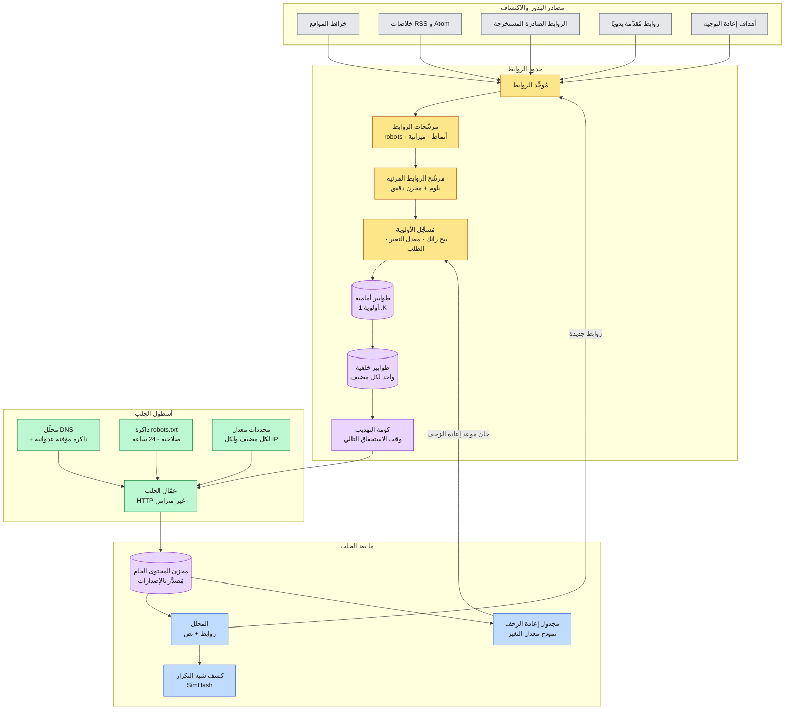
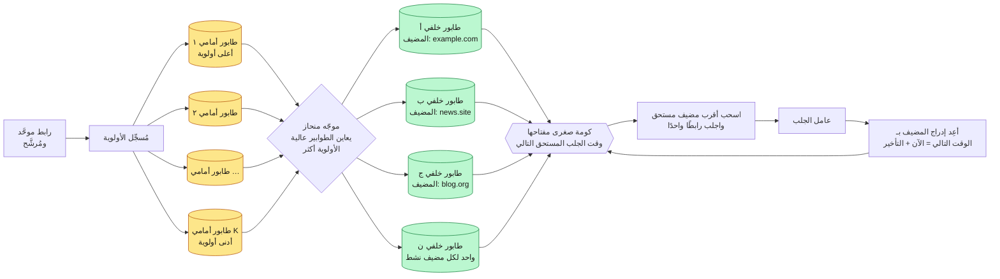
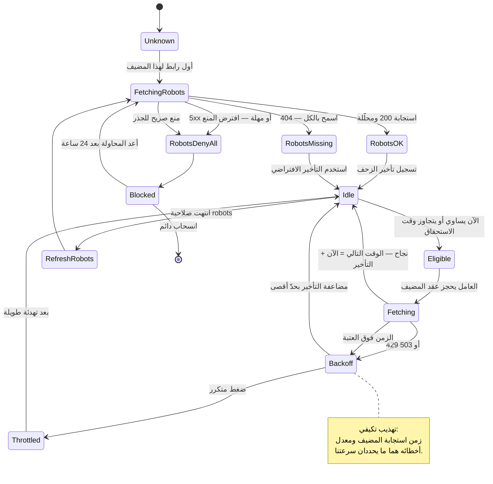
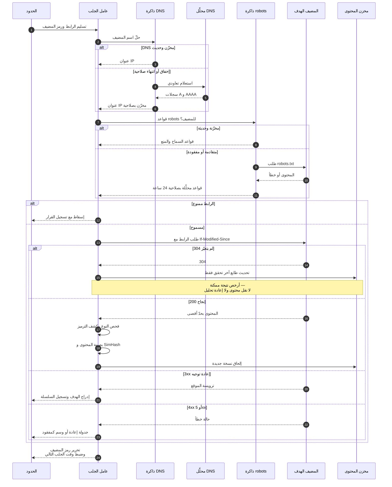
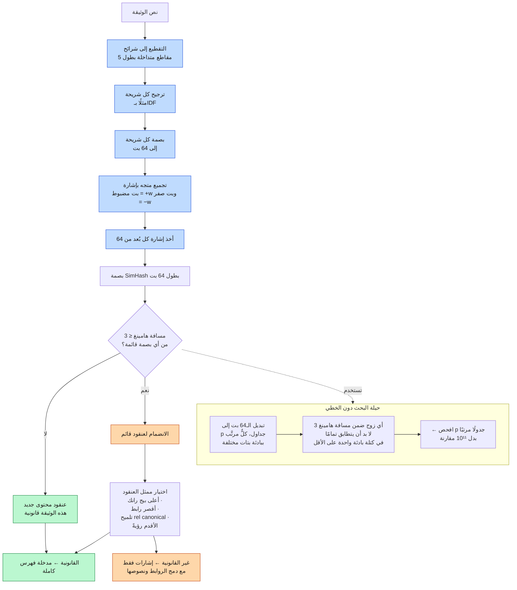
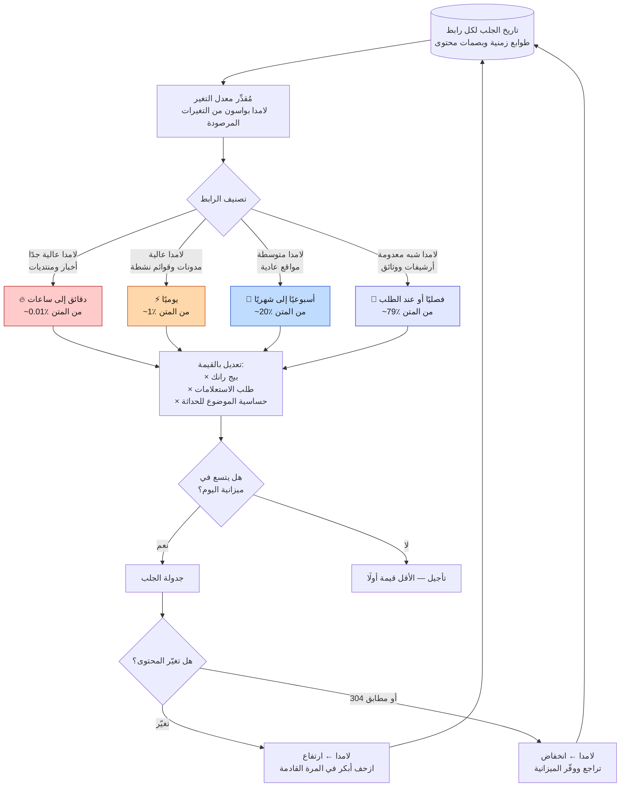

<div align="left">

**[🇬🇧 Read in English](../en/04-crawling.md)**

</div>

<div dir="rtl" align="right">

# الفصل ٠٤ · الزحف وحدود الروابط

**← [٠٣ · تقدير السعة](03-capacity-estimation.md)** · [🏠 الرئيسية](../../README.ar.md) · **[٠٥ · معالجة المحتوى](05-content-processing.md) →**

---

## ٤.١ وظيفة الزاحف الحقيقية

القراءة الساذجة تقول إن وظيفة الزاحف «تنزيل الويب». وهذا ليس صحيحًا. فمن [الفصل ٠٣](03-capacity-estimation.md) نعلم أن الحدود تضم **10¹²+ رابط** بينما يستطيع الأسطول جلب **~3.3 × 10⁹ يوميًا** فقط — أي نحو **٠.٣٪**. ولذا فللزاحف وظيفة صعبة واحدة بالضبط:

> **أن يقرر، باستمرار وفي ظروف عدائية، أيُّ ٠.٣٪ من الروابط المعروفة يستحق الجلب اليوم — دون أن يسيء أبدًا إلى خادم أحد.**

وكل ما عدا ذلك — من HTTP وتحليل وتخزين — سهل نسبيًا. أما ترتيب الأولويات والتهذيب فهما موضع الهندسة الحقيقية.

### القيود الأربعة

| القيد | النتيجة |
|---|---|
| **التهذيب** | لا يمكن تجاوز معدل لكل مضيف، مهما كانت السعة عاطلة |
| **فضاء الروابط اللانهائي** | التقاويم والتصفح متعدد الأوجه ومعرّفات الجلسات تولّد روابط بلا حدّ |
| **الانحراف الشديد** | حفنة مضيفين يملكون مليارات الروابط، وأغلب المضيفين يملكون أقل من ١٠٠ |
| **المحتوى العدائي** | مصائد الزاحفات، والتمويه، وقنابل العناكب، وقنابل الضغط، والتسميم المتعمَّد |

---

## ٤.٢ معمارية الزاحف

> **المخطط D-15 — معمارية أسطول الزحف**

</div>



<div dir="rtl" align="right">

---

## ٤.٣ حدود الروابط — قلب الزاحف

يجب أن تحقق الحدود هدفين يتصارعان فعليًا:

- **الأولوية:** اجلب الروابط المهمة والحديثة والمطلوبة أولًا.
- **التهذيب:** لا تُصدر أبدًا طلبين إلى مضيف واحد في وقتين متقاربين.

طابور أولوية واحد يحقق الأول وينتهك الثاني انتهاكًا كارثيًا — لأن الروابط الأعلى أولوية تتكدّس على قلة من المضيفين الكبار، فيقصف الطابور المحض هؤلاء المضيفين. والحل القياسي (بأسلوب Mercator، الموصوف في كتاب مانينغ وراغافان وشوتزه *مقدمة في استرجاع المعلومات*) هو **نظام طوابير من مرحلتين**.

> **المخطط D-16 — حدود من مرحلتين: الأولوية أمامًا والتهذيب خلفًا**

</div>



<div dir="rtl" align="right">

**الثابت الذي يجعل هذا يعمل:** *كل طابور خلفي يحمل روابط من مضيف واحد بالضبط، ولكل مضيف طابور خلفي واحد على الأكثر.* عندها تضمن الكومة ألا يُجلب المضيف أكثر من مرة لكل تأخير مضبوط، بينما يضمن الموجّه المنحاز أمامه أن **اختيار أي رابط من ذلك المضيف** يظل محترمًا للأولوية.

### تسجيل الأولوية

أولوية زحف الرابط تركيبة موزونة من الإشارات، وصيغتها النمطية:

</div>

```
الأولوية(u) =  w₁ · log(1 + بيج‑رانك(مضيف u))
             + w₂ · معدل_التغير_المتوقع(u)
             + w₃ · طلب_الاستعلامات(موضوع u)
             + w₄ · عجز_الحداثة(u)
             + w₅ · دفعة_الاكتشاف(u)          # رابط جديد تمامًا
             − w₆ · درجة_السبام(مضيف u)
             − w₇ · عقوبة_العمق(u)            # النقرات من الصفحة الرئيسية
             − w₈ · احتمال_التكرار(u)
```

<div dir="rtl" align="right">

ولا شيء من هذه الأوزان ثابت؛ بل تُضبط مقابل هدف تغطية/حداثة، ويُعاد ضبطها كلما تغيّر الويب.

### مشكلة «الروابط المرئية»

قبل الإدراج في الطابور، على الحدود أن تجيب: «هل رأيتُ هذا الرابط؟» — **10¹² مرة يوميًا**، مقابل مجموعة من **10¹² رابط**. وتخزين 10¹² رابط بـ~٧٠ بايت لكل منها يساوي ٧٠ تيرابايت، وهو أكبر بكثير من أن يقيم في ذاكرة آلة واحدة.

والبنية القياسية **اختبار من مستويين**:

1. **مرشّح بلوم في الذاكرة** — ~١٠ بتات لكل رابط ← ~1.25 تيرابايت موزعة على الأسطول، بمعدل إيجابيات كاذبة ~١٪. والجواب **السلبي** قاطع: الرابط جديد فعلًا.
2. **مخزن دقيق على القرص** (شبيه بـBigtable، مفتاحه بصمة الرابط) — يُستشار فقط عند **إصابة** بلوم، للتمييز بين تكرار حقيقي وإيجابية كاذبة.

ولأن مرشّحات بلوم لا تنتج سلبيات كاذبة أبدًا، فلن يُهمل رابط جديد خطأً قط. ونسبة الإيجابيات الكاذبة البالغة ١٪ لا تكلّف سوى بحث عرضي على القرص. وهذه هي المقايضة الصحيحة: البنية الرخيصة تعالج الحالة الشائعة، والمكلفة تعالج الحالة الملتبسة.

---

## ٤.٤ التهذيب — القيد غير القابل للتفاوض

> **المخطط D-17 — آلة حالات التهذيب لكل مضيف**

</div>



<div dir="rtl" align="right">

### القواعد التي يفرضها الزاحف

| القاعدة | التنفيذ |
|---|---|
| جلب `robots.txt` قبل أي رابط على المضيف | تُفحص ذاكرة robots عند كل جلب، والإخفاق يمنع الجلب |
| تعذّر الوصول إلى `robots.txt` ← افترض المنع | افشل مغلقًا لا مفتوحًا |
| احترام `Crawl-delay` عند وجوده | يغذّي وقت الجلب التالي مباشرة |
| تأخير افتراضي عند غيابه | عادةً ثانية واحدة، تكيفيًا بحسب سعة المضيف |
| تباطؤ تكيفي عند ارتفاع الزمن | إن تباطأ المضيف تباطأنا — زمنه إشارة |
| احترام `429` و`503` و`Retry-After` | تراجع أسي مع تشويش وحدّ أقصى |
| تحديد المعدل بـ**عنوان IP** لا بالاسم فقط | آلاف المضيفات الافتراضية قد تتشارك خادمًا واحدًا |
| التعريف بالنفس بصدق في `User-Agent` | مع رابط يشرح الزاحف وكيفية حجبه |

**الحدّ على مستوى IP هو الدقيق هنا.** فالاستضافة المشتركة تعني أن `a.com` و`b.com` … `z.com` قد تُحلّ كلها إلى آلة واحدة مثقلة. والتهذيب المطبَّق باسم المضيف وحده يسمح للزاحف بإصدار ٢٦ ضعف المعدل المقصود على تلك الآلة. لذا يجب أن يعتمد المحدِّد على IP المُحَلّ (أو كتلة IP) كذلك.

---

## ٤.٥ مسار الجلب بالتفصيل

> **المخطط D-18 — حياة جلبة واحدة**

</div>



<div dir="rtl" align="right">

**الطلب الشرطي أعلى التحسينات مردودًا في الزاحف.** فأغلب عمليات إعادة الزحف لأغلب الصفحات تعيد `304 Not Modified`. وتكلفة 304 رحلة ذهاب وإياب واحدة وصفر بايت من المحتوى، مقابل ١٠٠ كيلوبايت وإعادة تحليل وفهرسة كاملة. لذا فإتقان `If-Modified-Since` و`ETag` يساوي أكثر من أي قدر من ضبط عمّال الجلب.

---

## ٤.٦ كشف التكرار وشبه التكرار

نحو **٣٠–٤٠٪ من الويب محتوى مكرر أو شبه مكرر**: مرايا، ونشر مُعاد، ونسخ صالحة للطباعة، وتنويعات معاملات الروابط، وفروق حشو فقط. وفهرستها جميعًا يهدر التخزين، ويهدر جودة الترتيب، وينتج صفحات نتائج بائسة.

المكررات التامة تافهة — احسب بصمة المحتوى. أما أشباه المكررات فتحتاج **بصمة حساسة للموضع**، والخيار المعياري هو **SimHash** (شاريكار ٢٠٠٢؛ وأثبت مانكو وزملاؤه عام ٢٠٠٧ صلاحيته بحجم الويب في جوجل).

> **المخطط D-19 — خط كشف شبه التكرار بـSimHash**

</div>



<div dir="rtl" align="right">

**لماذا SimHash بدل MinHash هنا؟** لأن SimHash ينتج بصمة مضغوطة بطول ٦٤ بت لكل وثيقة مع اختبار تشابه رخيص (مسافة هامينغ)، وهذا يهم هائلًا حين تملك 10¹¹ وثيقة وعليك مقارنة كل جديدة بها جميعًا. أما MinHash فيعطي تقديرًا أفضل لمعامل جاكارد لكنه يحتاج بايتات أكثر بكثير لكل وثيقة. وعند حجم الويب، **حجم البصمة نفسه هو القيد التصميمي**.

### التوحيد القياسي، قبل حساب البصمة أصلًا

كثير من التكرار يمكن إزالته بتوحيد الروابط قبل الجلب:

| التحويل | المثال |
|---|---|
| تصغير المخطط واسم المضيف | `HTTP://Example.COM/A` ← `http://example.com/A` |
| إزالة المنفذ الافتراضي | `http://x.com:80/` ← `http://x.com/` |
| حلّ `.` و`..` | `/a/./b/../c` ← `/a/c` |
| إزالة معاملات التتبع | حذف `?utm_source=…&fbclid=…` |
| ترتيب معاملات الاستعلام | `?b=2&a=1` ← `?a=1&b=2` |
| إزالة الجزء المرجعي | `page#section` ← `page` |
| توحيد الشرطة المائلة الأخيرة | يُتعلَّم لكل مضيف |
| احترام `rel="canonical"` | تلميح قوي يُتحقق منه ولا يُصدَّق عمياءً |
| تتبّع سلاسل إعادة التوجيه وطيّها | تخزين الهدف النهائي فقط |

إن `rel="canonical"` **تلميح من طرف غير موثوق**. وهو إشارة قوية، لكن المُسيئين يستعملونه لتجميع الترتيب على صفحات يتحكمون بها، ولذا يُتحقق منه مقابل تشابه المحتوى بدل الانصياع له بلا شرط.

---

## ٤.٧ جدولة إعادة الزحف — إنفاق الميزانية بحكمة

بعد دخول الصفحة إلى المتن يصير السؤال: **متى ننظر مرة أخرى؟** إعادة زحف كل شيء بانتظام هدر هائل، لأن معدلات التغير على الويب تمتد على ست رتب مقدار على الأقل — فصفحة أخبار رئيسية تتغير كل دقيقة، وملف PDF مؤرشف لن يتغير أبدًا.

> **المخطط D-20 — جدولة إعادة الزحف التكيفية**

</div>



<div dir="rtl" align="right">

**حلقة التغذية الراجعة هي التصميم كله.** فكل جلبة تنتج دليلًا على ما إذا كانت الصفحة قد تغيّرت، وذلك الدليل يحدّث التقدير الذي يقرر الجلبة التالية. فالصفحات التي تظل تعيد `304` تُزحف على نحو أندر فأندر، والصفحات التي تظل تتغير تكسب ميزانية أكبر. وهكذا **يتعلّم** الزاحف شكل معدل تغيّر الويب بدل أن يُملى عليه.

ولاحظ أيضًا أن معدل التغير وحده لا يكفي. فصفحة تتغير كل ساعة لكن بلا روابط واردة ولا طلب استعلامات تستحق ميزانية أقل من صفحة تُحدَّث شهريًا وتتصدر مليون استعلام. **أولوية إعادة الزحف = معدل التغير × القيمة، لا معدل التغير وحده.**

---

## ٤.٨ مصائد الزاحفات ودفاعاتها

| المصيدة | الآلية | الدفاع |
|---|---|---|
| **التقويم اللانهائي** | `/calendar?date=2099-12-31` يتعاود بلا نهاية | حدود عمق وميزانيات لكل نمط وقوائم منع للمعاملات |
| **التصفح متعدد الأوجه** | روابط مرشِّحات توافقية: 2ⁿ تنويعة | كشف مجموعات المعاملات قليلة تنوع المحتوى وتحديد سقف لكل مضيف |
| **معرّفات الجلسات في الروابط** | كل زيارة تنتج رابطًا «جديدًا» | إزالة معاملات الجلسات المعروفة والكشف بهوية المحتوى |
| **مصائد العناكب البطيئة** | استجابات بطيئة عمدًا لتقييد العمّال | مهل عدوانية لكل طلب وسقف عمّال لكل مضيف |
| **قنابل الضغط** | 1 ك.ب مضغوط ← 10 غ.ب مفكوك | تحديد الحجم المفكوك والإجهاض عند عتبة النسبة |
| **التمويه (Cloaking)** | محتوى مختلف للزاحف عنه للمستخدم | جلبات عيّنية من مسارات شبيهة بالمنزلية ومقارنة العرض |
| **مزارع الروابط** | آلاف المضيفين يتشابكون لتضخيم بيج رانك | تحليل البيان على مستوى المضيف وكتلة IP، راجع [الفصل ١٤](14-security-abuse.md) |
| **انتشار DNS البدلي** | `*.spam.com` ← نطاقات فرعية بلا حدّ | ميزانية لكل نطاق قابل للتسجيل لا لكل اسم مضيف |

والدفاع الجامع: **ضع ميزانية لكل شيء وعند كل درجة تفصيل** — لكل نمط رابط، ولكل مضيف، ولكل كتلة IP، ولكل نطاق قابل للتسجيل. فالخصم يستطيع دائمًا توليد روابط أكثر مما تستطيع جلبه، والجواب الوحيد الدائم سقفٌ صارم لما يمكن لأي كيان واحد استهلاكه من سعتك.

---

## ٤.٩ ما نسلّمه إلى المرحلة التالية

عقد مخرجات الزاحف الذي يستهلكه [الفصل ٠٥](05-content-processing.md):

| الحقل | الوصف |
|---|---|
| `url` | الصيغة الموحَّدة القانونية |
| `fetch_time` | وقت اكتمال الجلب |
| `http_status` | الحالة النهائية بعد إعادة التوجيه |
| `redirect_chain` | السلسلة الكاملة لتجميع الإشارات |
| `content_type` و`charset` | مكتشفان ومتحقق منهما |
| `raw_body` | مضغوط ومحدود ومُصدَّر |
| `content_hash` | مفتاح التكرار التام |
| `simhash` | بصمة شبه التكرار |
| `robots_decision` | سجل سماح/منع قابل للتدقيق |
| `fetch_latency` و`response_size` | إشارات صحة المضيف التي تغذّي التهذيب |
| `discovered_from` | الرابط المُحيل، لبناء بيان الروابط |

</div>

<div align="center">

**← [٠٣ · تقدير السعة](03-capacity-estimation.md)** · [🏠 الرئيسية](../../README.ar.md) · **[٠٥ · معالجة المحتوى](05-content-processing.md) →** · [🇬🇧 English](../en/04-crawling.md)

</div>
