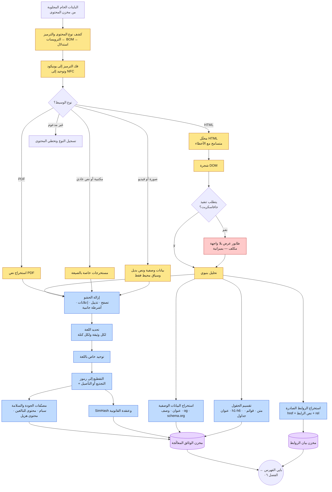
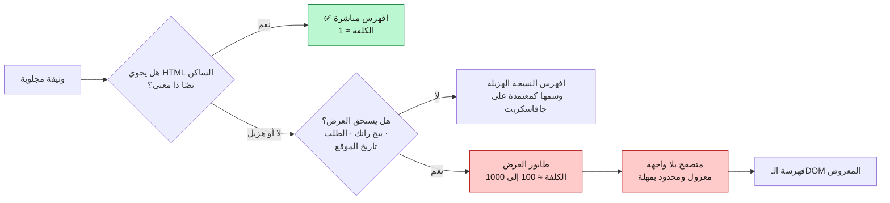
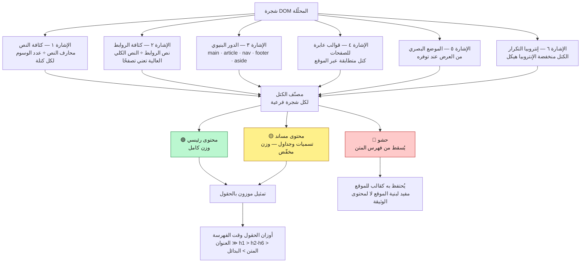
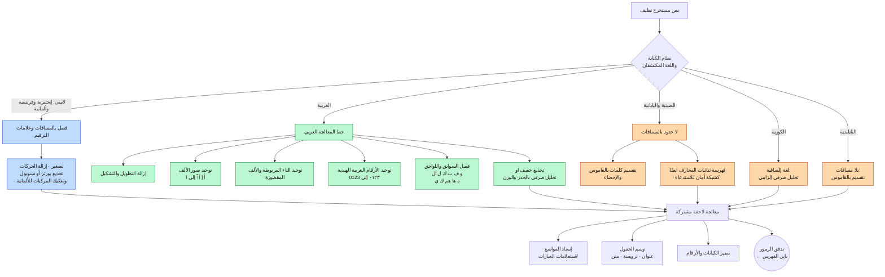
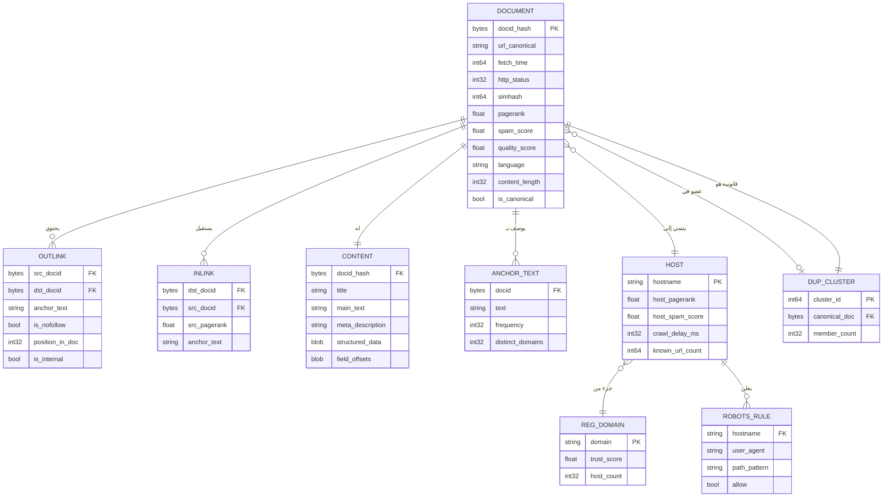
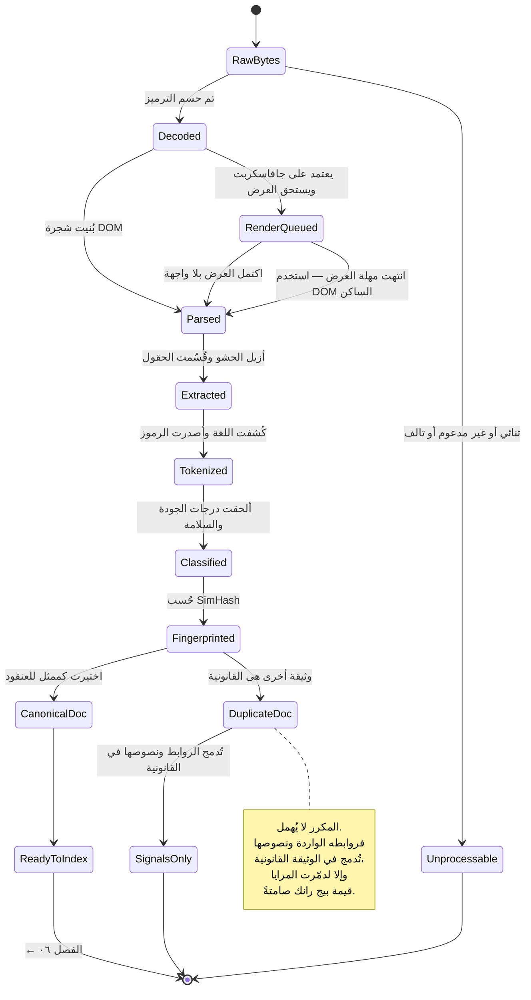

**[🇬🇧 Read in English](../en/05-content-processing.md)**

# الفصل ٠٥ · معالجة المحتوى

**← [٠٤ · الزحف](04-crawling.md)** · [🏠 الرئيسية](../../README.ar.md) · **[٠٦ · الفهرسة](06-indexing.md) →**

---

## ٥.١ من البايتات إلى إشارة قابلة للفهرسة

يسلّم الزاحف صفحات HTML مضغوطة، ويحتاج المُفهرِس رموزًا نظيفة وسمات لكل وثيقة وبيانًا للروابط. وكل ما بينهما هو معالجة المحتوى — أقل المراحل بريقًا وأكثرها تحديدًا للجودة.

ومن السهل التقليل من أهميتها. **فنموذج الترتيب لا يستطيع ترتيب إلا ما استخرجه المعالج.** فإن أبقت إزالةُ الحشو قائمةَ التصفح، بدت كل صفحة في الموقع متطابقة في مصطلحات تصفحها. وإن أخطأ كشف اللغة، عمل المُقطِّع الخاطئ فصارت الوثيقة غير قابلة للإيجاد. والأخطاء هنا صامتة ومنهجية وغير مرئية لاختبارات A/B التي تقيس طبقة الترتيب وحدها.

> **المخطط D-21 — خط معالجة المحتوى**

---

## ٥.٢ تحليل HTML لم تكتبه أنت

HTML الواقعي معطوب. فالوسوم غير المغلقة، والتداخل المختل، والمراجع المحرفية غير الصالحة، و٤٠ ميغابايت من JSON المضمّن، كلها أمور طبيعية. ويجب أن يكون المحلِّل **متسامحًا مع الأخطاء بالطريقة نفسها التي تتسامح بها المتصفحات** — لأن محلِّلًا يقرأ الوثيقة على نحو مختلف عن كروم يعني أنك تفهرس شيئًا لن يراه المستخدم أبدًا.

| الخطر | المعالجة |
|---|---|
| وسوم مشوّهة أو غير مغلقة | تعافٍ مطابق لمواصفة HTML5، أي لسلوك المتصفح |
| ترميز خاطئ أو مفقود | الترويسة ← BOM ← وسم charset ← كشف إحصائي، بهذا الترتيب |
| وثائق ضخمة | سقف صارم (١٠ ميغابايت مثلًا)؛ اقتطع ولا تفشل |
| DOM شديد التداخل | سقف عمق؛ والتداخل المشوّه إشارة سبام |
| محتوى تحقنه جافاسكربت | توجيه إلى طابور العرض، لمجموعة فرعية بميزانية فقط |
| `<noscript>` والنص المخفي | استخرِج مع الوسم؛ فالنص المخفي ناقل سبام كلاسيكي |
| الإطارات و`iframe` | تُتبَّع كوثائق منفصلة لا كمحتوى مضمّن |

### مشكلة عرض جافاسكربت

نسبة كبيرة من الويب الحديث تعرض محتواها الرئيسي في جانب العميل. فجلب HTML يعطيك `
` فارغًا. ولفهرسته يجب تشغيل متصفح بلا واجهة: تنفيذ جافاسكربت، وانتظار سكون الشبكة، ثم تسلسل الـDOM.

وهذا يكلّف **١٠٠ إلى ١٠٠٠ ضعف** من المعالج مقارنةً بتحليل HTML ساكن، ويُدخل زمنًا غير محدود وانكشافًا أمنيًا. لذا فالعرض **مُقنَّن**:

ولهذا تُفهرس المواقع المعتمدة بكثافة على جافاسكربت متأخرةً وبتغطية أقل من المواقع المعروضة على الخادم. وهذا ليس تفضيلًا سياسيًا بل نتيجة اصطفاف في طابور سببها نسبة كلفة تبلغ ألف ضعف.

---

## ٥.٣ إزالة الحشو — العثور على المحتوى الفعلي

صفحة الويب المتوسطة **ليست** محتواها في معظمها. فالتصفح والترويسات والتذييلات والأشرطة الجانبية ولافتات الكوكيز وأدوات «مقالات ذات صلة» والإعلانات قد تبلغ ٨٠٪ من الرموز. وفهرستها تسبب فشلين ملموسين:

1. **تبدو كل صفحة في الموقع متطابقة** في مصطلحات هيكلها المشترك، فيُدمَّر التمييز داخل الموقع.
2. **تُخفَّف إشارات الترتيب** — إذ تهيمن ترددات نص القالب على ترددات الموضوع.

> **المخطط D-22 — استخراج المحتوى الرئيسي**

**الإشارة الرابعة أقواها وأكثرها نسيانًا.** فإن كنت قد زحفت ١٠٬٠٠٠ صفحة من مضيف واحد، فالكتل المتطابقة بايتًا ببايت عبرها جميعًا هي — بحكم التعريف — قالب. والمفاضلة عبر الصفحات تتفوق على أي استدلال داخل الصفحة الواحدة — لكنها لا تعمل إلا لأنك تزحف مواقع كاملة لا صفحات معزولة. وهذا مثال جيد على قدرة تنشأ من **الحجم** لا من الذكاء.

---

## ٥.٤ تحديد اللغة والتوحيد

لا يمكنك التقطيع قبل معرفة اللغة، ولا يمكنك كشف اللغة بموثوقية من لاحقة النطاق. لذا يعمل الكشف على النص المستخرج، لكل وثيقة **ولكل كتلة**، لأن الصفحات متعددة اللغات شائعة.

| الطريقة | القوة | الضعف |
|---|---|---|
| ملفات n-gram المحرفية | سريعة وصغيرة وتعمل على نص قصير | تخلط بين اللغات المتقاربة |
| كشف نظام الكتابة في يونيكود | فوري للعربية والصينية واليابانية والسيريلية | عديم الفائدة للغات اللاتينية |
| تردد الكلمات الوظيفية | رخيص وقابل للتفسير | يحتاج نصًا طويلًا نسبيًا |
| المصنّفات العصبية | أعلى دقة وتعالج تبديل الشيفرة | كلفة معالج أعلى لكل وثيقة |
| سمة `lang` في HTML | مجانية | خاطئة كثيرًا أو منسوخة |

والكومة العملية: **كشف نظام الكتابة أولًا** (فهو يحسم العربية والصينية واليابانية والكورية والسيريلية واليونانية والعبرية والتايلندية في مرور واحد بكلفة تكاد تكون معدومة)، ثم n-gram لفض الالتباس بين اللاتينيات، ثم نموذج عصبي للنص القصير أو الملتبس فقط.

---

## ٥.٥ التقطيع خاص باللغة — مقارنة عملية

هنا يصعب بناء محرك بحث عالمي حقًا، وهنا يكون مستند ثنائي اللغة كهذا أنفع ما يكون.

> **المخطط D-23 — مسارات التقطيع حسب اللغة**

### لماذا العربية أصعب فعلًا من الإنجليزية

| الخاصية | الأثر على الاسترجاع |
|---|---|
| **التشكيل اختياري** | `كتب` قد تكون *كَتَبَ* أو *كُتُب* أو *كُتِبَ*. والصورة المكتوبة واحدة، فعلى الفهرس إما إزالة التشكيل كليًا أو معالجة عدة قراءات. |
| **الصرف بالجذر والوزن** | الجذر الثلاثي ك‑ت‑ب يولّد: كتاب، كاتب، مكتبة، مكتوب، كتابة. فالمُجذِّعات القائمة على قصّ اللواحق (بأسلوب بورتر) تفشل، وتحتاج تجذيعًا خفيفًا أو محللًا صرفيًا حقيقيًا. |
| **السوابق واللواحق الملتصقة** | `وبالمكتبة` = و + ب + ال + مكتبة، أي رمز إملائي واحد يحوي أربعة مورفيمات. وبلا فصل هذه الملحقات لن يطابقه استعلام «مكتبة». |
| **التنوع الإملائي** | أحمد / احمد، مكتبة / مكتبه — والكتّاب غير متسقين. فيجب أن يوحّد التوحيد بينها، على حساب شيء من الدقة. |
| **النص ثنائي الاتجاه** | المحتوى المختلط عربي‑لاتيني يتطلب معالجة صحيحة لمحارف التحكم في الاتجاه، وهي أيضًا ناقل تمويه. |
| **الأرقام العربية الهندية** | ٢٠٢٦ و2026 تعنيان الشيء نفسه ويجب توحيدهما. |

**التوتر التصميمي:** التوحيد العدواني يرفع **الاستدعاء** (تطابق صور إملائية كثيرة مصطلح فهرس واحدًا) ويخفض **الدقة** (تنهار كلمات متمايزة في واحدة). وعادةً ما توحّد الأنظمة الإنتاجية بعدوانية وقت الفهرسة، ثم تستعيد الدقة وقت الترتيب بالاحتفاظ بالصورة السطحية الأصلية كسمة وتعزيز التطابقات الحرفية. وهذا مبدأ عام يستحق التذكر: **تسامحْ أثناء الاسترجاع، وتشدّدْ أثناء الترتيب.**

---

## ٥.٦ بيان الروابط

تُستخرج الروابط الصادرة أثناء التحليل وتُراكم في بيان عالمي — وهو أثمن أصل مشتق في النظام كله، إذ يشغّل بيج رانك وفهرسة نصوص الروابط وكشف السبام وترتيب أولويات الزحف في آن واحد.

> **المخطط D-24 — بيان الروابط ونموذج بيانات الوثيقة المشتق**

### نص الرابط — وصف الصفحة بكلمات الآخرين

النص داخل الرابط (`<a href="...">اضغط هنا للدرس</a>`) وصفٌ للصفحة **الهدف** كتبه طرف ثالث. وهذا بالغ القيمة:

- يصف الصفحات بـ**المفردات التي يبحث بها المستخدمون فعلًا**، لا بمفردات كاتب الصفحة.
- يعمل مع وثائق لا يمكن فهرسة نصها الذاتي — الصور والفيديو وPDF وتطبيقات جافاسكربت.
- يجمّع آراء مستقلة كثيرة حول موضوع الصفحة.

وهو أيضًا **أكثر الإشارات تعرضًا للإساءة على الويب**، لأن بوسع أي أحد كتابة رابط إلى صفحتك يقول أي شيء. والدفاعات: تحديد سقف المساهمة لكل نطاق مصدر، والترجيح بدرجة ثقة المصدر نفسه، وخصم `rel="nofollow"` و`ugc` و`sponsored`، واشتراط تنوع عبر نطاقات قابلة للتسجيل متمايزة قبل احتساب أي عبارة. راجع [الفصل ١٤](14-security-abuse.md).

---

## ٥.٧ تصنيف الجودة

ليست كل وثيقة مجلوبة تستحق مدخلة في الفهرس. فتعمل مصنّفات رخيصة وقت المعالجة وتُلحق درجات تُستخدم لاحقًا في الطبقات والترتيب والترشيح.

| المصنّف | ما يكشفه | استخدامه |
|---|---|---|
| **السبام** | حشو الكلمات المفتاحية والنص المخفي والتمويه وشبكات الروابط | خفض الرتبة أو الاستبعاد |
| **المحتوى الهزيل** | صفحات مولَّدة آليًا أو منسوخة أو شبه فارغة | إسناد الطبقة وخفض الرتبة |
| **محتوى البالغين والحساس** | مواد غير لائقة | ترشيح البحث الآمن |
| **قابلية القراءة** | تعقيد النص وتماسكه | جودة المقتطف والطبقات |
| **الترجمة الآلية** | صفحات مترجمة آليًا بالجملة ورديئة | خفض الرتبة |
| **جودة بنية الصفحة** | نسبة الإعلان إلى المحتوى واستقرار التخطيط | إشارات تجربة الصفحة |
| **التصنيف الموضوعي** | مجال الموضوع | توجيه العموديات وسياسة الحداثة |

**والترتيب مهم من حيث التكلفة.** فهذه تعمل **قبل** بناء الفهرس، حتى إن الوثائق السيئة بما يكفي لا تُفهرس أصلًا — مما يوفّر بايتات الفهرس، وقد بيّن [الفصل ٠٣](03-capacity-estimation.md) أنها التكلفة المهيمنة في النظام.

---

## ٥.٨ عقد الوثيقة المعالَجة

> **المخطط D-25 — حالة الوثيقة عبر المعالجة**

عقد المخرجات الذي يستهلكه بانِي الفهرس:

| الحقل | الغرض |
|---|---|
| `docid` | معرّف ثابت ٦٤ بت، يُسند ببصمة الرابط القانوني |
| `tokens[]` | الرمز ووسم الحقل والموضع — المادة الخام للفهرس المقلوب |
| `title` و`meta` | يُعرضان في صفحة النتائج ويُرجَّحان بقوة في الترتيب |
| `main_text` | المتن بعد إزالة الحشو، يُحفظ لتوليد المقتطفات |
| `language` و`locale` | التوجيه والمطابقة |
| `outlinks[]` و`anchors[]` | المساهمة في بيان الروابط |
| `simhash` و`cluster_id` | إزالة التكرار |
| `quality_scores{}` | السبام والهزال ومحتوى البالغين وقابلية القراءة |
| `structured_data` | schema.org و JSON-LD للنتائج الغنية |
| `last_modified` و`change_rate` | جدولة الحداثة |

**← [٠٤ · الزحف](04-crawling.md)** · [🏠 الرئيسية](../../README.ar.md) · **[٠٦ · الفهرسة](06-indexing.md) →** · [🇬🇧 English](../en/05-content-processing.md)

