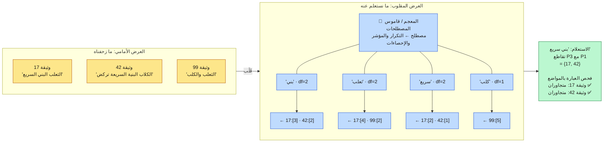
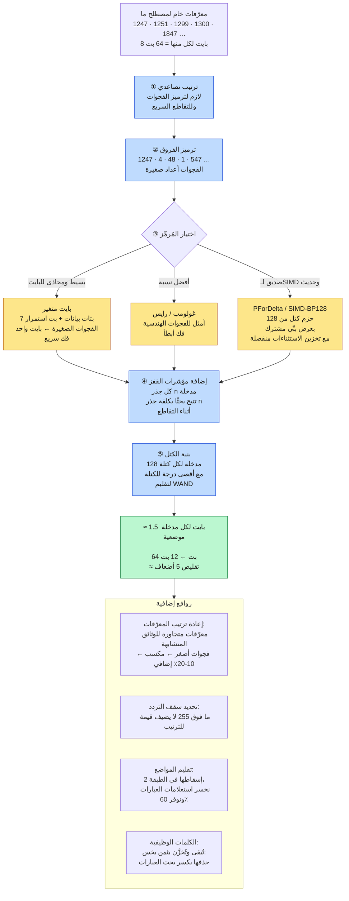
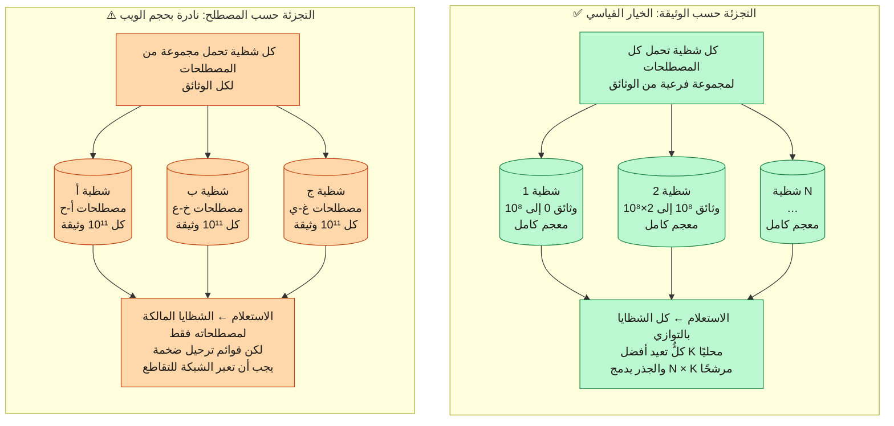
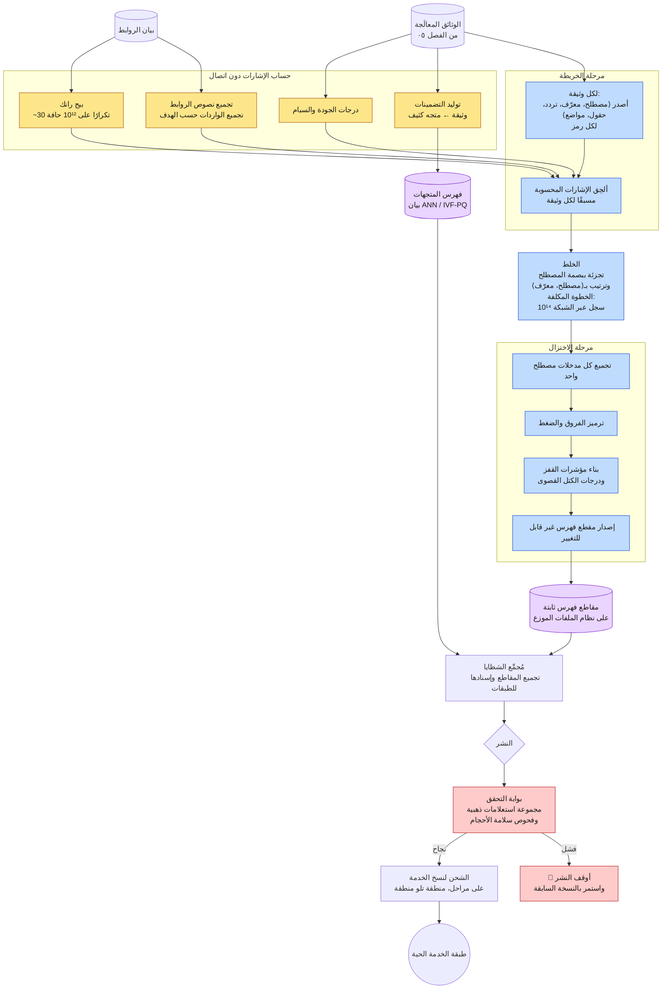
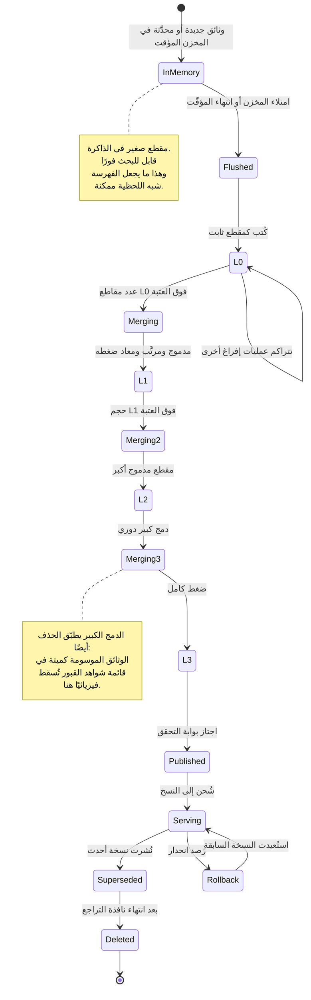
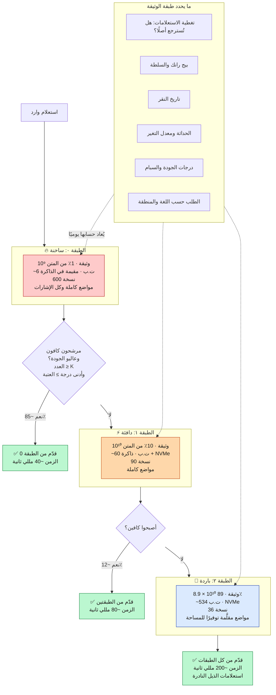
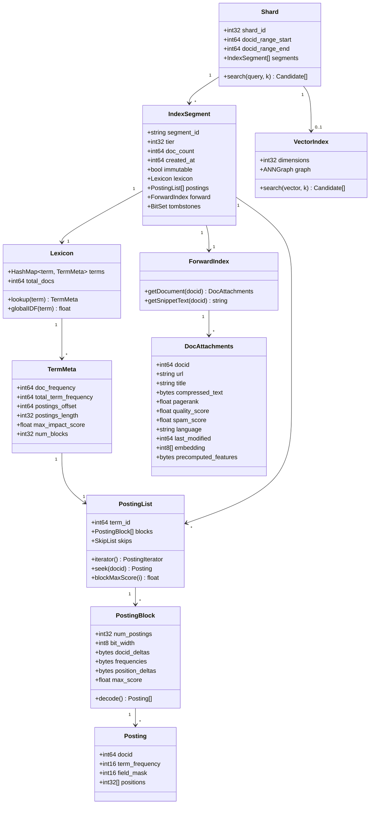

<div align="left">

**[🇬🇧 Read in English](../en/06-indexing.md)**

</div>

<div dir="rtl" align="right">

# الفصل ٠٦ · الفهرسة والفهرس المقلوب

**← [٠٥ · معالجة المحتوى](05-content-processing.md)** · [🏠 الرئيسية](../../README.ar.md) · **[٠٧ · الخدمة](07-serving.md) →**

---

## ٦.١ بنية البيانات الوحيدة التي تجعل البحث ممكنًا

كل ما في [الفصل ٠١](01-overview.md) اختُزل في فكرة واحدة: **لا تمسح الوثائق، بل امسح بنية مفتاحها المصطلح.** تلك البنية هي الفهرس المقلوب، وهي سبب إمكان إنهاء استعلام على 10¹¹ وثيقة في ٤٠ مللي ثانية.

> **المخطط D-26 · تشريح الفهرس المقلوب**

</div>



<div dir="rtl" align="right">

### المكوّنات الثلاثة

| المكوّن | المحتوى | الحجم (من [الفصل ٠٣](03-capacity-estimation.md)) |
|---|---|---:|
| **المعجم** | كل مصطلح مميز ← تكرار الوثائق، ومؤشر إلى المدخلات، وإحصاءات عامة | ~40 غيغابايت |
| **مدخلات الترحيل** | لكل مصطلح، قائمة مرتبة بالوثائق التي تحويه، مع الترددات والمواضع | ~225 تيرابايت |
| **الفهرس الأمامي والمرفقات** | بيانات كل وثيقة اللازمة **بعد** الاسترجاع: النص للمقتطفات، والسمات المحسوبة، والمتجهات | ~350 تيرابايت |

المعجم صغير بما يكفي ليبقى كاملًا في ذاكرة كل خادم أوراق. ومدخلات الترحيل هي الكتلة الأكبر. أما الفهرس الأمامي فلا يُستشار إلا للوثائق القليلة الناجية من الترتيب، ولهذا يمكنه العيش على تخزين أبطأ.

### ماذا تحتوي المدخلة فعلًا

</div>

```
المدخلة = ⟨ فرق_المعرّف، تردد_المصطلح، قناع_الحقول، فروق_المواضع[] ⟩

  فرق_المعرّف     الفجوة عن المعرّف السابق في القائمة  (بايت متغير)
  تردد_المصطلح    مرات ورود المصطلح في هذه الوثيقة
  قناع_الحقول     قناع بتّي: عنوان | h1 | متن | رابط | بديل | URL
  فروق_المواضع    الفجوات بين المواضع المتعاقبة        (بايت متغير)
```

<div dir="rtl" align="right">

و`قناع_الحقول` بالغ القيمة على صغره: فهو يخبر المُسجِّل **أين** ورد المصطلح دون لمس الوثيقة، فيمكن ترجيح تطابق العنوان فوق تطابق المتن بكثير أثناء تمريرة التسجيل الرخيصة L1.

---

## ٦.٢ الضغط: حيث المال

أثبت [الفصل ٠٣](03-capacity-estimation.md) أن الذاكرة هي التكلفة المهيمنة في النظام. ولذا فضغط الفهرس ليس تحسينًا، بل هو اقتصاديات المنتج. فكل خفض بنسبة ١٠٪ في حجم الفهرس هو تقريبًا خفض ١٠٪ في أسطول الخدمة.

> **المخطط D-27 · خط ضغط قوائم الترحيل**

</div>



<div dir="rtl" align="right">

**عن الكلمات الوظيفية.** النصيحة الكلاسيكية في الكتب هي حذف «في» و«من» و«على» من الفهرس لأنها ترد في كل وثيقة تقريبًا. لكن بحث الويب الحديث **لا** يفعل ذلك، لأنه يكسر استعلامات العبارات والاقتباس، فتصير `"لا إله إلا الله"` غير قابلة للإجابة. وبدلًا من ذلك تُبقى المصطلحات عالية التردد لكن تُخزَّن في بنى أرخص، ويتجنّب معالج الاستعلام ببساطة البدء بها.

**وإعادة ترتيب المعرّفات** تستحق التأكيد لأنها شبه مجانية. فإن أُسندت معرّفات الوثائق بحيث تنال الوثائق المتشابهة (المضيف نفسه، الموضوع نفسه، عنقود شبه التكرار نفسه) معرّفات متجاورة عدديًا، صارت الفجوات داخل كل قائمة ترحيل أصغر، والفجوات الأصغر تُضغط أفضل. وترتيب الوثائق حسب الرابط قبل إسناد المعرّفات (بحيث تتجاور صفحات الموقع الواحد) يعطي عادةً تقليصًا إضافيًا بنسبة ١٠–٢٠٪ بكلفة هندسية تكاد تكون صفرًا.

---

## ٦.٣ التشظية: القرار الذي يعرّف معمارية الخدمة

فهرس بحجم 600 تيرابايت لا يمكن أن يعيش على آلة واحدة. وطريقة تقسيمه تحدد كل شيء في مسار الاستعلام.

> **المخطط D-28 · التجزئة حسب الوثيقة مقابل التجزئة حسب المصطلح**

</div>



<div dir="rtl" align="right">

| الخاصية | التجزئة حسب الوثيقة | التجزئة حسب المصطلح |
|---|---|---|
| الخوادم المُتصل بها لكل استعلام | **الكل** (توزيع عالٍ) | المالكة لمصطلحات الاستعلام فقط |
| حجم الشبكة لكل استعلام | صغير: أفضل K فقط | **هائل**: يجب شحن قوائم الترحيل كاملة |
| توازن الحمل | متساوٍ: كل شظية تؤدي عملًا مشابهًا | **سيئ جدًا**: شظية «في» تنصهر و«زيلوفون» عاطلة |
| إضافة وثائق | تافهة: اكتب لأي شظية أو أضف شظية | تتطلب لمس شظايا كثيرة |
| فشل شظية واحدة | فقدان شريحة من المتن مع تدهور تدريجي | فقدان مصطلحات كاملة: بعض الاستعلامات يستحيل إجابته |
| جودة الترتيب | الإحصاءات العامة تحتاج قناة جانبية صغيرة | الإحصاءات العامة محلية ودقيقة |
| موضعية التسجيل | **ممتازة**: كل بيانات الوثيقة مجتمعة | ضعيفة: مصطلحات الوثيقة موزّعة |

**تفوز التجزئة حسب الوثيقة فوزًا حاسمًا**، والعامل الفاصل هو الصف الثالث. فترددات المصطلحات على الويب تتبع توزيع زيبف، ما يعني أن الفهرس المُجزَّأ بالمصطلح يعاني مشكلة نقاط ساخنة دائمة لا تُحل. أما التجزئة بالوثيقة فتمنح كل شظية عملًا متطابقًا إحصائيًا.

والثمن الذي تقبله هو التوزيع الشامل: كل استعلام يلمس كل شظية، وهذا ينشئ مشكلة زمن الذيل التي يُنفق [الفصل ٠٧](07-serving.md) و[الفصل ١٢](12-reliability.md) ميزانيتهما كاملة في تخفيفها. وهذه مقايضة جيدة، فزمن الذيل **قابل للإدارة** بالتحويط والمهل، بينما نقاط زيبف الساخنة غير قابلة للإدارة إطلاقًا.

### إحصاءٌ عام واحد يجب تشاركه

للتجزئة حسب الوثيقة عيب حقيقي واحد: **معامل IDF كمية عامة**، بينما لا ترى كل شظية إلا وثائقها. فلو حسبت الشظايا IDF محليًا لسُجّل المصطلح نفسه بدرجات مختلفة على شظايا مختلفة، ولصار الترتيب المدموج غير متماسك.

والحل رخيص: احسب `df` العام لكل مصطلح دوريًا في مهمة دفعية، وابثّ جدولًا مضغوطًا (~40 غيغابايت، أي المعجم) إلى كل ورقة. وIDF يتغير ببطء، فالتحديث كل ساعة أو كل يوم أكثر من كافٍ.

---

## ٦.٤ بناء الفهرس

> **المخطط D-29 · خط بناء الفهرس**

</div>



<div dir="rtl" align="right">

**الخلط هو كل تكلفة بناء الفهرس.** فالخريطة والاختزال متوازيان بداهةً ورخيصان. أما نقل 10¹⁴ سجل ⟨مصطلح، معرّف⟩ عبر الشبكة ليصل كل مدخلات مصطلح واحد إلى مُختزِل واحد، فهو ما يستغرق الساعات. وهذا بالضبط هو العبء الذي صُمم MapReduce من أجله، وليس مصادفةً أن الورقة خرجت من شركة بحث.

**وبوابة التحقق ليست اختيارية.** فنشر فهرس معطوب إلى طبقة الخدمة أحد أنماط الفشل الكارثية القليلة في النظام: إذ يُدهور النتائج عالميًا، والمتن أكبر من أن يُفحص يدويًا. لذا تعمل مجموعة ثابتة من الاستعلامات الذهبية ذات النتائج المعروفة على كل فهرس مرشّح، وأي انحدار يوقف النشر بينما تستمر النسخة السابقة في الخدمة.

---

## ٦.٥ المقاطع والدمج والثبات

مقاطع الفهرس **غير قابلة للتغيير بمجرد كتابتها**. فالتحديثات لا تعدّل مقطعًا أبدًا بل تنشئ مقاطع جديدة. وهذا هو انضباط الدمج المهيكل بالسجل (LSM)، ويشتري عدة خصائص دفعة واحدة:

- لا يحتاج القرّاء إلى أقفال، فالمقطع المقروء لا يمكن أن يتغير من تحتهم.
- الكتابات إلحاقات متسلسلة، وهو نمط الوصول الوحيد السريع على كل وسيط تخزين.
- النسخ تافه: يمكن نسخ ملف ثابت إلى أي مكان وتخزينه مؤقتًا إلى الأبد.
- التراجع تافه: احتفظ بمجموعة المقاطع السابقة وبدّل مؤشرًا.

والثمن هو **تضخيم القراءة** (إذ على الاستعلام استشارة كل مقطع حي), وهذا ما يسدده الدمج.

> **المخطط D-30 · دورة حياة المقطع والدمج المتدرج**

</div>



<div dir="rtl" align="right">

**الحذف شواهد قبور لا تعديلات.** فإزالة وثيقة تكتب علامة في قائمة حذف؛ وتظل الوثيقة تشغل مساحة الفهرس حتى الدمج الكبير التالي الذي يُسقطها فيزيائيًا. وتُرشِّح الاستعلامات المعرّفات الموسومة وقت القراءة. وهذه الطريقة الوحيدة للتعامل مع الحذف في بنية ثابتة، وتعني أن زمن «الحذف» **ثوانٍ** (يُرشَّح من النتائج) بينما زمن «استرجاع المساحة» **ساعات** (الدمج التالي). وبالنسبة للإزالات القانونية فالزمن الأول هو المهم، وهو مُحقَّق.

---

## ٦.٦ طبقات الفهرس

بيّن [الفصل ٠٣](03-capacity-estimation.md) أن الطبقات تساوي نحو رتبتَي مقدار من تكلفة الأسطول. وإليك الآلية.

> **المخطط D-31 · الفهرس المتدرج والسقوط بين الطبقات**

</div>



<div dir="rtl" align="right">

**الطبقات رهان، وللرهان ثمن.** فشرط السقوط (`العدد ≥ K وأدنى درجة ≥ العتبة`) استدلالٌ تقريبي. وحين يُطلق خطأً، يقدّم النظام نتائج من الطبقة ٠ وحدها لاستعلام كان أفضل جوابه في الطبقة ٢، وهو فشل ملاءمة صامت لن يكشفه أي مقياس زمن. وضبط العتبة مقايضة مباشرة بين التكلفة والجودة على الاستعلامات النادرة، ويجب مراقبته بمقاييس الجودة المُقيَّمة بشريًا من [الفصل ٠٢](02-requirements.md)، لا بالزمن أو معدل النقر وحدهما.

---

## ٦.٧ نموذج بيانات الفهرس الكامل

> **المخطط D-32 · بنى الفهرس**

</div>



<div dir="rtl" align="right">

---

## ٦.٨ اجتياز الفهرس وقت الاستعلام

بعد معرفة البنية، إليك كيف يستخدمها خادم الأوراق فعلًا، والتحسين الذي يجعلها سريعة.

**التقاطع الساذج** لقائمتَي ترحيل يمشي فيهما كاملتين: بكلفة `طول(أ) + طول(ب)`. وبالنسبة لمصطلح مثل «في» يعني ذلك 10¹⁰ مدخلة. غير مقبول.

**التقاطع بمؤشرات القفز** يمشي في القائمة الأقصر و**يقفز** في الأطول مستعملًا مؤشرات القفز. أفضل بكثير.

**خوارزمية WAND / BlockMax-WAND** تذهب أبعد وهي المستعملة في الأنظمة الإنتاجية. فكل كتلة تخزّن أقصى مساهمة ممكنة لها في الدرجة. وأثناء الاجتياز يتتبع المحرك درجة أفضل مرشح في المرتبة k الحالية؛ وأي كتلة لا يستطيع أقصى ما تعطيه أن يتفوق عليها **تُتخطى كليًا دون فك ضغط**.

</div>

```
العتبة θ ← درجة المرشح الحالي في المرتبة k

لكل كتلة مرشحة:
    الحد_الأعلى ← مجموع أقصى درجات الكتلة لمصطلحات الاستعلام
    إذا كان الحد_الأعلى ≤ θ:
        تخطَّ الكتلة كاملة       ← لا فك ضغط ولا تسجيل
    وإلا:
        فُكّ الكتلة وسجّل الوثائق وحدّث θ
```

<div dir="rtl" align="right">

عمليًا يتخطى هذا **٨٠–٩٥٪** من المدخلات لاستعلام نمطي متعدد المصطلحات، وهو **دقيق**: إذ إن أفضل k المُعادة مطابقة تمامًا لنتيجة التقييم الكامل. وهي حالة نادرة من تسريع كبير بلا كلفة في الجودة، ولهذا تُخزَّن درجات الكتل القصوى وقت البناء (انظر المخطط D-27، الخطوة ⑤).

---

## ٦.٩ المفاضلات المسجَّلة

| القرار | المُختار | المرفوض | السبب |
|---|---|---|---|
| التجزئة | حسب الوثيقة | حسب المصطلح | نقاط زيبف الساخنة غير قابلة للإصلاح |
| القابلية للتغيير | مقاطع ثابتة + دمج | تحديث في المكان | قراءات بلا أقفال ونسخ وتراجع تافهان |
| الضغط | كتل PForDelta/SIMD | غولومب-رايس | سرعة الفك تتفوق على بضع نقاط مئوية من النسبة |
| المواضع | تُحفظ في الطبقتين ٠ و١ وتُقلَّم في ٢ | تُحفظ في كل مكان | استعلامات العبارات نادرة على وثائق الذيل |
| الكلمات الوظيفية | تُبقى وتُخزَّن بثمن بخس | تُحذف | الحذف يكسر استعلامات العبارات المقتبسة |
| الحذف | شواهد قبور + دمج كسول | إعادة كتابة فورية | الثبات أثمن من استرجاع المساحة فورًا |
| الطبقات | ٣ طبقات حسب تغطية الاستعلامات | فهرس مسطح | تقليص تكلفة الأسطول ~١٠٠ ضعف |
| إسناد المعرّفات | مرتَّبة حسب الرابط | عشوائية | مكسب ضغط مجاني ١٠–٢٠٪ |

</div>

<div align="center">

**← [٠٥ · معالجة المحتوى](05-content-processing.md)** · [🏠 الرئيسية](../../README.ar.md) · **[٠٧ · الخدمة](07-serving.md) →** · [🇬🇧 English](../en/06-indexing.md)

</div>
