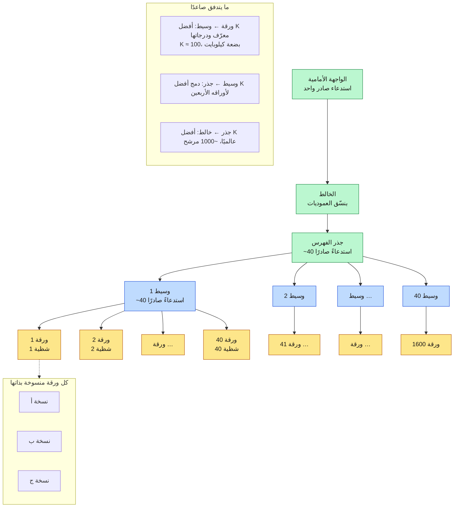
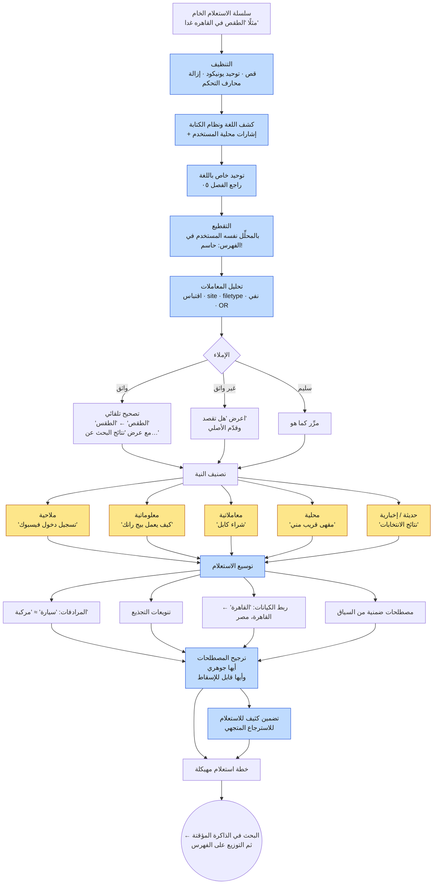
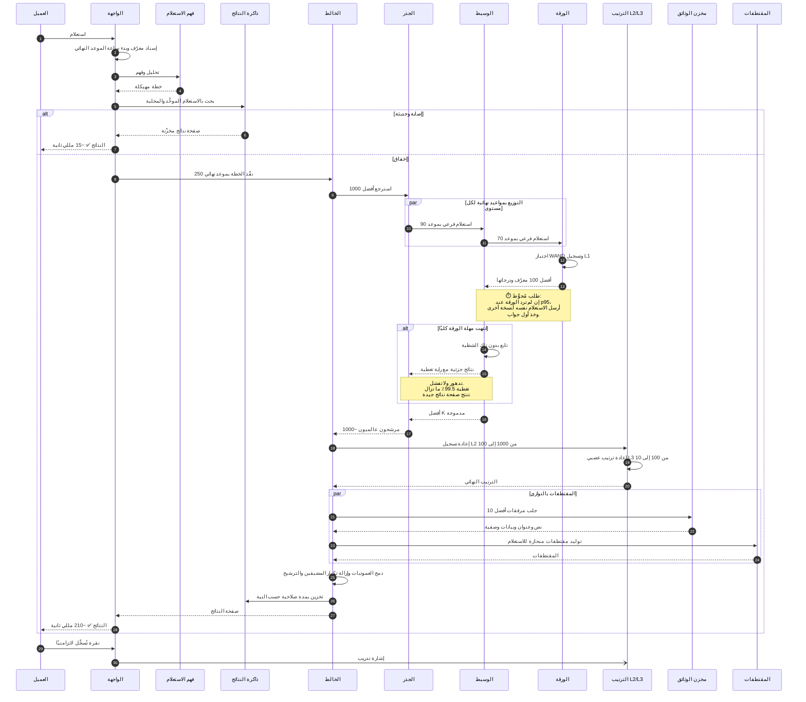
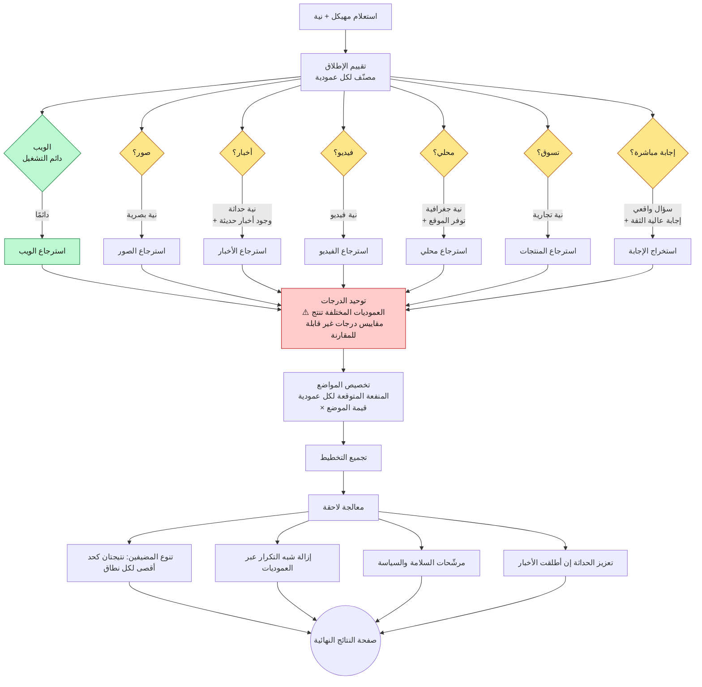
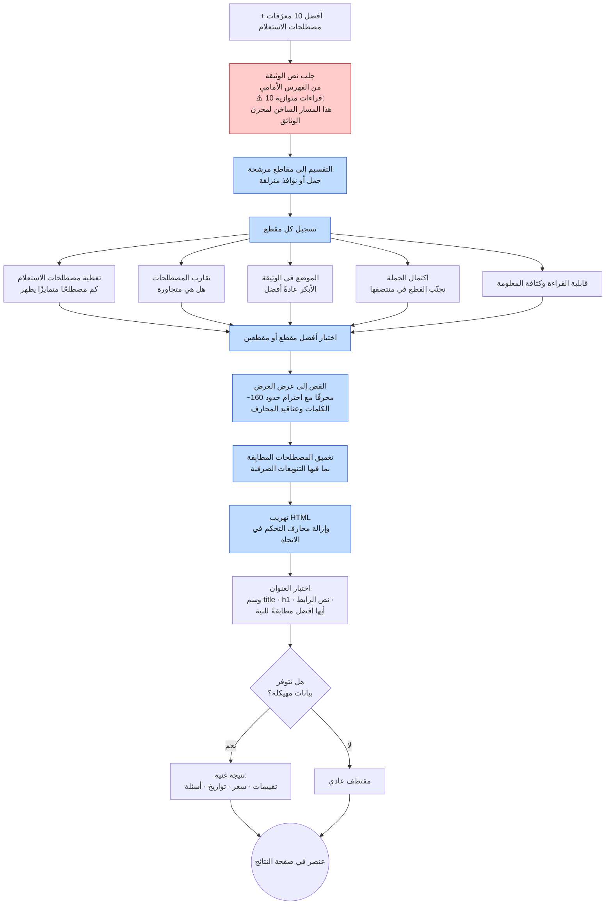

<div align="left">

**[🇬🇧 Read in English](../en/07-serving.md)**

</div>

<div dir="rtl" align="right">

# الفصل ٠٧ · مسار خدمة الاستعلام

**← [٠٦ · الفهرسة](06-indexing.md)** · [🏠 الرئيسية](../../README.ar.md) · **[٠٨ · الترتيب](08-ranking.md) →**

---

## ٧.١ طوبولوجيا الخدمة

التجزئة حسب الوثيقة ([الفصل ٠٦](06-indexing.md)) تعني أن كل استعلام يجب أن يصل إلى كل شظية. ومع آلاف الشظايا، فإن جذرًا واحدًا يخاطبها كلها مباشرةً سيحتاج آلاف الاستدعاءات الصادرة لكل استعلام، فيصير الجذر عنق زجاجة للتوزيع ومضخِّمًا لزمن الذيل بذاته.

والجواب **شجرة**.

> **المخطط D-33 · شجرة الخدمة: جذر ووسطاء وأوراق**

</div>



<div dir="rtl" align="right">

**لماذا شجرة لا توزيع مسطح؟**

| الخاصية | مسطح (جذر ← 1600 ورقة) | شجرة (جذر ← 40 ← 1600) |
|---|---|---|
| الاستدعاءات من الجذر | 1600 | 40 |
| عمل الدمج عند الجذر | 1600 × K نتيجة | 40 × K نتيجة |
| معالج الجذر | عنق زجاجة | متواضع |
| انكشاف الذيل عند الجذر | أقصى 1600 زمن | أقصى 40 زمنًا (كلٌّ محوَّط بالفعل) |
| زمن القفزة الإضافية | صفر | ~0.5 مللي ثانية |

تكلّف الشجرة قفزة شبكية إضافية واحدة (~0.5 مللي ثانية من ميزانية 300) وتشتري تقليصًا للتوزيع بمقدار ٤٠ ضعفًا عند كل مستوى. ويمتص كل وسيط ذيل أوراقه الأربعين محليًا، فتؤثر ورقة بطيئة واحدة في شجرة فرعية بدل الاستعلام كله.

---

## ٧.٢ فهم الاستعلام

قبل لمس أي فهرس، يجب أن تتحول السلسلة الخام إلى استعلام مهيكل. وهذه المرحلة رخيصة بالمللي ثانية وباهظة الثمن في الملاءمة إن أُسيء تنفيذها.

> **المخطط D-34 · خط فهم الاستعلام**

</div>



<div dir="rtl" align="right">

### أهم قاعدة مفردة في هذا الفصل

> **يجب أن يكون محلِّل الاستعلام ومحلِّل الفهرس هما الشيفرة نفسها.**

فإن صغّر الفهرسُ الحروف وجذّع بينما لم يفعل مسار الاستعلام ذلك، فلن يطابق `Running` أبدًا الرمز المفهرس `run`. وهذا الصنف من العلل **صامت**: لا يُرمى خطأ، بل تصير النتائج أسوأ فحسب وبشكل دائم. ولذا يتشارك كل نظام بحث ناضج تنفيذًا واحدًا للمحلِّل بين البناء والخدمة، ويعامل أي تباعد بينهما كخطأ يكسر البناء.

### النية تشكّل كل ما بعدها

| النية | تركيز الاسترجاع | وزن الحداثة | عرض النتائج |
|---|---|---|---|
| ملاحية | هدف واحد بعينه؛ الدقة في المرتبة الأولى هي كل شيء | منخفض | نتيجة واحدة مهيمنة مع روابط فرعية |
| معلوماتية | استدعاء واسع ومصادر متنوعة | متوسط | عشر روابط، وربما مقتطف مميز |
| معاملاتية | متن المنتجات والتوفر والسعر | متوسط | وحدة تسوق ومراجعات |
| محلية | متن مُرشَّح جغرافيًا | مرتفع | حزمة خرائط ومواعيد ومسافات |
| إخبارية | الحداثة تهيمن على السلطة | **مرتفع جدًا** | شريط أهم الأخبار مع طوابع زمنية |

فدالة ترتيب مضبوطة للاستعلامات المعلوماتية ستؤدي أداءً رديئًا على الملاحية (إذ ستوزّع الاحتمال على صفحات «ملائمة» كثيرة بينما أراد المستخدم واحدة بعينها). ولهذا يسبق تصنيفُ النية الترتيبَ بدل أن يُدمج فيه.

---

## ٧.٣ تتابع الخدمة الكامل مع دفاعات زمن الذيل

> **المخطط D-35 · مسار الخدمة شاملًا التحويط والتدهور**

</div>



<div dir="rtl" align="right">

### دفاعات زمن الذيل الثلاثة

من [الفصل ٠٢](02-requirements.md): مع ١٦٠٠ ورقة واحتمال ١٪ لبطء كل منها، فإن ~99.99٪ من الاستعلامات تلمس خادمًا بطيئًا واحدًا على الأقل. وثلاث تقنيات (كلها من ورقة دين وباروسو *الذيل عند الحجم*) تمنع ذلك من الظهور للمستخدم.

| التقنية | الآلية | الكلفة |
|---|---|---|
| **الطلبات المُحوَّطة** | بعد انتظار زمن p95، أرسل نسخة إلى نسخة أخرى واستخدم أسرع عائد | ~٥٪ حمل إضافي |
| **الطلبات المربوطة** | أرسل إلى نسختين فورًا، وكلٌّ تُلغي نسخة الأخرى المصطفة عند بدء التنفيذ | رسائل أكثر قليلًا وهدر يكاد يكون صفرًا |
| **تمرير الموعد النهائي** | كل قفزة تمرّر ميزانيتها المتبقية، والورقة التي لا تستطيع الإنهاء تعيد نتائج جزئية | مجانية: مجرد توصيل |

يُضاف إليها الدفاع المعماري: **تدهور التغطية**. فإن لم تُجب شظية، يمضي الاستعلام بدونها وتُوسم الاستجابة بنسبة التغطية. وتقديم ٩٩.٥٪ من المتن في 200 مللي ثانية منتج أفضل بكثير من تقديم ١٠٠٪ في ٣ ثوانٍ، والبديل، أي إعادة خطأ، هو أسوأ النتائج جميعًا.

---

## ٧.٤ أين تذهب المللي ثانية

> **المخطط D-36 · الخط الزمني لميزانية الاستعلام (إخفاق الذاكرة، مسار p99)**

```mermaid
gantt
    title ميزانية زمن الاستعلام بالمللي ثانية
    dateFormat X
    axisFormat %s

    section الشبكة
    من العميل إلى الحافة        :net1, 0, 20
    من الحافة إلى خلية الخدمة   :net2, 20, 25

    section الواجهة
    تهيئة الطلب والتوجيه        :fe1, 25, 33
    فهم الاستعلام               :qu1, 33, 53
    البحث في الذاكرة المؤقتة    :ca1, 53, 55

    section الاسترجاع
    من الجذر للوسيط للورقة      :rt1, 55, 58
    اجتياز WAND وتسجيل L1       :lf1, 58, 98
    الدمج صعودًا في الشجرة       :mg1, 98, 105

    section الترتيب
    إعادة تسجيل L2              :l2, 105, 135
    إعادة ترتيب عصبي L3         :l3, 135, 185

    section التجميع
    جلب من مخزن الوثائق         :ds1, 185, 205
    توليد المقتطفات             :sn1, 205, 215
    الدمج والتسلسل              :bl1, 215, 230

    section العودة
    الاستجابة إلى العميل        :ret, 230, 250
    هامش الذيل حتى الهدف        :crit, head, 250, 300
```

</div>



<div dir="rtl" align="right">

اقرأ هذا كميزانية **تنفقها**. وتنبثق منه حقيقتان بنيويتان:

1. **الاسترجاع والترتيب معًا يشكلان ~٥٠٪ من الميزانية** (من 55 إلى 185). وكل ما عداهما نفقات عامة تُقلَّل ليكون هذا النصف أفضل ما يمكن.
2. **الخمسون مللي ثانية في النهاية ليست فائضًا بل هي الذيل.** فـp50 ينتهي قرب 210، وp99 يستهلك الهامش. وإنفاقه على مزايا يعني تجاوز الهدف لـ١٪ من الاستعلامات.

---

## ٧.٥ البحث الشامل: دمج العموديات

صفحات النتائج الحديثة ليست قائمة مرتبة واحدة، بل تتداخل فيها نتائج الويب مع الصور والأخبار والفيديو والخرائط والتسوق والإجابات المباشرة. وكل عمودية نظام استرجاع منفصل بفهرسه وترتيبه، وعلى الخالط أن يقرر **أيها** يُعرض و**أين** و**كم** مساحة ينال.

> **المخطط D-37 · إطلاق العموديات ودمجها**

</div>



<div dir="rtl" align="right">

**الجزء الصعب هو توحيد الدرجات.** فدرجة نتيجة الويب ودرجة نتيجة الصور تأتيان من نموذجين مختلفين دُرّبا على أهداف مختلفة؛ وهما ليستا على مقياس مشترك، فلا يمكنك ببساطة ترتيبهما معًا. والحل القياسي تحويل درجة كل عمودية إلى **منفعة متوقعة** (أي تقدير لاحتمال رضا المستخدم عن ذلك العنصر) مُعايَرًا على أحكام بشرية محجوزة. فالاحتمالات المعايَرة وحدها قابلة للمقارنة عبر العموديات.

**والإطلاق المتحمس أكثر من اللازم هو الفشل الكلاسيكي.** فعرض شريط أخبار لاستعلام بلا نية إخبارية يدفع نتيجة الويب الملائمة فعلًا إلى أسفل الشاشة. ولذا تُضبط مُطلقات العموديات بتحفّظ: عتبة **إضافة** عمودية أعلى من عتبة احتفاظ نتيجة ويب بموضعها.

---

## ٧.٦ توليد المقتطفات

المقتطف هو ما يقرأه المستخدم فعلًا. ويُولَّد لكل استعلام على حدة ولا يُخزَّن، لأن المقطع النافع يعتمد على ما سُئل عنه.

> **المخطط D-38 · توليد المقتطفات المنحازة للاستعلام**

</div>



<div dir="rtl" align="right">

ملاحظتان أهم مما تبدوان:

- **توليد المقتطفات مضخِّم قراءة لمخزن الوثائق.** فكل استعلام غير مخزَّن ينفّذ ~١٠ قراءات عشوائية على مخزن بحجم البيتابايت، وذلك في المسار الحرج للزمن. ولهذا يُوضع الفهرس الأمامي بجوار طبقة خدمة الأوراق حيثما أمكن، ولهذا يكون تخزين المقتطفات طبقة ذاكرة مؤقتة مستقلة في [الفصل ١٠](10-caching.md).
- **يجب إزالة محارف التحكم في الاتجاه.** وفي سياق ثنائي اللغة هذا ليس تجميليًا: فمحارف تجاوز الاتجاه في يونيكود قادرة على جعل النص المعروض يُقرأ على نحو مخالف لمحتواه الفعلي، وهو ناقل حقيقي لانتحال صفحات النتائج. فتعقيمها **ضابط أمني** لا لباقة تنسيقية.

---

## ٧.٧ ماذا يفعل خادم الأوراق فعلًا

للاكتمال، إليك الحلقة الأعمق:

</div>

```
دالة بحث_الورقة(الاستعلام، k، الموعد_النهائي):
    المرشحون ← كومة أفضل k فارغة
    θ ← سالب ما لا نهاية              # درجة أفضل مرشح في المرتبة k

    القوائم ← [افتح_قائمة_ترحيل(t) لكل t في مصطلحات الاستعلام]
    رتّب القوائم تصاعديًا حسب تكرار الوثائق   # الأندر يقود

    طالما لم تنتهِ و الآن() < الموعد_النهائي:
        # تقليم BlockMax-WAND (الفصل ٠٦ §٦.٨)
        إذا كان مجموع أقصى_درجات_الكتل ≤ θ:
            تخطَّ_الكتلة(القوائم)
            تابع

        d ← المعرّف_المشترك_التالي(القوائم)
        إذا كان d عدمًا: اخرج

        إذا كان d موسومًا بشاهد قبر أو يخالف المرشّحات:
            تابع

        الدرجة ← تسجيل_L1(d، الاستعلام)   # رخيص: شبيه BM25 + إشارات ساكنة
        إذا كانت الدرجة > θ:
            المرشحون.أدرج(d، الدرجة)
            إذا تجاوز الحجم k:
                المرشحون.أخرج_الأدنى()
                θ ← المرشحون.الأدنى()

    أعِد المرشحين، وحالة: كاملة أو جزئية
```

<div dir="rtl" align="right">

ثلاث خصائص لهذه الحلقة تحدد طابع النظام:

1. **إنها واعية بالموعد النهائي.** فالحلقة تفحص الساعة وتعيد ما لديها. ولا تتجاوز الورقة الميزانية أبدًا، بل تعيد جوابًا جزئيًا موسومًا بذلك.
2. **تسجيل L1 رخيص عمدًا.** تسجيل مصطلحات بأسلوب BM25 مع إشارات ساكنة محسوبة مسبقًا، بلا استدلال نموذجي وبلا جلب وثائق. فالتسجيل المكلف يأتي لاحقًا على وثائق أقل بكثير.
3. **التقليم دقيق.** فـBlockMax-WAND يتخطى العمل دون تغيير أفضل k. المسار الرخيص والمسار الصحيح هما المسار نفسه.

</div>

<div align="center">

**← [٠٦ · الفهرسة](06-indexing.md)** · [🏠 الرئيسية](../../README.ar.md) · **[٠٨ · الترتيب](08-ranking.md) →** · [🇬🇧 English](../en/07-serving.md)

</div>
