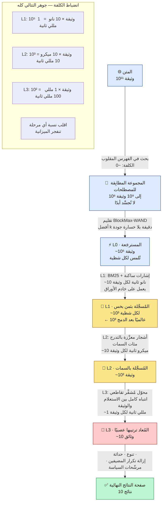
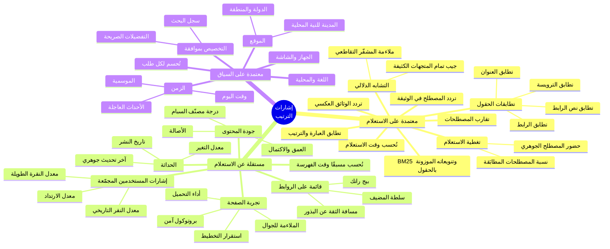
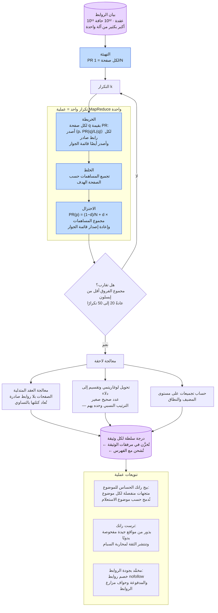
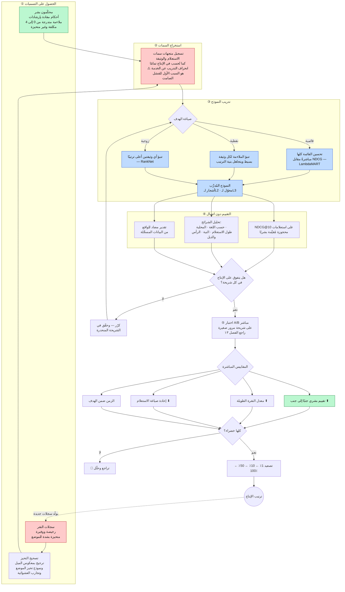
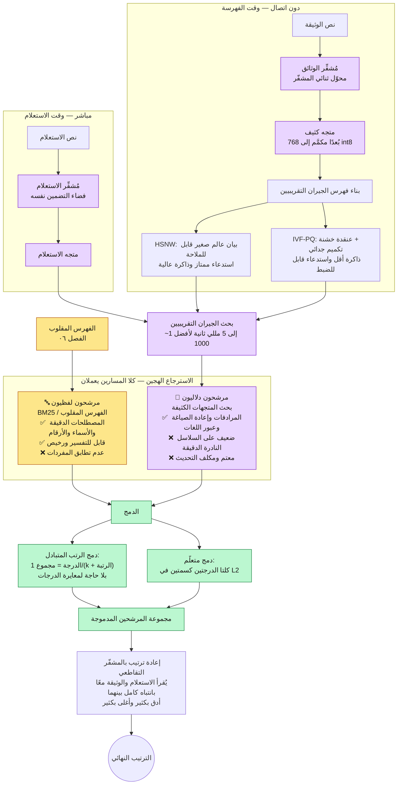
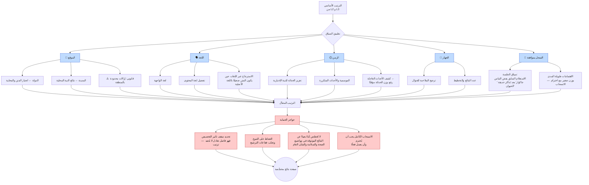
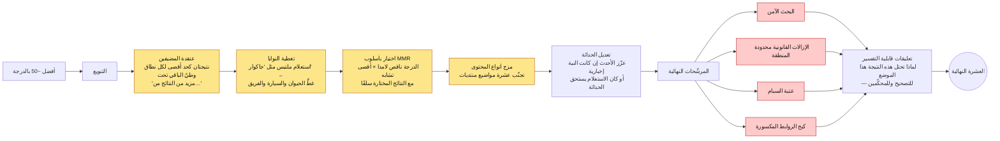

**[🇬🇧 Read in English](../en/08-ranking.md)**

# الفصل ٠٨ · الترتيب والملاءمة

**← [٠٧ · الخدمة](07-serving.md)** · [🏠 الرئيسية](../../README.ar.md) · **[٠٩ · التخزين](09-storage.md) →**

---

## ٨.١ الترتيب هو المنتج

كل ما في الفصول ٠٤–٠٧ موجود لتسليم بضع مئات من المرشحين المعقولين إلى هذا الفصل. فالاسترجاع مسألة هندسية لها أجوبة صحيحة، أما **الترتيب فمسألة حُكم بلا حقيقة أساس** — إذ إن تحديد أي الوثائق «أفضل» لاستعلام مثل «جاكوار» يعتمد على من يسأل، ومتى، ولماذا.

والنتيجة المعمارية هي **التتالي**: طبّق تسجيلًا رخيصًا على وثائق كثيرة وتسجيلًا مكلفًا على وثائق قليلة، بحيث تبقى الكلفة الكلية داخل ميزانية الزمن بينما ينال الترتيب النهائي منفعة أقوى نموذج تستطيع تحمّله.

> **المخطط D-39 — قمع الاسترجاع والترتيب**

**اقرأ صندوق الميزانية بعناية — فهو البصيرة الجوهرية.** إن L3 أغلى من L1 بمئة ألف ضعف لكل وثيقة. وتشغيل L3 على 10⁵ وثيقة سيستغرق ١٠٠ ثانية. فالقمع ليس تحسينًا يُضاف فوق الترتيب، بل **القمع هو ما يجعل الترتيب المكلف ممكنًا أصلًا**.

والخطر المقابل: **الوثيقة التي تُسقط خطأً في L1 لا يمكن استعادتها أبدًا في L3.** فأخطاء الاستدعاء في بداية التتالي دائمة. ولهذا يكون L1 سخيًا عمدًا — إذ يُحسِّن الاستدعاء لا الدقة، ويترك الدقة للمراحل القادرة على تحمّلها.

---

## ٨.٢ تصنيف الإشارات

> **المخطط D-40 — من أين تأتي إشارات الترتيب**

والانقسام مهم عمليًا:

| الصنف | متى يُحسب | كلفة التخزين | كلفة الزمن |
|---|---|---|---|
| مستقل عن الاستعلام | دون اتصال، وقت الفهرسة | عالية — يُخزَّن لكل وثيقة | ~صفر وقت الاستعلام |
| معتمد على الاستعلام | وقت الاستعلام، في الورقة | ~صفر | التكلفة المهيمنة في الخدمة |
| معتمد على السياق | وقت الاستعلام، من الطلب | ~صفر | منخفضة، لكنها تضاعف مفاتيح الذاكرة المؤقتة |

**ادفع كل ما تستطيع إلى العمود المستقل عن الاستعلام.** وهذا هو المبدأ المتكرر من [الفصل ٠١](01-overview.md) — أنجز العمل المكلف دون اتصال. فمسار الاستعلام ينبغي أن **يجمع** أرقامًا محسوبة مسبقًا لا أن يحسبها.

---

## ٨.٣ بيج رانك — إشارة السلطة المستقلة عن الاستعلام

يُنمذج بيج رانك متصفحًا عشوائيًا يتبع الروابط عشوائيًا ويقفز أحيانًا إلى صفحة عشوائية. والاحتمال المستقر لوجوده في الصفحة *p* هو قيمة بيج رانك لها.

$$PR(p) = \frac{1-d}{N} + d \sum_{q \in In(p)} \frac{PR(q)}{L(q)}$$

حيث *d* ≈ 0.85 معامل التخميد، و*N* عدد الصفحات، و*In(p)* مجموعة الصفحات المرتبطة بـ*p*، و*L(q)* درجة خروج *q*.

> **المخطط D-41 — حساب بيج رانك عند الحجم الضخم**

**تحفظان صادقان.**

أولًا، **بيج رانك إشارة واحدة بين مئات**، وقد انخفض وزنه النسبي انخفاضًا هائلًا منذ ١٩٩٨. واعتباره «خوارزمية جوجل» خطأ شائع وجسيم. فهو يوفّر افتراضًا مسبقًا عن السلطة مستقلًا عن الاستعلام، ولا يقول شيئًا عمّا إذا كانت الصفحة تجيب عن السؤال.

ثانيًا، **العقد المتدلية ليست حاشية.** فنسبة كبيرة من الويب بلا روابط صادرة (ملفات PDF والصور والصفحات الطرفية). وبلا إعادة توزيع كتلة رتبتها، يتسرّب الاحتمال خارج النظام في كل تكرار ولا يتقارب الحساب إلى توزيع سليم. فمعالجتها بصورة صحيحة متطلب تنفيذي حقيقي لا لباقة نظرية.

---

## ٨.٤ التعلم للترتيب

ضبط مئات أوزان السمات يدويًا مستحيل. فالترتيب يُتعلَّم من بيانات موسومة.

> **المخطط D-42 — حلقة تدريب ونشر التعلم للترتيب**

### لماذا تفوز الأهداف القائمية

تُقاس جودة الترتيب بـNDCG، وهي خاصية **القائمة كلها** لا خاصية الوثائق منفردة. فالنموذج النقطي الذي يتنبأ بملاءمة كل وثيقة تنبؤًا مثاليًا بمعزل عن غيرها قد ينتج مع ذلك قائمة رديئة، لأنه لا يدرك أن تبديل الموضعين الأول والثاني أهم بكثير من تبديل التاسع والعاشر. أما LambdaMART فيعمل بترجيح كل زوج تدريبي مباشرةً بـ**مقدار تغيّر NDCG** لو تبادلت الوثيقتان موضعيهما — وهذا يوائم التدرج مع المقياس الذي يهمك فعلًا.

### نمطا الفشل اللذان يعضّان فعلًا

**تحيز الموضع.** ينقر المستخدمون على النتيجة الأولى أكثر بكثير من الخامسة بصرف النظر عن الملاءمة. والنموذج المُدرَّب ساذجًا على النقرات يتعلم أن «الوثائق التي رُتِّبت أولًا جيدة»، وهذا استدلال دائري: فهو يرسّخ الترتيب الحالي ولا يستطيع أبدًا اكتشاف أن السابعة كانت أفضل. والحلول — الترجيح بمعكوس الميل، وعشوَنة النتائج عمدًا لشريحة مرور صغيرة لجمع بيانات غير متحيزة — إلزامية لا تحسينات اختيارية.

**انحراف التدريب عن الخدمة.** إن حُسبت سمةٌ بطريقة في خط التدريب وبطريقة مختلفة قليلًا في ثنائية الخدمة، تلقّى النموذج مدخلات لم يُدرَّب عليها قط. وهذا لا ينتج خطأً ولا تنبيهًا؛ بل تتدهور الجودة فحسب. والدفاع الموثوق الوحيد هو **تسجيل السمات من خدمة الإنتاج والتدريب على تلك المتجهات المسجَّلة بعينها**، لا إعادة حسابها في خط التدريب.

---

## ٨.٥ الاسترجاع العصبي — أبعد من مطابقة المصطلحات

يفشل الاسترجاع اللفظي في **مشكلة عدم تطابق المفردات**: فوثيقة عن «صيانة المركبات» لا تطابق استعلامًا عن «إصلاح السيارات» رغم أنها بالضبط ما يريده المستخدم. ويحل الاسترجاع الكثيف ذلك بإسقاط الاستعلامات والوثائق في فضاء متجهي دلالي مشترك.

> **المخطط D-43 — الاسترجاع الكثيف والدمج الهجين**

### المشفّر الثنائي مقابل التقاطعي — لماذا يوجد كلاهما

| | **الثنائي** (للاسترجاع) | **التقاطعي** (لإعادة الترتيب) |
|---|---|---|
| البنية | يشفّر الاستعلام والوثيقة **منفصلين** | يشفّرهما **معًا** |
| متجهات الوثائق | تُحسب مسبقًا وتُخزَّن في الفهرس | يجب حسابها لكل زوج استعلام‑وثيقة |
| الكلفة وقت الاستعلام | تشفير واحد للاستعلام + بحث تقريبي | مرور محوّل كامل **لكل وثيقة** |
| الدقة | جيدة | أفضل بكثير |
| قابل للتطبيق على | 10¹¹ وثيقة | ~10² وثيقة |

وهذا بالضبط سبب وجود التتالي. فالمشفّر الثنائي يستطيع حساب متجهات الوثائق مسبقًا لأنه لا ينظر إلى الاستعلام أثناء التشفير — فيصير الاسترجاع عبر المليارات ممكنًا. والمشفّر التقاطعي أدق **لأنه بالتحديد** يقرأهما معًا، وهو أيضًا سبب استحالة حسابه مسبقًا. فالرخيص المتوازي يسترجع، والمكلف الدقيق يعيد الترتيب.

### متى يفوز الاسترجاع اللفظي رغم ذلك

الاسترجاع الكثيف ليس بديلًا؛ فهو يخسر باطّراد في:

- **المعرّفات الدقيقة** — أرقام القطع ورموز الأخطاء وأسماء الاستثناءات وأرقام الهواتف
- **أسماء العلم النادرة** الغائبة أو ضعيفة التمثيل في بيانات التدريب
- **النفي والمنطق الدقيق** — إذ تُشتهر التضمينات بطمس الفرق بين «س» و«ليس س»
- **الحداثة** — فالكيان الجديد تمامًا ليس في مفردات نموذج التضمين حتى يُعاد تدريبه، بينما يملكه الفهرس المقلوب لحظة زحفه

والنقطة الأخيرة مهمة معماريًا: **الفهرس اللفظي يتحدّث خلال دقائق، ونموذج التضمين يتحدّث خلال أسابيع.** فالاسترجاع الهجين ليس تحوّطًا، بل هو دمج نظامين بنمطَي فشل متكاملين حقًا.

---

## ٨.٦ التخصيص والسياق

> **المخطط D-44 — تطبيق السياق في الترتيب**

**التخصيص مكلف معماريًا بطريقة يسهل إغفالها.** فكل بُعد سياقي تضيفه يضاعف فضاء مفاتيح ذاكرة النتائج المؤقتة. فذاكرة مفتاحها `(استعلام، دولة، لغة)` قد تصيب ٤٠٪ من الوقت، أما مفتاحها `(استعلام، دولة، لغة، مدينة، جهاز، معرّف مستخدم)` فلن يصيب عمليًا أبدًا. ولما كان [الفصل ٠٣](03-capacity-estimation.md) قد بيّن أن الذاكرة المؤقتة تزيل ~٤٠٪ من تكلفة الخدمة، فإن التخصيص العدواني قد **يضاعف تكلفة أسطول الخدمة بأكمله**. وهذا — أكثر بكثير من أي حجة خصوصية — هو سبب تطبيق التخصيص الإنتاجي كتعديل خفيف بعد الترتيب لا كاسترجاع لكل مستخدم.

---

## ٨.٧ التنوع والتعديلات النهائية

أفضل عشرة بالدرجة غالبًا ما تكون صفحة نتائج رديئة. فعشر صفحات شبه متطابقة من موقع واحد تُعظّم الملاءمة تقنيًا بينما تخدم المستخدم خدمة سيئة.

> **المخطط D-45 — تحسين مجموعة النتائج بعد الترتيب**

**التنويع مقايضة صريحة للملاءمة المقيسة بالنفع الفعلي.** فكل قيد تنويع **يخفض** قيمة NDCG للقائمة محسوبةً مقابل تسميات ملاءمة كل وثيقة، لأنك تمتنع عمدًا عن عرض الوثيقة الأعلى درجة في موضع ما. ولا يُبرَّر ذلك إلا بمقاييس على مستوى المستخدم — نجاح المهمة، ومعدل إعادة الصياغة، والنقرات الطويلة — وهو مثال جيد على سبب إصرار [الفصل ٠٢](02-requirements.md) على مقاييس جودة متعددة ومتعارضة بدل هدف تحسين واحد.

---

## ٨.٨ الملخص — كومة الترتيب

| المرحلة | تعمل على | الوثائق داخلًا ← خارجًا | النموذج | الزمن |
|---|---|---:|---|---:|
| **L0 الاسترجاع** | الورقة | 10¹¹ ← 10⁵ | فهرس مقلوب + WAND | ~40 مللي ثانية |
| **L1 التسجيل الرخيص** | الورقة | 10⁵ ← 10³ | BM25 + إشارات ساكنة | ضمن الأربعين |
| **L2 التسجيل بالسمات** | طبقة الترتيب | 10³ ← 10² | أشجار معزَّزة بالتدرج | ~30 مللي ثانية |
| **L3 إعادة الترتيب العصبي** | مسرّعات | 10² ← 10¹ | محوّل مشفّر تقاطعي | ~50 مللي ثانية |
| **المعالجة اللاحقة** | الخالط | 10¹ ← 10¹ | قواعد وتنويع | ~5 مللي ثانية |

**← [٠٧ · الخدمة](07-serving.md)** · [🏠 الرئيسية](../../README.ar.md) · **[٠٩ · التخزين](09-storage.md) →** · [🇬🇧 English](../en/08-ranking.md)

