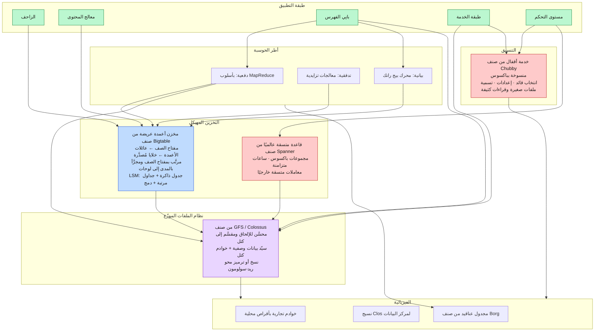
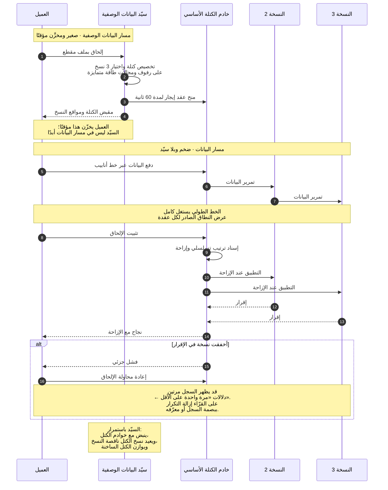
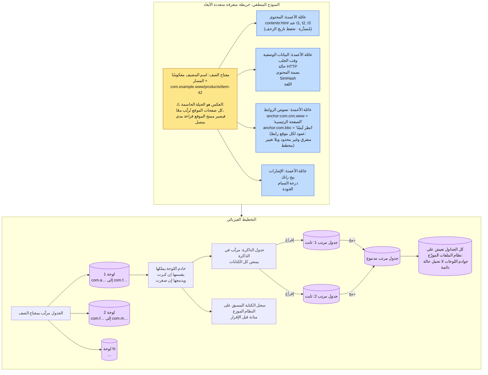
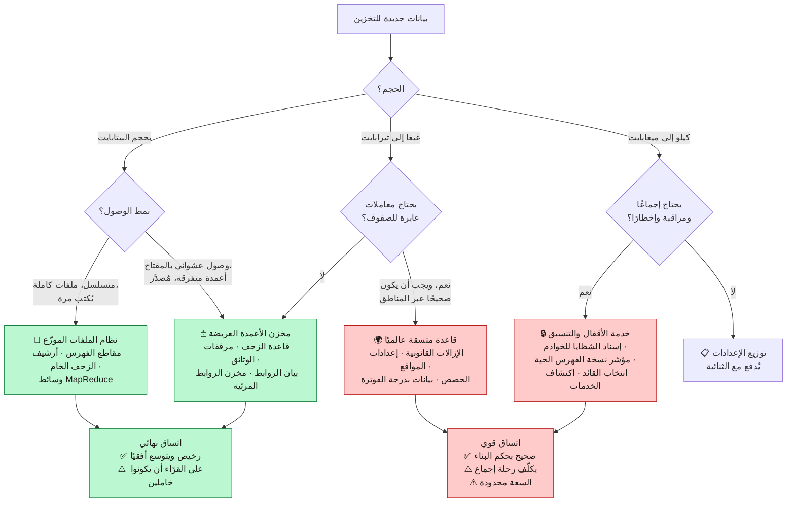
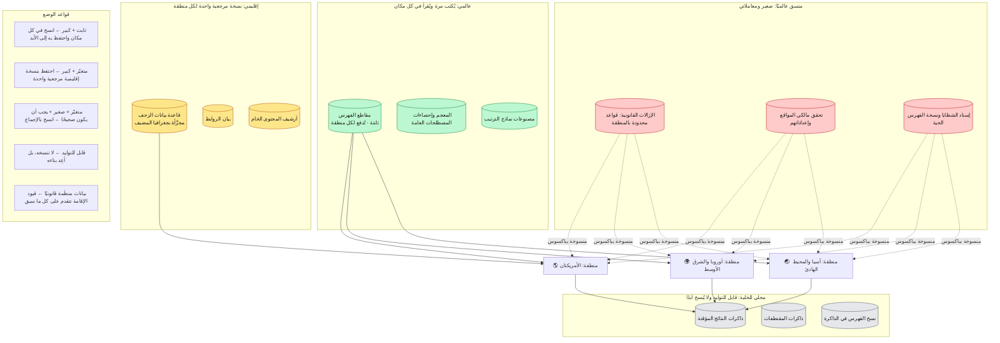

**[🇬🇧 Read in English](../en/09-storage.md)**

# الفصل ٠٩ · بنية التخزين التحتية

**← [٠٨ · الترتيب](08-ranking.md)** · [🏠 الرئيسية](../../README.ar.md) · **[١٠ · التخزين المؤقت](10-caching.md) →**

---

## ٩.١ أربع مشكلات تخزين وأربعة أنظمة مختلفة

الغريزة المبتدئة الشائعة هي اللجوء إلى قاعدة بيانات واحدة. وهذا النظام لا يستطيع ذلك: فلديه أربعة أعباء عمل متطلباتها متناقضة فيما بينها.

| العبء | الحجم | نمط الوصول | الاتساق | الأداة الصحيحة |
|---|---:|---|---|---|
| الصفحات الخام ومقاطع الفهرس | عشرات البيتابايت | كتابة وقراءة متسلسلة، غير قابل للتغيير | نهائي | **نظام ملفات موزّع** |
| بيانات الزحف الوصفية ومرفقات الوثائق | عشرات البيتابايت | قراءة/كتابة عشوائية بالمفتاح، أعمدة متفرقة | نهائي، ذرّي لكل صف | **مخزن أعمدة عريضة** |
| إسناد الشظايا ونسخة الفهرس والإعدادات | كيلو–غيغابايت | قراءة كثيفة وكتابات ضئيلة يجب أن تكون صحيحة | **قوي / خطّي** | **خدمة تنسيق** |
| الإزالات القانونية وإعدادات المواقع والحصص | غيغا–تيرابايت | معاملاتي وعابر للمناطق | **قوي، اتساق خارجي** | **قاعدة بيانات متسقة عالميًا** |

> **المخطط D-46 · كومة التخزين**

**لاحظ الطبقية:** مخزن الأعمدة العريضة لا يدير الأقراص، بل يخزّن ملفاته **على نظام الملفات الموزّع**. ونظام الملفات لا يدير اتساق بياناته الوصفية، بل يستخدم خدمة التنسيق لانتخاب السيّد. فكل طبقة تحل مشكلة واحدة بالضبط وتفوّض الباقي. ولهذا نجت هذه الكومة عقدين من تغيّر العتاد.

---

## ٩.٢ نظام الملفات الموزّع

صُمِّم حول ملاحظة واحدة من ورقة نظام ملفات جوجل (٢٠٠٣): عند هذا الحجم، **فشل المكوّنات هو القاعدة لا الاستثناء**. فمع ١٠٬٠٠٠ آلة ومتوسط زمن بين الأعطال يبلغ ٣ سنوات لكل آلة، يحدث عطل ما كل ١٥ دقيقة تقريبًا. لذا يجب أن يعامل نظام الملفات الفشل حدثًا عاديًا لا حالة طوارئ.

> **المخطط D-47 · مسار الكتابة ومعالجة الأعطال**

### الاختيارات التصميمية المهمة

| الاختيار | المبرر |
|---|---|
| **كتل ضخمة (64–128 ميغابايت)** | تقلّل حجم البيانات الوصفية ~١٠٠٠ ضعف، فتقيم كلها في ذاكرة السيّد |
| **السيّد خارج مسار البيانات** | العملاء يخزّنون المواقع ويتدفقون مباشرةً إلى خوادم الكتل؛ فلا يصير السيّد عنق زجاجة |
| **محسَّن للإلحاق لا للكتابة العشوائية** | يطابق العبء الفعلي: مخرجات الزحف ومقاطع الفهرس تُكتب مرة وتُقرأ مرارًا |
| **اتساق مرتخٍ: إلحاق مرة واحدة على الأقل** | أبسط وأسرع بكثير من «مرة واحدة بالضبط»؛ والتطبيقات تزيل التكرار ببصمة السجل |
| **النسخ عبر مجالات الفشل** | ثلاث نسخ على رفوف ومجالات طاقة متمايزة، الفشل المترابط هو ما يقتلك |
| **ترميز المحو للبيانات الباردة** | ريد‑سولومون يعطي متانة مماثلة بحمل ~1.4× بدل 3× |

**ودلالات «مرة واحدة على الأقل» تستحق التأكيد** لأنها المقايضة الأكثر إغفالًا. فنظام الملفات **لا** يعد بأن السجل يظهر مرة واحدة بالضبط، بل يعد بأنه يظهر **مرة على الأقل**، ذرّيًا، عند إزاحة ما. وعلى كل مستهلك أن يكون خاملًا (idempotent). وهذا الارتخاء وحده هو ما يجعل مسار الكتابة سريعًا ومعالجة الأعطال بسيطة، ولا يُقبل إلا لأن [الفصل ٠٢](02-requirements.md) قرّر أن مستوى البيانات يتحمّل الاتساق النهائي.

---

## ٩.٣ مخزن الأعمدة العريضة

قاعدة بيانات الزحف هي حالة الاستخدام النموذجية، وهي بالضبط العبء الذي دفع إلى ابتكار Bigtable: **متفرق ومُصدَّر وهائل ومفتاحه الرابط.**

> **المخطط D-48 · مخطط جدول الزحف وتخطيطه الفيزيائي**

### لماذا مفتاح الصف المعكوس هو التصميم كله

يصير `www.example.com/page` هو `com.example.www/page`. ولأن الجدول مرتَّب بمفتاح الصف:

- كل صفحات مضيف واحد تقع في **مدى مفاتيح متصل واحد** ← فزحف موقع كامل أو إعادة معالجته مسح مدى واحد كفؤ، لا ١٠٬٠٠٠ قراءة عشوائية.
- كل المضيفين تحت نطاق قابل للتسجيل واحد متجاورون ← فالتجميع على مستوى النطاق (تسجيل السبام، فرض الحصص) مسح مدى أيضًا.
- ويتوزع الحمل توزعًا معقولًا عبر اللوحات لتنوع أسماء المضيفين.

**وتصميم مفتاح الصف هو القرار الأعلى مردودًا** في مخزن الأعمدة العريضة. فهو يحدد أي الاستعلامات مسوح مدى رخيصة وأيها عمليات نثر وجمع مكلفة، وخلافًا للفهرس في قاعدة علائقية، لا يمكن إضافته لاحقًا.

### لماذا لا تحمل خوادم اللوحات حالة دائمة

كل الجداول المرتبة تعيش على نظام الملفات الموزّع، فخادم اللوحة مجرد ذاكرة مؤقتة وتنسيق. وإن مات أحدها، تولّى غيره ملكية اللوحة وأعاد تشغيل سجل الكتابة المسبق وتابع: **دون أي نقل للبيانات**. فالتعافي ثوانٍ لا ساعات. وهذا الفصل بين الحوسبة والتخزين هو سبب تحمّل النظام لدوران الآلات المستمر، وهو المبدأ نفسه الذي صار لاحقًا معيارًا في مستودعات البيانات السحابية.

### عقد الاتساق

| الضمانة | متوفرة؟ |
|---|---|
| ذرّية القراءة والكتابة لصف واحد | ✅ نعم، عبر كل عائلات الأعمدة |
| معاملات متعددة الصفوف | ❌ لا: محذوفة عمدًا |
| معاملات عابرة للجداول | ❌ لا |
| مسوح مرتَّبة بمفتاح الصف | ✅ نعم، وهي القدرة الجوهرية |
| إصدارات لكل خلية مع صلاحية وجمع نفايات | ✅ نعم |

**وإسقاط المعاملات متعددة الصفوف هو ما يشتري الحجم.** فالمعاملات الموزعة تتطلب تنسيقًا عبر خوادم اللوحات، وهذا يُدخل بالضبط الاعتمادية العابرة للآلات التي تحدّ الإنتاجية. وتعوّض طبقة التطبيق ذلك: فالزاحف مصمَّم بحيث تكون كل عملية تحديثًا لصف واحد، وتُدفع الاحتياجات المعاملاتية الحقيقية القليلة إلى القاعدة المتسقة عالميًا.

---

## ٩.٤ الاتساق القوي حيث يلزم فعلًا

نسبة ضئيلة من البيانات لا تتحمّل الاتساق النهائي. ومن [الفصل ٠٢](02-requirements.md): إسناد الشظايا، ونسخة الفهرس، والإزالات القانونية، وتفويض مالكي المواقع.

> **المخطط D-49 · اختيار المخزن**

### خدمة التنسيق صغيرة عن قصد

خدمة الأقفال من صنف Chubby تحمل كيلوبايتات فقط: أي خادم يملك أي شظية، وأي نسخة فهرس حية، ومن السيّد الحالي لكل نظام فرعي. وهي منسوخة بباكسوس عبر خمس عقد، فتكلّف الكتابةُ رحلةَ إجماع: مكلفة، لكنها تكاد تكون معدومة.

وأهم خصائصها ليس القفل بل **المراقبة والإخطار مع رؤية متسقة**: فكل عقدة خدمة تراقب عقدة «نسخة الفهرس الحية»، وحين تتغير تعلم كل العقد خلال مللي ثوانٍ وتنتقل معًا. وبدون هذا، سيترك تحديث الفهرس المتدرّج خوادم مختلفة تجيب من نسخ فهرس مختلفة: منتجةً نتائج صحيحة فرديًا لكنها غير متماسكة جماعيًا، ويكاد يستحيل تصحيحها.

**ونمط الفشل الذي يجب احترامه:** خدمة التنسيق اعتمادية **صارمة** لمستوى التحكم. فإن لم تتوفر، لا يمكن إعادة إسناد أي شظية ولا نشر أي نسخة فهرس. لذا يجب تصميم الأنظمة المعتمدة عليها لتواصل الخدمة بآخر حالة سليمة معروفة إلى أجل غير مسمى، بحيث يُدهور انقطاعُ التنسيق **التغييرَ** لا **الخدمة**.

---

## ٩.٥ النسخ والجغرافيا

> **المخطط D-50 · وضع البيانات عبر المناطق**

**والقاعدة التي تؤدي معظم العمل هي P1.** فمقاطع الفهرس ثابتة، ولذا فنسخها عالميًا بلا أي كلفة اتساق إطلاقًا: إذ لا يمكن لنسخة أن تتقادم بالنسبة لأخرى، لأن أيًا منهما لن تتغير أبدًا. فالثبات، الذي اختير في [الفصل ٠٦](06-indexing.md) من أجل القراءات بلا أقفال، يتبين أنه يجعل النسخ الجغرافي العالمي تافهًا أيضًا. وهذا نمط متكرر يستحق الاستيعاب: **الثبات يحوّل مشكلة اتساق موزّع إلى مشكلة توزيع**، والتوزيع أسهل بكثير.

---

## ٩.٦ ملخص معالجة الأعطال

| العطل | الكشف | الاستجابة | أثر المستخدم |
|---|---|---|---|
| قرص مفرد | عدم تطابق البصمة عند القراءة | القراءة من نسخة أخرى وإعادة نسخ الكتلة | لا شيء |
| خادم كتل | فقدان النبضات | السيّد يعيد نسخ كتله في مكان آخر | لا شيء |
| خادم لوحة | انتهاء عقد الإيجار في خدمة الأقفال | خادم آخر يحمّل اللوحة ويعيد تشغيل السجل | ثوانٍ من عدم الإتاحة لذلك المدى |
| سيّد البيانات الوصفية | انتهاء الإيجار في خدمة التنسيق | ترقية الاحتياطي وإعادة تشغيل سجل العمليات | ثوانٍ؛ والقراءات القائمة تستمر |
| رفّ كامل | فقدان نبضات مترابط | النسخ على رفوف أخرى تخدم مع إعادة النسخ | لا شيء، ولهذا يمتد الوضع عبر الرفوف |
| منطقة كاملة | فحوص الصحة ومراقبة المرور | موازن الحمل العالمي يصرّف المرور لمناطق أخرى | زمن أعلى للمتأثرين، راجع [الفصل ١٢](12-reliability.md) |
| خدمة التنسيق | فقدان النصاب | **يتجمد مستوى التحكم** | تستمر الخدمة بآخر حالة سليمة |
| تلف بيانات صامت | بصمات لكل كتلة وفحص خلفي | الإصلاح من نسخة سليمة | لا شيء إن التقطه الفحص |

**والتلف الصامت يستحق الكلمة الأخيرة.** فعند حجم البيتابايت، يصير تعفّن البتات غير القابل للكشف يقينًا إحصائيًا لا احتمالًا. لذا تحمل كل كتلة بصمة، وتُتحقق البصمات عند كل قراءة، ويعيد فاحص خلفي قراءة البيانات الباردة باستمرار ليجد التلف **قبل** أن يطلبها أحد. فبدون الفحص الخلفي، لن تكتشف التلف إلا حين تحتاج البيانات، وهي بالضبط أسوأ لحظة ممكنة.

**← [٠٨ · الترتيب](08-ranking.md)** · [🏠 الرئيسية](../../README.ar.md) · **[١٠ · التخزين المؤقت](10-caching.md) →** · [🇬🇧 English](../en/09-storage.md)

