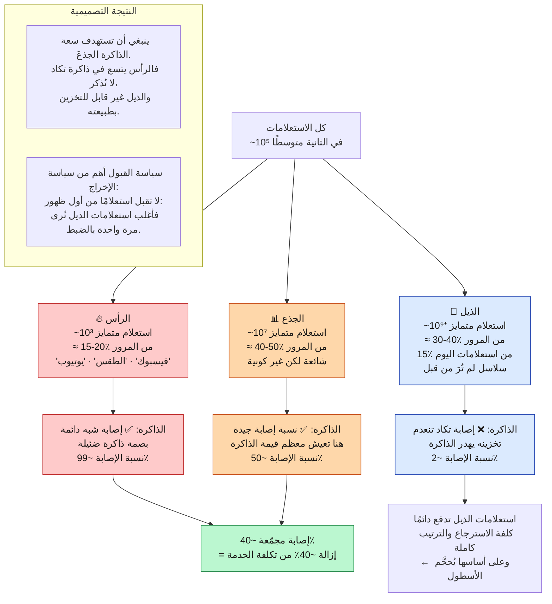
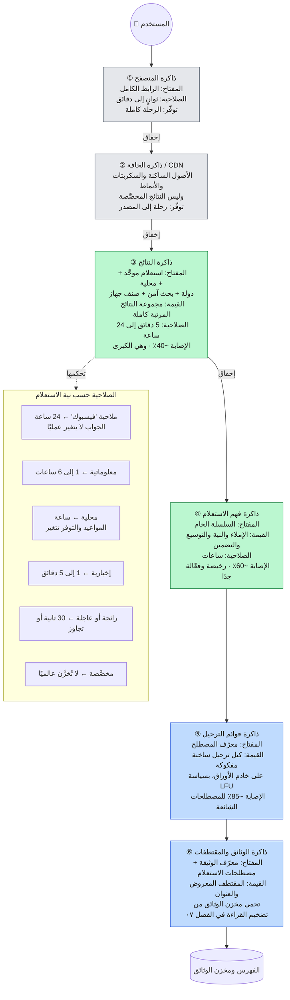
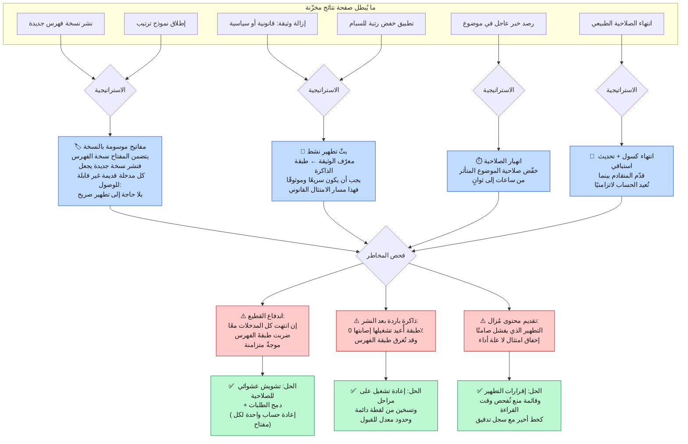
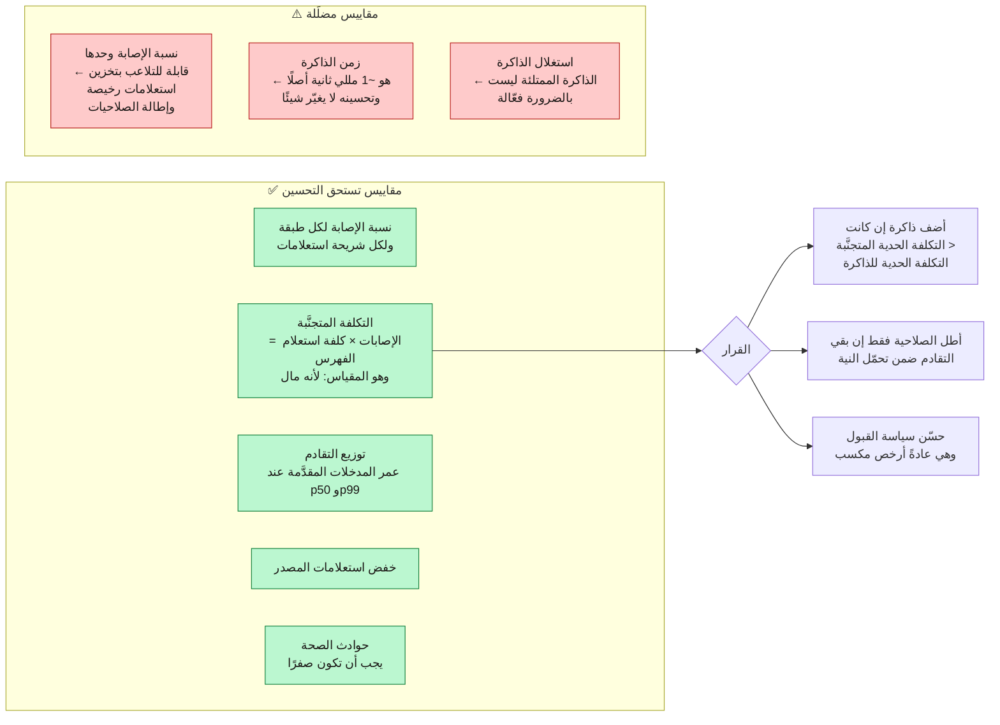

**[🇬🇧 Read in English](../en/10-caching.md)**

# الفصل ١٠ · استراتيجية التخزين المؤقت

**← [٠٩ · التخزين](09-storage.md)** · [🏠 الرئيسية](../../README.ar.md) · **[١١ · الحداثة](11-freshness.md) →**

---

## ١٠.١ لماذا التخزين المؤقت قرار اقتصادي لا قرار زمن

الغريزة تقول إن الذاكرات المؤقتة تجعل الأمور سريعة. وفي هذا النظام تجعلها **رخيصة** في المقام الأول، والفارق يغيّر طريقة تصميمها.

من [الفصل ٠٣](03-capacity-estimation.md): مرور الذروة 3 × 10⁵ استعلام/ثانية، ونسبة إصابة ٤٠٪ في ذاكرة النتائج تعني أن 1.8 × 10⁵ فقط تصل إلى الفهرس. وبدون تلك الذاكرة سيحتاج أسطول الخدمة إلى أن يكون أكبر بنحو ٦٧٪. فالذاكرة المؤقتة لا تقتطع مللي ثوانٍ من مسار سريع أصلًا، بل تحذف ثلثَي عتادِ أسطولٍ كامل.

وهذا يعيد صياغة سؤال التصميم. فهو ليس «كيف نجعل الاستعلامات المخزّنة أسرع؟» بل **«كيف نعظّم نسبة المرور الذي لا يلمس الفهرس أبدًا، دون أن نقدّم شيئًا خاطئًا قط؟»**

---

## ١٠.٢ مرور الاستعلامات شديد الانحراف، وهذا ما يجعل التخزين المؤقت ناجحًا

> **المخطط D-51 · توزيع شعبية الاستعلامات وقابلية التخزين**

**والصندوق الثاني هو المهم عمليًا.** فذاكرة LRU الساذجة تقبل كل استعلام من أول طلب. ولمّا كان ~١٥٪ من استعلامات اليوم لم تُرَ من قبل ومن الأرجح ألا تُرى ثانيةً، فإن الذاكرة الساذجة تنفق حصة كبيرة من سعتها على مدخلات لن تُقرأ أبدًا. واشتراط رؤية الاستعلام مرتين ضمن نافذة قبل قبوله (مرشّح قبول بأسلوب TinyLFU) قد يرفع نسبة الإصابة الفعلية رفعًا معتبرًا بلا ذاكرة إضافية.

---

## ١٠.٣ تراتبية الذاكرات المؤقتة

لا توجد ذاكرة واحدة، بل ست، في طبقات مختلفة، بمفاتيح وأحجام ومدد صلاحية مختلفة.

> **المخطط D-52 · تراتبية الذاكرات متعددة الطبقات**

### مفتاح الذاكرة هو أصعب ما في الأمر

كل بُعد يُضاف إلى المفتاح يضاعف فضاء المفاتيح ويقسّم نسبة الإصابة:

| المفتاح | المفاتيح المتمايزة تقريبًا | الأثر على الإصابة |
|---|---|---|
| `الاستعلام` | 10⁹ | خط الأساس |
| `+ الدولة` | × 200 | ضروري: النتائج تختلف فعلًا |
| `+ اللغة` | × 50 | ضروري |
| `+ البحث الآمن` | × 2 | ضروري: مسألة صحة |
| `+ صنف الجهاز` | × 3 | مبرَّر: التخطيط يختلف |
| `+ المدينة` | × 10⁴ | ❌ يدمّر الذاكرة |
| `+ معرّف المستخدم` | × 10⁹ | ❌ تصير الذاكرة بلا جدوى |

وهذه هي الآلية الملموسة خلف التحذير في [الفصل ٠٨](08-ranking.md): **التخصيص مكلف لأنه يدمّر قابلية التخزين المؤقت**، لا لأن التخصيص صعب حسابيًا. والحل القياسي **تصميم من مرحلتين**: خزّن مجموعة النتائج المحسوبة عالميًا تحت مفتاح خشن، ثم طبّق إعادة ترتيب خفيفة لكل مستخدم بعد القراءة. فالـ200 مللي ثانية المكلفة من الاسترجاع والترتيب مشتركة، ولا يخصّ المستخدمَ إلا التعديل النهائي الرخيص.

---

## ١٠.٤ الإبطال

> **المخطط D-53 · تماسك الذاكرة ومسارات الإبطال**

**المفاتيح الموسومة بالنسخة هي الحل الأنيق وينبغي أن تكون الافتراضي.** فلمّا كانت مقاطع الفهرس ثابتة ([الفصل ٠٦](06-indexing.md))، صار للفهرس الحي رقم نسخة. وتضمينه في مفتاح الذاكرة يعني أن نشر فهرس جديد يُبطل الذاكرة كلها ذرّيًا دون إرسال رسالة تطهير واحدة: إذ تصير المدخلات القديمة غير قابلة للوصول وتتقادم طبيعيًا. وهكذا يؤتي الثبات ثماره للمرة الثالثة.

**لكن الوسم بالنسخة لا يكفي للإزالات القانونية.** فهذه لا تستطيع انتظار النشر التالي للفهرس، بل تحتاج مسار التطهير النشط **مع** قائمة منع تُفحص وقت القراءة كخط أخير، لأن رسالة تطهير تُسقط صامتةً تنتج انتهاكًا للامتثال لا نتيجة متقادمة. وهذه حالة يستحق فيها الدفاع المتعدد الطبقات ما يستحق: فالمسار السريع هو التطهير، وضمانة الصحة هي الفحص وقت القراءة.

---

## ١٠.٥ ما لا يجوز تخزينه أبدًا

| البيانات | السبب |
|---|---|
| ترتيب النتائج المخصَّص | تقديم نتائج مستخدم لآخر حادثة خصوصية |
| المحتوى المُصادق عليه والخاص | لا يدخل الفهرس العام أصلًا |
| الروابط المُزالة قانونيًا | يجب أن تختفي فورًا وبشكل قابل للتحقق |
| البيانات اللحظية (النتائج المباشرة، الأسعار) | التقادم هنا هو الفشل نفسه لا تحسين |
| أي شيء مفتاحه هوية مستخدم جزئية | يصير تسميم الذاكرة تسريبًا للبيانات بين المستخدمين |

**وتصادم مفاتيح الذاكرة ثغرة أمنية لا علة برمجية.** فإن أمكن لطلبين منطقيين مختلفين أن يُسقطا على المفتاح نفسه، أمكن لمستخدم أن يتلقى نتائج آخر. ولهذا يجب أن يتضمن المفتاح **كل** بُعد يؤثر في الاستجابة: بما فيها حالة البحث الآمن والدولة، وهما بُعدا صحة لا أداء. والمبدأ الآمن: **عند الشك، أضف البُعد إلى المفتاح واقبل نسبة إصابة أدنى.**

---

## ١٠.٦ قياس فعالية الذاكرة

> **المخطط D-54 · المقاييس التي تهم فعلًا**

**نسبة الإصابة وحدها فخ.** إذ يمكنك رفعها بسهولة بإطالة مدد الصلاحية، وهذا يقايض تحسّن مقياس بنتائج أكثر تقادمًا صامتًا. والمقياس غير القابل للتلاعب هو **التكلفة المتجنَّبة لكل وحدة تقادم مُدخَل**، ويجب تقييمه دائمًا إلى جانب عدد حوادث الصحة، وهدفه الصارم صفر.

**← [٠٩ · التخزين](09-storage.md)** · [🏠 الرئيسية](../../README.ar.md) · **[١١ · الحداثة](11-freshness.md) →** · [🇬🇧 English](../en/10-caching.md)

