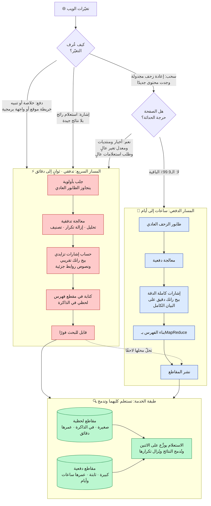
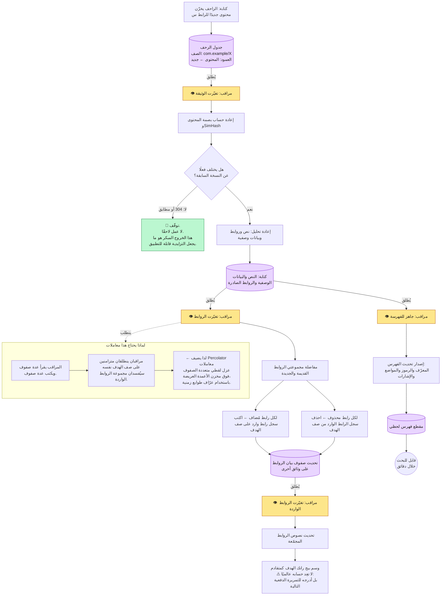
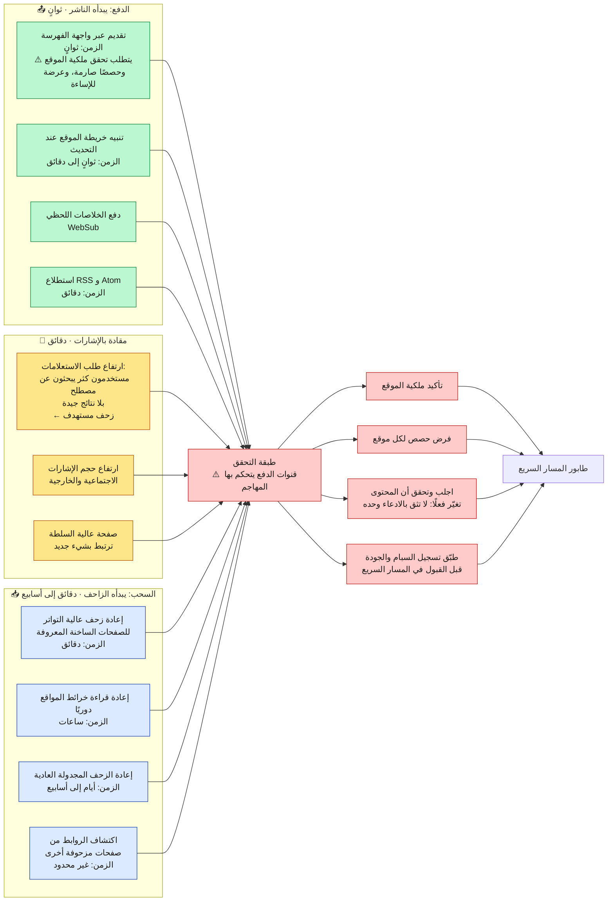
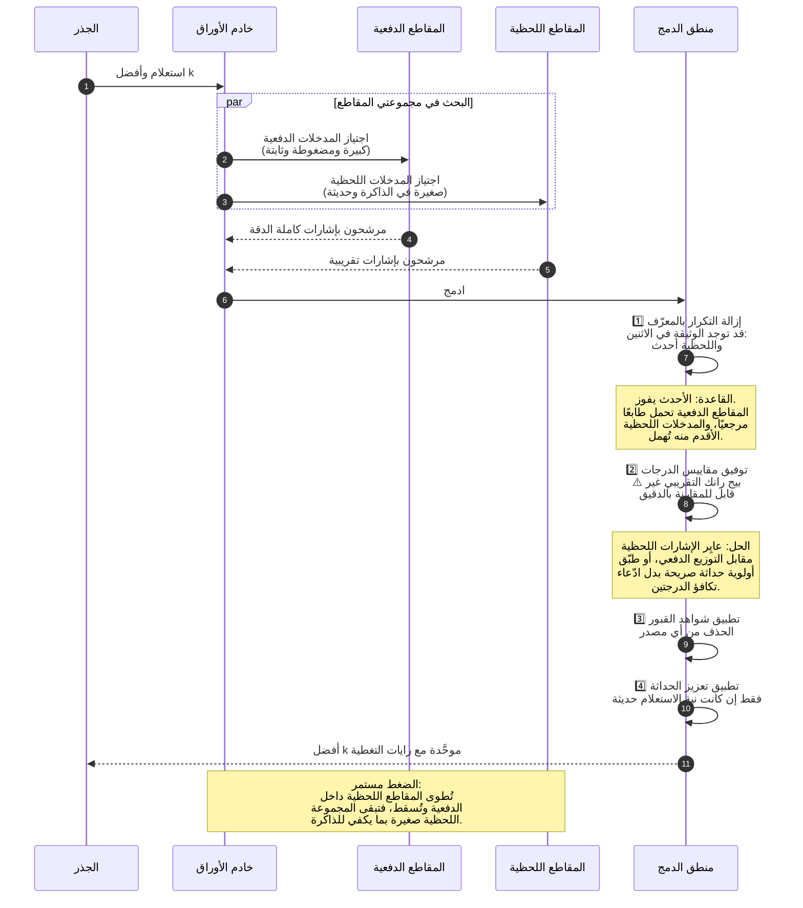

**[🇬🇧 Read in English](../en/11-freshness.md)**

# الفصل ١١ · الحداثة والفهرسة اللحظية

**← [١٠ · التخزين المؤقت](10-caching.md)** · [🏠 الرئيسية](../../README.ar.md) · **[١٢ · الموثوقية](12-reliability.md) →**

---

## ١١.١ المشكلة التي لا تحلّها الفهرسة الدفعية

وصف [الفصل ٠٦](06-indexing.md) بناء الفهرس بأنه عملية MapReduce على المتن كله: بيتابايت من النص و~١٤ ساعة. وهذا كافٍ تمامًا للويب العادي، لكنه عديم الفائدة تمامًا عند وقوع زلزال.

المتطلب من [الفصل ٠٢](02-requirements.md) هو **وسيط زمن فهرسة أقل من ٥ دقائق للمجموعة الساخنة**. ولا تستطيع إعادة البناء الكاملة تحقيق ذلك بأي ثمن، لأن عنق الزجاجة ليس الحوسبة، بل كون إعادة البناء الكاملة **تعيد حساب 10¹¹ وثيقة لتعكس تغيّرًا في 10⁶ منها**. فتضخيم الكتابة ١٠٠٬٠٠٠ ضعف.

والجواب ليس تسريع المهمة الدفعية، بل **التوقف عن إعادة بناء ما لم يتغيّر**، وهذه بالضبط بصيرة ورقة Percolator من جوجل (٢٠١٠) ونظام الفهرسة Caffeine الذي أتاحته.

> **المخطط D-55 · الفهرسة ثنائية المسار**

**الفكرة البنيوية الأساسية: المسار السريع يقايض الدقة بالزمن، والمسار الدفعي يصحّحه لاحقًا.** فالوثيقة المفهرسة عبر المسار السريع تحمل إشارات ترتيب تقريبية؛ بيج رانك محسوبًا من بيان جزئي، ونصوص روابط مما تصادف معرفته. فهي **قابلة للإيجاد** خلال دقائق لكنها ليست **مرتَّبة** بدقة. وحين يلحق الخط الدفعي بعد ساعات، تحلّ النسخة الدقيقة محلها. فينال المستخدمون جوابًا سريعًا خاطئًا قليلًا الآن بدل جواب مثالي غدًا، وهذه في الأخبار العاجلة مقايضة صحيحة بلا لبس.

---

## ١١.٢ المعالجة التزايدية: نموذج Percolator

المعالجة الدفعية تعيد حساب كل شيء. أما التزايدية فتحسب ما تغيّر فقط وتنشر عواقبه. والآلية هي **المراقبون**: مُطلِقات تنطلق حين يتغير عمود محدد في صف محدد.

> **المخطط D-56 · الفهرسة التزايدية المقادة بالمراقبين**

### لماذا هذا صعب فعلًا

مخزن الأعمدة العريضة من [الفصل ٠٩](09-storage.md) يقدّم عمدًا **ذرّية صف واحد فقط**. لكن المراقب الذي يضيف رابطًا واردًا يجب أن يقرأ صف الهدف ويعدّله ويكتبه ثانيةً، ومراقبان يفعلان ذلك متزامنين على هدف شائع سيفقدان تحديثات.

وكانت مساهمة Percolator إضافة **معاملات عزل لقطي متعددة الصفوف فوق** مخزن من صنف Bigtable، عبر عرّاف طوابع زمنية مركزي وتثبيت ثنائي المرحلة مُرمَّز في أعمدة إضافية. والكلفة معتبرة: فالكتابة المعاملاتية أغلى بأضعاف من العادية. والفائدة أن الفهرسة التزايدية تصير **صحيحة**، وهذا ما يجعلها صالحة للإنتاج بدل أن تكون مصدرًا لبيانات روابط فاسدة بخفاء.

**وعقدة `توقّف` تستحق الانتباه أيضًا.** فالخروج المبكر عند عدم تغيّر المحتوى ليس تفصيلة تحسين، بل هو الخاصية التي تجعل المقاربة كلها قابلة للتطبيق. إذ إن أغلب عمليات إعادة الزحف لا تجد جديدًا ([الفصل ٠٤](04-crawling.md))، فتنتهي أغلب سلاسل المراقبين عند الخطوة الأولى. وبدون ذلك الخروج، لأدّت المعالجة التزايدية عملًا بحجم الدفعي وبتواتر التدفقي.

---

## ١١.٣ الاكتشاف: الدفع يتفوق على السحب في الحداثة

انتظار **اكتشاف** التغيّر بإعادة الزحف أبطأ مسار ممكن. والناشرون الراغبون في فهرسة سريعة يستطيعون إخبارك مباشرة.

> **المخطط D-57 · قنوات اكتشاف التغيّر مرتَّبة بالزمن**

**كل قناة دفع سطح هجوم.** فواجهة «أخبرني حين تُحدِّث» هي (من منظور المُسيء), وسيلة لتخطي طابور الزحف. ولذا فطبقة التحقق ليست توصيلًا اختياريًا: يجب إثبات الملكية، وفرض الحصص لكل موقع مُتحقَّق منه، وتأكيد التغيّر المُدَّعى بجلب الصفحة فعلًا، وتشغيل تسجيل الجودة **قبل** دخول الوثيقة المسار السريع لا بعده. فالمسار السريع بلا بوابة تحقق ليس إلا مسارًا سريعًا للسبام.

**والقناة المقادة بالإشارات هي الذكية.** فإن بحث آلاف المستخدمين فجأةً عن مصطلح ولم يجد الفهرس نتائج جيدة، فذلك دليل مباشر على أن المتن تنقصه أشياء مهمة الآن. وتحويل الطلب غير الملبَّى إلى أولوية زحف يُغلق الحلقة من [المخطط D-01](../../README.ar.md) (سلوك المستخدم يوجّه الزاحف), ويلتقط أحداثًا لم يفكر أي ناشر في الإعلان عنها.

---

## ١١.٤ خدمة متن مقسوم على فهرسين

يجب أن تستعلم طبقة الخدمة المقاطع الدفعية واللحظية معًا وتنتج ترتيبًا متماسكًا واحدًا.

> **المخطط D-58 · دمج النتائج اللحظية والدفعية**

**الخطوة ٢ هي حيث تنكسر التنفيذات الساذجة.** فالوثيقة في الفهرس اللحظي لها بيج رانك تقريبي محسوب من بيان روابط جزئي، وهو عادةً **تقدير أدنى**، لأن أغلب روابطها الواردة لم تُكتشف بعد. وإن دمجت تلك الدرجات مباشرةً مع الدرجات الدفعية الدقيقة، عوقبت الوثائقُ الحديثة منهجيًا، وأنتج خط الحداثة المكلف محتوًى لا يراه أحد.

والمعالجة الصحيحة أن تعامل التوزيعين بوصفهما مختلفين وتعايِر بينهما، أو (وهو الأمتن) أن تُبقي الحداثة **أولوية ترتيب صريحة** يطبّقها المُرتِّب لاستعلامات النية الحديثة، بدل أن تأمل انبثاقها ضمنيًا من إشارات مختلطة الدقة.

---

## ١١.٥ مقايضة الحداثة بالتكلفة

الحداثة ليست مجانية، وتكلفتها ليست موزعة بالتساوي.

| شريحة المتن | النسبة | فترة إعادة الزحف | المسار | التكلفة النسبية للوثيقة |
|---|---:|---|---|---:|
| الأخبار العاجلة والبث المباشر | ~0.001٪ | ثوانٍ إلى دقائق | دفع + مسار سريع | **~١٠٠٠×** |
| مواقع الأخبار النشطة والمنتديات | ~0.1٪ | دقائق إلى ساعات | مسار سريع | ~١٠٠× |
| المواقع كثيرة التحديث | ~1٪ | ساعات إلى يوميًا | مختلط | ~١٠× |
| صفحات الويب العادية | ~20٪ | أسبوعيًا إلى شهريًا | دفعي | ١× |
| الأرشيفات الساكنة وملفات PDF | ~79٪ | فصليًا أو أبدًا | دفعي منخفض الأولوية | ~0.1× |

**وتركيز كل إنفاق الحداثة تقريبًا على ~٠.١٪ من المتن هو الاستراتيجية بأكملها.** فتطبيق المسار السريع بالتساوي سيضاعف كلفة الفهرسة برتبتَي مقدار تقريبًا بينما يحسّن النتائج لأحد يكاد لا يُذكر، لأن الـ٩٩.٩٪ الأخرى من الوثائق لم تكن ستتغير أصلًا.

وهذا الشكل نفسه هو قرار الطبقات في [الفصل ٠٦](06-indexing.md) وقرار التخزين المؤقت في [الفصل ١٠](10-caching.md)، ويستحق التسمية الصريحة كنمط متكرر:

> **الأنظمة بحجم الويب تصير ميسورة باستغلال الانحراف الشديد. حدّد الجزء الصغير الذي يهم، وأنفق عليه بسخاء، وعامل الباقي بثمن بخس وبالجملة.**

وكل قرار تكلفة كبير في هذا المستودع هو تجسيد لتلك الفكرة الواحدة.

**← [١٠ · التخزين المؤقت](10-caching.md)** · [🏠 الرئيسية](../../README.ar.md) · **[١٢ · الموثوقية](12-reliability.md) →** · [🇬🇧 English](../en/11-freshness.md)

