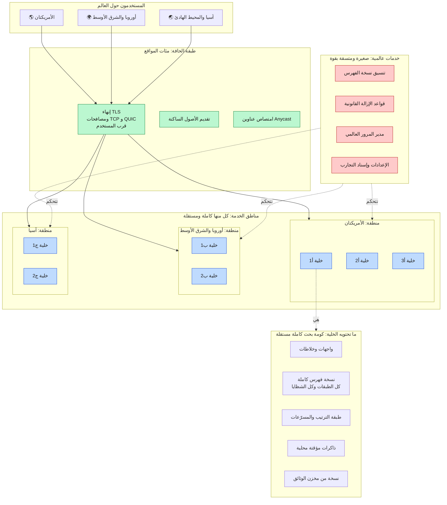
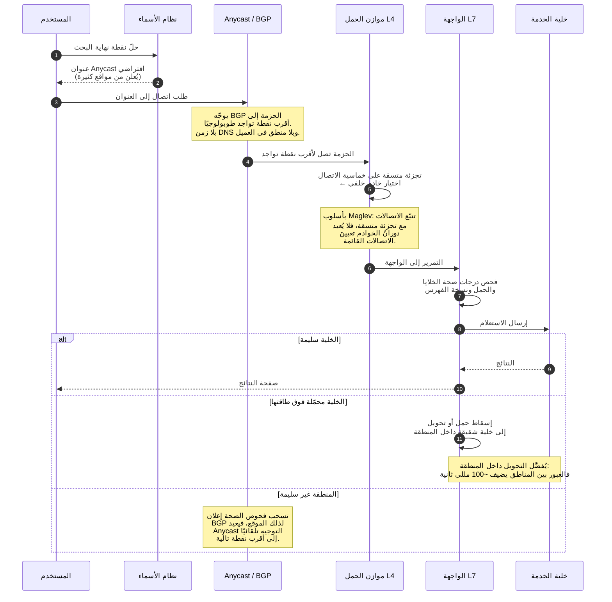
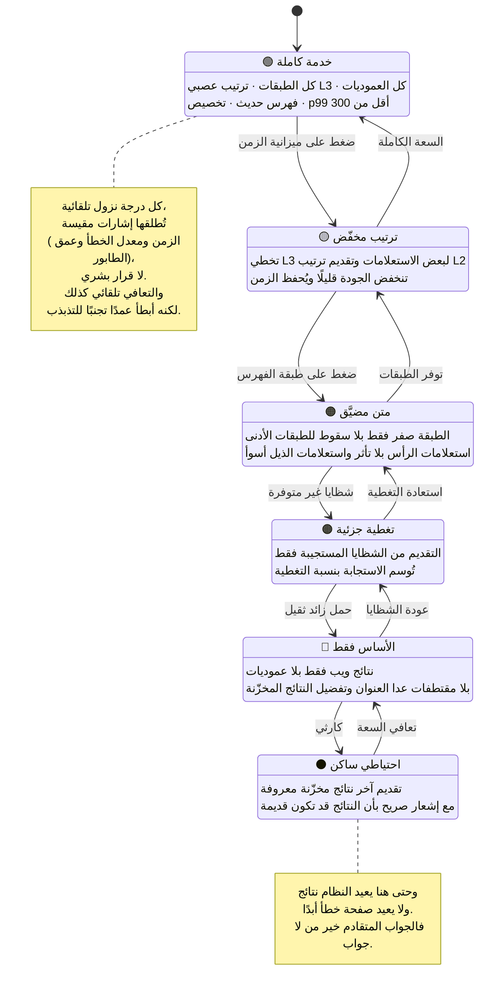
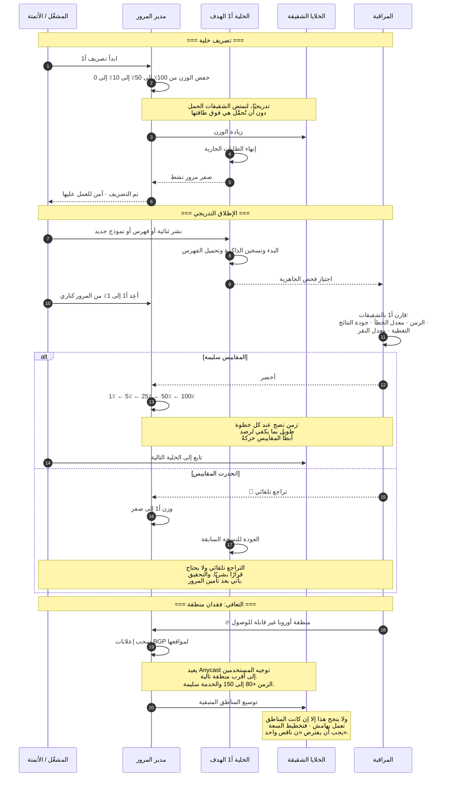

**[🇬🇧 Read in English](../en/12-reliability.md)**

# الفصل ١٢ · الموثوقية والطوبولوجيا العالمية

**← [١١ · الحداثة](11-freshness.md)** · [🏠 الرئيسية](../../README.ar.md) · **[١٣ · المراقبة](13-observability.md) →**

---

## ١٢.١ الجغرافيا قيد صارم

أثبت [الفصل ٠٣](03-capacity-estimation.md) الحقيقة التي تُملي طوبولوجيا النشر كلها: رحلة الذهاب والإياب من كاليفورنيا إلى هولندا ~150 مللي ثانية، وهدف p99 هو 300. إذن **لا يستطيع مركز بيانات عالمي واحد خدمة العالم**، مهما كان البرنامج سريعًا. فالفيزياء (لا الهندسة) هي ما يفرض النسخ الجغرافي.

> **المخطط D-59 · الطوبولوجيا العالمية للخدمة**

### الخلية هي وحدة كل شيء

**الخلية** كومة بحث كاملة مكتفية بذاتها: واجهات، ونسخة فهرس كاملة، وترتيب، وذاكرات مؤقتة. وهذا أهم قرار بنيوي في النشر، لأن الخلية في آنٍ واحد:

| وحدةُ… | المعنى |
|---|---|
| **الفشل** | يمكن أن تموت الخلية كلها دون إسقاط أي شيء آخر |
| **النشر** | تُطلق الثنائيات الجديدة خلية تلو خلية |
| **السعة** | تتوسع بإضافة خلايا لا بتضخيم واحدة |
| **التجريب** | يمكن أن تقدّم خلية إعدادًا مختلفًا |
| **العزل** | الفهرس أو النموذج السيئ محصور في الخلايا التي تلقّته |

ولأن الخلية كاملة، فلا توجد **اعتماديات عابرة للخلايا في مسار الخدمة**. فالاستعلام الداخل إلى الخلية أ1 يُجاب كليًا داخلها. وهذا ما يجعل «تصريف خلية» عمليةً روتينية آمنة لا أزمة، والعمليات الروتينية الآمنة أساس كل ما تبقى في هذا الفصل.

---

## ١٢.٢ إيصال الطلب إلى خلية سليمة

> **المخطط D-60 · توجيه الطلبات متعدد الطبقات**

**ويؤدي Anycast هنا دورًا دقيقًا وثمينًا.** فالعنوان نفسه يُعلن من مواقع كثيرة، وBGP يسلّم كل حزمة إلى أقرب إعلان. وتترتب على ذلك نتيجتان:

1. **التوجيه تلقائي وفوري**، بلا انتظار صلاحية DNS، وبلا منطق في العميل، وبلا قاعدة بيانات جغرافية يجب تحديثها.
2. **التجاوز عند الفشل مجرد سحب إعلان**، فلإخراج موقع من الخدمة، توقّف عن إعلان بادئته، فينتقل المرور خلال ثوانٍ دون لمس أي عميل.

والمقايضة فقدان التحكم الدقيق: إذ لا تستطيع بسهولة إرسال ١٠٪ من المستخدمين إلى موقع بعينه، لأن BGP هو من يقرر. ولهذا يتولى Anycast التوجيه الجغرافي **الخشن**، بينما تتولى الواجهة L7 القرارات **الدقيقة** كإسناد التجارب واختيار الخلية.

---

## ١٢.٣ أنماط الفشل والاستجابات

> **المخطط D-61 · مجالات الفشل ونطاق الانفجار**

```mermaid
flowchart TB
    subgraph SMALL["🟢 روتيني: غير مرئي للمستخدمين"]
        S1["موت آلة واحدة<br/>← نسخة تخدم والمجدول يعيد الجدولة"]
        S2["فشل قرص واحد<br/>← البصمة تلتقطه وتُعاد النسخة"]
        S3["انهيار عملية<br/>← إعادة تشغيل خلال ثوانٍ"]
        S4["بطء ورقة واحدة<br/>← الطلب المُحوَّط يفوز"]
    end

    subgraph MED["🟡 ملحوظ: متدهور لكنه يخدم"]
        M1["عدم توفر مجموعة نسخ شظية<br/>← قدّم بتغطية أقل<br/>مع وسم الاستجابة"]
        M2["فقدان رفّ أو مجال طاقة<br/>← النسخ الأخرى تمتص"]
        M3["طبقة الترتيب محمّلة<br/>← تخطَّ L3 وقدّم ترتيب L2"]
        M4["إعادة تشغيل طبقة الذاكرة<br/>← يقفز حمل الفهرس<br/>وحدود القبول تحميه"]
        M5["توقف خط الحداثة<br/>← تتقادم النتائج وتبقى صحيحة"]
    end

    subgraph LARGE["🟠 خطير: مرئي للمستخدم"]
        L1["فشل خلية كاملة<br/>← صرّف وأعد التوزيع داخل المنطقة"]
        L2["فشل منطقة كاملة<br/>← يعيد Anycast التوجيه<br/>ويرتفع الزمن لأولئك المستخدمين"]
        L3["نشر فهرس معطوب<br/>← تراجع إلى النسخة السابقة"]
        L4["نموذج ترتيب سيئ<br/>← تراجع تلقائي عند إنذار المقاييس"]
    end

    subgraph CRIT["🔴 حرج: يحتاج استجابة مخططة مسبقًا"]
        C1["فقدان نصاب خدمة التنسيق<br/>← يتجمد مستوى التحكم<br/>وتستمر الخدمة بآخر حالة"]
        C2["دفعة إعدادات عالمية تُفسد كل الخلايا<br/>← وهو الخطر الأكبر:<br/>التغيير العالمي بلا حدّ لنطاق انفجاره"]
        C3["حمل زائد مترابط:<br/>كل الخلايا تبلغ سعتها معًا"]
    end

    S1 & S2 & S3 & S4 --> AUTO["يُعالج تلقائيًا<br/>بلا تدخل بشري"]
    M1 & M2 & M3 & M4 & M5 --> DEGRADE["تدهور تدريجي<br/>مع تنبيه بلا استدعاء"]
    L1 & L2 & L3 & L4 --> PAGE["استدعاء المناوب<br/>مع وجود دليل إجراءات"]
    C1 & C2 & C3 --> INCIDENT["استجابة حوادث<br/>مخططة ومُتمرَّن عليها"]

    classDef ok fill:#bbf7d0,stroke:#15803d,color:#1c1917
    classDef warn fill:#fef08a,stroke:#a16207,color:#1c1917
    classDef bad fill:#fed7aa,stroke:#c2410c,color:#1c1917
    classDef crit fill:#fecaca,stroke:#b91c1c,color:#1c1917
    class S1,S2,S3,S4,AUTO ok
    class M1,M2,M3,M4,M5,DEGRADE warn
    class L1,L2,L3,L4,PAGE bad
    class C1,C2,C3,INCIDENT crit
```

**والحالة C2 هي نمط الفشل الجدير بالأرق.** فكل مدخلة أخرى لها حدّ طبيعي لنطاق الانفجار: الآلة تؤثر في آلة، والخلية في خلية، والمنطقة في منطقة. أما **دفعة الإعدادات العالمية** فلا حدّ لها: إذ تصل إلى كل خلية في آنٍ واحد بحكم التصميم. وتاريخيًا، وعلى مستوى الصناعة كلها، جاء أغلب الانقطاعات واسعة النطاق من تغييرات الإعدادات ومستوى التحكم لا من أعطال العتاد أو علل الشيفرة.

ولذا فالدفاعات إجرائية لا معمارية:

- تُطلَق تغييرات الإعدادات **كما تُطلَق الثنائيات**: كناري، ومراحل، وتراجع تلقائي عند انحدار المقاييس.
- يتحقق النظام من الإعدادات **قبل** تطبيقها، ويرفض تطبيق إعداد يفشل في فحوص المخطط أو السلامة.
- تحتفظ كل خدمة بـ**آخر إعداد سليم معروف** وتستمر عليه إن رُفض الجديد.
- يوجد **حدّ لمعدل التغييرات العالمية**، فلا يمكنك دفع تغييرين عالميين ضمن نافذة مراقبة الأول.

---

## ١٢.٤ التدهور التدريجي: الموقف التصميمي الجوهري

من [الفصل ٠٢](02-requirements.md): **الإتاحة تعني «أعاد صفحة نتائج نافعة» لا «أعاد HTTP 200»**. ولذا فللنظام مستويات تدهور صريحة ومرتَّبة بدل حالة ثنائية «يعمل/لا يعمل».

> **المخطط D-62 · سُلَّم التدهور**

**والتعافي أبطأ عمدًا من التدهور.** فالتدهور السريع يحمي النظام، أما التعافي السريع فيخاطر بالرفرفة: استعادة الخدمة الكاملة، ثم الحمل الزائد فورًا، ثم التدهور ثانيةً. والتخلّف اللامتماثل (نزول سريع وصعود بطيء) هو ما يُبقي سُلَّم التدهور مستقرًا لا متذبذبًا.

---

## ١٢.٥ إسقاط الحمل والحمل الزائد

حين يتجاوز الطلب السعة، لا بد من إسقاط شيء. والسؤال الوحيد هو **ماذا**، والإجابة السيئة تحوّل الحمل الزائد إلى انقطاع كامل.

| الاستراتيجية | السلوك | الحكم |
|---|---|---|
| لا تفعل شيئًا: اصطفّ كل شيء | تنمو الطوابير وينفجر الزمن وتنتهي كل المهل وتضخّم الإعاداتُ الحملَ | ❌ **كارثية**: هكذا يصير الحمل الزائد انقطاعًا |
| أسقط عشوائيًا | عادل لكنه مهدر؛ إذ يُهمل عمل أُنجز جزئيًا | ⚠️ أفضل من لا شيء |
| أسقط عند الحافة قبل بدء العمل | أرخص رفض ممكن بلا عمل لاحق مهدور | ✅ صحيحة |
| أسقط حسب الأولوية | أسقط مرور الروبوتات والجلب المسبق أولًا واحمِ المستخدمين | ✅ الأفضل |
| تدهورْ بدل الإسقاط | قدّم للجميع نتيجة أرخص | ✅ الأفضل حيثما أمكن |

**وفخ تضخيم الإعادات يستحق ذكرًا خاصًا.** فحين تبطؤ خدمة، تنتهي مهل العملاء فيعيدون المحاولة، فيزيد الحمل، فتزداد بطئًا: حلقة تغذية راجعة موجبة تحوّل ومضة عابرة إلى انقطاع مستمر. والتخفيفات غير قابلة للتفاوض في أي نظام كبير:

- **ميزانيات الإعادة**: لا ينفق العميل أكثر من ~١٠٪ من حجم طلباته على الإعادات، متتبَّعة عالميًا لا لكل طلب.
- **التراجع الأسي مع تشويش**: لا تعِد المحاولة فورًا أبدًا، ولا تدع عملاء كثيرين يعيدون في تزامن.
- **قواطع الدارة**: بعد إخفاقات متكررة، توقّف عن استدعاء الاعتمادية الفاشلة كليًا وقدّم نتائج متدهورة فورًا.
- **تمرير المواعيد النهائية**: الطلب الذي انقضى موعده لا يُعاد إطلاقًا؛ فهو عمل ميت.

---

## ١٢.٦ التصريف والإطلاقات والتعافي من الكوارث

> **المخطط D-63 · تصريف الخلية والإطلاق التدريجي**

**وقاعدة «ن ناقص واحد» هي النتيجة التخطيطية لكل ما سبق.** فإن كان فقدان منطقة يجب ألا يسبب انقطاعًا، وجب أن تستطيع المناطق الباقية امتصاص مرورها. ويعني ذلك تشغيل كل منطقة عند استغلال أقل بكثير من الكامل في الظروف العادية، أي دفع ثمن سعة عاطلة كتأمين. وأي خطة سعة تُحجَّم للحمل المتوقع بالضبط تكون قد قررت بهدوء أن فشل منطقة انقطاعٌ مقبول.

---

## ١٢.٧ ملخص ممارسات الموثوقية

| الممارسة | الغرض |
|---|---|
| **الخلايا كمجالات فشل** | تقييد نطاق انفجار كل صنف من الأعطال |
| **لا اعتماديات خدمة عابرة للخلايا** | جعل التصريف والإطلاق روتينيين وآمنين |
| **إطلاق تدريجي بتراجع تلقائي** | التقاط الإصدارات السيئة عند ١٪ من المرور لا ١٠٠٪ |
| **معاملة الإعدادات كشيفرة** | دفعات الإعدادات تسبب انقطاعات أكثر من الشيفرة |
| **سُلَّم تدهور تدريجي** | لا تُعِد خطأً أبدًا ما دام هناك جواب أسوأ متاح |
| **ميزانيات الإعادة وقواطع الدارة** | منع تضخيم الإعادات من تحويل الومضات إلى انقطاعات |
| **تمرير المواعيد النهائية** | التوقف عن أداء عمل لا ينتظره أحد |
| **سعة إقليمية بقاعدة ن ناقص واحد** | النجاة من فقدان منطقة دون انقطاع |
| **تمارين تعافٍ منتظمة** | إجراء التجاوز غير المختبَر لا يعمل، بل يبدو أنه يعمل فحسب |
| **تحليلات ما بعد الحادث بلا لوم** | إصلاح الأنظمة لا الأشخاص، والهدف استحالة تكرار العطل نفسه |

والأخيرة ليست زينة. ففي نظام بهذا الحجم، كل انقطاع جسيم نتيجةُ **نظامٍ** سمح بخطأ، لا نتيجةَ فردٍ ارتكبه. وتحليلات ما بعد الحادث التي تُنتج تغييرات نظامية دائمة هي الآلية التي تتحسن بها الموثوقية فعلًا مع الوقت.

**← [١١ · الحداثة](11-freshness.md)** · [🏠 الرئيسية](../../README.ar.md) · **[١٣ · المراقبة](13-observability.md) →** · [🇬🇧 English](../en/12-reliability.md)

