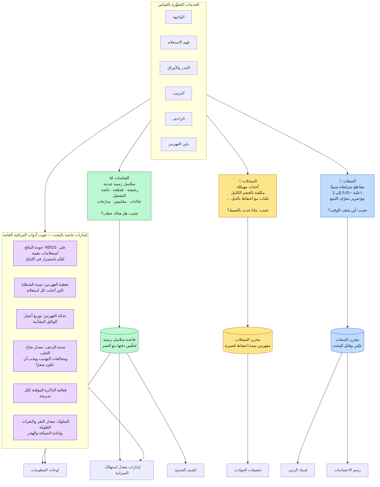
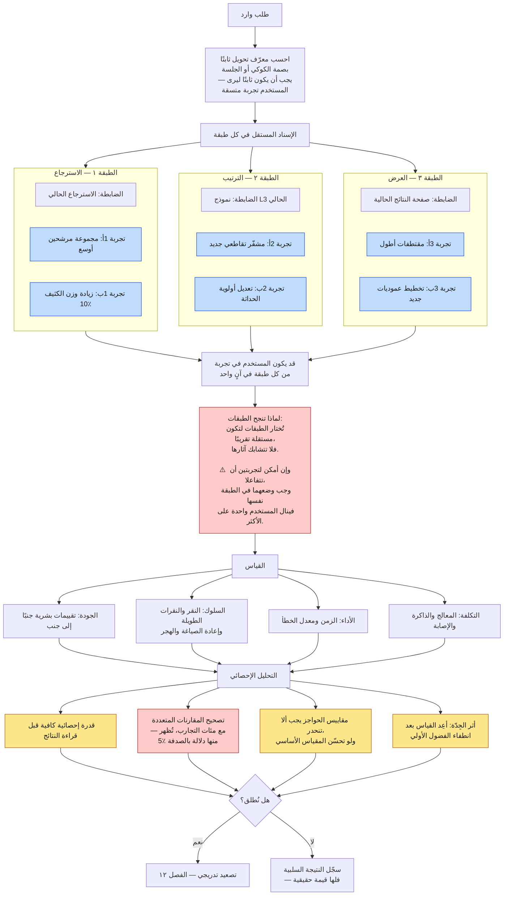

**[🇬🇧 Read in English](../en/13-observability.md)**

# الفصل ١٣ · المراقبة والتجريب

**← [١٢ · الموثوقية](12-reliability.md)** · [🏠 الرئيسية](../../README.ar.md) · **[١٤ · السبام والأمان](14-security-abuse.md) →**

---

## ١٣.١ لا يمكنك تصحيح ما لا تراه

الاستعلام الواحد يلمس آلاف الآلات عبر عشرات الخدمات. وحين يبطؤ، لا يمكن الإجابة عن سؤال «أيها كان السبب؟» بتسجيل الدخول إلى خادم. فالمراقبة هنا ليست فكرة تشغيلية لاحقة، بل متطلب وظيفي في المعمارية، لأن المعمارية نفسها جعلت التصحيح على آلة واحدة مستحيلًا.

> **المخطط D-64 — كومة المراقبة**

**وصندوق الجودة هو ما يميّز مراقبة البحث عن المراقبة العامة.** فقد يكون محرك البحث سليمًا تمامًا بكل مقاييس البنية التحتية — إتاحة ١٠٠٪، وp99 ضمن الهدف، وصفر أخطاء — بينما يعيد نتائج بائسة. فالزمن ومعدل الخطأ عاجزان عن كشف نموذج ترتيب سيئ أو فهرس فاسد. والتقييم المستمر للجودة مقابل مجموعة استعلامات ذهبية ثابتة هو المراقب الوحيد الذي يلتقط ذلك الصنف من الفشل، ويستحق درجة الإنذار نفسها التي يستحقها خرق الإتاحة.

---

## ١٣.٢ التتبع الموزع

> **المخطط D-65 — تتبّع استعلام واحد**

```mermaid
gantt
    title تتبّع موزّع لاستعلام بطيء بالمللي ثانية
    dateFormat X
    axisFormat %s

    section الواجهة
    معالجة البحث - المقطع الجذر     :active, fe, 0, 340
    تحليل الطلب                     :fe1, 2, 6

    section فهم الاستعلام
    الفهم                           :qu, 6, 34
    التدقيق الإملائي                :qu1, 8, 18
    تصنيف النية                     :qu2, 18, 28
    تضمين الاستعلام                 :qu3, 28, 34

    section الذاكرة المؤقتة
    بحث في ذاكرة النتائج - إخفاق    :ca, 34, 37

    section الاسترجاع
    توزيع الجذر                     :active, rt, 37, 195
    الوسيط 07                       :im, 39, 193
    الورقة 0712 عادية               :lf1, 41, 96
    الورقة 0713 عادية               :lf2, 41, 92
    الورقة 0714 بطيئة - توقف جمع    :crit, lf3, 41, 191
    تحويط الورقة 0714 على نسخة      :done, lf4, 130, 188

    section الترتيب
    إعادة تسجيل L2                  :l2, 195, 228
    إعادة ترتيب عصبي L3             :l3, 228, 288

    section التجميع
    توليد المقتطفات                 :sn, 288, 322
    الدمج والتسلسل                  :bl, 322, 338
```

بقراءة هذا التتبع يصير التشخيص فوريًا ولا لبس فيه: **استغرقت `الورقة 0714` مئة وخمسين مللي ثانية بدل ~٥٥**، ولأن الجذر يجب أن ينتظر كل الشظايا، حدّدت تلك الورقة وحدها زمن الاستعلام بأكمله. وقد أُطلق الطلب المُحوَّط عند ~١٣٠ لكن نسخته لم تعُد مبكرًا بما يكفي لتنفع كثيرًا.

وبدون التتبع، يظهر هذا في القياسات بوصفه «ارتفاع زمن p99» فحسب — مع ألف ورقة مرشحة وبلا وسيلة للإسناد. وهذه بالضبط المشكلة التي بُني Dapper (٢٠١٠) لحلّها، وقراراته التصميمية الثلاثة تستحق الذكر لأنها ما يجعل التتبع ميسورًا عند هذا الحجم:

| القرار | السبب |
|---|---|
| **أخذ عيّنات بعدوانية** (0.01–1٪) | تتبّع كل طلب سيكلّف أكثر من خدمته. والأحداث النادرة تظهر رغم ذلك عند الحجم الكبير. |
| **تمرير معرّف التتبع عبر كل استدعاء** | لا يمكن إعادة بناء السببية لاحقًا؛ بل يجب حملها. |
| **تجهيز طبقة الاستدعاء لا التطبيق** | ينال المطورون التتبع مجانًا ولا يمكنهم نسيان إضافته. ولهذا فالتغطية كاملة. |

**وأخذ العيّنات التكيفي** يتفوق كثيرًا على العيّنات المنتظمة: تتبَّع دائمًا الطلبات البطيئة والأخطاء، مع خط أساس منتظم صغير. فتصير التتبعات المحفوظة فعلًا هي المثيرة للاهتمام بنسبة غير متناسبة.

---

## ١٣.٣ التجريب

كل تغيير في الترتيب أو الواجهة أو البنية التحتية يُتحقق منه بتجربة مضبوطة. وفي أي لحظة يُجري محرك بحث كبير **مئات** التجارب المتزامنة — وهذا يخلق مشكلة: لا يوجد مرور كافٍ لمنح كل تجربة شريحة حصرية.

> **المخطط D-66 — التجارب الطبقية المتداخلة**

### الفخّان الإحصائيان الأهم

**المقارنات المتعددة.** إجراء ٤٠٠ تجربة عند مستوى دلالة ٠.٠٥ يعني أن ~٢٠ منها ستبدو ذات دلالة بالصدفة المحضة. وبدون تصحيح (بنياميني‑هوخبرغ أو ما شابه)، تُطلق المؤسسة ضجيجًا بشكل منهجي وتُدهور منتجها ببطء بينما بدا كل قرار منفرد مبرَّرًا. وهذا ليس قلقًا نظريًا، بل النتيجة الافتراضية لإجراء تجارب كثيرة بلا تصحيح.

**مقاييس الحواجز.** التغيير الذي يرفع معدل النقر ٢٪ بينما يزيد الزمن ٣٠ مللي ثانية ويخفض معدل النقرة الطويلة هو **خسارة** لا مكسب. ويجب أن تعلن كل تجربة حواجزها مسبقًا — الزمن، ومعدل الخطأ، والجودة المُقيَّمة بشريًا — وأي انحدار في حاجز يمنع الإطلاق مهما بدا المقياس الأساسي جيدًا. وإعلانها **مسبقًا** هو الجزء المهم: فالحواجز المُعلنة بأثر رجعي لا تُميَّز عن التبرير.

---

## ١٣.٤ الإنذار على الأعراض لا على الأسباب

> **المخطط D-67 — الإنذار المبني على أهداف الخدمة**

```mermaid
flowchart TB
    subgraph GOOD["✅ أنذِر على هذه — أعراض مرئية للمستخدم"]
        A1["معدل استهلاك ميزانية الخطأ<br/>'ستنفد الميزانية خلال 4 ساعات'"]
        A2["زمن p99 فوق الهدف<br/>لمدة مستمرة"]
        A3["هبوط درجة جودة النتائج<br/>على الاستعلامات الذهبية"]
        A4["تغطية الفهرس دون العتبة"]
        A5["توقف حداثة الفهرس<br/>— انزياح توزيع الأعمار"]
        A6["🚨 مخالفات التهذيب أكثر من صفر<br/>— خرق ثقة، استدعِ فورًا"]
    end

    subgraph BAD["⚠️ لا تستدعِ على هذه — أسباب لا أعراض"]
        B1["توقف آلة واحدة<br/>← متوقع ويُعالج تلقائيًا"]
        B2["المعالج فوق 80٪<br/>← هذا اسمه استغلال"]
        B3["حدث إخفاق في الذاكرة المؤقتة"]
        B4["بطء ورقة واحدة<br/>← التحويط موجود لهذا بالضبط"]
        B5["القرص ممتلئ 70٪<br/>← تذكرة لا استدعاء"]
    end

    A1 & A2 & A3 & A4 & A5 & A6 --> PAGE["📟 استدعاء المناوب"]
    B1 & B2 & B3 & B4 & B5 --> DASH["📊 لوحة معلومات أو تذكرة فقط"]

    PAGE --> RB["دليل الإجراءات<br/>كل إنذار يرتبط بواحد"]
    RB --> ACT{"قابل للتنفيذ؟"}
    ACT -->|"لا"| DELETE["🗑️ احذف الإنذار.<br/>فالاستدعاء غير القابل للتنفيذ<br/>إجهاد إنذارات محض."]
    ACT -->|"نعم"| RESP["استجب وخفّف ثم<br/>حقّق في السبب الجذري"]

    RESP --> PM["تحليل ما بعد الحادث بلا لوم"]
    PM --> FIX["تغيير نظامي يمنع تكرار<br/>العطل نفسه"]
    FIX --> GOOD

    subgraph BURN["إنذار معدل الاستهلاك متعدد النوافذ"]
        W1["استهلاك سريع: 2٪ من الميزانية في ساعة<br/>← استدعِ فورًا"]
        W2["استهلاك بطيء: 10٪ في 6 ساعات<br/>← تذكرة وتحقيق اليوم"]
        W3["النافذتان معًا تكبحان<br/>الاستدعاءات الكاذبة والتسريبات البطيئة"]
    end

    A1 -.تُنفَّذ هكذا.-> BURN

    classDef good fill:#bbf7d0,stroke:#15803d,color:#1c1917
    classDef bad fill:#fed7aa,stroke:#c2410c,color:#1c1917
    classDef crit fill:#fecaca,stroke:#b91c1c,color:#1c1917
    class A1,A2,A3,A4,A5 good
    class B1,B2,B3,B4,B5 bad
    class A6,DELETE crit
```

**«المعالج فوق ٨٠٪» هو الإنذار السيئ النموذجي.** ففي نظام مصمَّم للتدهور التدريجي، الاستغلال العالي **هو الهدف** — والسعة العاطلة مال مهدور. والمستخدمون لا يختبرون المعالج، بل يختبرون الزمن وجودة النتائج. فأنذِر على ما يختبره المستخدمون، ودع النظام يعالج الأسباب تلقائيًا.

**وعقدة `احذف` أقل الأدوات استخدامًا في التشغيل.** فكل إنذار ينطلق بلا إجراء واضح يدرّب المهندس المناوب على تجاهل الإنذارات. وإجهاد الإنذارات ليس قصورًا شخصيًا، بل نتيجة متوقعة لإنذارات غير قابلة للتنفيذ، وعلاجه الحذف لا الانضباط.

---

## ١٣.٥ المقاييس المهمة بحسب الجمهور

| الجمهور | المقاييس الأساسية |
|---|---|
| **المناوبون** | معدل استهلاك الميزانية · معدل الخطأ · زمن p99 · التغطية |
| **جودة البحث** | NDCG على المجموعة الذهبية · الانتصارات جنبًا إلى جنب · النقرات الطويلة · إعادة الصياغة |
| **الزحف** | معدل نجاح الجلب · مخالفات التهذيب (صفر) · زمن الاكتشاف · عمق الحدود |
| **الفهرس** | نجاح البناء · زمن النشر · حجم الفهرس · توزيع أعمار الحداثة |
| **السعة** | الاستعلامات مقابل المُخصَّص · نسبة الإصابة · التكلفة لكل ألف استعلام · هامش «ن ناقص واحد» |
| **القيادة** | الإتاحة · معدل نجاح المهمة · اتجاه التكلفة لكل استعلام |

**ومخالفات التهذيب لها هدف صارم قدره صفر** وتنتمي إلى قائمة الاستدعاء، وهذا غير معتاد لمقياس بلا أثر مباشر على المستخدم. والمبرر: الزحف امتياز يمنحه الويب بأسره على افتراض حسن سلوك الزاحف. والمخالفة خرقٌ لتلك الثقة، وتضرّ بقدرة المشغّل على الزحف أصلًا، وخلافًا لانحدار الزمن لا يمكن إصلاحها بأثر رجعي.

**← [١٢ · الموثوقية](12-reliability.md)** · [🏠 الرئيسية](../../README.ar.md) · **[١٤ · السبام والأمان](14-security-abuse.md) →** · [🇬🇧 English](../en/13-observability.md)

