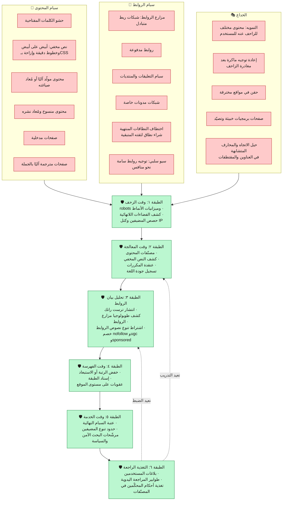
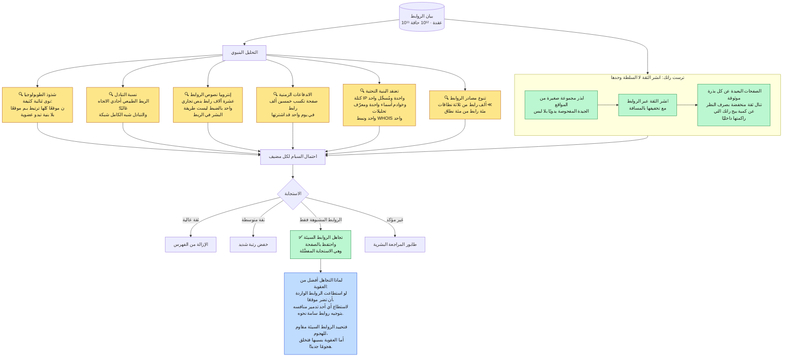
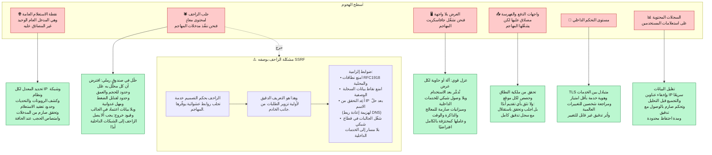
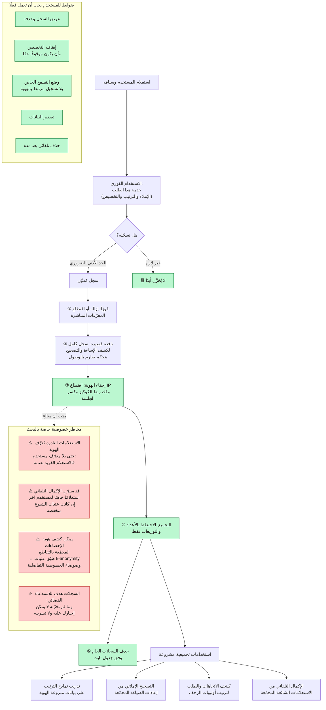

**[🇬🇧 Read in English](../en/14-security-abuse.md)**

# الفصل ١٤ · سبام الويب وإساءة الاستخدام والأمان

**← [١٣ · المراقبة](13-observability.md)** · [🏠 الرئيسية](../../README.ar.md) · **[١٥ · المفاضلات](15-tradeoffs.md) →**

---

## ١٤.١ الفرضية العدائية

افترضت كل الفصول الأخرى أن الويب **كبير** فحسب. ويفترض هذا الفصل أنه **معادٍ**. فنسبة معتبرة من الصفحات وُجدت لغرض وحيد هو التصدّر لاستعلامات لا تستحقها، وخلفها فاعلون جيدو الموارد بدوافع مالية مباشرة.

وهذا يغيّر الانضباط الهندسي بطريقة محددة:

> **أي إشارة يتحكم بها طرف خارجي ستُتلاعب بها عاجلًا أو آجلًا. ولذا فموثوقية الإشارة تتناسب عكسيًا مع سهولة تأثير موضوعها فيها.**

| الإشارة | من يتحكم بها | مقاومة التلاعب |
|---|---|---|
| الكلمات المفتاحية والوسوم في الصفحة | مالك الصفحة كليًا | ⚫ تكاد تنعدم |
| الروابط الصادرة من الصفحة | مالك الصفحة | ⚫ تكاد تنعدم |
| الروابط الواردة | أطراف ثالثة، لكنها قابلة للشراء | 🔴 منخفضة |
| نص الرابط | أطراف ثالثة، لكنه قابل للشراء | 🔴 منخفضة |
| روابط من مواقع **موثوقة سلفًا** | يصعب الحصول عليها بالاحتيال | 🟡 متوسطة |
| سلوك المستخدمين المجمّع عند الحجم | يتطلب احتيالًا واسعًا لتزييفه | 🟢 عالية |
| أحكام المحكّمين البشر | غير قابلة للتحكم خارجيًا | 🟢 عالية جدًا |

ولاحظ أن هذا الترتيب يفسّر مباشرةً القوس التاريخي لترتيب البحث: إشارات الصفحة المحضة (التسعينيات) ← الإشارات القائمة على الروابط (بيج رانك، ١٩٩٨) ← الإشارات السلوكية والمتعلَّمة (الألفينيات فصاعدًا). **وكل نقلة فرضها نجاحُ التلاعب بالجيل السابق من الإشارات.**

---

## ١٤.٢ تصنيف السبام والدفاع الطبقي

> **المخطط D-68 · تقنيات سبام الويب وأين تُلتقط كل منها**

**والدفاع متعدد الطبقات إلزامي هنا لسبب اقتصادي.** فأي مصنّف مفرد يمكن للخصم عكس هندسته بعدد كافٍ من المحاولات: إذ يستطيع رصد ترتيبه الخاص والتكرار. أما ست طبقات مستقلة فتعني وجوب هزيمة الست جميعًا في آنٍ واحد، وكل طبقة يهزمها ترفع تكلفته بينما تبقى تكلفة المدافع ثابتة تقريبًا. فمكافحة السبام ليست بناء مرشّح مثالي، بل جعل الهجوم أغلى من مكافأته.

**والتمويه (K1) يستحق ذكرًا خاصًا** لأنه يهزم كل مصنّف قائم على المحتوى بحكم البناء: إذ لا يرى المصنّف السبام أصلًا. والكشف الموثوق الوحيد هو جلب الصفحة مرة ثانية من عميل يبدو منزليًا، دون معرّف الزاحف، ومقارنة العرضين. وهذا مكلف، فيُطبَّق انتقائيًا على الصفحات التي تتصدر رغم إشارات سلوكية مريبة.

---

## ١٤.٣ سبام الروابط والكشف عبر البيان

سبام الروابط أصعب الأصناف، لأن الروابط في آنٍ واحد أثمن إشارات السلطة ([الفصل ٠٨](08-ranking.md)) وأكثرها قابلية للشراء.

> **المخطط D-69 · كشف الشذوذ في بيان الروابط**

**وصندوق «لماذا» يلتقط مبدأ تصميميًا يتعدى البحث بكثير.** فعند الدفاع ضد التلاعب، فضّل **تحييد** الإشارة المُتلاعب بها على **معاقبة** الكيان الذي تشير إليه: لأن العقوبات يمكن أن يستخدمها أطراف ثالثة سلاحًا. فلو خفضت الروابطُ الواردة السيئة ترتيبَ موقع، لصار «السيو السلبي» هجومًا رخيصًا وفعّالًا على المنافسين. أما خصم الروابط السيئة فيجعل الهجوم بلا جدوى: ينفق المهاجم ماله ولا يحقق شيئًا.

**وترست رانك يقلب ضعف بيج رانك.** فبيج رانك يقيس كمية سلطة الروابط المتدفقة **إلى** الصفحة، وتستطيع مزرعة روابط تصنيع ذلك داخليًا. أما ترست رانك فيقيس المسافة عن مجموعة بذور موثوقة مفحوصة يدويًا، ولا يقرّبك أي قدر من الربط الذاتي من بذرة لا تربطك بها صلة حقيقية. ودمج «كم من السلطة» مع «كم من القرب من المعروف جيدًا» أمتن بكثير من أي منهما وحده.

---

## ١٤.٤ أمان بنية البحث نفسها

بمعزل عن سبام الويب: النظام نفسه هدف.

> **المخطط D-70 · أسطح الهجوم والضوابط**

**وصندوق SSRF هو الأكثر إغفالًا في نقاشات تصميم الأنظمة.** فالزاحف يجلب روابط يوفّرها أطراف غير موثوقين، وهذا مطابق بنيويًا لثغرة تزوير الطلبات من جانب الخادم، إلا أنه وظيفة المنتج الجوهرية لا علة فيه. فإن أمكن استدراج الزاحف لجلب عنوان بيانات السحابة الوصفية أو عنوان خدمة داخلية، نال المهاجم أوليةَ طلبٍ داخل شبكتك بمجرد نشر رابط.

ولاحظ خاصةً ضابط **إعادة التحقق بعد حلّ الاسم**. فالتأكد من أن اسم المضيف ليس داخليًا **قبل** حلّه غير كافٍ: إذ يستطيع المهاجم تقديم عنوان عام في أول استعلام DNS وعنوان داخلي في الثاني (إعادة ربط DNS). فيجب أن يقع التحقق على العنوان المُحَلّ الذي يجري الاتصال به فعلًا.

---

## ١٤.٥ الخصوصية

استعلامات البحث من أشد البيانات حساسيةً في أي نظام. فالناس يبحثون عن أعراض طبية ومشكلات قانونية وأشياء لا يبوحون بها لأحد.

> **المخطط D-71 · دورة حياة بيانات الاستعلام وضوابط الخصوصية**

**والخطر R1 هو ما يفاجئ المهندسين أكثر من غيره.** فعبارة «أزلنا معرّف المستخدم فصارت مجهولة» خاطئة في سجلات البحث. فاستعلام مثل *«محامٍ متخصص في [حالة نادرة] في [بلدة صغيرة]»* يعرّف شخصًا بفعالية الاسم نفسها. والإخفاء الحقيقي لهوية سجلات الاستعلام يتطلب عتبات k-anonymity (أي كبح الاستعلامات التي أصدرها عدد قليل جدًا من المستخدمين المتمايزين) لا مجرد إزالة المعرّفات.

**والخطر R4 هو أقوى ضابط خصوصية متاح وأسهله تخطيًا.** فالبيانات التي لم تُجمَع أصلًا لا يمكن تسريبها ولا استدعاؤها قضائيًا ولا إساءة استخدامها من الداخل ولا كشفها بعلة مستقبلية. وينبغي أن ينطلق كل قرار احتفاظ من «ما الحد الأدنى الذي نحتاجه ولأقصر مدة؟» لا من «ما الذي قد يفيد يومًا ما؟»

---

## ١٤.٦ سباق تسلح دائم

| الخاصية | الأثر على التصميم |
|---|---|
| الخصوم يتكيفون خلال أيام | القواعد الساكنة تتآكل؛ والمصنّفات يجب أن تُعاد تدريبها باستمرار |
| الكشف يفضح الكشف | نشر ما تكشفه بالضبط يعلّم التهرب |
| الإيجابيات الكاذبة تدمّر أرزاقًا | خفض رتبة نشاط مشروع خطأً ضررٌ حقيقي، فالتظلم والمراجعة البشرية إلزاميان لا اختياريان |
| المهاجمون يجسّون بمرور حقيقي | تجاربهم تبدو استخدامًا عاديًا؛ فيجب أن يعمل الكشف على التجميعات |
| الدفاع يجب أن يتوسع لـ10¹¹ صفحة | المراجعة اليدوية تغطي الحالات الأعلى أثرًا فقط |
| بعض الفئات تحتاج عناية أشد | معلومات الصحة والمال والسلامة والشأن العام تستوجب اشتراطات سلطة أصرم |

**ونقطة الإيجابيات الكاذبة قيد أخلاقي لا هندسي فحسب.** فعند هذا الحجم، مصنّفٌ دقته ٩٩.٩٪ يظل يسم 10⁸ صفحة خطأً. وخلف بعض تلك الصفحات أعمال صغيرة يعتمد دخلها على قابلية إيجادها. ولهذا يقرن النظام الناضج الإنفاذَ الآلي بمسار تظلّم حقيقي ومراجعة بشرية للقرارات ذات الأثر، ولهذا لا تكون «هكذا قال النموذج» تبريرًا كافيًا أبدًا لعقوبة تمسّ رزق أحد.

**← [١٣ · المراقبة](13-observability.md)** · [🏠 الرئيسية](../../README.ar.md) · **[١٥ · المفاضلات](15-tradeoffs.md) →** · [🇬🇧 English](../en/14-security-abuse.md)

