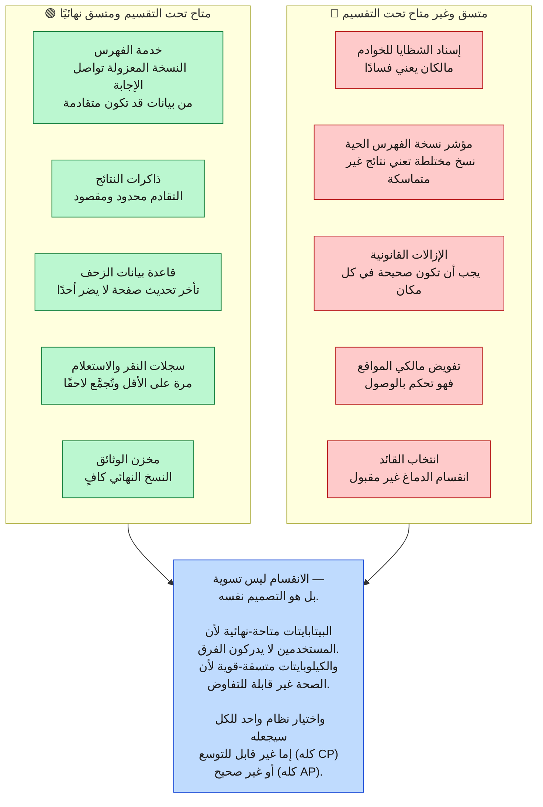
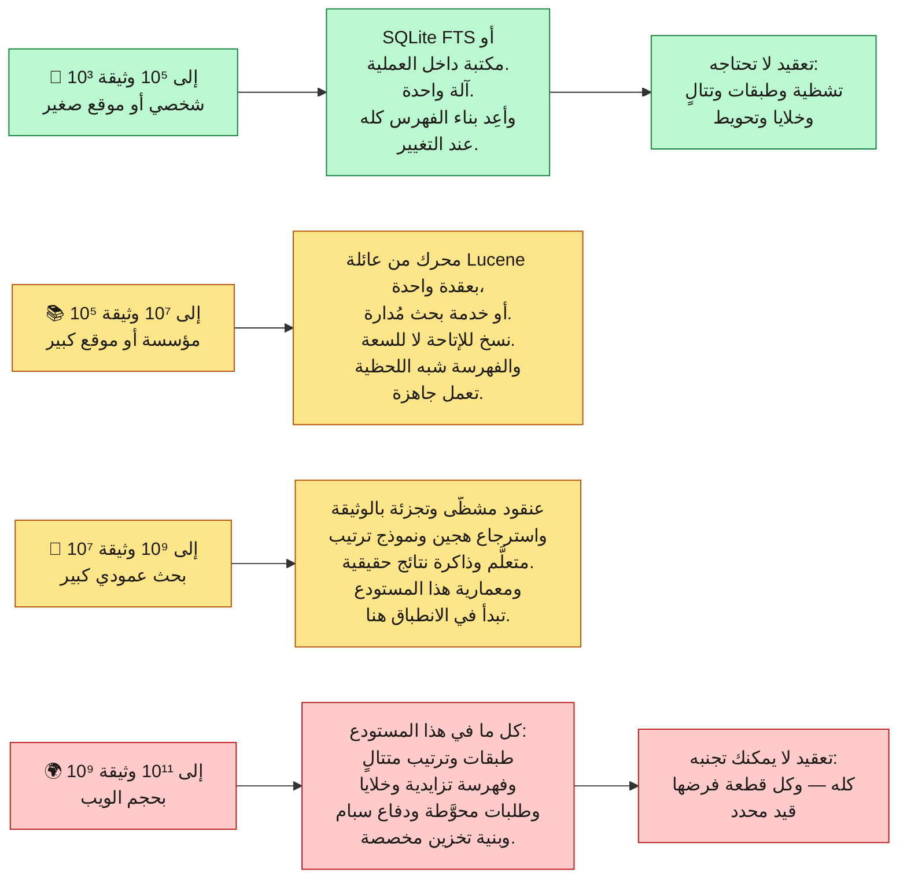

**[🇬🇧 Read in English](../en/15-tradeoffs.md)**

# الفصل ١٥ · المفاضلات والبدائل

**← [١٤ · السبام والأمان](14-security-abuse.md)** · [🏠 الرئيسية](../../README.ar.md) · **[١٦ · دليل المقابلة](16-interview-guide.md) →**

---

## ١٥.١ كل القرارات في جدول واحد

يُعرَّف تصميم النظام بما **رفضه** أكثر مما يُعرَّف بما يفعله. وإليك السجل الكامل.

| # | القرار | المُختار | البديل المرفوض | السبب | الثمن المقبول |
|:--:|---|---|---|---|---|
| ١ | تخطيط البيانات | فهرس مقلوب | مسح كامل أو فهرس أمامي فقط | البنية الوحيدة التي تجيب استعلامات المصطلحات دون الخطي | كلفة بناء الفهرس وتضخيم الكتابة |
| ٢ | التشظية | حسب الوثيقة | حسب المصطلح | توزيع زيبف يجعل التشظية بالمصطلح ساخنة دائمًا | توزيع شامل في كل استعلام |
| ٣ | قابلية تغيير المقاطع | ثابتة + دمج | تحديث في المكان | قراءات بلا أقفال ونسخ وتراجع تافهان | تضخيم قراءة حتى الدمج |
| ٤ | الحذف | شواهد قبور | إعادة كتابة فورية | يحفظ الثبات | تُحجز المساحة حتى الدمج الكبير |
| ٥ | إقامة الفهرس | الذاكرة (متدرجة) | القرص | هدف 300 مللي ثانية غير قابل للبلوغ من القرص | الذاكرة أكبر تكلفة في النظام |
| ٦ | التغطية لكل استعلام | متدرجة مع سقوط | مسطحة، ابحث في كل شيء | تقليص تكلفة الأسطول ~١٠٠ ضعف | الاستعلامات النادرة تُخدم أحيانًا بنقص |
| ٧ | الترتيب | تتالٍ من L0 إلى L3 | نموذج واحد على كل المرشحين | L3 أغلى من L1 بـ10⁵ | أخطاء الاستدعاء المبكرة غير قابلة للاستعادة |
| ٨ | نوع الاسترجاع | هجين لفظي + كثيف | لفظي فقط أو كثيف فقط | أنماط فشل متكاملة | نظامان يجب بناؤهما ومزامنتهما |
| ٩ | الاتساق (البيانات) | نهائي | قوي | لا أحد يلاحظ تأخرًا ٩٠ ثانية | على القرّاء أن يكونوا خاملين |
| ١٠ | الاتساق (التحكم) | قوي | نهائي | ملكية خادمين لشظية خطأ في الصحة | رحلة إجماع وسعة محدودة |
| ١١ | سلوك الفشل | تدهور | فشل سريع | صفحة نتائج جزئية خير من صفحة خطأ | فقدان جودة صامت يجب مراقبته |
| ١٢ | زمن الذيل | طلبات محوَّطة ومربوطة | مجرد الانتظار | توزيع على ١٦٠٠ ورقة يضمن خادمًا بطيئًا | ~٥٪ حمل إضافي |
| ١٣ | الحداثة | مساران: دفعي وتدفقي | دفعي فقط أو تدفقي فقط | ٩٩.٩٪ من الصفحات لا تحتاج دقائق | فهرسان يُدمجان وتباين مقاييس الدرجات |
| ١٤ | التخزين المؤقت | متعدد الطبقات بمفاتيح خشنة | بلا ذاكرة أو مفاتيح لكل مستخدم | يزيل ~٤٠٪ من تكلفة الخدمة | تقادم محدود ويحدّ التخصيص |
| ١٥ | التخصيص | تعديل خفيف بعد الترتيب | استرجاع لكل مستخدم | مفاتيح المستخدمين تدمّر الذاكرة | نتائج أقل تفصيلًا |
| ١٦ | النشر | خلايا مستقلة | عنقود عالمي واحد | نطاق انفجار محدود وإطلاقات آمنة | سعة مكررة لكل خلية |
| ١٧ | السعة الإقليمية | هامش «ن ناقص واحد» | التحجيم للحمل المتوقع | يجب أن تستطيع منطقة أن تفشل | دفع ثمن سعة عاطلة |
| ١٨ | الرد على سبام الروابط | تحييد الروابط السيئة | معاقبة الهدف | العقوبات تصير سلاحًا | بعض منفعة السبام تنجو |
| ١٩ | عرض جافاسكربت | مُقنَّن بقيمة الصفحة | اعرض كل شيء أو لا شيء | نسبة كلفة ١٠٠ إلى ١٠٠٠ | المواقع المعتمدة عليه تُفهرس متأخرة |
| ٢٠ | الكلمات الوظيفية | تُبقى وتُخزَّن بثمن بخس | تُحذف | الحذف يكسر استعلامات العبارات | فهرس أكبر |

---

## ١٥.٢ أين يقع كل نظام فرعي على نظرية CAP

تُطبَّق CAP كثيرًا على النظام ككل، وهذا خطأ تصنيفي. فـ**CAP تنطبق على كل تدفق بيانات على حدة**، وهذا النظام يتخذ عمدًا خيارات مختلفة في مواضع مختلفة.

> **المخطط D-72 — موقع كل نظام فرعي على CAP**

---

## ١٥.٣ معماريات كانت ستكون خاطئة

القدرة على قول **لماذا** يفشل البديل أثمن من معرفة الجواب المختار.

> **المخطط D-73 — المعماريات المرفوضة ونقاط فشلها**

**ولاحظ النمط في عمود «يصلح لـ».** فكل بديل مرفوض تقريبًا هو التصميم **الصحيح** عند حجم أصغر. فقاعدة علائقية ببحث نصي هي بالضبط الصواب لـ10⁶ وثيقة. وقاعدة متجهات محضة هي بالضبط الصواب لمتن دلالي منسَّق. وعنقود واحد هو بالضبط الصواب لمنتج بمنطقة واحدة.

وهذا أكثر الدروس قابلية للنقل في المستودع كله: **لا وجود لمعمارية جيدة في المطلق، بل معمارية مناسبة لحجم محدد ومجموعة قيود محددة.** فتطبيق أنماط حجم الويب على متن من 10⁶ وثيقة هندسةٌ مفرطة بقدر ما أن تطبيق تصميم قاعدة واحدة على 10¹¹ وثيقة هندسةٌ قاصرة.

---

## ١٥.٤ ما الذي سيتغير عند أحجام مختلفة

> **المخطط D-74 — المعمارية بحسب حجم المتن**

---

## ١٥.٥ الأفكار الخمس الجديرة بالنقل إلى غير البحث

انزع التفاصيل الخاصة بالبحث فتبقى خمسة مبادئ، كلٌّ منها قابل للتطبيق على أي نظام كبير تقريبًا.

| المبدأ | في هذا النظام | في غيره |
|---|---|---|
| **استغل الانحراف** | الطبقات والتخزين المؤقت والحداثة — كلها تنفق بسخاء على جزء ساخن ضئيل وبثمن بخس على الباقي | أي عبء بتوزيع وصول أُسّي |
| **تتالَ من الرخيص إلى المكلف** | L0 يلمس 10¹¹ وثيقة وL3 يلمس 10¹ | كشف الاحتيال، وإشراف المحتوى، والتوصية، والترجمة البرمجية |
| **الثبات يحوّل الاتساق إلى توزيع** | المقاطع الثابتة تجعل النسخ العالمي والتخزين والتراجع تافهًا | مصادر الأحداث، والتخزين المعنون بالمحتوى، ومصنوعات البناء |
| **تدهورْ ولا تفشل** | ستة مستويات تدهور صريحة بدل «يعمل/لا يعمل» | أي نظام موجه للمستخدم يكون فيه الجواب الأسوأ خيرًا من لا جواب |
| **ادفع العمل إلى ما دون الاتصال** | سمات الترتيب محسوبة وقت الفهرسة، ومسار الاستعلام يجمعها فقط | أي نظام بنسبة قراءة/كتابة غير متماثلة |

ومبدأ فوقي واحد يبرهنه المستودع كله:

> **كل قرار معماري يجب أن يكون قابلًا للتتبع إلى قيد محدد.** فإن عجزت عن تسمية القيد الذي يفرض قطعةً من التعقيد، فالأرجح أن ذلك التعقيد لا يستحق وجوده. وعلى العكس، فالتعقيد الذي **يفرضه** قيد حقيقي ليس هندسة مفرطة، بل هو الحد الأدنى للتصميم الصالح.

**← [١٤ · السبام والأمان](14-security-abuse.md)** · [🏠 الرئيسية](../../README.ar.md) · **[١٦ · دليل المقابلة](16-interview-guide.md) →** · [🇬🇧 English](../en/15-tradeoffs.md)

