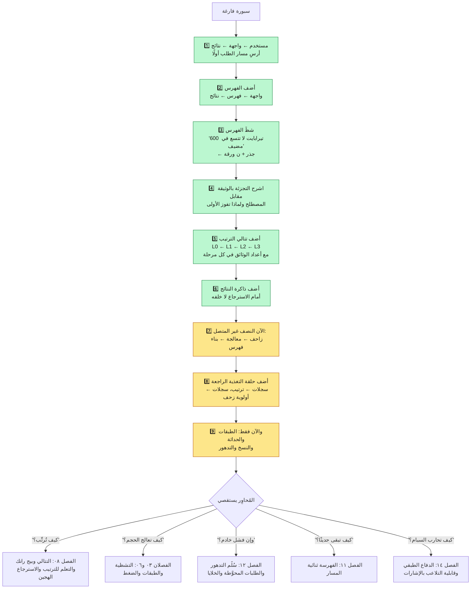
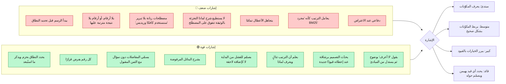

**[🇬🇧 Read in English](../en/16-interview-guide.md)**

# الفصل ١٦ · دليل مقابلة تصميم الأنظمة

**← [١٥ · المفاضلات](15-tradeoffs.md)** · [🏠 الرئيسية](../../README.ar.md) · **[١٧ · المعجم](17-glossary.md) →**

---

## ١٦.١ «صمّم محرك بحث جوجل» في ٤٥ دقيقة

لا تستطيع عرض هذا المستودع كله في مقابلة. فالمهارة المُقيَّمة هي **اختيار ما تغطيه**، وقيادة الحوار، وتبرير كل قرار بقيد.

> **المخطط D-75 — خطة الخمس والأربعين دقيقة**

```mermaid
gantt
    title توزيع وقت المقابلة بالدقائق
    dateFormat X
    axisFormat %s

    section النطاق
    توضيح المتطلبات وتقليص النطاق    :crit, a1, 0, 5
    إعلان الفرضيات بصوت عالٍ          :a2, 5, 7

    section التقدير
    تقدير السعة التقريبي              :b1, 7, 13

    section التصميم
    المعمارية العليا والحلقات الثلاث  :crit, c1, 13, 20
    الزحف والحدود                     :c2, 20, 26
    الفهرسة والتشظية                  :crit, c3, 26, 33
    مسار الخدمة وتتالي الترتيب        :crit, c4, 33, 40

    section الختام
    عنق الزجاجة والمفاضلات والأعطال   :d1, 40, 44
    أسئلة للمُحاوِر                    :d2, 44, 45
```

**ولاحظ ما يغيب عن الخطة.** تفاصيل التخزين وخطوط الحداثة ودفاع السبام والمراقبة والأمان — كلها غائبة عن الأساس. فهي في جيبك الخلفي، لا تُخرجها إلا إن وجّه المُحاوِر إليها أو انتهيت مبكرًا. ومحاولة تغطية كل شيء تضمن ألا تغطي شيئًا جيدًا.

---

## ١٦.٢ المراحل الخمس

### المرحلة ١ — النطاق (٠–٧ دقائق): استحقّ حق التصميم

لا تبدأ بالرسم، بل ابدأ بتقليص المشكلة إلى شيء قابل للإجابة.

**أسئلة تطرحها:**
- «بحث ويب عام بحجم الويب، أم متن محدود كبحث المؤسسات؟»
- «نص فقط، أم صور وفيديو وأخبار أيضًا؟»
- «هل الإعلانات وبيان المعرفة والإجابات التوليدية داخل النطاق؟» *(اقترح استبعادها.)*
- «هل أُحسِّن لجودة الملاءمة أم للزمن أم للتكلفة؟»
- «ما مدى الحداثة المطلوبة — دقائق أم أيام؟»

**ثم أعلن فرضياتك صراحةً:**

> «سأصمّم لـ~10¹¹ وثيقة و~10⁵ استعلام/ثانية بذروة ٣×، وهدف p99 أقل من 300 مللي ثانية. والنطاق بحث ويب نصي مع مسار حداثة للأخبار. والإعلانات وبيان المعرفة والإجابات التوليدية خارج النطاق. أخبرني إن كنت تفضّل أن أتجه لغير ذلك.»

هذه الفقرة وحدها تشير إلى النضج: نطاق محدود، وأرقام مسمّاة، واستبعادات صريحة، ودعوة لإعادة التوجيه.

### المرحلة ٢ — التقدير (٧–١٣): اجعل الأرقام تفرض التصميم

أجرِ حساب [الفصل ٠٣](03-capacity-estimation.md) بصوت عالٍ، و— وهذا ما يفوت أغلب المرشحين — **قل ما الذي يفرضه كل رقم**:

> «10¹¹ وثيقة × ~1500 رمز ≈ 1.5 × 10¹⁴ مدخلة. وبـ~1.5 بايت مضغوطًا يصير ذلك ~225 تيرابايت للفهرس المقلوب، ونحو 600 تيرابايت مع المرفقات والمتجهات. **وهذا الرقم وحده يخبرنا أن الفهرس لا يمكن أن يعيش على آلة واحدة ولا أن يُقرأ من القرص خلال 300 مللي ثانية — فوجب تشظيته على آلاف الخوادم المقيمة في الذاكرة. وبقية التصميم تتبع من ذلك.**»

فالتقدير ليس طقسًا، بل هو الحجة التي تبرر كل صندوق ستتلوه بالرسم.

### المرحلة ٣ — التصميم العلوي (١٣–٢٠): الحلقات الثلاث

ارسم [المخطط D-02](01-overview.md) — الاكتشاف والحداثة والاستعلام — واشرح أنها تعمل بسرعات ساعة متباينة تمامًا. وهذا التأطير يبرهن فورًا أنك تدرك أن محرك البحث ليس خط أنابيب واحدًا، وهو الخطأ المفاهيمي الأشيع.

ثم ارسم مخطط السياق: زاحف ← معالجة ← بناء فهرس ← خدمة، مع حلقة السجلات الراجعة إلى الترتيب وأولوية الزحف.

### المرحلة ٤ — الغوص العميق (٢٠–٤٠): اذهب حيث الصعوبة

غطِّ الفهرسة والخدمة تغطيةً وافية، وعامل الزحف بإيجاز ما لم يُطلب غير ذلك.

> **المخطط D-76 — ترتيب الرسم على السبورة**

**ارسم تدريجيًا، واذكر القيد قبل كل إضافة.** لا تنتج معمارية مكتملة بضربة واحدة — فلا أحد يستطيع متابعة ذلك، وهو يخفي استدلالك. فقولك «لدينا 600 تيرابايت وتحمل الآلة 512 غيغابايت، فنحتاج نحو ١٢٠٠ آلة؛ وإليك كيف يصل الاستعلام إليها كلها» لحظةٌ أقوى بكثير من مخطط مرسوم سلفًا مكتوب عليه «شظايا الفهرس».

### المرحلة ٥ — الختام (٤٠–٤٥): سمِّ نقاط الضعف بنفسك

تطوّع بذكر عنق الزجاجة قبل أن يُسأل عنه:

> «أهم أعناق الزجاجة: كلفة الذاكرة للفهرس — وتعالجها الطبقات؛ وزمن الذيل من التوزيع على ١٦٠٠ ورقة — وتعالجه الطلبات المحوَّطة؛ وزمن إعادة بناء الفهرس الكاملة — ويعالجه المسار التزايدي. وأضعف ما في وصفي هو توفيق الدرجات بين الفهرسين اللحظي والدفعي؛ وأودّ نمذجة ذلك بعناية.»

وتسمية أضعف نقطة في تصميمك أنت من أقوى الإشارات المتاحة.

---

## ١٦.٣ ما يميّز المرشحين الأقوياء

> **المخطط D-77 — أبعاد التقييم**

---

## ١٦.٤ أسئلة توقّعها، وشكل الجواب الجيد

| السؤال | إلى أين تذهب | جوهر الجواب في سطر |
|---|---|---|
| «كيف تخزّن 10¹¹ وثيقة؟» | [الفصل ٠٩](09-storage.md) | افصل الأرشيف (أعمدة عريضة، بيتابايت) عمّا تخدم منه (فهرس مقلوب، تيرابايت) |
| «لماذا فهرس مقلوب؟» | [الفصل ٠٦](06-indexing.md) | البحث بمفتاح المصطلح دون خطي، ومسح الوثائق ليس كذلك |
| «تشظية بالوثيقة أم بالمصطلح؟» | [الفصل ٠٦](06-indexing.md) | بالوثيقة — فزيبف يجعل التشظية بالمصطلح ساخنة دائمًا |
| «كيف تبلغ 300 مللي ثانية؟» | [الفصل ٠٧](07-serving.md) | فهرس مشظّى مقيم في الذاكرة وتوزيع متوازٍ وترتيب متتالٍ وتخزين مؤقت |
| «شظية بطيئة — ماذا الآن؟» | [الفصل ١٢](12-reliability.md) | طلبات محوَّطة وتمرير مواعيد وتدهور مع راية تغطية |
| «كيف تُرتِّب؟» | [الفصل ٠٨](08-ranking.md) | تتالٍ: تسجيل رخيص على كثير وتسجيل مكلف على قليل |
| «كيف تفهرس خبرًا عاجلًا في دقائق؟» | [الفصل ١١](11-freshness.md) | مسار تدفقي منفصل بإشارات تقريبية يُدمج وقت الخدمة |
| «كيف تتجنب زحف الصفحة نفسها للأبد؟» | [الفصل ٠٤](04-crawling.md) | نموذج معدل التغير × القيمة، بحلقة راجعة من كل جلبة |
| «كيف تحارب السبام؟» | [الفصل ١٤](14-security-abuse.md) | دفاع طبقي؛ والثقة عكسية مع سهولة التحكم بالإشارة |
| «ما الذي ينكسر أولًا إن تضاعف المرور ١٠×؟» | [الفصل ٠٣](03-capacity-estimation.md) | سعة استعلامات طبقة الفهرس؛ ويُخفَّف بمزيد من نسخ الطبقة صفر ورفع الإصابة |
| «ماذا كنت ستبني لـ10⁶ وثيقة؟» | [الفصل ١٥](15-tradeoffs.md) | كل شيء تقريبًا — آلة واحدة ومحرك جاهز |

**والسؤال الأخير فخ يستحق الانتباه.** فالمُحاوِر يفحص ما إذا كنت تطبّق تعقيد حجم الويب انعكاسيًا. والجواب الصحيح تبسيطٌ متحمس: «عند 10⁶ وثيقة سأستخدم محرك بحث بعقدة واحدة وبلا تشظية إطلاقًا. وكل ما ناقشناه للتو سيكون هندسة مفرطة.»

---

## ١٦.٥ ملخص في ستين ثانية ينبغي أن تتقنه

> «محرك البحث ثلاث حلقات بسرعات مختلفة. **الزاحف** يكتشف الصفحات ويعيد جلبها — والجزء الصعب ليس عرض النطاق بل ترتيب الأولويات، لأننا نعرف تريليون رابط ونستطيع جلب بضعة مليارات يوميًا، وعلينا أن نكون مهذبين مع كل مضيف. و**المعالجة** تحوّل HTML إلى رموز نظيفة وبيان روابط وإشارات جودة محسوبة مسبقًا. و**بناء الفهرس** يقلب ذلك إلى قوائم ترحيل من المصطلح إلى الوثيقة، مضغوطة إلى نحو 1.5 بايت لكل مدخلة ومشظّاة بالوثيقة على آلاف الخوادم المقيمة في الذاكرة، ومقسومة إلى طبقات ساخنة ودافئة وباردة لأن ١٪ من الوثائق تجيب ٨٥٪ من الاستعلامات.
>
> و**وقت الاستعلام** نفهم الاستعلام، ونفحص ذاكرة نتائج تمتص نحو ٤٠٪ من المرور، ثم نوزّع عبر شجرة من جذر ووسطاء على كل شظية. وكل ورقة تجري تسجيلًا رخيصًا بأسلوب BM25 وتعيد أفضل مرشحيها؛ ثم تُدمج النتائج صعودًا وتمر بتتالي ترتيب — أشجار معزَّزة بالتدرج على ألف وثيقة، ثم مشفّر عصبي تقاطعي على مئة — لأن النموذج المكلف أغلى بمئة ألف ضعف لكل وثيقة من الرخيص.
>
> وكل شيء منسوخ في خلايا مستقلة عبر المناطق، لأن رحلة عبور القارات وحدها ستستهلك نصف ميزانية الزمن. ونحن نتدهور ولا نفشل: فالشظية المفقودة تعني نتائج جزئية لا خطأ. وكل إشارة يتحكم بها مالكو المواقع تُفترض مُتلاعبًا بها عدائيًا، فيتّكئ الترتيب على إشارات يصعب تزييفها.»

فإن استطعت قول ذلك بطلاقة فأنت تفهم النظام. وكل ما تبقّى في هذا المستودع تفصيل داعم.

**← [١٥ · المفاضلات](15-tradeoffs.md)** · [🏠 الرئيسية](../../README.ar.md) · **[١٧ · المعجم](17-glossary.md) →** · [🇬🇧 English](../en/16-interview-guide.md)

