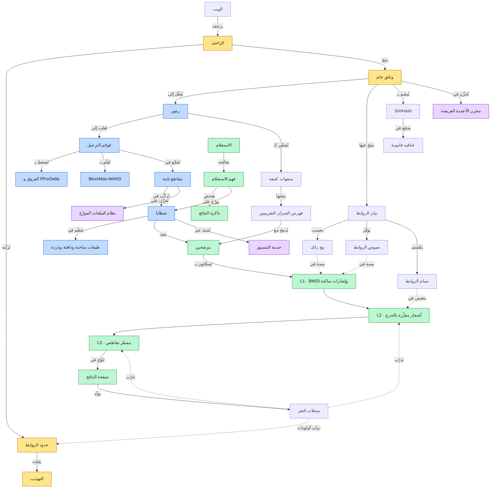

**[🇬🇧 Read in English](../en/17-glossary.md)**

# الفصل ١٧ · المعجم ثنائي اللغة والمصادر

**← [١٦ · دليل المقابلة](16-interview-guide.md)** · [🏠 الرئيسية](../../README.ar.md)

---

## ١٧.١ كيف تترابط المفاهيم

> **المخطط D-78 — خريطة المفاهيم**

---

## ١٧.٢ المعجم — العربية ⇄ English

### الزحف

| العربية | English | المعنى |
|---|---|---|
| زاحف / عنكبوت | Crawler / Spider | برنامج يجلب صفحات الويب آليًا |
| حدود الروابط | URL Frontier | طابور مرتَّب بالأولوية للروابط المنتظرة |
| التهذيب | Politeness | تحديد معدل الطلبات لأي مضيف أو عنوان |
| ميزانية الزحف | Crawl budget | سعة الجلب المخصصة لموقع أو نمط |
| ملف الروبوتات | `robots.txt` | أذونات الزحف التي يعلنها الموقع |
| الطلب الشرطي | Conditional GET | جلب باستخدام `If-Modified-Since` أو `ETag` |
| جدولة إعادة الزحف | Recrawl scheduling | تحديد موعد إعادة جلب صفحة معروفة |
| معدل التغيّر | Change rate (λ) | التواتر المقدَّر لتعديل الصفحة |
| مصيدة الزاحف | Crawler trap | فضاء روابط يحبس الزاحف قصدًا أو عرضًا |
| التمويه | Cloaking | تقديم محتوى للزاحف يخالف ما يُقدَّم للمستخدم |
| التوحيد القياسي | Canonicalization | ردّ تنويعات الرابط إلى صيغة قانونية واحدة |
| سِمهاش | SimHash | بصمة حساسة للموضع لكشف شبه التكرار |
| مرشّح بلوم | Bloom filter | بنية احتمالية لعضوية المجموعات، بلا سلبيات كاذبة |

### الفهرسة

| العربية | English | المعنى |
|---|---|---|
| الفهرس المقلوب | Inverted index | خريطة من المصطلح إلى قائمة الوثائق الحاوية له |
| الفهرس الأمامي | Forward index | خريطة من الوثيقة إلى محتواها وسماتها |
| مدخلة / قائمة ترحيل | Posting / Posting list | مدخلة لكل ورود مصطلح؛ والقائمة لمصطلح واحد |
| المعجم / قاموس المصطلحات | Lexicon / Term dictionary | كل المصطلحات المتمايزة مع إحصاءاتها ومؤشراتها |
| تكرار الوثائق | Document frequency (df) | عدد الوثائق الحاوية للمصطلح |
| تكرار المصطلح | Term frequency (tf) | مرات ورود المصطلح داخل وثيقة واحدة |
| تكرار الوثائق العكسي | IDF | ترجيح بندرة المصطلح |
| بي‑إم ٢٥ | BM25 | دالة تسجيل احتمالية قياسية للمصطلحات |
| ترميز الفروق | Delta encoding | تخزين الفجوات بين القيم المرتبة بدل القيم |
| بايت متغير / بي‑فور‑دلتا | Variable-byte / PForDelta | مُرمِّزات ضغط الأعداد لقوائم الترحيل |
| مؤشرات القفز | Skip pointers | جدول قفز يتيح بحثًا دون خطي في القائمة |
| بلوك‑ماكس واند | BlockMax-WAND | تقليم دقيق لأفضل k بحدود درجات الكتل |
| شظية | Shard | جزء من الفهرس تحمله مجموعة خوادم |
| مقطع | Segment | وحدة ثابتة من بيانات الفهرس |
| الدمج | Compaction / Merge | ضم المقاطع الصغيرة في أكبر |
| شاهد قبر | Tombstone | علامة حذف تُطبَّق وقت القراءة |
| طبقات الفهرس | Index tiering | تقسيم الفهرس إلى ساخن ودافئ وبارد |
| شجرة الدمج المهيكلة بالسجل | LSM tree | بنية محسَّنة للكتابة: جدول ذاكرة وملفات مرتبة ثابتة |

### الخدمة والترتيب

| العربية | English | المعنى |
|---|---|---|
| التوزيع | Fan-out | إرسال طلب واحد إلى خوادم كثيرة بالتوازي |
| خادم الجذر / الأوراق | Root / Leaf server | المجمّع والخوادم الحاملة للشظايا |
| الخالط / المُدمِج | Mixer / Blender | مكوّن يدمج العموديات في صفحة نتائج واحدة |
| صفحة نتائج البحث | SERP | Search engine results page |
| زمن الذيل | Tail latency | الزمن عند المئينات العالية، p99 فما فوق |
| الطلب المُحوَّط | Hedged request | طلب مكرر إلى نسخة أخرى بعد تأخير |
| الطلب المربوط | Tied request | نسختان تتسابقان وكلٌّ تُلغي الأخرى عند البدء |
| تمرير الموعد النهائي | Deadline propagation | تمرير الوقت المتبقي عبر كل قفزة |
| تتالي الترتيب | Ranking cascade | مراحل متعاقبة، كلٌّ أغلى وعلى وثائق أقل |
| التعلم للترتيب | Learning to rank (LTR) | تدريب نموذج على ترتيب النتائج |
| لامدا‑مارت | LambdaMART | خوارزمية قائمية تُحسِّن NDCG مباشرةً |
| إن‑دي‑سي‑جي | NDCG | مقياس جودة الترتيب المخصوم بالموضع |
| المشفّر الثنائي | Bi-encoder | يشفّر الاستعلام والوثيقة منفصلين؛ يتيح الاسترجاع |
| المشفّر التقاطعي | Cross-encoder | يشفّرهما معًا؛ أدق لإعادة الترتيب |
| بحث الجيران التقريبيين | ANN search | بحث متجهي تقريبي عن أقرب الجيران |
| إتش‑إن‑إس‑دبليو | HNSW | بنية فهرس تقريبي قائمة على البيانات |
| الاسترجاع الهجين | Hybrid retrieval | دمج الاسترجاع اللفظي والكثيف |
| دمج الرتب المتبادل | Reciprocal Rank Fusion | دمج قائم على الرتب بلا معايرة درجات |
| تحيز الموضع | Position bias | نقر المستخدمين على الأعلى بصرف النظر عن الملاءمة |
| مقتطف منحاز للاستعلام | Query-biased snippet | مقطع مُختار لمطابقته الاستعلام |

### البنية التحتية

| العربية | English | المعنى |
|---|---|---|
| نظام ملفات موزّع | Distributed file system | تخزين محسَّن للإلحاق عبر آلات كثيرة |
| مخزن أعمدة عريضة | Wide-column store | مخزن جداول متفرق ومُصدَّر مرتَّب بمفتاح الصف |
| لوحة | Tablet | مدى متصل من مفاتيح الصفوف |
| جدول مرتَّب ثابت | SSTable | ملف ثابت مرتَّب من أزواج مفتاح‑قيمة |
| خدمة التنسيق | Coordination service | مخزن مدعوم بالإجماع للأقفال والإعدادات والانتخاب |
| باكسوس / رافت | Paxos / Raft | خوارزميات الإجماع |
| ترميز المحو | Erasure coding | تكرار بحمل أقل من النسخ الكامل |
| خلية | Cell | كومة خدمة كاملة مستقلة |
| إنيكاست | Anycast | عنوان واحد يُعلن من مواقع كثيرة |
| التجزئة المتسقة | Consistent hashing | تخطيط يقلّل إعادة التعيين عند تغيّر العقد |
| إسقاط الحمل | Load shedding | رفض العمل عمدًا عند الحمل الزائد |
| قاطع الدارة | Circuit breaker | يوقف استدعاء اعتمادية فاشلة |
| ميزانية الإعادة | Retry budget | سقف نسبة المرور المُنفقة على الإعادات |
| التدهور التدريجي | Graceful degradation | خفض الجودة بدل الفشل |
| نطاق الانفجار | Blast radius | نطاق أثر عطل واحد |
| مؤشر / هدف / ميزانية الخطأ | SLI / SLO / Error budget | القياس والوعد والسماح بالفشل |
| تضخيم الكتابة | Write amplification | البايتات المكتوبة لكل بايت تغيير منطقي |
| تضخيم القراءة | Read amplification | القراءات المنفَّذة لكل قراءة منطقية |

### الثقة والسلامة

| العربية | English | المعنى |
|---|---|---|
| سبام الويب | Web spam | محتوى أو روابط تُنشأ للتلاعب بالترتيب |
| مزرعة روابط | Link farm | شبكة مواقع تتشابك لتضخيم السلطة |
| ترست رانك | TrustRank | ثقة تنتشر من مواقع بذور مفحوصة يدويًا |
| السيو السلبي | Negative SEO | مهاجمة منافس بروابط سامة |
| حشو الكلمات المفتاحية | Keyword stuffing | تكرار مفرط للمصطلحات للتلاعب بالتسجيل |
| صفحة مدخلية | Doorway page | صفحة تُبنى فقط لالتقاط المرور وإعادة توجيهه |
| تزوير الطلبات من جانب الخادم | SSRF | استدراج خادم لجلب عناوين يختارها المهاجم |
| إعادة ربط DNS | DNS rebinding | تغيير العنوان بين التحقق والاتصال |
| إخفاء الهوية بـk | k-anonymity | كل سجل لا يُميَّز عن k ناقص واحد غيره |
| الخصوصية التفاضلية | Differential privacy | إضافة ضوضاء معايَرة لحماية الأفراد |
| تقليل البيانات | Data minimization | جمع أقل ما يمكن والاحتفاظ بأقصر مدة |

---

## ١٧.٣ المصادر مع التعليق

كلها متاحة للعموم. وهذا المستودع تركيبٌ لها؛ ولا شيء فيه من معلومات داخلية.

| الورقة | السنة | ما تسهم به هنا | الفصول |
|---|:--:|---|:--:|
| برين وبيدج — *تشريح محرك بحث نصي فائق واسع النطاق* | ١٩٩٨ | المعمارية الأصلية وبيج رانك ونصوص الروابط | ٠١، ٠٨ |
| باروسو ودين وهولزل — *بحث الويب لكوكب كامل* | ٢٠٠٣ | العتاد التجاري والنسخ بدل الاعتماد على الموثوقية | ٠١، ١٢ |
| غيماوات وزملاؤه — *نظام ملفات جوجل* | ٢٠٠٣ | نظام موزّع مقسَّم إلى كتل ودلالات «مرة على الأقل» | ٠٩ |
| دين وغيماوات — *MapReduce* | ٢٠٠٤ | بناء الفهرس الدفعي والخلط كمركز للتكلفة | ٠٦ |
| تشانغ وزملاؤه — *Bigtable* | ٢٠٠٦ | نموذج الأعمدة العريضة وتصميم مفتاح الصف واللوحات | ٠٩ |
| بوروز — *خدمة القفل Chubby* | ٢٠٠٦ | التنسيق وانتخاب القائد والمراقبة والإخطار | ٠٩، ١٢ |
| مانكو وجين وسارما — *كشف أشباه المكررات لزحف الويب* | ٢٠٠٧ | SimHash بحجم الويب والبحث بالجداول المُبدَّلة | ٠٤ |
| دين — *تحديات بناء أنظمة استرجاع معلومات ضخمة* | ٢٠٠٩ | طبقات الفهرس وتطور أنظمة الخدمة | ٠٣، ٠٦ |
| بينغ ودابك — *المعالجة التزايدية واسعة النطاق* (Percolator) | ٢٠١٠ | المراقبون والفهرسة التزايدية والمعاملات فوق Bigtable | ١١ |
| سيغلمان وزملاؤه — *Dapper* | ٢٠١٠ | التتبع الموزع بالعيّنات وتجهيز طبقة الاستدعاء | ١٣ |
| كوربيت وزملاؤه — *Spanner* | ٢٠١٢ | معاملات متسقة عالميًا بعدم يقين زمني محدود | ٠٩ |
| دين وباروسو — *الذيل عند الحجم* | ٢٠١٣ | الطلبات المحوَّطة والمربوطة والتصميم المتحمل للذيل | ٠٧، ١٢ |
| فيرما وزملاؤه — *إدارة العناقيد واسعة النطاق بـBorg* | ٢٠١٥ | جدولة العناقيد ودوران المهام كأمر طبيعي | ٠٩، ١٢ |
| سينغ وزملاؤه — *صعود جوبيتر* | ٢٠١٥ | نسيج Clos لمركز البيانات وعرض النطاق المنصِّف | ٠٩ |
| أيزنبود وزملاؤه — *Maglev* | ٢٠١٦ | موازنة حمل برمجية والتجزئة المتسقة | ١٢ |
| غيونغي وغارسيا‑مولينا وبيدرسن — *مكافحة سبام الويب بـTrustRank* | ٢٠٠٤ | انتشار الثقة من بذور مفحوصة | ١٤ |
| مانينغ وراغافان وشوتزه — *مقدمة في استرجاع المعلومات* | ٢٠٠٨ | تصميم الحدود وضغط الفهرس وأساسيات الاسترجاع | ٠٤، ٠٦، ٠٨ |
| برودر وزملاؤه — *تقييم الاستعلامات بعملية استرجاع من مستويين* (WAND) | ٢٠٠٣ | التقليم الديناميكي أثناء الاجتياز | ٠٦ |
| دينغ وسويل — *استرجاع أسرع لأفضل k بفهارس أقصى الكتل* | ٢٠١١ | درجات الكتل القصوى والتقليم الدقيق | ٠٦ |
| شاريكار — *تقنيات تقدير التشابه من خوارزميات التقريب* | ٢٠٠٢ | بناء SimHash | ٠٤ |

### ترتيب مقترح لقراءة الأوراق

1. *بحث الويب لكوكب كامل* — أرخص طريق لاستيعاب الفلسفة العامة
2. *تشريح محرك بحث نصي فائق واسع النطاق* — التصميم الأصلي، ولا يزال سلس القراءة
3. *نظام ملفات جوجل* ← *Bigtable* ← *MapReduce* — أساس التخزين والحوسبة بترتيب الاعتمادية
4. *الذيل عند الحجم* — قصيرة، وتغيّر تفكيرك في زمن الأنظمة الموزعة تغييرًا دائمًا
5. *Percolator* — كيف تصير الأنظمة الدفعية تزايدية
6. *مقدمة في استرجاع المعلومات* — الكتاب المرجعي عند التباس أي تفصيل

**← [١٦ · دليل المقابلة](16-interview-guide.md)** · [🏠 الرئيسية](../../README.ar.md) · [📐 فهرس المخططات](../../diagrams/README.md) · [🇬🇧 English](../en/17-glossary.md)

**🎉 وصلت إلى النهاية. إن كان هذا نافعًا، فالنجمة ⭐ تساعد غيرك على إيجاده.**

