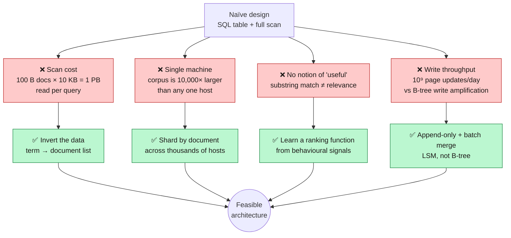
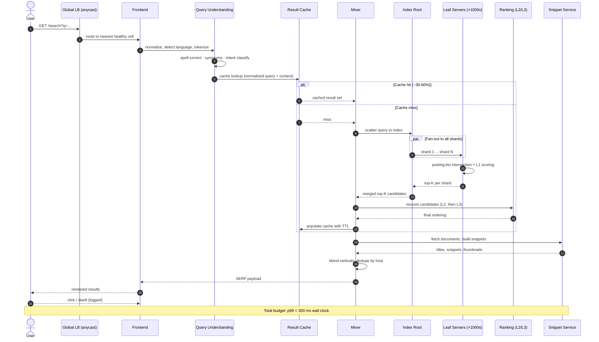
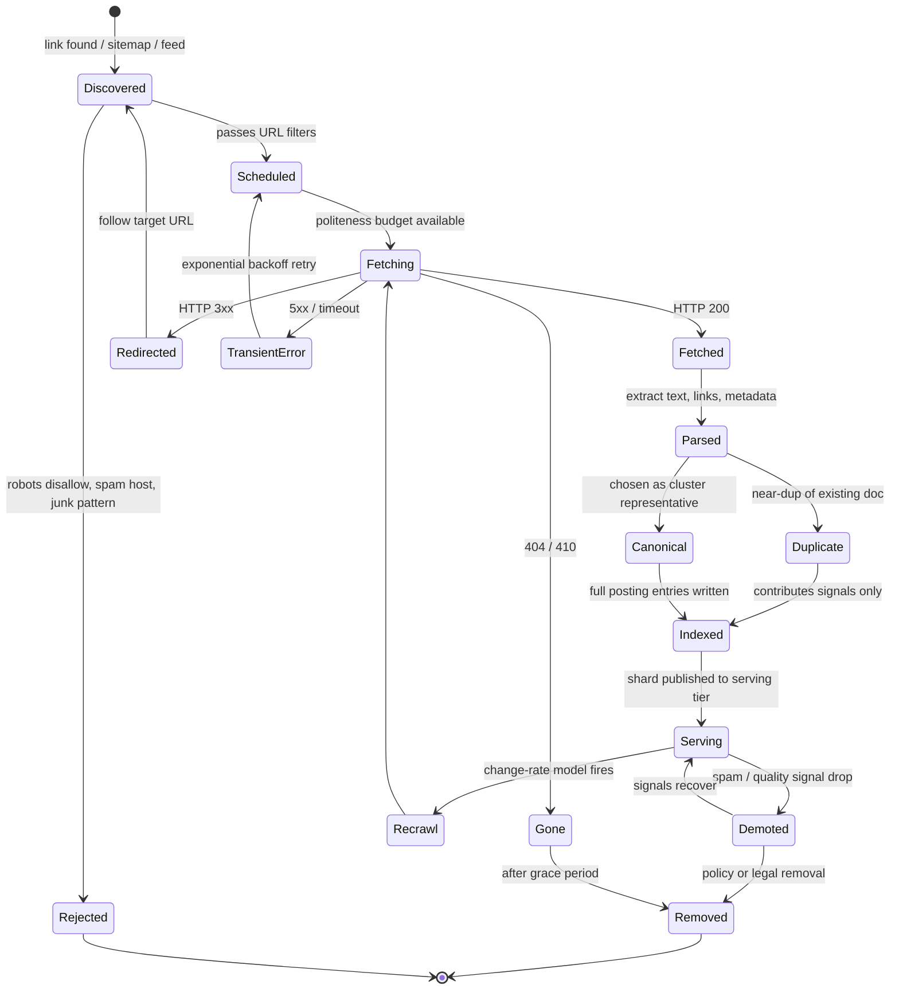
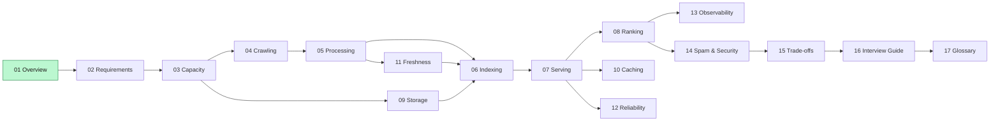

**[🇸🇦 اقرأ بالعربية](../ar/01-overview.md)**

# Chapter 01 · Overview & Problem Framing

[🏠 Home](../../README.md) · **Next → [02 · Requirements & SLOs](02-requirements.md)**

---

## 1.1 The problem, stated honestly

> *"Given an arbitrary sequence of characters typed by a human, return, within a quarter of a second, the ten most useful documents from a corpus of one hundred billion, while the corpus is changing underneath you, while a fraction of your machines are broken, and while a well-funded adversary is actively trying to poison the results."*

Every hard part of the system is already in that sentence. Let us decompose it.

| Phrase in the problem | The subsystem it forces into existence | Chapter |
|---|---|---|
| *"a corpus of one hundred billion"* | Crawler + distributed storage | [04](04-crawling.md), [09](09-storage.md) |
| *"arbitrary sequence of characters"* | Query understanding, spelling, synonyms | [07](07-serving.md) |
| *"ten most useful"* | Ranking: the actual product | [08](08-ranking.md) |
| *"within a quarter of a second"* | Sharding, fan-out, caching, tail-latency work | [06](06-indexing.md), [07](07-serving.md), [10](10-caching.md) |
| *"the corpus is changing underneath you"* | Incremental / real-time indexing | [11](11-freshness.md) |
| *"a fraction of your machines are broken"* | Replication, degradation, DR | [12](12-reliability.md) |
| *"an adversary trying to poison the results"* | Web spam and abuse defence | [14](14-security-abuse.md) |

This is the framing to open a system design interview with. It earns you the right to draw boxes, because every box now has a *reason*.

---

## 1.2 Why the naïve design fails immediately

The obvious design ("put the web in a database and run `LIKE '%query%'`") fails on four independent axes, each by many orders of magnitude.

> **Diagram D-04 · Why the naïve design collapses**

Those four arrows on the right are, essentially, the four foundational ideas of the entire system:

1. **Inversion**: never scan documents; scan a term-keyed structure instead.
2. **Partitioning**: no single machine ever holds, or needs to hold, the whole corpus.
3. **Learned relevance**: "useful" is a statistical function fit to human behaviour, not a boolean.
4. **Append-only storage**: mutation at this scale is done by writing new data and merging later.

---

## 1.3 The layered architecture

Zooming into the context diagram from the README, here is the layer stack. Read it bottom-up: each layer only depends on the ones below it.

> **Diagram D-05 · Layered architecture**

```mermaid
flowchart TB
    subgraph L7["Layer 7: Product Surface"]
        P1["SERP rendering"]
        P2["Autocomplete"]
        P3["Knowledge panels · answers"]
        P4["Verticals: images, news, video"]
    end

    subgraph L6["Layer 6: Relevance"]
        R1["Query understanding"]
        R2["Retrieval funnel"]
        R3["Learning-to-rank models"]
        R4["Personalization & locale"]
    end

    subgraph L5["Layer 5: Serving"]
        S1["Mixer / blender"]
        S2["Root & leaf index servers"]
        S3["Snippet generators"]
        S4["Multi-level caches"]
    end

    subgraph L4["Layer 4: Index"]
        I1["Inverted index shards"]
        I2["Forward index / attachments"]
        I3["Index tiering hot·warm·cold"]
        I4["Index build & merge pipeline"]
    end

    subgraph L3["Layer 3: Corpus"]
        C1["Crawler fleet"]
        C2["Content processing"]
        C3["Link graph"]
        C4["Document store"]
    end

    subgraph L2["Layer 2: Platform"]
        PL1["Distributed file system"]
        PL2["Wide-column store"]
        PL3["Coordination / locking"]
        PL4["Batch & stream compute"]
        PL5["Cluster scheduler"]
    end

    subgraph L1["Layer 1: Physical"]
        H1["Commodity servers"]
        H2["Datacenter network fabric"]
        H3["Global WAN backbone"]
        H4["Multi-region datacenters"]
    end

    L1 --> L2 --> L3 --> L4 --> L5 --> L6 --> L7

    classDef phys fill:#e5e7eb,stroke:#4b5563,color:#1c1917
    classDef plat fill:#e9d5ff,stroke:#7e22ce,color:#1c1917
    classDef corp fill:#fde68a,stroke:#b45309,color:#1c1917
    classDef idx fill:#bfdbfe,stroke:#1d4ed8,color:#1c1917
    classDef srv fill:#bbf7d0,stroke:#15803d,color:#1c1917
    classDef rel fill:#fbcfe8,stroke:#be185d,color:#1c1917
    classDef prod fill:#fed7aa,stroke:#c2410c,color:#1c1917
    class H1,H2,H3,H4 phys
    class PL1,PL2,PL3,PL4,PL5 plat
    class C1,C2,C3,C4 corp
    class I1,I2,I3,I4 idx
    class S1,S2,S3,S4 srv
    class R1,R2,R3,R4 rel
    class P1,P2,P3,P4 prod
```

**The key architectural insight:** layers 1–2 are *general infrastructure*; they are not search-specific at all. Google's most influential published work (GFS, MapReduce, Bigtable, Borg, Spanner) is almost entirely at layers 1–2. Search was the forcing function; the infrastructure was the durable output.

---

## 1.4 What actually happens when you press Enter

Before diving into subsystems, here is the whole online path in one sequence. Every arrow here gets its own chapter later.

> **Diagram D-06 · Life of a query, end to end**

Two things in this diagram deserve early attention, because they shape everything downstream:

1. **The fan-out is total, not selective.** The root does not know which shards contain matches, so it asks *all* of them. This makes the query latency equal to the *slowest* shard's latency: the "tail at scale" problem, addressed in [Chapter 12](12-reliability.md).

2. **The cache sits before the expensive work, not after.** A 40 % hit rate does not make the system 40 % faster; it makes it ~40 % *cheaper*, which is what pays for the ranking quality in the remaining 60 %.

---

## 1.5 The document lifecycle

Everything the offline half of the system does can be modelled as a single document moving through states.

> **Diagram D-07 · Document lifecycle state machine**

Note the two loops: `Serving → Recrawl → Fetching` is the **freshness loop**, and `Serving ↔ Demoted` is the **quality loop**. Neither ever terminates. A web index is not a thing you build; it is a process you run forever.

---

## 1.6 Design principles that recur everywhere

These show up in every chapter. Learn them once here.

| Principle | Concrete form in this system |
|---|---|
| **Do the expensive work offline** | Ranking features are precomputed at index time; the query path only *combines* them |
| **Trade freshness for throughput, selectively** | 99 % of pages recrawl on a slow batch loop; a tiny hot set streams in seconds |
| **Cascade cheap → expensive** | Retrieval touches 10⁹ docs, L1 scores 10⁵, L2 scores 10³, L3 scores 10¹ |
| **Replicate for latency, shard for capacity** | Sharding lets the corpus fit; replication lets QPS scale and hides failures |
| **Degrade, never fail** | Missing shard → serve incomplete results, flag it, do not return an error |
| **Make the common case fast, the rare case correct** | Cache the head; recompute the tail |
| **Every signal is adversarial** | Any input an outsider controls will eventually be gamed |

---

## 1.7 Chapter map

---

[🏠 Home](../../README.md) · **Next → [02 · Requirements & SLOs](02-requirements.md)** · [🇸🇦 العربية](../ar/01-overview.md)

