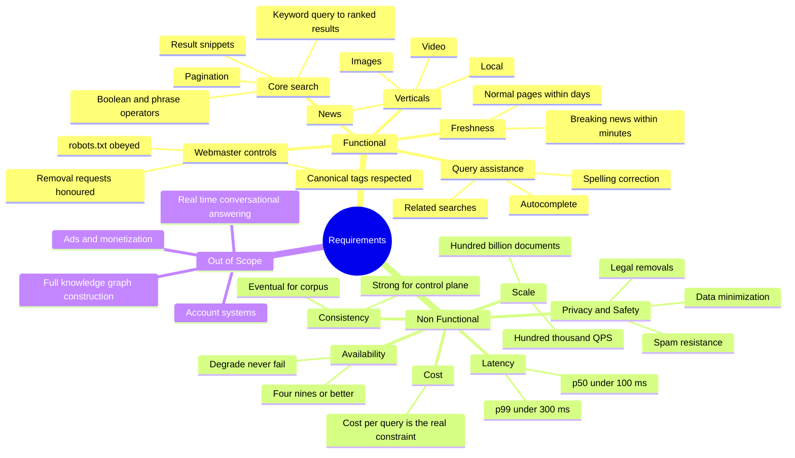
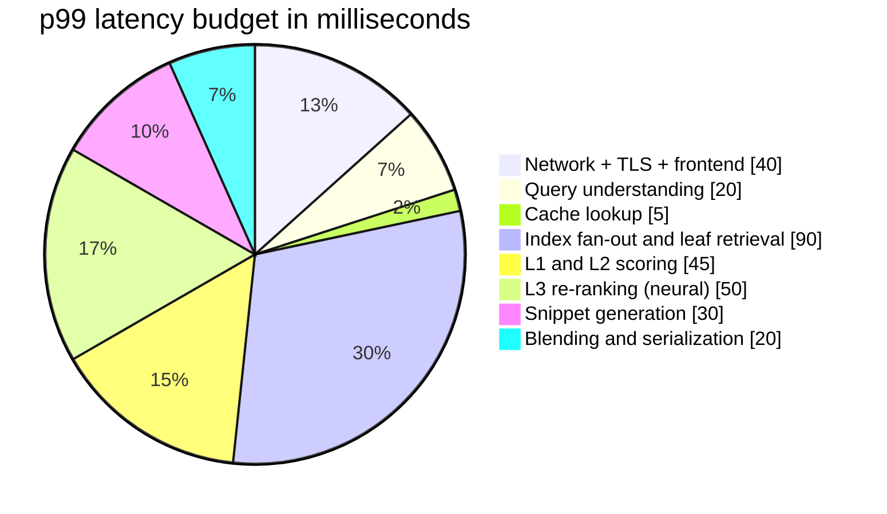
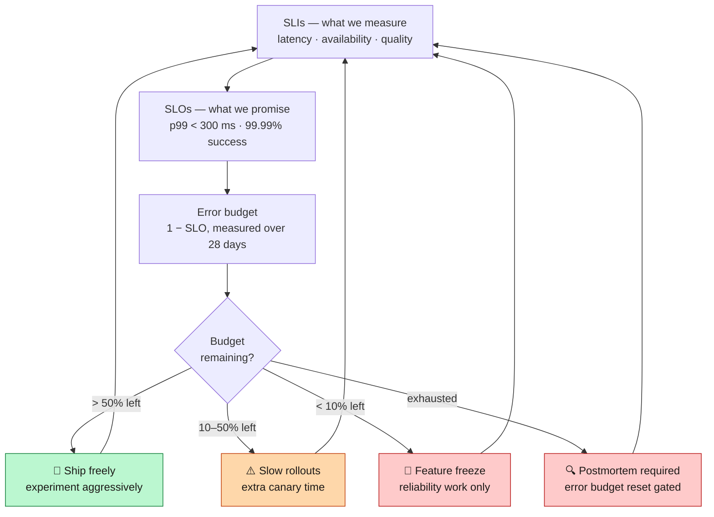
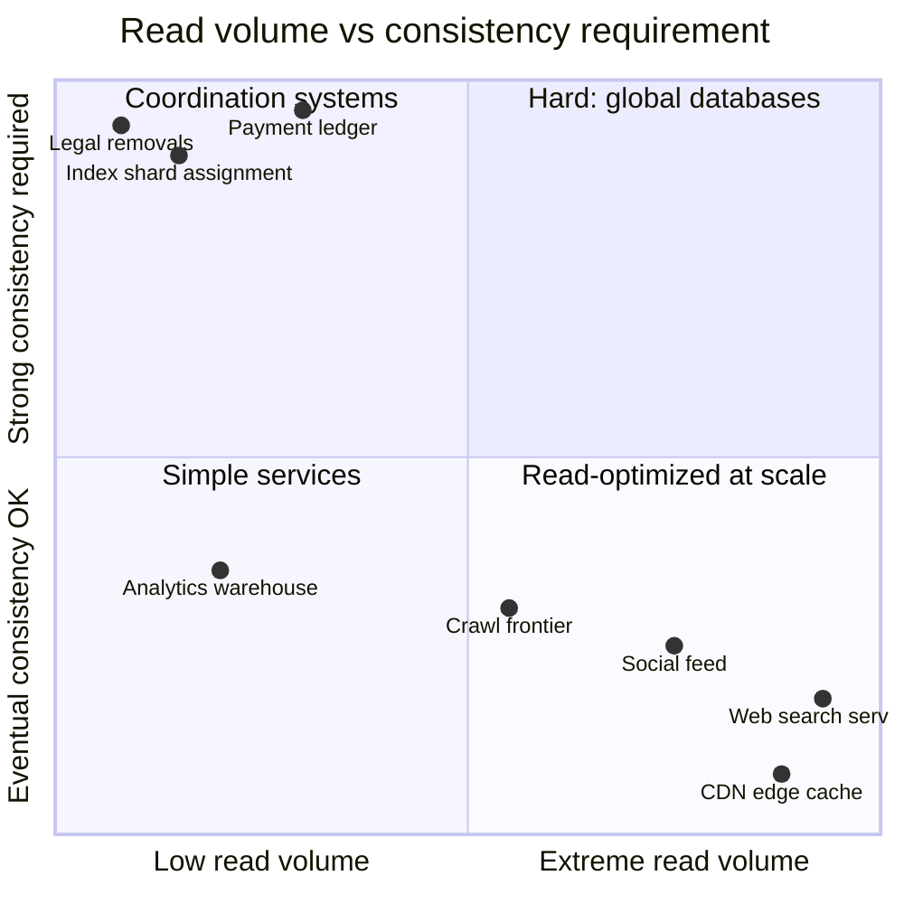

<div align="right">

**[🇸🇦 اقرأ بالعربية](../ar/02-requirements.md)**

</div>

# Chapter 02 · Requirements & Service Level Objectives

**← [01 · Overview](01-overview.md)** · [🏠 Home](../../README.md) · **[03 · Capacity Estimation](03-capacity-estimation.md) →**

---

## 2.1 Scope: what we are and are not building

Scoping is the first real design decision. A search engine can absorb infinite requirements; the ones you *refuse* determine whether the architecture is coherent.

> **Diagram D-08 — Requirements decomposition**



**Explicitly out of scope for this study**, and worth saying out loud in an interview:

| Excluded | Why |
|---|---|
| Ads auction & monetisation | A separate distributed system of comparable complexity |
| Knowledge Graph construction | Entity extraction and curation is its own discipline |
| Generative / conversational answers | Layers *on top of* retrieval; does not change the retrieval architecture |
| User accounts, sync, history UI | Product surface, not search infrastructure |

Excluding these is not laziness — it keeps the design's *centre of gravity* on retrieval, which is where all the genuinely hard scale problems live.

---

## 2.2 Functional requirements, prioritised

| Priority | Requirement | Acceptance criterion |
|:--:|---|---|
| **P0** | Free-text query returns ranked, relevant documents | Human raters score relevance above an agreed baseline |
| **P0** | Results include title, URL, snippet | Snippet contains query terms in context |
| **P0** | Respect `robots.txt` and crawl-delay | Zero policy violations; auditable crawl log |
| **P0** | Index reflects the public web broadly | Coverage measured against a sampled URL set |
| **P1** | Spelling correction and query rewriting | Corrected query offered and/or auto-applied |
| **P1** | Freshness: news-class pages indexed in minutes | Median time-to-index for hot set < 5 min |
| **P1** | Universal results: blend images, news, video | Vertical triggers only when intent justifies it |
| **P1** | Autocomplete with sub-100 ms response | Suggestions returned per keystroke |
| **P2** | Advanced operators: `site:`, `filetype:`, quotes, `-term` | Operators parse and constrain retrieval |
| **P2** | Locale and language targeting | Results respect user language and region |
| **P2** | Personalisation from consented history | Opt-out fully honoured |

---

## 2.3 Non-functional requirements — the ones that shape the architecture

### Latency

Latency is not one number; it is a distribution, and the tail is what you design for.

| Percentile | Target (end-to-end, server side) | Rationale |
|---|---:|---|
| p50 | < 100 ms | Feels instantaneous |
| p95 | < 200 ms | Still below perceptual threshold |
| p99 | < 300 ms | Hard SLO — drives all fan-out design |
| p99.9 | < 800 ms | Acceptable with degraded results |

**Why the tail dominates.** If a query fans out to 1,000 leaf servers and each has an independent 1 % chance of being slow, the probability that *at least one* is slow is `1 − 0.99¹⁰⁰⁰ ≈ 99.996 %`. Practically every query hits a slow server. This is Dean & Barroso's *tail at scale* result, and it is why the serving design in [Chapter 07](07-serving.md) contains hedged requests, tied requests and shard-level timeouts.

> **Diagram D-09 — Latency budget allocation (p99 = 300 ms)**



Every millisecond spent in one slice is a millisecond stolen from ranking quality. The budget is the architecture.

### Availability

| Tier | Target | Error budget / month | Behaviour on breach |
|---|---:|---:|---|
| Query serving | 99.99 % | ~4.3 min | Page on-call, freeze releases |
| Autocomplete | 99.9 % | ~43 min | Degrade to no suggestions |
| Index freshness pipeline | 99.5 % | ~3.6 h | Backlog drains; results go stale |
| Crawl pipeline | 99 % | ~7.2 h | Recrawl later; no user impact |

**Availability here means "returned a useful SERP", not "returned HTTP 200".** A response missing 5 % of shards is still a success. A response that returns an error page is a failure. This distinction is why the whole system is built to degrade.

> **Diagram D-10 — SLO hierarchy and error-budget policy**



### Consistency

This system deliberately runs **two different consistency regimes**, and knowing which is which is a load-bearing design decision.

| Data | Regime | Justification |
|---|---|---|
| Crawled documents, index shards | **Eventual** | Nobody can tell if a page appears 90 seconds later |
| Click and query logs | **Eventual**, at-least-once | Aggregate statistics tolerate duplication |
| Result cache | **Eventual with TTL** | Bounded staleness is the whole point |
| Shard-to-server assignment | **Strong** | Two servers claiming one shard is a correctness bug |
| Index version currently serving | **Strong** | Mixed-version reads produce incoherent results |
| Legal / policy removals | **Strong** | A removed URL must be removed everywhere, promptly |
| Webmaster verification & settings | **Strong** | Authorisation data |

The rule of thumb: **the data plane is eventual, the control plane is strong.** Petabytes flow eventually; kilobytes of metadata are transactional. This is exactly the split that motivates Bigtable (eventual, huge) alongside Spanner/Chubby (strong, small) in [Chapter 09](09-storage.md).

### Cost

At this scale cost is a first-class *functional* requirement, not an afterthought.

The relevant unit is **cost per thousand queries**, decomposed as:

```
cost/1000q  =  (serving CPU + RAM amortised)
             + (index storage amortised over query volume)
             + (crawl + processing + index build amortised)
             + (network egress)
```

The dominant term is **RAM**. The index must be memory-resident to hit the latency SLO, and RAM is the most expensive resource per byte in the fleet. Nearly every optimisation in [Chapter 06](06-indexing.md) — posting compression, index tiering, docid reordering — exists to reduce bytes of RAM per document.

---

## 2.4 Where search sits among distributed systems

> **Diagram D-11 — Design pressure map**



Search serving lives in the bottom-right: **extreme read volume, weak consistency requirement**. That single positioning grants the architecture its most valuable freedom — you may replicate the index as many times as you like, because replicas never need to agree with each other about anything. Contrast with the top-left corner, where shard assignment and legal removals sit: tiny data, but they demand consensus, so they get a completely different storage system.

---

## 2.5 Quality metrics — how "good results" is measured

You cannot optimise what you do not measure, and relevance is the hardest thing in the system to measure honestly.

| Metric | What it captures | Weakness |
|---|---|---|
| **NDCG@10** | Graded relevance of top 10, position-discounted | Needs expensive human labels |
| **MRR** | Position of the first relevant result | Ignores results below the first hit |
| **Precision@k / Recall** | Classical IR measures | Recall is unmeasurable on a web-scale corpus |
| **CTR** | Real user behaviour, free and abundant | Heavily position-biased; clickbait scores well |
| **Long-click rate** | Click followed by long dwell — a proxy for satisfaction | Misses queries answered on the SERP itself |
| **Abandonment rate** | No click at all | Ambiguous: satisfied by snippet, or failed? |
| **Query reformulation rate** | User rewrote the query | Strong negative signal, low latency to observe |
| **Side-by-side human eval** | Direct A/B judgement by trained raters | Slow, costly, but the ground truth |

**The honest picture:** behavioural metrics are cheap and biased; human ratings are expensive and unbiased. Production relevance work uses human ratings to *calibrate* and behavioural metrics to *iterate*. Any ranking change that improves CTR while degrading human ratings is treated as a regression, not a win — this is the guardrail that keeps the engine from optimising itself into clickbait. See [Chapter 13](13-observability.md).

---

## 2.6 Constraints that are external, not chosen

Some requirements are imposed by the outside world and cannot be negotiated away:

- **`robots.txt` is a hard contract.** Violating it is not a bug, it is a breach of trust with the entire web. The crawler enforces it *before* fetch, not after.
- **Crawl politeness is bounded by other people's servers.** You cannot crawl faster than site owners tolerate, regardless of your bandwidth.
- **The web is adversarial by default.** A meaningful fraction of all pages exist solely to manipulate ranking.
- **Legal removal obligations vary by jurisdiction.** The system must support region-scoped suppression with strong consistency and an audit trail.
- **The corpus is unbounded and mostly worthless.** Infinite URL spaces (calendars, faceted filters, session IDs) mean the frontier must *choose*, forever.

---

## 2.7 Requirements summary card

| Dimension | Committed target |
|---|---|
| Corpus size | ~10¹¹ indexed documents |
| Query volume | ~10⁵ QPS average, ~3× peak |
| Latency | p50 < 100 ms · p99 < 300 ms |
| Availability | 99.99 % useful-response rate |
| Freshness (hot set) | < 5 min median time-to-index |
| Freshness (general web) | days to weeks, change-rate driven |
| Consistency | Eventual data plane · strong control plane |
| Durability | No permanent loss of crawled content |
| Cost | Optimised for RAM bytes per document |

---

<div align="center">

**← [01 · Overview](01-overview.md)** · [🏠 Home](../../README.md) · **[03 · Capacity Estimation](03-capacity-estimation.md) →** · [🇸🇦 العربية](../ar/02-requirements.md)

</div>
