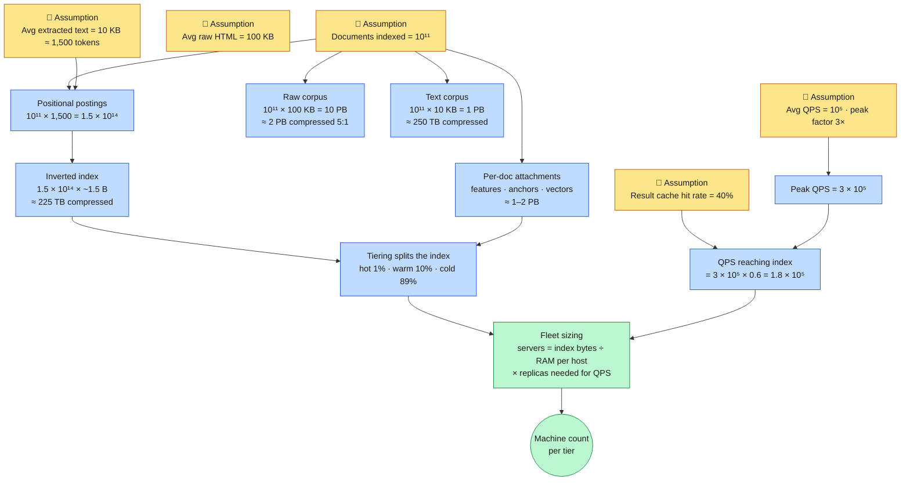
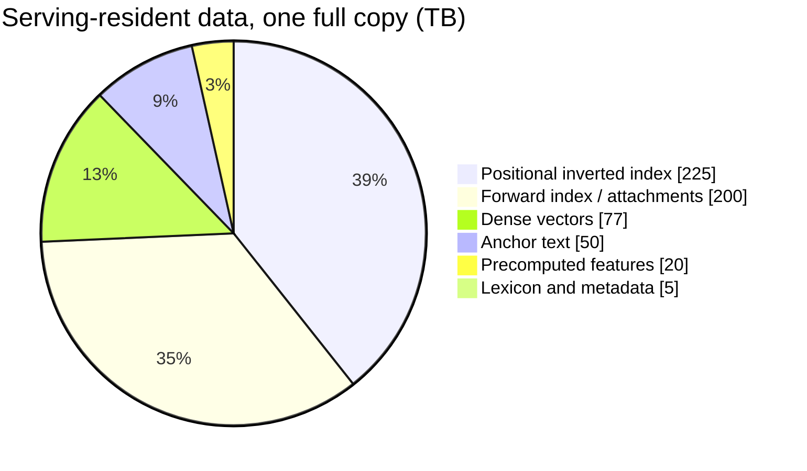
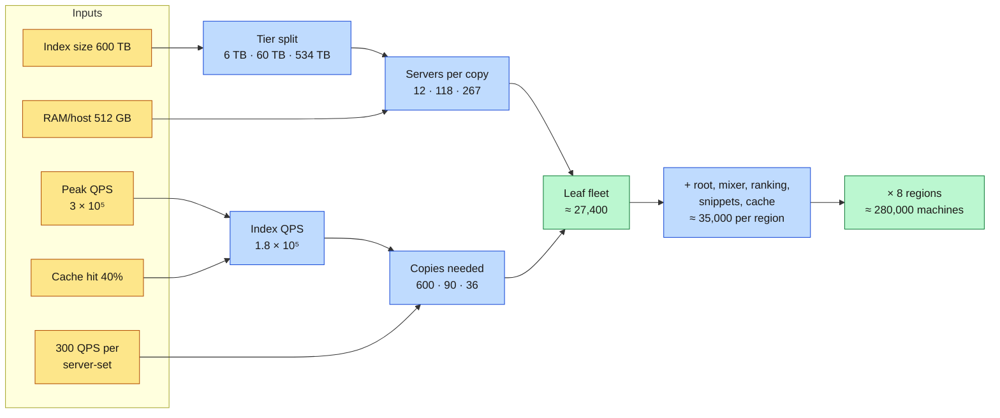

<div align="right">

**[🇸🇦 اقرأ بالعربية](../ar/03-capacity-estimation.md)**

</div>

# Chapter 03 · Capacity Estimation

**← [02 · Requirements](02-requirements.md)** · [🏠 Home](../../README.md) · **[04 · Crawling](04-crawling.md) →**

---

> ⚠️ **Every number in this chapter is an order-of-magnitude estimate derived from public information.** None of it is measured from Google's production systems. The purpose is to demonstrate a *method*: if you change an assumption, the arithmetic should follow visibly. Assumptions are stated in bold so you can substitute your own.

---

## 3.1 The method

Back-of-the-envelope estimation in a system design interview fails in one of two ways: too vague ("it's a lot of data") or too precise (six significant figures of fiction). The useful middle is a short chain where **each number is derived from the previous one and every assumption is named**.

> **Diagram D-12 · Estimation dependency chain**



---

## 3.2 Corpus size

**Assumptions:**
- Documents in the serving index: **10¹¹** (100 billion)
- URLs *known* to the frontier but not indexed: **10¹²+** (mostly junk, duplicates, infinite spaces)
- Average raw HTML per document: **100 KB**
- Average extracted body text after boilerplate removal: **10 KB** ≈ 1,500 tokens

| Quantity | Derivation | Result |
|---|---|---:|
| Raw HTML, one snapshot | 10¹¹ × 100 KB | **10 PB** |
| Raw HTML, compressed 5:1 | 10 PB ÷ 5 | **2 PB** |
| Extracted text, uncompressed | 10¹¹ × 10 KB | **1 PB** |
| Extracted text, compressed 4:1 | 1 PB ÷ 4 | **250 TB** |
| With ~5 historical versions retained | 2 PB × 5 | **~10 PB** |
| Plus non-HTML, media metadata, fetched-but-unindexed | n/a | **tens to hundreds of PB** |

**The takeaway:** the *document store* is measured in tens of petabytes, and it is dominated by history and junk, not by the text you actually index. The text you actually index is only ~250 TB compressed: three orders of magnitude smaller. **Separating "everything we fetched" from "what we serve from" is the single most important storage decision in the system.**

---

## 3.3 Index size

A positional inverted index stores one posting per *token occurrence*, not per distinct term.

```
postings = documents × tokens-per-document
         = 10¹¹ × 1,500
         = 1.5 × 10¹⁴ postings
```

**Compression assumption:** delta-encoded document IDs with variable-byte or PForDelta encoding, plus gap-encoded positions, achieve **~1.5 bytes per positional posting** on typical web text. (Uncompressed, a 37-bit docid plus a position would need 6–8 bytes; 4–5× compression is standard and well-documented in the IR literature.)

| Component | Derivation | Size |
|---|---|---:|
| Positional inverted index | 1.5 × 10¹⁴ × 1.5 B | **~225 TB** |
| Lexicon / term dictionary | ~10⁹ distinct terms × ~40 B | **~40 GB** |
| Forward index (doc → terms, for snippets & scoring) | 10¹¹ × ~2 KB | **~200 TB** |
| Precomputed ranking features per doc | 10¹¹ × ~200 B | **~20 TB** |
| Anchor text aggregated per doc | 10¹¹ × ~500 B | **~50 TB** |
| Dense vectors, 768-dim int8, one model | 10¹¹ × 768 B | **~77 TB** |
| **Total serving-resident data (one copy)** | n/a | **~600 TB ≈ 0.6 PB** |

**Sanity check against the latency SLO:** 600 TB cannot be read from disk within 300 ms by any arrangement of hardware. It must be RAM- or flash-resident, distributed across thousands of machines, and touched in parallel. That constraint alone forces the entire sharded fan-out architecture. This is the moment in the design where the numbers stop being trivia and start dictating structure.

> **Diagram D-13 · Where the bytes go**



---

## 3.4 Why tiering changes everything

If every query had to touch all 600 TB, the fleet would be economically impossible. It is saved by an extremely skewed fact about queries: **a tiny fraction of documents satisfies the overwhelming majority of queries.**

**Assumption:** the top 1 % of documents by query-coverage answer ~85 % of queries fully; the top 11 % answer ~97 %.

| Tier | Share of corpus | Documents | Index share | Medium | Queries resolved here |
|---|---:|---:|---:|---|---:|
| **Tier 0: hot** | 1 % | 10⁹ | ~6 TB | RAM | ~85 % |
| **Tier 1: warm** | 10 % | 10¹⁰ | ~60 TB | RAM + NVMe | ~12 % |
| **Tier 2: cold** | 89 % | ~8.9 × 10¹⁰ | ~534 TB | NVMe / flash | ~3 % |

A query enters Tier 0. If it collects enough high-quality candidates there, it never descends. Only when Tier 0 returns too few or too weak results does the system fall through to Tier 1, and rarely to Tier 2. This is the mechanism described in Jeff Dean's 2009 WSDM keynote, and it is worth roughly **two orders of magnitude of fleet cost.**

---

## 3.5 Query volume and fleet sizing

**Assumptions:**
- Average query rate: **10⁵ QPS** globally
- Peak-to-average ratio: **3×** → peak **3 × 10⁵ QPS**
- Result cache hit rate: **40 %**
- Queries reaching the index at peak: 3 × 10⁵ × 0.6 = **1.8 × 10⁵ QPS**
- A leaf server sustains **~300 index QPS** (posting-list intersection + L1 scoring)
- Usable index RAM per leaf host: **512 GB**

### Step 1: how many servers hold one copy of each tier?

```
Tier 0:   6 TB ÷ 512 GB  ≈    12 servers per copy
Tier 1:  60 TB ÷ 512 GB  ≈   118 servers per copy
Tier 2: 534 TB ÷ 2 TB NVMe ≈ 267 servers per copy
```

### Step 2: how many copies does the QPS demand?

```
Tier 0:  1.8 × 10⁵ QPS × 100%  ÷ 300 QPS/server-set ≈ 600 copies
Tier 1:  1.8 × 10⁵ QPS × 15%   ÷ 300               ≈  90 copies
Tier 2:  1.8 × 10⁵ QPS × 3%    ÷ 150 (slower, NVMe) ≈  36 copies
```

### Step 3: multiply

| Tier | Servers/copy | Copies | **Leaf servers** |
|---|---:|---:|---:|
| Tier 0 | 12 | 600 | **7,200** |
| Tier 1 | 118 | 90 | **10,620** |
| Tier 2 | 267 | 36 | **9,612** |
| | | **Total** | **~27,400** |

### Step 4: the rest of the serving fleet

| Role | Sizing logic | Servers |
|---|---|---:|
| Leaf index servers | above | ~27,400 |
| Root / intermediate aggregators | ~1 per 40 leaves | ~700 |
| Mixers & frontends | 3 × 10⁵ QPS ÷ 2,000 QPS each | ~150 |
| Query understanding | 3 × 10⁵ ÷ 1,500 | ~200 |
| L3 neural re-ranking | 1.8 × 10⁵ × 50 docs ÷ accelerator throughput | ~3,000 (accelerated) |
| Snippet generation + doc store reads | 3 × 10⁵ × 10 docs | ~2,500 |
| Result cache tier | 600 TB working set ÷ 256 GB | ~1,200 |
| **Serving total (one region)** | | **~35,000** |
| **× 8 geographic regions** | | **~280,000** |

**Reality check on this number.** ~10⁵–10⁶ machines is the right order of magnitude for a hyperscale search operation, and the arithmetic above lands inside it. If your estimate had come out at 1,000 machines or at 100 million, you would know an assumption was wrong by orders of magnitude, which is exactly what this exercise is for. It is a *consistency check*, not a prediction.

> **Diagram D-14 · Fleet sizing derivation**



---

## 3.6 Crawl throughput

**Assumptions:**
- Corpus 10¹¹ documents, average recrawl interval **30 days**
- Average fetch size **100 KB**

```
fetches/day    = 10¹¹ ÷ 30           ≈ 3.3 × 10⁹
fetches/second = 3.3 × 10⁹ ÷ 86,400  ≈ 38,000 fetches/s
ingress        = 38,000 × 100 KB     ≈ 3.8 GB/s ≈ 30 Gbps sustained
```

30 Gbps is *trivial* for an operator of this size. **Crawl is not bandwidth-bound.** It is bound by three other things:

1. **Politeness.** With ~1 fetch/host/second and ~2 × 10⁸ active hosts, the theoretical global ceiling is enormous, but URLs are catastrophically skewed. A handful of hosts own billions of URLs each, and those hosts are exactly the ones you must crawl slowly.
2. **DNS.** 38,000 fetches/s against a naive resolver would melt it. DNS must be aggressively cached and, in practice, self-hosted.
3. **Selection.** With 10¹²+ known URLs and capacity for 3.3 × 10⁹ fetches/day, the frontier can only visit **0.3 % of what it knows about per day.** Crawling is fundamentally a *prioritisation* problem, not a throughput problem. See [Chapter 04](04-crawling.md).

---

## 3.7 Index build throughput

| Job | Input | Assumed aggregate throughput | Wall-clock |
|---|---:|---:|---|
| Full index rebuild (MapReduce) | 1 PB text | 20 GB/s | ~14 hours |
| PageRank, 30 iterations | 10¹¹ nodes, ~10¹² edges | n/a | ~hours on a graph engine |
| Incremental index update | ~10⁹ changed docs/day | streaming | continuous |
| Shard publish to serving tier | 600 TB × replicas | 100 GB/s | staged over hours |

**The critical constraint is not build time but publish time.** Rebuilding the index in 14 hours is fine; *pushing 600 TB to hundreds of serving replicas* is the genuinely hard part, and it is why index updates are distributed as immutable, incrementally-shipped segments rather than as full replacements. See [Chapter 06](06-indexing.md) and [Chapter 11](11-freshness.md).

---

## 3.8 Latency arithmetic: is 300 ms even possible?

Let us verify the SLO is not fantasy, using standard latency numbers.

| Operation | Typical latency |
|---|---:|
| L1 cache reference | 1 ns |
| Main memory reference | 100 ns |
| Compress 1 KB | ~2 µs |
| Send 1 KB over 10 Gbps datacenter link | ~1 µs |
| SSD random read | ~16–100 µs |
| Round trip within datacenter | ~500 µs |
| Disk seek | ~5 ms |
| Round trip CA ↔ Netherlands | ~150 ms |

Now the serving path:

```
Client → nearest datacenter (anycast, regional)       ~20 ms
Frontend + query understanding (in-memory)            ~20 ms
Cache lookup (1 RTT in DC)                            ~1 ms
Root → leaf fan-out (1 RTT + leaf work)               ~1 ms + 40 ms
Leaf posting intersection (RAM, parallel)             (in the 40 ms)
Root merge + L2 scoring                               ~30 ms
L3 neural re-rank on ~50 docs (accelerator)           ~50 ms
Snippet fetch (parallel doc-store reads)              ~30 ms
Blend + serialize + render                            ~20 ms
─────────────────────────────────────────────────────────────
Total                                                 ~212 ms
```

It fits, with **~90 ms of headroom** for the p99 tail. Two observations that drive later chapters:

- **The cross-continent round trip (150 ms) does not appear.** That is not luck; it is why serving must be *geographically replicated*. A globally centralised index cannot meet this SLO no matter how fast the software is. Geography is the constraint, not code.
- **The single largest controllable slice is L3 neural re-ranking.** It is also the largest quality lever. The entire retrieval funnel in [Chapter 08](08-ranking.md) exists to reduce the number of documents that reach L3 to a few dozen, so the expensive model can be afforded at all.

---

## 3.9 Estimation cheat-sheet

Memorise these; they let you do this arithmetic live.

| Fact | Value |
|---|---|
| Seconds in a day | ~86,400 ≈ 10⁵ |
| Seconds in a year | ~3.2 × 10⁷ |
| 2¹⁰ / 2²⁰ / 2³⁰ / 2⁴⁰ / 2⁵⁰ | K / M / G / T / P |
| Bits needed for 10¹¹ ids | 37 bits → pack as 5 bytes |
| gzip on HTML | ~5:1 |
| gzip on plain text | ~3–4:1 |
| Delta+varint on sorted docids | ~4–6× |
| Typical web page, body text | ~1,500 tokens |
| Datacenter RTT | ~0.5 ms |
| Cross-continent RTT | ~150 ms |
| RAM read throughput | ~10 GB/s per socket |
| NVMe read | ~3–7 GB/s, ~500 K IOPS |

---

<div align="center">

**← [02 · Requirements](02-requirements.md)** · [🏠 Home](../../README.md) · **[04 · Crawling](04-crawling.md) →** · [🇸🇦 العربية](../ar/03-capacity-estimation.md)

</div>
