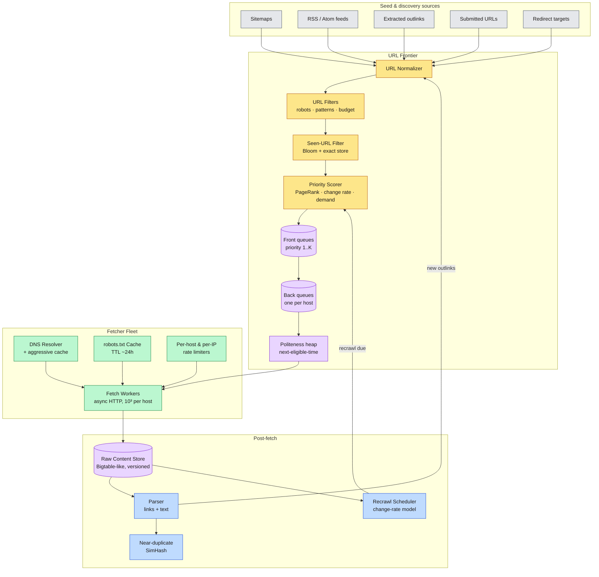
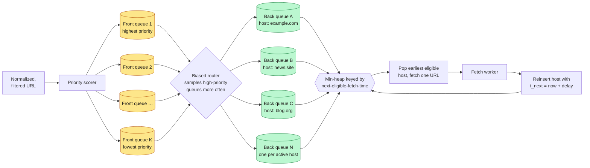
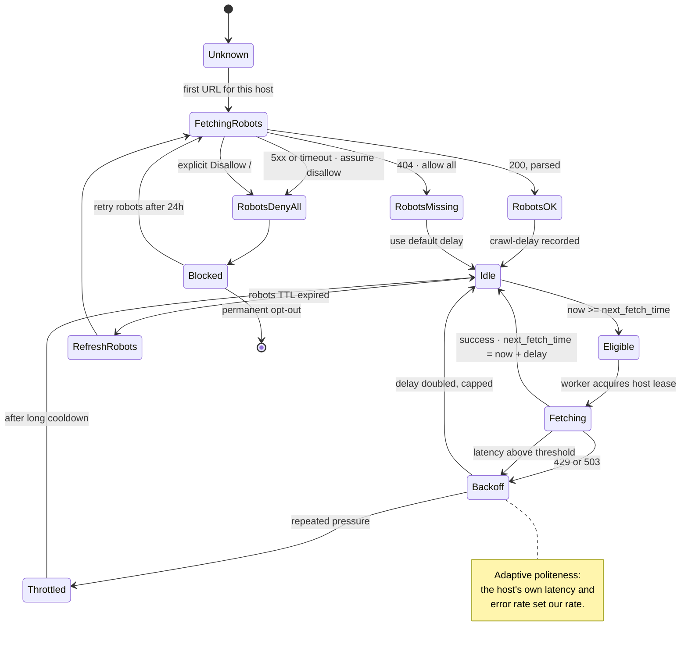
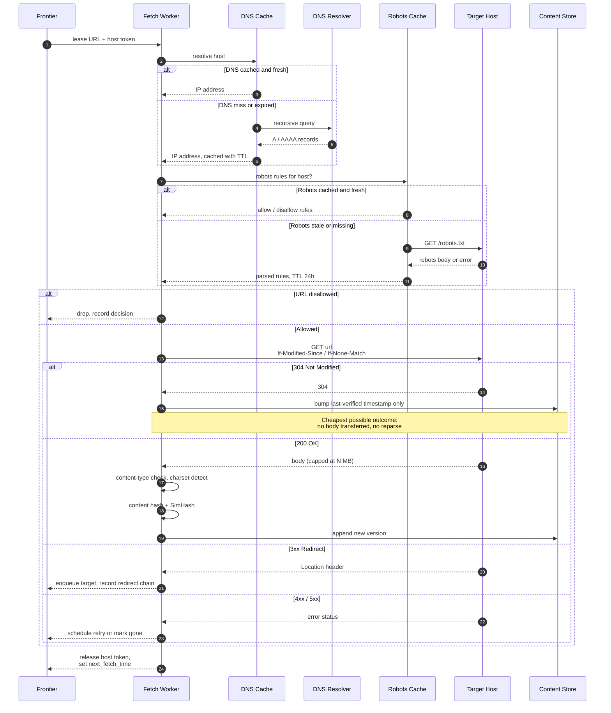
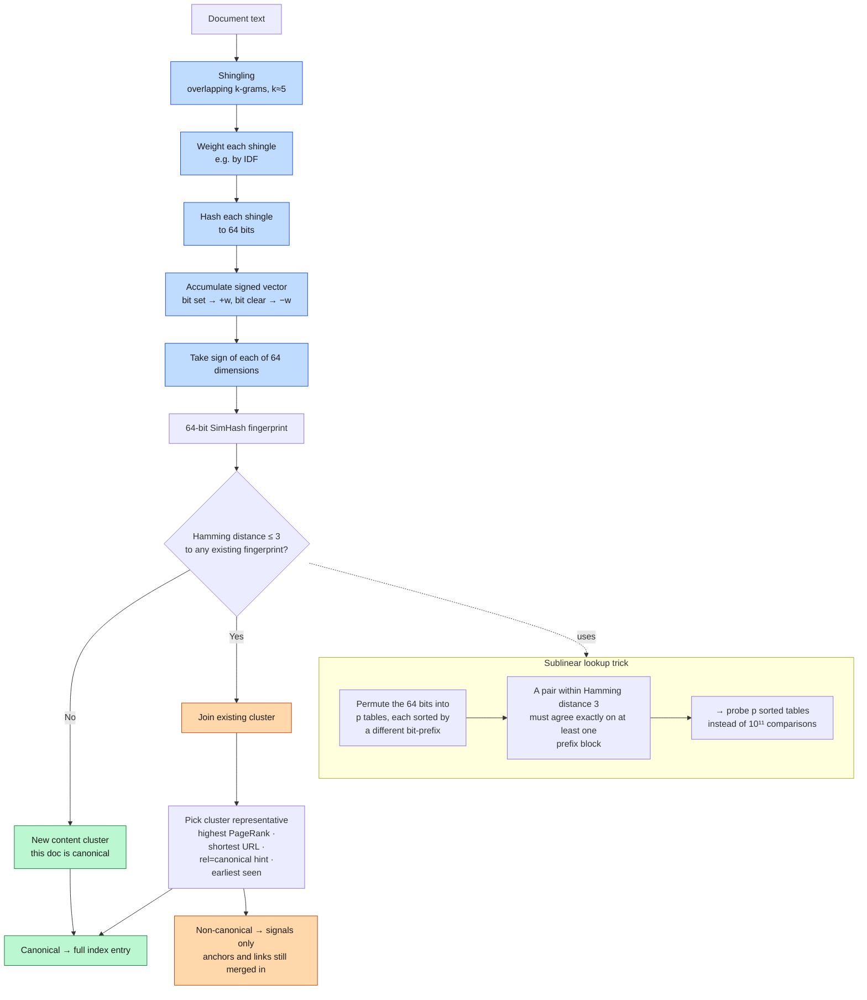
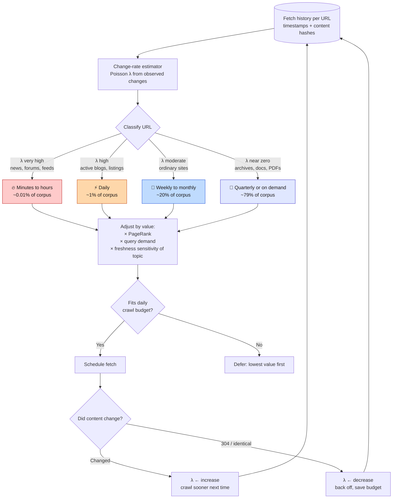

<div align="right">

**[🇸🇦 اقرأ بالعربية](../ar/04-crawling.md)**

</div>

# Chapter 04 · Crawling & the URL Frontier

**← [03 · Capacity Estimation](03-capacity-estimation.md)** · [🏠 Home](../../README.md) · **[05 · Content Processing](05-content-processing.md) →**

---

## 4.1 The crawler's real job

A naïve reading says the crawler's job is "download the web". It is not. From [Chapter 03](03-capacity-estimation.md) we know the frontier holds **10¹²+ URLs** but the fleet can fetch only **~3.3 × 10⁹ per day**: about **0.3 %**. The crawler therefore has exactly one hard job:

> **Decide, continuously and under adversarial conditions, which 0.3 % of known URLs are worth fetching today, while never being rude to anyone's server.**

Everything else (HTTP, parsing, storage) is comparatively easy. Prioritisation and politeness are where the engineering lives.

### The four constraints

| Constraint | Consequence |
|---|---|
| **Politeness** | Cannot exceed a per-host rate, no matter how much capacity is idle |
| **Infinite URL space** | Calendars, faceted navigation, session IDs generate unbounded URLs |
| **Extreme skew** | A handful of hosts own billions of URLs; most hosts own fewer than 100 |
| **Adversarial content** | Crawler traps, cloaking, spider bombs, zip bombs, and deliberate poisoning |

---

## 4.2 Crawler architecture

> **Diagram D-15 · Crawler fleet architecture**



---

## 4.3 The URL frontier: the heart of the crawler

The frontier must satisfy two goals that actively fight each other:

- **Priority:** fetch important, fresh, in-demand URLs first.
- **Politeness:** never issue two requests to one host too close together.

A single priority queue satisfies the first and catastrophically violates the second: the highest-priority URLs cluster on a few big hosts, so a pure priority queue hammers those hosts. The standard solution (Mercator-style, described in Manning/Raghavan/Schütze's *Introduction to Information Retrieval*) is a **two-stage queue system**.

> **Diagram D-16 · Two-stage frontier: priority in front, politeness behind**



**The invariant that makes this work:** *each back queue holds URLs from exactly one host, and each host has at most one back queue.* The heap then guarantees that a host is fetched at most once per its configured delay, while the biased router in front ensures the *choice of which URL from that host* still respects priority.

### Priority scoring

A URL's crawl priority is a weighted combination of signals. Typical formulation:

```
priority(u) =  w₁ · log(1 + PageRank(host(u)))
             + w₂ · predicted_change_rate(u)
             + w₃ · query_demand(topic(u))
             + w₄ · freshness_deficit(u)
             + w₅ · discovery_boost(u)          # brand-new URL
             − w₆ · spam_score(host(u))
             − w₇ · depth_penalty(u)            # clicks from homepage
             − w₈ · duplicate_probability(u)
```

None of these weights is static; they are tuned against a coverage/freshness objective and re-tuned as the web changes.

### The seen-URL problem

Before enqueuing, the frontier must answer "have I seen this URL?": **10¹² times a day**, against a set of **10¹² URLs**. Storing 10¹² URLs at ~70 bytes each is 70 TB, far too large to keep in RAM on one machine.

The standard structure is a **two-level test**:

1. **Bloom filter in RAM**: ~10 bits per URL → ~1.25 TB sharded across the fleet, with ~1 % false-positive rate. A *negative* answer is definitive: the URL is genuinely new.
2. **Exact store on disk** (Bigtable-like, keyed by URL hash): consulted only on a Bloom *hit*, to distinguish a true duplicate from a false positive.

Because Bloom filters never produce false negatives, no new URL is ever wrongly discarded. The 1 % false-positive rate merely costs an occasional disk lookup. This is the right trade: the cheap structure handles the common case, the expensive one handles the ambiguous case.

---

## 4.4 Politeness: the non-negotiable constraint

> **Diagram D-17 · Per-host politeness state machine**



### Rules the crawler enforces

| Rule | Implementation |
|---|---|
| `robots.txt` fetched before any URL on a host | Robots cache checked on every fetch; miss blocks the fetch |
| `robots.txt` unreachable → assume disallow | Fail closed, never fail open |
| Respect `Crawl-delay` when present | Feeds directly into `next_fetch_time` |
| Default delay when absent | Typically 1 s, adaptive by host capacity |
| Adaptive slowdown on latency rise | If the host slows, we slow, treat their latency as a signal |
| Honour `429` / `503` + `Retry-After` | Exponential backoff with jitter and a cap |
| Rate-limit by **IP**, not just hostname | Thousands of vhosts can share one server |
| Identify honestly in `User-Agent` | Include a URL explaining the crawler and how to block it |

**The IP-level limit is the subtle one.** Shared hosting means `a.com`, `b.com` … `z.com` may all resolve to one overloaded machine. Politeness applied only per-hostname would let the crawler issue 26× the intended rate at that machine. The limiter must key on the resolved IP (or IP block) as well.

---

## 4.5 The fetch path in detail

> **Diagram D-18 · Life of a single fetch**



**Conditional GET is the highest-leverage optimisation in the crawler.** Most recrawls of most pages return `304 Not Modified`. A 304 costs one round trip and zero bytes of body, versus 100 KB plus a full reparse and reindex. Getting `If-Modified-Since` and `ETag` right is worth more than any amount of fetch-worker tuning.

---

## 4.6 Duplicate and near-duplicate detection

Roughly **30–40 % of the web is duplicate or near-duplicate content**: mirrors, syndication, printer-friendly versions, URL parameter variants, boilerplate-only differences. Indexing all of it wastes storage, wastes ranking quality, and produces terrible SERPs.

Exact duplicates are trivial: hash the content. Near-duplicates need a **locality-sensitive hash**, and the canonical choice is **SimHash** (Charikar 2002; Manku et al. showed it works at web scale at Google in 2007).

> **Diagram D-19 · SimHash near-duplicate pipeline**



**Why SimHash rather than MinHash here?** SimHash produces a compact 64-bit fingerprint per document with a cheap similarity test (Hamming distance), which matters enormously when you have 10¹¹ documents and must compare each new one against all of them. MinHash gives better Jaccard estimation but needs many more bytes per document. At web scale, fingerprint size *is* the design constraint.

### Canonicalisation, before you even hash

Much duplication is removable by normalising URLs before fetching:

| Transformation | Example |
|---|---|
| Lowercase scheme and host | `HTTP://Example.COM/A` → `http://example.com/A` |
| Remove default port | `http://x.com:80/` → `http://x.com/` |
| Resolve `.` and `..` | `/a/./b/../c` → `/a/c` |
| Strip tracking parameters | `?utm_source=…&fbclid=…` removed |
| Sort remaining query params | `?b=2&a=1` → `?a=1&b=2` |
| Strip fragment | `page#section` → `page` |
| Normalise trailing slash per host convention | learned per host |
| Honour `rel="canonical"` | strong hint, verified not blindly trusted |
| Follow and collapse redirect chains | store final target only |

`rel="canonical"` is *a hint from an untrusted party*. It is a strong signal, but spammers use it to consolidate ranking onto pages they control, so it is validated against content similarity rather than obeyed unconditionally.

---

## 4.7 Recrawl scheduling: spending the budget wisely

Once a page is in the corpus, the question becomes: *when should we look again?* Recrawling everything uniformly is enormously wasteful, because change rates on the web span at least six orders of magnitude; a news homepage changes every minute, an archived PDF never changes again.

> **Diagram D-20 · Adaptive recrawl scheduling**



**The feedback loop is the whole design.** Every fetch produces evidence about whether the page changed, and that evidence updates the estimate that decides the next fetch. Pages that keep returning `304` are crawled ever less often; pages that keep changing earn more budget. The crawler therefore *learns* the shape of the web's change rate rather than being told it.

Note also that change rate alone is insufficient. A page that changes hourly but has no inbound links and no query demand deserves less budget than a monthly-updated page that ranks for a million queries. **Recrawl priority is change rate × value, not change rate alone.**

---

## 4.8 Crawler traps and defences

| Trap | Mechanism | Defence |
|---|---|---|
| **Infinite calendar** | `/calendar?date=2099-12-31` recurses forever | Depth limits, per-pattern budgets, parameter blacklists |
| **Faceted navigation** | Combinatorial filter URLs: 2ⁿ variants | Detect low-content-diversity parameter sets, cap per host |
| **Session IDs in URLs** | Every visit yields a "new" URL | Strip known session parameters; detect via content-identity |
| **Spider traps / tarpits** | Deliberately slow responses to tie up workers | Aggressive per-request timeouts, per-host worker caps |
| **Zip / decompression bombs** | 1 KB compressed → 10 GB decompressed | Cap decompressed size; abort on ratio threshold |
| **Cloaking** | Different content served to the crawler than to users | Sample fetches from residential-like paths; compare renders |
| **Link farms** | Thousands of hosts cross-linking to inflate PageRank | Host-level and IP-block-level graph analysis; see [Ch 14](14-security-abuse.md) |
| **DNS wildcard sprawl** | `*.spam.com` → unlimited subdomains | Budget per registrable domain, not per hostname |

The unifying defence: **budget everything, at every granularity**; per URL pattern, per host, per IP block, per registrable domain. An adversary can always generate more URLs than you can fetch; the only durable answer is a hard cap on how much of your capacity any one entity can consume.

---

## 4.9 What we hand to the next stage

The crawler's output contract, consumed by [Chapter 05](05-content-processing.md):

| Field | Description |
|---|---|
| `url` | Normalised, canonical form |
| `fetch_time` | When the fetch completed |
| `http_status` | Final status after redirects |
| `redirect_chain` | Full chain, for signal consolidation |
| `content_type`, `charset` | Detected and validated |
| `raw_body` | Compressed, capped, versioned |
| `content_hash` | Exact-duplicate key |
| `simhash` | Near-duplicate fingerprint |
| `robots_decision` | Auditable allow/disallow record |
| `fetch_latency`, `response_size` | Host-health signals feeding politeness |
| `discovered_from` | Referring URL, for the link graph |

---

<div align="center">

**← [03 · Capacity Estimation](03-capacity-estimation.md)** · [🏠 Home](../../README.md) · **[05 · Content Processing](05-content-processing.md) →** · [🇸🇦 العربية](../ar/04-crawling.md)

</div>
