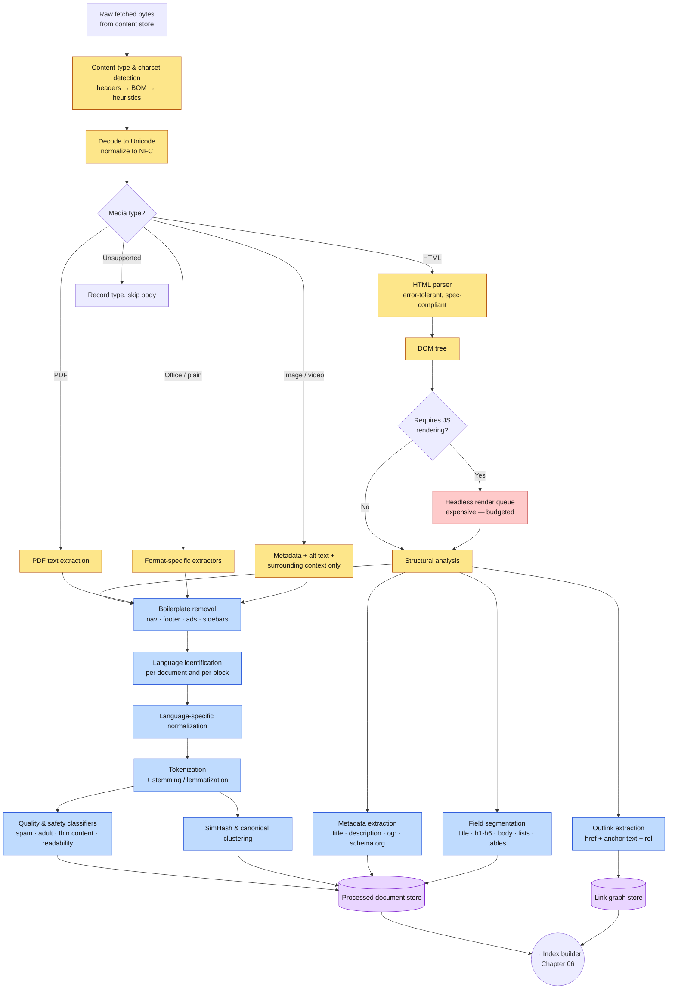
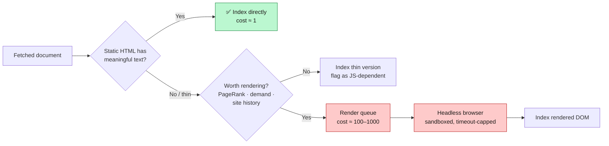
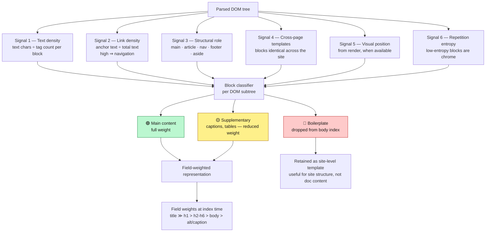
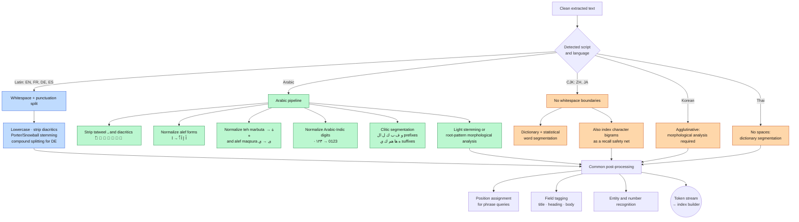
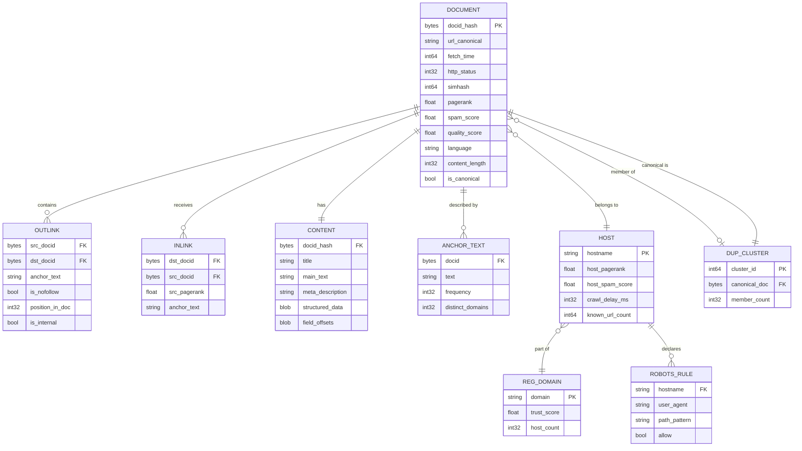
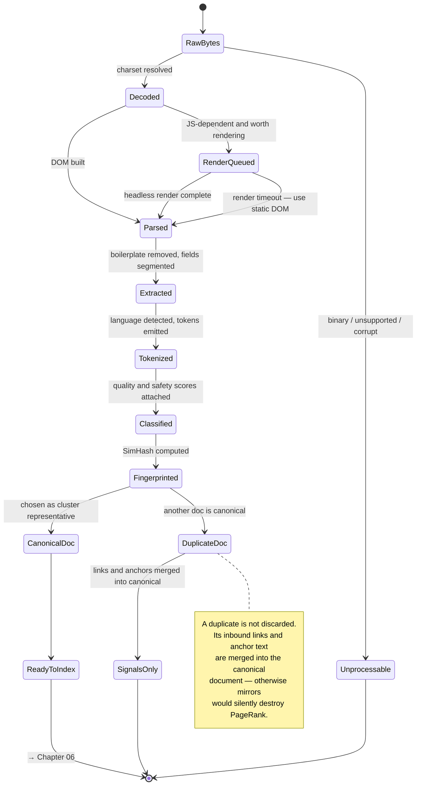

**[🇸🇦 اقرأ بالعربية](../ar/05-content-processing.md)**

# Chapter 05 · Content Processing

**← [04 · Crawling](04-crawling.md)** · [🏠 Home](../../README.md) · **[06 · Indexing](06-indexing.md) →**

---

## 5.1 From bytes to indexable signal

The crawler hands over compressed HTML. The indexer needs clean tokens, per-document features, and a link graph. Everything in between is content processing — the least glamorous and most quality-determining stage in the pipeline.

Its importance is easy to underrate. **A ranking model can only rank what the processor extracted.** If boilerplate stripping keeps the navigation menu, every page on a site looks identical for its nav terms. If language detection is wrong, the wrong tokenizer runs and the document becomes unfindable. Errors here are silent, systematic, and invisible to A/B tests that only measure the ranking layer.

> **Diagram D-21 — Content processing pipeline**

---

## 5.2 Parsing HTML you did not write

Real-world HTML is broken. Unclosed tags, mismatched nesting, invalid character references, and 40 MB of inline JSON are all normal. The parser must be **error-tolerant in exactly the way browsers are** — because if your parser reads a document differently from Chrome, you index something the user will never see.

| Hazard | Handling |
|---|---|
| Malformed / unclosed tags | HTML5-spec-compliant recovery, identical to browser behaviour |
| Wrong or missing charset | Header → BOM → `<meta charset>` → statistical detection, in that order |
| Enormous documents | Hard cap (e.g. 10 MB parsed); truncate, do not fail |
| Deeply nested DOM | Depth cap; malformed nesting is a spam signal |
| Content injected by JavaScript | Route to a rendering queue — but only for a budgeted subset |
| `<noscript>` / hidden text | Extract but flag; hidden text is a classic spam vector |
| Frames and iframes | Follow as separate documents, not as inline content |

### The JavaScript rendering problem

A large share of the modern web renders its main content client-side. Fetching the HTML gives you an empty `
`. To index it you must run a headless browser: execute JavaScript, wait for network idle, then serialise the DOM.

This costs **100× to 1000× more CPU than parsing static HTML** and introduces unbounded latency and security exposure. So rendering is *rationed*:

This is why JavaScript-heavy sites are indexed later and less completely than server-rendered ones. It is not a policy preference; it is a queueing consequence of a 1000× cost ratio.

---

## 5.3 Boilerplate removal — finding the actual content

An average web page is mostly *not* its content. Navigation, headers, footers, sidebars, cookie banners, related-article widgets and advertising can be 80 % of the tokens. Indexing them causes two concrete failures:

1. **Every page on a site looks the same** for the terms in its shared chrome, destroying intra-site discrimination.
2. **Ranking signals are diluted** — term frequencies are dominated by template text rather than subject matter.

> **Diagram D-22 — Main-content extraction**

**Signal 4 is the most powerful and the most often forgotten.** If you have crawled 10,000 pages from one host, the blocks that are byte-identical across all of them are, by definition, template. Cross-page differencing beats any per-page heuristic — but it only works because you crawl whole sites, not isolated pages. It is a good example of a capability that emerges from scale rather than from cleverness.

---

## 5.4 Language identification and normalisation

You cannot tokenize before you know the language, and you cannot detect the language reliably from a domain suffix. Detection runs on the extracted text, per document *and* per block, because multilingual pages are common.

| Method | Strength | Weakness |
|---|---|---|
| Character n-gram profiles | Fast, tiny, works on short text | Confuses closely related languages |
| Unicode script detection | Instant for Arabic, CJK, Cyrillic, Greek | Useless for Latin-script languages |
| Stopword frequency | Cheap and interpretable | Needs reasonably long text |
| Neural classifiers | Best accuracy, handles code-switching | Higher CPU cost per document |
| HTML `lang` attribute | Free | Frequently wrong or copy-pasted |

The practical stack: **script detection first** (it resolves Arabic, Chinese, Japanese, Korean, Cyrillic, Greek, Hebrew, Thai in one pass at near-zero cost), then n-grams for Latin-script disambiguation, then a neural model only for short or ambiguous text.

---

## 5.5 Tokenization is language-specific — a worked comparison

This is where a genuinely global search engine gets hard, and where a bilingual document like this one can be most useful.

> **Diagram D-23 — Language-specific tokenization paths**

### Why Arabic is genuinely harder than English

| Property | Consequence for retrieval |
|---|---|
| **Optional diacritics** | `كتب` may be *kataba* (he wrote), *kutub* (books), or *kutiba* (it was written). The written form is identical; the index must either normalise away diacritics entirely or handle several readings. |
| **Root-and-pattern morphology** | One triliteral root ك-ت-ب generates كتاب، كاتب، مكتبة، مكتوب، كتابة. Suffix-stripping stemmers (Porter-style) fail; you need either light stemming or a real morphological analyser. |
| **Agglutinative clitics** | `وبالمكتبة` = و + ب + ال + مكتبة ("and at the library") is one orthographic token containing four morphemes. Without clitic segmentation, the query مكتبة will not match it. |
| **Orthographic variation** | أحمد / احمد, مكتبة / مكتبه — writers are inconsistent. Normalisation must collapse these, at the cost of some precision. |
| **Bidirectional text** | Mixed Arabic-Latin content requires correct handling of Unicode bidi control characters, which are also a cloaking vector. |
| **Arabic-Indic digits** | ٢٠٢٦ and 2026 mean the same thing and must be unified. |

**The design tension:** aggressive normalisation raises *recall* (many spellings match one index term) and lowers *precision* (distinct words collapse together). Production systems usually normalise aggressively at index time and then recover precision at ranking time, by keeping the original surface form as a feature and boosting exact matches. This is a general principle worth remembering: **be permissive during retrieval, be strict during ranking.**

---

## 5.6 The link graph

Outlinks are extracted during parsing and accumulated into a global graph — arguably the single most valuable derived asset in the whole system, since it powers PageRank, anchor-text indexing, spam detection and crawl prioritisation simultaneously.

> **Diagram D-24 — Link graph and derived document data model**

### Anchor text — describing a page in other people's words

The text inside a link (`<a href="...">click here for the tutorial</a>`) is a description of the *target* page written by a third party. This is extraordinarily valuable:

- It describes pages in the **vocabulary users actually search with**, not the vocabulary the page author chose.
- It works for documents whose own text is unindexable — images, videos, PDFs, JavaScript apps.
- It aggregates many independent opinions about what a page is about.

It is also the **single most abused signal on the web**, because anyone can write a link to your page saying anything. Defences: cap contribution per source domain, weight by the source's own trust score, discount `rel="nofollow"` / `rel="ugc"` / `rel="sponsored"`, and require diversity across distinct registrable domains before a phrase counts. See [Chapter 14](14-security-abuse.md).

---

## 5.7 Quality classification

Not every fetched document deserves an index entry. Cheap classifiers run at processing time and attach scores used later for tiering, ranking and filtering.

| Classifier | Detects | Used for |
|---|---|---|
| **Spam** | Keyword stuffing, hidden text, cloaking, link schemes | Demotion or exclusion |
| **Thin content** | Auto-generated, scraped, near-empty pages | Tier assignment, demotion |
| **Adult / sensitive** | NSFW material | SafeSearch filtering |
| **Readability** | Text complexity and coherence | Snippet quality, tiering |
| **Machine translation** | Low-quality bulk-translated pages | Demotion |
| **Page structure quality** | Ad-to-content ratio, layout stability | Page-experience signals |
| **Topical classification** | Subject area | Vertical routing, freshness policy |

**Order matters for cost.** These run *before* index construction so that documents scoring badly enough are never indexed at all — saving index bytes, which [Chapter 03](03-capacity-estimation.md) showed is the dominant cost in the system.

---

## 5.8 The processed-document contract

> **Diagram D-25 — Document state through processing**

The output contract consumed by the index builder:

| Field | Purpose |
|---|---|
| `docid` | Stable 64-bit id, assigned by hash of canonical URL |
| `tokens[]` | Token, field tag, position — the raw material of the inverted index |
| `title`, `meta` | Displayed on the SERP, weighted heavily in ranking |
| `main_text` | Boilerplate-stripped body, kept for snippet generation |
| `language`, `locale` | Routing and matching |
| `outlinks[]`, `anchors[]` | Link graph contribution |
| `simhash`, `cluster_id` | Deduplication |
| `quality_scores{}` | Spam, thin, adult, readability |
| `structured_data` | schema.org / JSON-LD for rich results |
| `last_modified`, `change_rate` | Freshness scheduling |

---

**← [04 · Crawling](04-crawling.md)** · [🏠 Home](../../README.md) · **[06 · Indexing](06-indexing.md) →** · [🇸🇦 العربية](../ar/05-content-processing.md)

