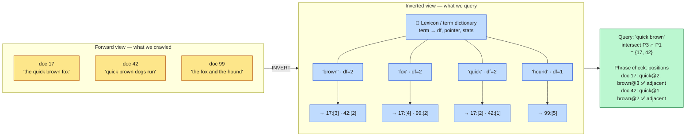
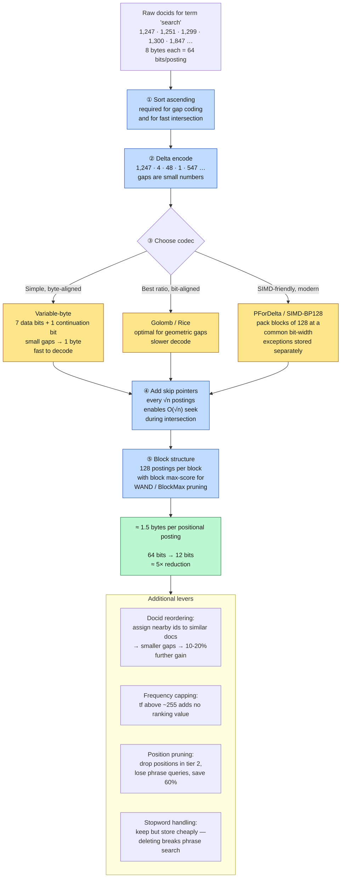
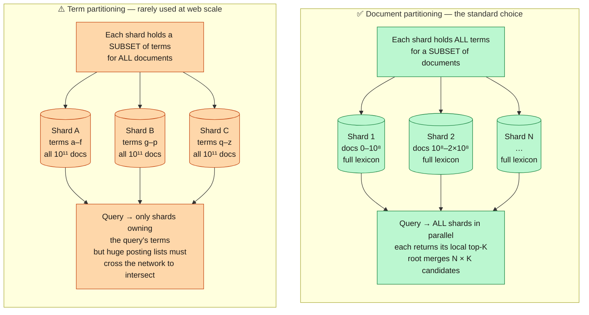
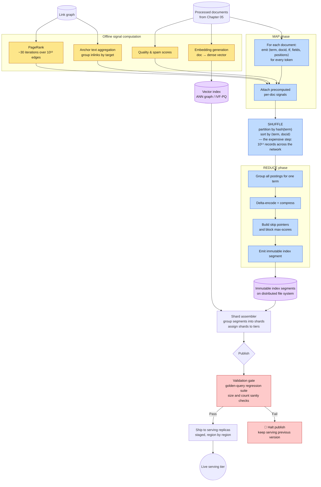
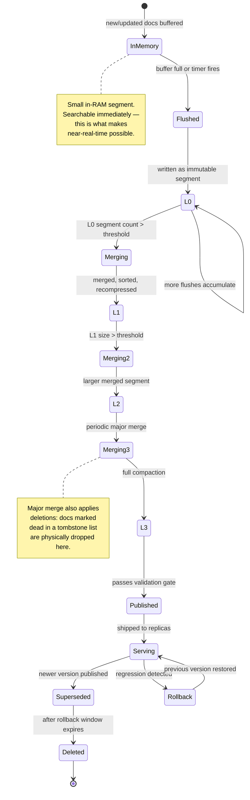
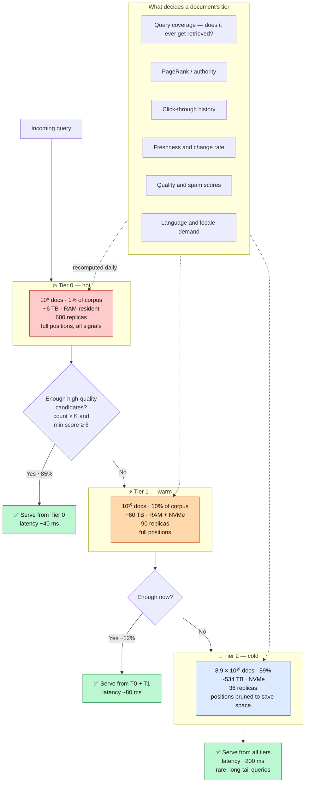
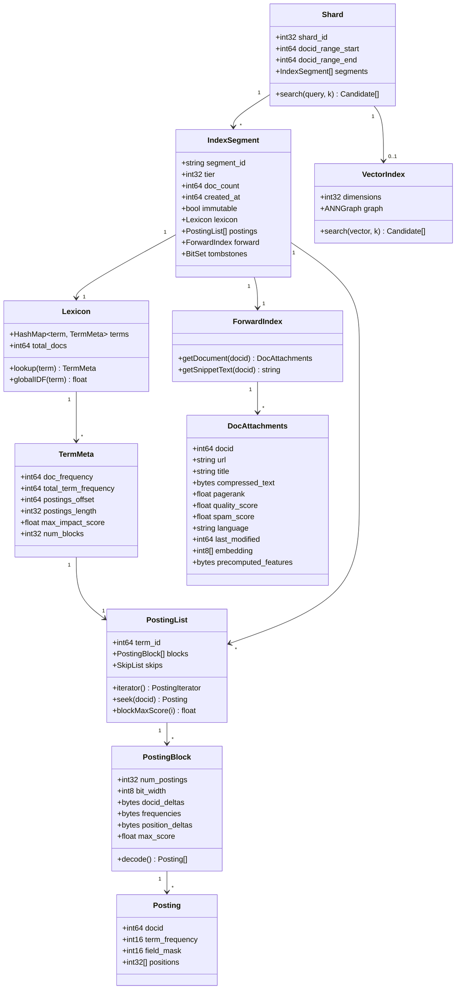

<div align="right">

**[🇸🇦 اقرأ بالعربية](../ar/06-indexing.md)**

</div>

# Chapter 06 · Indexing & the Inverted Index

**← [05 · Content Processing](05-content-processing.md)** · [🏠 Home](../../README.md) · **[07 · Serving](07-serving.md) →**

---

## 6.1 The one data structure that makes search possible

Everything in [Chapter 01](01-overview.md) reduced to a single idea: **do not scan documents, scan a term-keyed structure**. That structure is the inverted index, and it is the reason a query over 10¹¹ documents can finish in 40 milliseconds.

> **Diagram D-26 — Anatomy of the inverted index**



### The three components

| Component | Contents | Size (from [Ch 03](03-capacity-estimation.md)) |
|---|---|---:|
| **Lexicon** | Every distinct term → document frequency, pointer into postings, global statistics | ~40 GB |
| **Postings** | For each term, the sorted list of documents containing it, with frequencies and positions | ~225 TB |
| **Forward index / attachments** | Per-document data needed *after* retrieval: text for snippets, precomputed features, vectors | ~350 TB |

The lexicon is small enough to keep entirely in RAM on every leaf server. The postings are the bulk. The forward index is only consulted for the few documents that survive ranking — which is why it can live on slower storage.

### What a posting actually contains

```
posting = ⟨ docid_delta, term_frequency, field_mask, position_deltas[] ⟩

  docid_delta      gap from the previous docid in this list  (variable-byte)
  term_frequency   occurrences of this term in this document
  field_mask       bitmask: title | h1 | body | anchor | alt | url
  position_deltas  gaps between successive positions          (variable-byte)
```

The `field_mask` is disproportionately valuable: it lets the scorer know *where* a term appeared without touching the document, so a title match can be weighted far above a body match during the cheap L1 scoring pass.

---

## 6.2 Compression — where the money is

[Chapter 03](03-capacity-estimation.md) established that RAM is the dominant cost in the system. Index compression is therefore not an optimisation; it is the economics of the product. Every 10 % reduction in index size is roughly a 10 % reduction in the serving fleet.

> **Diagram D-27 — Posting list compression pipeline**



**On stopwords.** The classic textbook advice is to delete `the`, `a`, `of` from the index because they appear in nearly every document. Modern web search does *not* do this, because it breaks phrase and quoted queries — `"to be or not to be"` becomes unanswerable. Instead the high-frequency terms are kept but stored in cheaper structures, and query processing simply avoids leading with them.

**Docid reordering** deserves emphasis because it is nearly free. If document IDs are assigned so that similar documents (same host, same topic, near-duplicate cluster) receive numerically adjacent IDs, then the gaps within each posting list become smaller, and smaller gaps compress better. Sorting documents by URL before assigning IDs — so all pages of one site are contiguous — typically yields a further 10–20 % size reduction for essentially zero engineering cost.

---

## 6.3 Sharding: the decision that defines the serving architecture

An index of 600 TB cannot live on one machine. How you split it determines everything about the query path.

> **Diagram D-28 — Document partitioning vs term partitioning**



| Property | Document partitioning | Term partitioning |
|---|---|---|
| Servers contacted per query | **All** (high fan-out) | Only those owning query terms (low fan-out) |
| Network volume per query | Small — top-K results only | **Huge** — full posting lists must be shipped to intersect |
| Load balance | Even — every shard does similar work | **Terrible** — "the" shard is melted, "xylophone" shard idles |
| Adding documents | Trivial — write to any shard, or add a shard | Requires touching many shards |
| Failure of one shard | Lose a slice of the corpus, results degrade gracefully | Lose entire terms — some queries become unanswerable |
| Ranking quality | Global stats (IDF) need a small side-channel | Global stats are local and exact |
| Scoring locality | **Excellent** — all data for a doc is co-located | Poor — a document's terms are spread across shards |

**Document partitioning wins decisively**, and the deciding factor is the third row. Term frequencies on the web follow a Zipf distribution, so a term-partitioned index has a permanent, unfixable hot-spotting problem. Document partitioning gives every shard statistically identical work.

The cost you accept is total fan-out: every query touches every shard, which creates the tail-latency problem that [Chapter 07](07-serving.md) and [Chapter 12](12-reliability.md) spend their entire budgets mitigating. That is a good trade — tail latency is *manageable* with hedging and timeouts, whereas Zipf hot-spotting is not manageable at all.

### One global statistic must be shared

Document partitioning has one genuine flaw: **IDF (inverse document frequency) is a global quantity**, but each shard only sees its own documents. If shards computed IDF locally, the same term would be scored differently on different shards and the merged ranking would be incoherent.

The fix is cheap: periodically compute global `df` for every term in a batch job and broadcast a compact table (~40 GB — the lexicon) to every leaf. IDF changes slowly, so an hourly or daily refresh is more than adequate.

---

## 6.4 Building the index

> **Diagram D-29 — Index construction pipeline**



**The shuffle is the whole cost of index building.** Map and reduce are embarrassingly parallel and cheap. Moving 10¹⁴ ⟨term, docid⟩ records across the network so that all postings for one term land on one reducer is what takes the hours. This is precisely the workload MapReduce was designed for, and it is not a coincidence that the paper came out of a search company.

**The validation gate is not optional.** Publishing a broken index to the serving tier is one of the few genuinely catastrophic failure modes in the system — it degrades results globally, and the corpus is too large to inspect by hand. A fixed suite of golden queries with known-good results runs against every candidate index, and any regression halts the publish while the previous version keeps serving.

---

## 6.5 Segments, merging and immutability

Index segments are **immutable once written**. Updates never modify a segment; they create new ones. This is the log-structured merge (LSM) discipline, and it buys several properties at once:

- Readers need no locks — a segment being read can never change underneath them.
- Writes are sequential appends, which is the only access pattern that is fast on every storage medium.
- Replication is trivial: an immutable file can be copied anywhere and cached forever.
- Rollback is trivial: keep the previous segment set and switch a pointer.

The cost is **read amplification** — a query must consult every live segment — and this is what merging repays.

> **Diagram D-30 — Segment lifecycle and tiered merging**



**Deletions are tombstones, not edits.** Removing a document writes a marker into a delete list; the document keeps occupying index space until the next major merge physically drops it. Queries filter tombstoned docids at read time. This is the only way to handle deletion in an immutable structure, and it means "delete" has a latency of *seconds* (filtered from results) but "reclaim the space" has a latency of *hours* (next merge). For legal removals, the first latency is what matters — and it is satisfied.

---

## 6.6 Index tiering

[Chapter 03](03-capacity-estimation.md) showed tiering is worth roughly two orders of magnitude of fleet cost. Here is the mechanism.

> **Diagram D-31 — Tiered index and fallthrough**



**Tiering is a bet, and the bet has a cost.** The fallthrough condition (`count ≥ K and min score ≥ θ`) is a heuristic. When it fires incorrectly, the system serves a Tier-0-only result set for a query whose best answer was in Tier 2 — a silent relevance failure that no latency metric will reveal. Tuning θ is a direct trade of cost against quality on rare queries, and it must be monitored with the human-rated quality metrics from [Chapter 02](02-requirements.md), never with latency or CTR alone.

---

## 6.7 The complete index data model

> **Diagram D-32 — Index structures**



---

## 6.8 Query-time index traversal

Knowing the structure, here is how a leaf server actually uses it — and the optimisation that makes it fast.

**Naïve intersection** of two posting lists walks both fully: O(len(A) + len(B)). For a term like "the" that is 10¹⁰ postings. Unacceptable.

**Skip-pointer intersection** walks the shorter list and *seeks* in the longer one, using skip pointers to jump: O(len(shorter) × log). Much better.

**WAND / BlockMax-WAND** goes further and is what production systems use. Each block stores its maximum possible contribution to the score. During traversal the engine tracks the current *k*-th best score; any block whose maximum possible score cannot beat it is **skipped entirely without decompression**.

```
threshold θ ← score of current k-th best candidate

for each candidate block:
    upper_bound ← Σ blockMaxScore(term) over query terms
    if upper_bound ≤ θ:
        skip the whole block          ← no decompression, no scoring
    else:
        decode block, score documents, update θ
```

In practice this skips **80–95 %** of postings for a typical multi-term query, and it is exact — the top-k returned is identical to the result of full evaluation. It is a rare case of a large speedup with no quality cost, which is why block max-scores are stored at build time (see Diagram D-27, step ⑤).

---

## 6.9 Trade-offs recorded

| Decision | Chosen | Rejected | Why |
|---|---|---|---|
| Partitioning | By document | By term | Zipf hot-spotting is unfixable |
| Mutability | Immutable segments + merge | In-place updates | Lock-free reads, trivial replication and rollback |
| Compression | PForDelta/SIMD blocks | Golomb-Rice | Decode speed beats a few % of ratio when RAM-resident |
| Positions | Kept in tiers 0–1, pruned in tier 2 | Kept everywhere | Phrase queries are rare on tail documents |
| Stopwords | Kept, stored cheaply | Removed | Removal breaks quoted-phrase queries |
| Deletion | Tombstones + lazy merge | Immediate rewrite | Immutability is worth more than prompt space reclamation |
| Tiering | 3 tiers by query coverage | Flat index | ~100× fleet cost reduction |
| Docid assignment | Sorted by URL | Random | 10–20 % free compression gain |

---

<div align="center">

**← [05 · Content Processing](05-content-processing.md)** · [🏠 Home](../../README.md) · **[07 · Serving](07-serving.md) →** · [🇸🇦 العربية](../ar/06-indexing.md)

</div>
