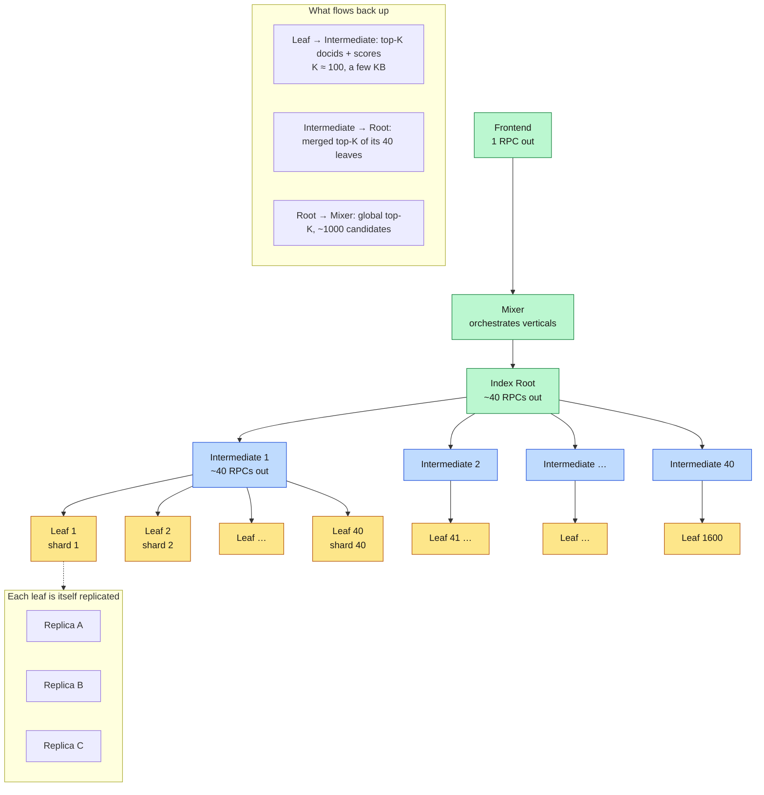
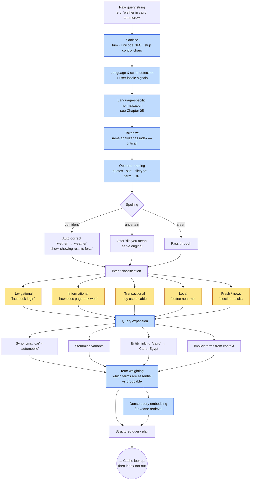
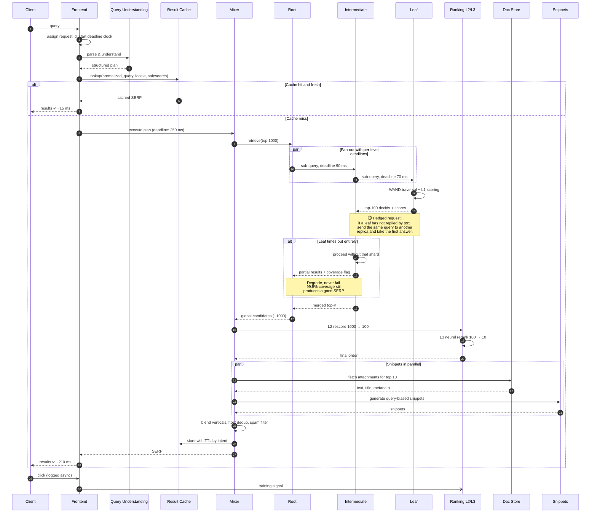
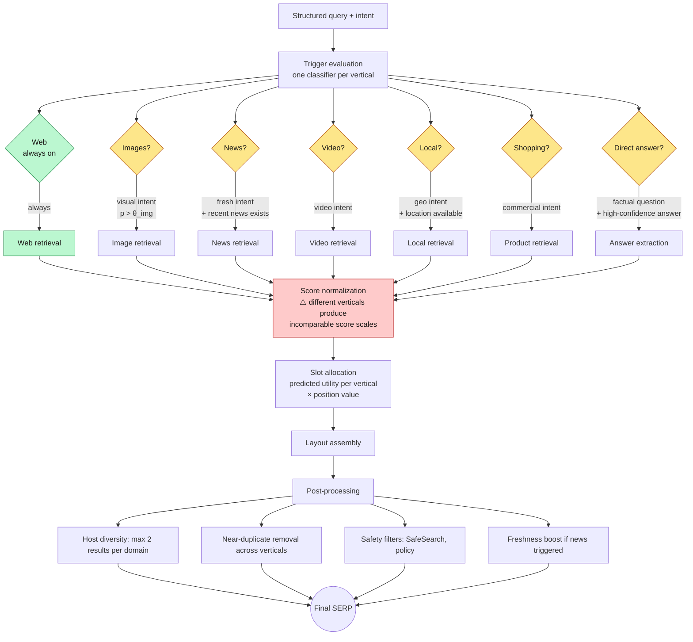
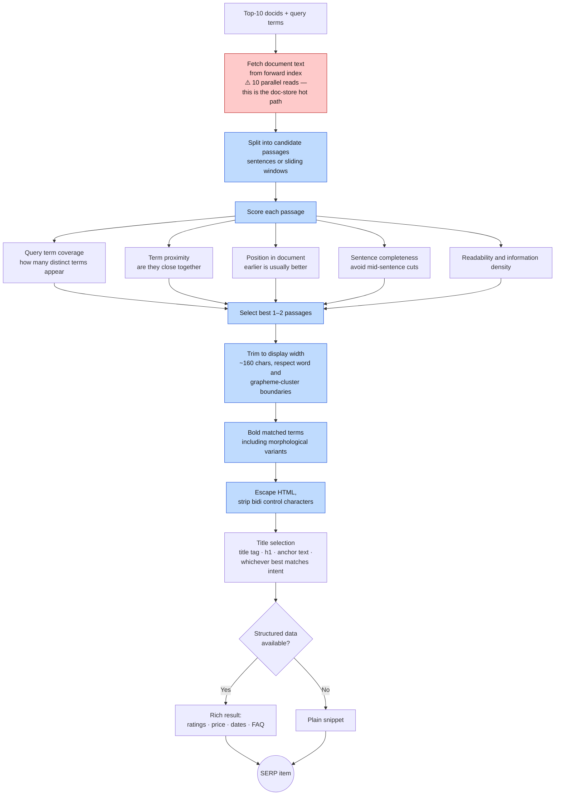

<div align="right">

**[🇸🇦 اقرأ بالعربية](../ar/07-serving.md)**

</div>

# Chapter 07 · The Query Serving Path

**← [06 · Indexing](06-indexing.md)** · [🏠 Home](../../README.md) · **[08 · Ranking](08-ranking.md) →**

---

## 7.1 The serving topology

Document partitioning ([Chapter 06](06-indexing.md)) means every query must reach every shard. With thousands of shards, a single root talking directly to all of them would need thousands of outbound RPCs per query — the root becomes a fan-out bottleneck and its own tail-latency amplifier.

The answer is a **tree**.

> **Diagram D-33 — Root, intermediate and leaf serving tree**



**Why a tree and not a flat fan-out?**

| Property | Flat (root → 1,600 leaves) | Tree (root → 40 → 1,600) |
|---|---|---|
| RPCs from the root | 1,600 | 40 |
| Merge work at the root | 1,600 × K results | 40 × K results |
| Root CPU | Bottleneck | Modest |
| Tail exposure at root | max of 1,600 latencies | max of 40 latencies (each already hedged below) |
| Extra hop latency | 0 | ~0.5 ms |

The tree costs one extra network hop (~0.5 ms out of a 300 ms budget) and buys a 40× reduction in fan-out at every level. Each intermediate absorbs the tail of its own 40 leaves locally, so a single slow leaf perturbs one subtree rather than the whole query.

---

## 7.2 Query understanding

Before any index is touched, the raw string must become a structured query. This stage is cheap in milliseconds and enormously expensive in relevance if done badly.

> **Diagram D-34 — Query understanding pipeline**



### The single most important rule in this chapter

> **The query analyzer and the index analyzer must be the same code.**

If the index lowercased and stemmed but the query path did not, `Running` will never match the indexed token `run`. This class of bug is silent — no error is thrown, results are merely and permanently worse. Every mature search system shares one analyzer implementation between build and serve, and treats any divergence as a build-breaking error.

### Intent shapes everything downstream

| Intent | Retrieval emphasis | Freshness weight | Result presentation |
|---|---|---|---|
| Navigational | One exact target; precision@1 is all that matters | Low | Single dominant result, sitelinks |
| Informational | Broad recall, diverse sources | Medium | Ten blue links, possibly a featured snippet |
| Transactional | Product corpus, availability, price | Medium | Shopping unit, reviews |
| Local | Geo-filtered corpus | High | Map pack, hours, distance |
| Fresh / news | Recency dominates authority | **Very high** | Top stories carousel, timestamps |

A ranking function tuned for informational queries will do badly on navigational ones (it will spread probability across many "relevant" pages when the user wanted exactly one). This is why intent classification precedes ranking rather than being folded into it.

---

## 7.3 The full serving sequence, with tail-latency defences

> **Diagram D-35 — Serving path including hedging and degradation**



### The three tail-latency defences

From [Chapter 02](02-requirements.md): with 1,600 leaves and a 1 % chance each is slow, ~99.99 % of queries touch at least one slow server. Three techniques, all from Dean & Barroso's *The Tail at Scale*, keep that from becoming user-visible.

| Technique | Mechanism | Cost |
|---|---|---|
| **Hedged requests** | After waiting for the p95 latency, send a duplicate to another replica; use whichever returns first | ~5 % extra load |
| **Tied requests** | Send to two replicas immediately; each cancels the other's queued copy when it starts executing | Slightly more messaging, near-zero wasted work |
| **Deadline propagation** | Every hop passes down its remaining budget; a leaf that cannot finish in time returns partial results rather than blowing the budget | Free — just plumbing |

Plus the architectural defence: **coverage degradation**. If a shard does not answer, the query proceeds without it and the response is annotated with the coverage fraction. Serving 99.5 % of the corpus in 200 ms is a far better product than serving 100 % in 3 seconds — and the alternative, returning an error, is the worst outcome of all.

---

## 7.4 Where the milliseconds go

> **Diagram D-36 — Latency budget timeline (cache miss, p99 path)**

```mermaid
gantt
    title Query latency budget — cache miss (units: milliseconds)
    dateFormat X
    axisFormat %s

    section Network
    Client to edge (TLS resumed)      :net1, 0, 20
    Edge to serving cell              :net2, 20, 25

    section Frontend
    Request setup and routing         :fe1, 25, 33
    Query understanding               :qu1, 33, 53
    Cache lookup (miss)               :ca1, 53, 55

    section Retrieval
    Root to intermediate to leaf      :rt1, 55, 58
    Leaf WAND traversal and L1 score  :lf1, 58, 98
    Merge up the tree                 :mg1, 98, 105

    section Ranking
    L2 rescore 1000 to 100            :l2, 105, 135
    L3 neural rerank 100 to 10        :l3, 135, 185

    section Assembly
    Doc store fetch (parallel)        :ds1, 185, 205
    Snippet generation                :sn1, 205, 215
    Blend, dedupe, serialize          :bl1, 215, 230

    section Return
    Response to client                :ret, 230, 250
    Tail headroom to p99 SLO          :crit, head, 250, 300
```



Read this as a budget you are *spending*. Two structural facts fall out of it:

1. **Retrieval and ranking together are ~50 % of the budget** (55 ms → 185 ms). Everything else is overhead you minimise so that this half can be as good as possible.
2. **The 50 ms of headroom at the end is not slack — it is the tail.** p50 finishes near 210 ms; p99 uses the headroom. Spending it on features means missing the SLO for 1 % of queries.

---

## 7.5 Universal search — blending the verticals

Modern SERPs are not one ranked list. They interleave web results with images, news, video, maps, shopping and direct answers. Each vertical is a separate retrieval system with its own index and ranking, and the mixer must decide *which* to show, *where*, and *how much space* each gets.

> **Diagram D-37 — Vertical triggering and blending**



**The hard part is score normalisation.** A web result's score and an image result's score come from different models trained on different objectives; they are not on a common scale, so you cannot simply sort them together. The standard solution is to convert each vertical's score into a **predicted utility** — an estimate of the probability the user is satisfied by that item — calibrated on held-out human judgements. Only calibrated probabilities are comparable across verticals.

**Triggering too eagerly is the classic failure.** Showing a news carousel for a query with no news intent pushes the actually-relevant web result below the fold. Vertical triggers are therefore tuned conservatively: the bar for *adding* a vertical is higher than the bar for a web result to keep its slot.

---

## 7.6 Snippet generation

The snippet is what the user actually reads. It is generated per query, not stored, because the useful passage depends on what was asked.

> **Diagram D-38 — Query-biased snippet generation**



Two notes that matter more than they look:

- **Snippet generation is a document-store read amplifier.** Every uncached query performs ~10 random reads against a petabyte-scale store, in the latency-critical path. This is why the forward index is co-located with the leaf serving tier where possible, and why snippet caching is a separate cache layer in [Chapter 10](10-caching.md).
- **Bidi control characters must be stripped.** In a bilingual context this is not cosmetic: Unicode direction-override characters can make displayed text read differently from its actual content — a genuine SERP-spoofing vector. Sanitising them is a security control, not a formatting nicety.

---

## 7.7 What the leaf server actually does

For completeness, the innermost loop:

```
function leafSearch(query, k, deadline):
    candidates ← empty top-k heap
    θ ← −∞                                   # k-th best score so far

    postings ← [openPostingList(t) for t in query.terms]
    sort postings by document frequency ascending    # rarest term drives

    while not exhausted and now() < deadline:
        # BlockMax-WAND pruning (Chapter 06 §6.8)
        if Σ blockMaxScore(p) for p in postings ≤ θ:
            skipBlock(postings)
            continue

        d ← nextCommonDocid(postings)
        if d is null: break

        if isTombstoned(d) or failsFilters(d, query):
            continue

        score ← L1Score(d, query)            # cheap: BM25-ish + static signals
        if score > θ:
            candidates.push(d, score)
            if candidates.size > k:
                candidates.pop()
                θ ← candidates.min()

    return candidates, exhausted ? COMPLETE : PARTIAL
```

Three properties of this loop define the system's character:

1. **It is deadline-aware.** The loop checks the clock and returns what it has. A leaf never blows the budget; it returns a partial answer flagged as such.
2. **L1 scoring is deliberately cheap.** BM25-style term scoring plus precomputed static signals — no model inference, no document fetch. Expensive scoring happens later, on far fewer documents.
3. **Pruning is exact.** BlockMax-WAND skips work without changing the top-k. The cheap path and the correct path are the same path.

---

<div align="center">

**← [06 · Indexing](06-indexing.md)** · [🏠 Home](../../README.md) · **[08 · Ranking](08-ranking.md) →** · [🇸🇦 العربية](../ar/07-serving.md)

</div>
