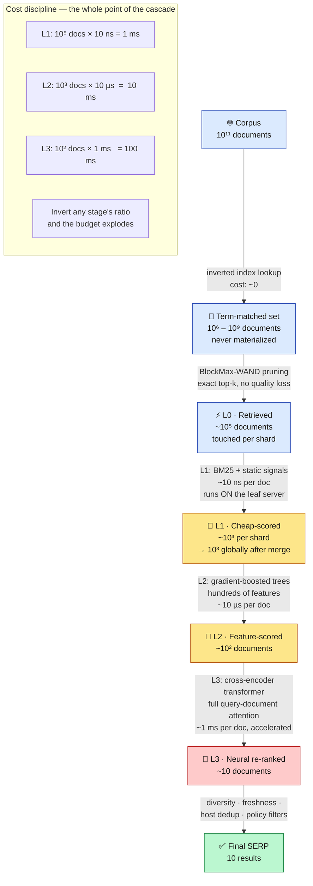
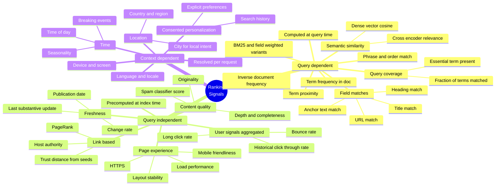
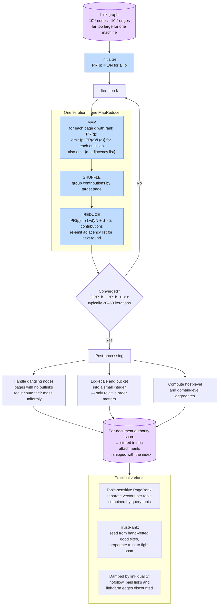
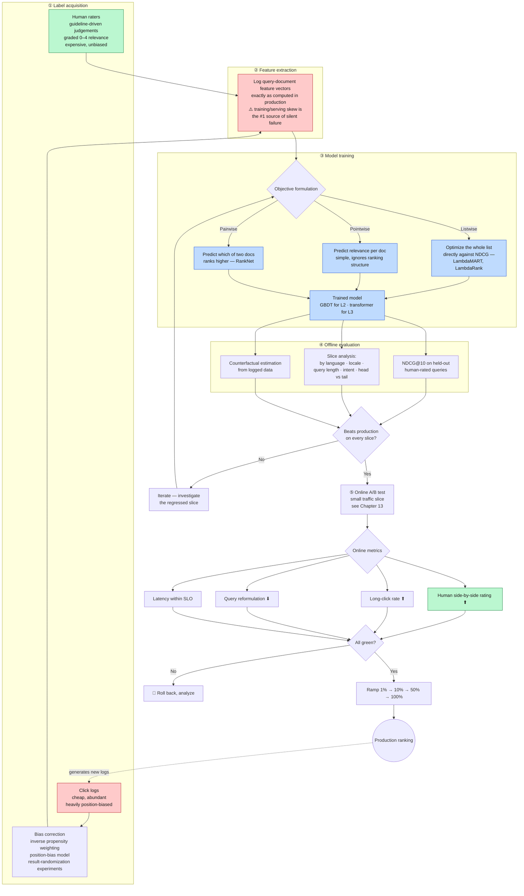
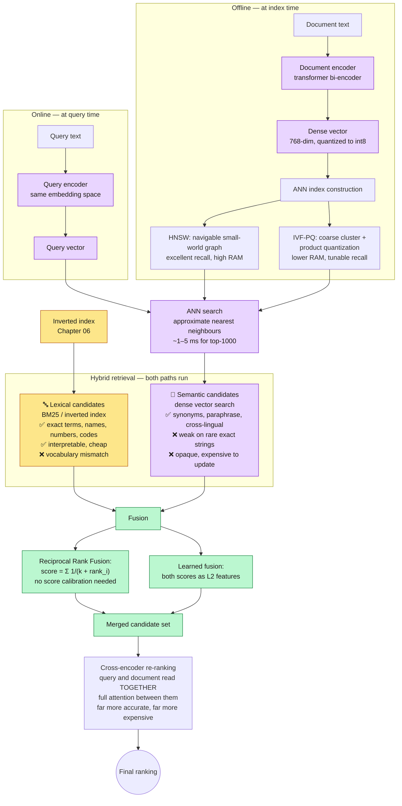
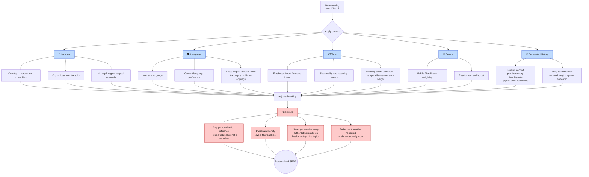
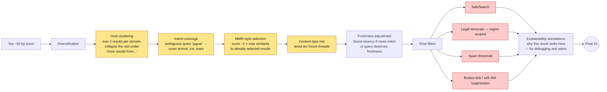

**[🇸🇦 اقرأ بالعربية](../ar/08-ranking.md)**

# Chapter 08 · Ranking & Relevance

**← [07 · Serving](07-serving.md)** · [🏠 Home](../../README.md) · **[09 · Storage](09-storage.md) →**

---

## 8.1 Ranking is the product

Everything in Chapters 04–07 exists to deliver a few hundred plausible candidates to this chapter. Retrieval is an engineering problem with correct answers. **Ranking is a judgement problem with no ground truth** — which documents are "best" for `jaguar` depends on who is asking, when, and why.

The architectural consequence is the **cascade**: apply cheap scoring to many documents and expensive scoring to few, so that total cost stays inside the latency budget while the final ordering gets the benefit of the most powerful model you can afford.

> **Diagram D-39 — The retrieval and ranking funnel**

**Read the budget box carefully — it is the core insight.** L3 is 100,000× more expensive per document than L1. Running L3 on 10⁵ documents would take 100 seconds. The funnel is not an optimisation layered on top of ranking; the funnel *is* how expensive ranking becomes possible at all.

The corresponding risk: **a document wrongly dropped at L1 can never be recovered by L3.** Recall errors early in the cascade are permanent. This is why L1 is deliberately generous — it optimises recall, not precision, and leaves precision to the stages that can afford it.

---

## 8.2 The signal taxonomy

> **Diagram D-40 — Where ranking signals come from**

The split matters operationally:

| Class | Computed | Storage cost | Latency cost |
|---|---|---|---|
| Query-independent | Offline, at index time | High — stored per document | ~0 at query time |
| Query-dependent | At query time, in the leaf | ~0 | The dominant serving cost |
| Context-dependent | At query time, from request | ~0 | Low, but multiplies cache keys |

**Push everything you can into the query-independent column.** That is the recurring principle from [Chapter 01](01-overview.md) — do the expensive work offline. The query path should *combine* precomputed numbers, not compute them.

---

## 8.3 PageRank — the query-independent authority signal

PageRank models a random surfer who follows links at random and occasionally jumps to a random page. The stationary probability of being at page *p* is its PageRank.

$$PR(p) = \frac{1-d}{N} + d \sum_{q \in In(p)} \frac{PR(q)}{L(q)}$$

where *d* ≈ 0.85 is the damping factor, *N* is the number of pages, *In(p)* is the set of pages linking to *p*, and *L(q)* is the outdegree of *q*.

> **Diagram D-41 — PageRank computation at scale**

**Two honest caveats.**

First, **PageRank is one signal among hundreds**, and its relative weight has fallen enormously since 1998. Treating it as "the Google algorithm" is a common and significant error. It provides a query-independent prior on authority; it says nothing about whether a page answers the question.

Second, **dangling nodes are not a footnote.** A large fraction of the web has no outlinks (PDFs, images, leaf pages). Without redistributing their rank mass, probability leaks out of the system every iteration and the computation does not converge to a proper distribution. Handling them correctly is a real implementation requirement, not a theoretical nicety.

---

## 8.4 Learning to rank

Hand-tuning hundreds of feature weights is impossible. Ranking is learned from labelled data.

> **Diagram D-42 — Learning-to-rank training and deployment loop**

### Why listwise objectives win

Ranking quality is measured by NDCG, which is a property of the *whole list*, not of individual documents. A pointwise model that predicts each document's relevance perfectly in isolation can still produce a poor list, because it has no notion that swapping positions 1 and 2 matters far more than swapping positions 9 and 10. LambdaMART works by directly weighting each training pair by *how much NDCG would change* if those two documents swapped — which aligns the gradient with the metric you actually care about.

### The two failure modes that actually bite

**Position bias.** Users click result #1 far more than result #5, regardless of relevance. A model trained naïvely on clicks learns "documents that were ranked first are good", which is circular: it entrenches the current ranking and can never discover that #7 was better. The fixes — inverse propensity weighting, and deliberately randomising results for a small traffic slice to collect unbiased data — are mandatory, not optional refinements.

**Training/serving skew.** If a feature is computed one way in the training pipeline and slightly differently in the serving binary, the model receives inputs it was never trained on. This produces no error and no alert; quality simply degrades. The only reliable defence is to **log features from production serving and train on exactly those logged vectors**, never recomputing them in the training pipeline.

---

## 8.5 Neural retrieval — beyond term matching

Lexical retrieval fails on the **vocabulary mismatch problem**: a document about "automobile maintenance" does not match a query for "car repair" even though it is exactly what the user wants. Dense retrieval solves this by mapping both queries and documents into a shared semantic vector space.

> **Diagram D-43 — Dense retrieval and hybrid fusion**

### Bi-encoder vs cross-encoder — why both exist

| | **Bi-encoder** (retrieval) | **Cross-encoder** (re-ranking) |
|---|---|---|
| Structure | Encode query and document *separately* | Encode query and document *together* |
| Document vectors | Precomputed offline, stored in the index | Must be computed per query-document pair |
| Cost at query time | One query encoding + ANN search | One full transformer pass **per document** |
| Accuracy | Good | Substantially better |
| Feasible over | 10¹¹ documents | ~10² documents |

This is exactly why the cascade exists. The bi-encoder can pre-compute document vectors because it never looks at the query while encoding — so retrieval over billions is possible. The cross-encoder is more accurate precisely *because* it reads both together, which is also why it can never be precomputed. Cheap-and-parallel retrieves; expensive-and-accurate re-ranks.

### When lexical retrieval still wins

Dense retrieval is not a replacement. It reliably loses on:

- **Exact identifiers** — part numbers, error codes, `NullPointerException`, phone numbers
- **Rare proper nouns** absent or under-represented in training data
- **Negation and precise logic** — embeddings notoriously blur "X" and "not X"
- **Freshness** — a brand-new entity is not in the embedding model's learned vocabulary until it is retrained; the inverted index has it the moment it is crawled

That last point is architecturally important: **the lexical index updates in minutes; the embedding model updates in weeks.** Hybrid retrieval is not hedging — it is combining two systems with genuinely complementary failure modes.

---

## 8.6 Personalisation and context

> **Diagram D-44 — Context application in ranking**

**Personalisation is architecturally expensive in a way that is easy to miss.** Every context dimension you add multiplies the result-cache key space. A cache keyed on `(query, country, language)` might hit 40 % of the time; a cache keyed on `(query, country, language, city, device, user_id)` will essentially never hit. Since [Chapter 03](03-capacity-estimation.md) showed the cache removes ~40 % of all serving cost, aggressive personalisation can *double the cost of the entire serving fleet*. This — far more than any privacy argument — is why production personalisation is applied as a light post-ranking adjustment rather than as a per-user retrieval.

---

## 8.7 Diversity, and the final adjustments

The top-10 by score is often a bad SERP. Ten near-identical pages from one site technically maximise relevance while serving the user poorly.

> **Diagram D-45 — Post-ranking result-set optimisation**

**Diversification is an explicit trade of measured relevance for actual usefulness.** Every diversity constraint *lowers* the NDCG of the list as computed against per-document relevance labels, because you are deliberately not showing the highest-scoring document in some slot. It is justified only by user-level metrics — task success, reformulation rate, long clicks — which is a good illustration of why [Chapter 02](02-requirements.md) insists on multiple, disagreeing quality metrics rather than one optimisation target.

---

## 8.8 Summary — the ranking stack

| Stage | Runs on | Docs in → out | Model | Latency |
|---|---|---:|---|---:|
| **L0 Retrieval** | Leaf | 10¹¹ → 10⁵ | Inverted index + WAND | ~40 ms |
| **L1 Cheap scoring** | Leaf | 10⁵ → 10³ | BM25 + static signals | in the 40 ms |
| **L2 Feature scoring** | Ranking tier | 10³ → 10² | Gradient-boosted trees | ~30 ms |
| **L3 Neural re-rank** | Accelerators | 10² → 10¹ | Cross-encoder transformer | ~50 ms |
| **Post-processing** | Mixer | 10¹ → 10¹ | Rules + diversity | ~5 ms |

---

**← [07 · Serving](07-serving.md)** · [🏠 Home](../../README.md) · **[09 · Storage](09-storage.md) →** · [🇸🇦 العربية](../ar/08-ranking.md)

