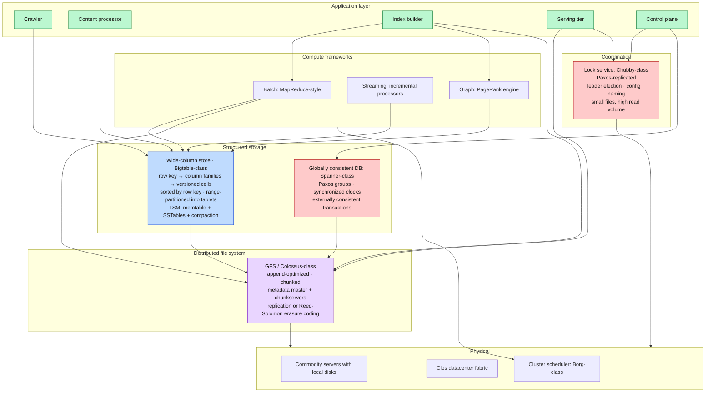
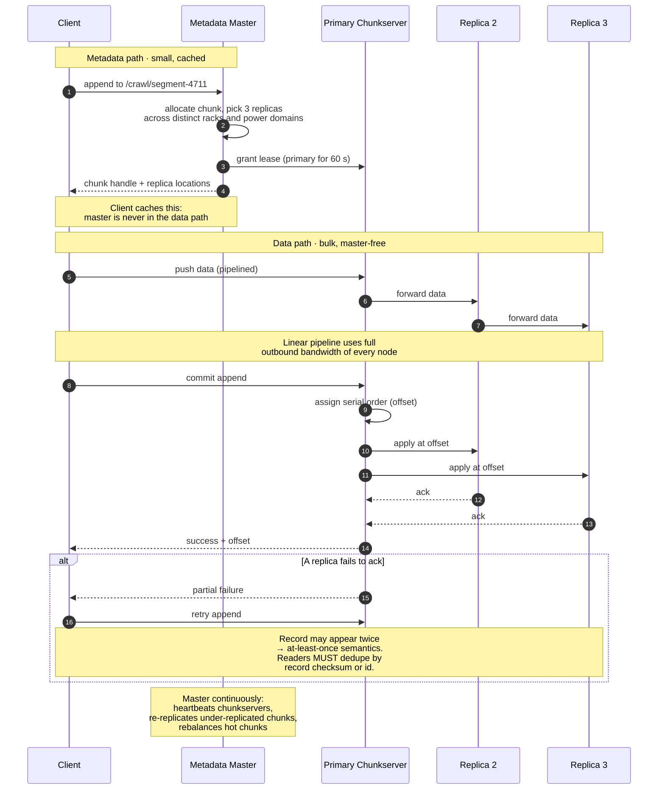
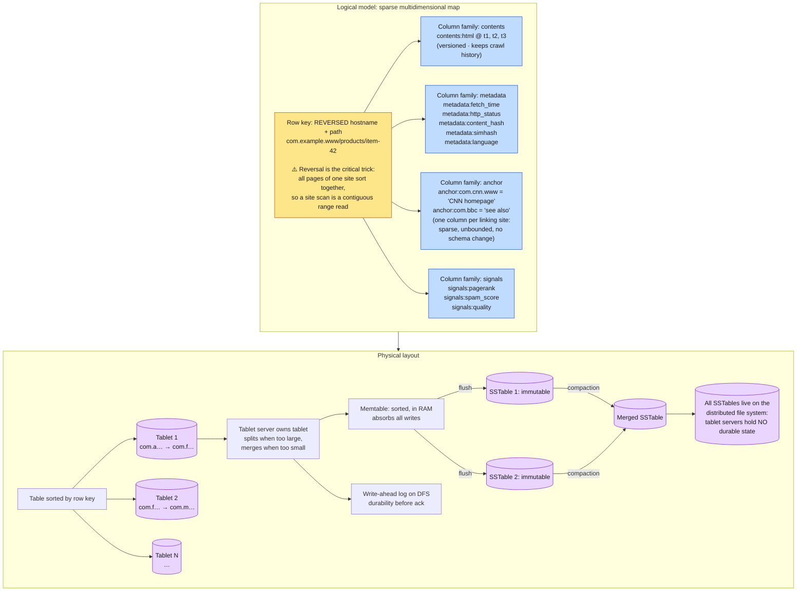
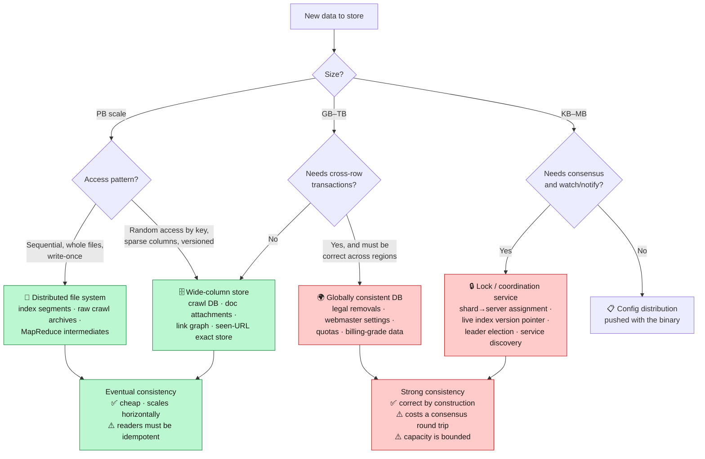
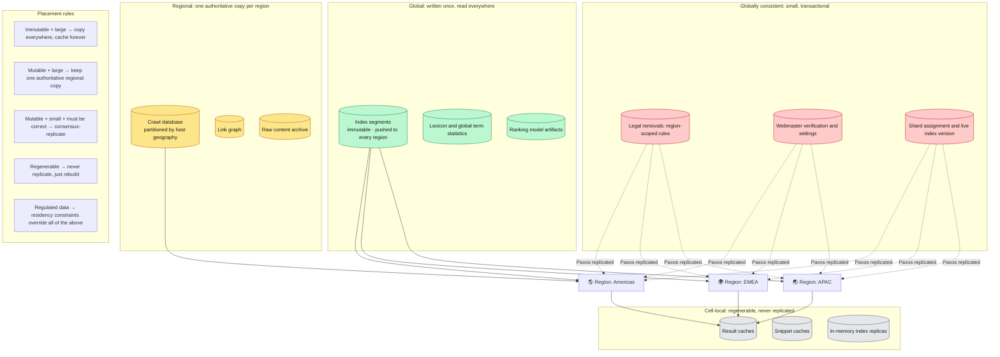

**[🇸🇦 اقرأ بالعربية](../ar/09-storage.md)**

# Chapter 09 · Storage Infrastructure

**← [08 · Ranking](08-ranking.md)** · [🏠 Home](../../README.md) · **[10 · Caching](10-caching.md) →**

---

## 9.1 Four storage problems, four different systems

A common beginner instinct is to reach for one database. This system cannot: it has four workloads whose requirements are mutually contradictory.

| Workload | Volume | Access pattern | Consistency | Right tool |
|---|---:|---|---|---|
| Raw crawled pages, index segments | 10s of PB | Sequential write, sequential read, immutable | Eventual | **Distributed file system** |
| Per-URL crawl metadata, document attachments | 10s of PB | Random read/write by key, sparse columns | Eventual, single-row atomic | **Wide-column store** |
| Shard assignment, index version, config | KB–GB | Read-heavy, tiny writes, must be correct | **Strong / linearizable** | **Coordination service** |
| Legal removals, webmaster settings, quotas | GB–TB | Transactional, cross-region | **Strong, external consistency** | **Globally consistent database** |

> **Diagram D-46 · The storage stack**

**Note the layering:** the wide-column store does not manage disks; it stores its files *on the distributed file system*. The file system does not manage consistency of metadata: it uses the coordination service for master election. Each layer solves exactly one problem and delegates the rest. This is why the stack has survived two decades of hardware change.

---

## 9.2 The distributed file system

Designed around one observation from the Google File System paper (2003): at this scale, **component failure is the norm, not the exception**. With 10,000 machines and a 3-year MTBF per machine, something fails roughly every 15 minutes. The file system must treat failure as an ordinary event, not an emergency.

> **Diagram D-47 · Write path and failure handling**

### The design choices that matter

| Choice | Rationale |
|---|---|
| **Huge chunks (64–128 MB)** | Cuts metadata volume by ~1000×, letting all metadata live in the master's RAM |
| **Master out of the data path** | Clients cache locations and stream directly to chunkservers; the master never becomes a bandwidth bottleneck |
| **Append-optimised, not random-write** | Matches the actual workload: crawl output and index segments are written once, read many times |
| **Relaxed consistency: at-least-once append** | Enormously simpler and faster than exactly-once; applications dedupe by record checksum |
| **Replication across failure domains** | Three replicas on distinct racks and power domains, correlated failure is what kills you |
| **Erasure coding for cold data** | Reed-Solomon gives comparable durability at ~1.4× overhead instead of 3× |

**The at-least-once semantics deserve emphasis** because it is the trade most often missed. The file system does *not* promise a record appears exactly once. It promises the record appears *at least* once, atomically, at some offset. Every consumer must be idempotent. That single relaxation is what makes the write path fast and the failure handling simple, and it is only acceptable because [Chapter 02](02-requirements.md) established that the data plane tolerates eventual consistency.

---

## 9.3 The wide-column store

The crawl database is the canonical use case, and it is exactly the workload that motivated Bigtable: **sparse, versioned, enormous, keyed by URL.**

> **Diagram D-48 · Crawl table schema and physical layout**

### Why the reversed row key is the whole design

`www.example.com/page` becomes `com.example.www/page`. Because the table is sorted by row key:

- All pages from one host land in **one contiguous key range** → crawling or reprocessing a whole site is a single efficient range scan, not 10,000 random reads.
- All hosts under one registrable domain are adjacent → domain-level aggregation (spam scoring, quota enforcement) is also a range scan.
- Load distributes reasonably across tablets, because hostnames are diverse.

**Row key design is the single highest-leverage decision** in a wide-column store. It determines which queries are cheap range scans and which are expensive scatter-gathers, and unlike an index in a relational database, it cannot be added afterwards.

### Why tablet servers hold no durable state

All SSTables live on the distributed file system. A tablet server is pure cache and coordination. If one dies, another simply takes ownership of the tablet, replays the write-ahead log, and continues: **no data movement is required**. Recovery is seconds, not hours. This separation of compute from storage is the reason the system tolerates constant machine churn, and it is the same principle that later became standard in cloud data warehouses.

### The consistency contract

| Guarantee | Provided? |
|---|---|
| Single-row read/write atomicity | ✅ Yes, across all column families |
| Multi-row transactions | ❌ No: deliberately omitted |
| Cross-table transactions | ❌ No |
| Ordered scans by row key | ✅ Yes: the core capability |
| Per-cell versioning with TTL/GC | ✅ Yes |

**Dropping multi-row transactions is what buys the scale.** Distributed transactions require coordination across tablet servers, which introduces the very cross-machine dependency that limits throughput. The application layer compensates: the crawler is designed so that every operation is a single-row update, and the few genuinely transactional needs are pushed to the globally consistent database.

---

## 9.4 Strong consistency where it is genuinely needed

A small fraction of data cannot tolerate eventual consistency. From [Chapter 02](02-requirements.md): shard assignment, index version, legal removals, webmaster authorisation.

> **Diagram D-49 · Choosing a store**

### The coordination service is small on purpose

A Chubby-class lock service holds only kilobytes: which server owns which shard, which index version is live, who is the current master of each subsystem. It is Paxos-replicated across five nodes, so writes cost a consensus round trip: expensive, but there are almost none.

Its most important property is not locking but **watch/notify with a consistent view**: every serving node watches the "live index version" node, and when it changes, all nodes learn within milliseconds and switch together. Without this, a rolling index update would leave different servers answering from different index versions: producing results that are individually valid but collectively incoherent, and nearly impossible to debug.

**The failure mode to respect:** the coordination service is a *hard* dependency for the control plane. If it is unavailable, no shard can be reassigned and no index version can be published. Systems that depend on it must be designed to keep serving with their last-known-good state indefinitely, so that a coordination outage degrades *change* rather than degrading *service*.

---

## 9.5 Replication and geography

> **Diagram D-50 · Data placement across regions**

**The rule that does most of the work is P1.** Index segments are immutable, so replicating them globally has no consistency cost whatsoever: a copy can never be stale relative to another copy, because neither will ever change. Immutability, chosen back in [Chapter 06](06-indexing.md) for lock-free reads, turns out to also make global geo-replication trivial. This is a recurring pattern worth internalising: **immutability converts a distributed-consistency problem into a distribution problem**, and distribution is much easier.

---

## 9.6 Failure handling summary

| Failure | Detection | Response | User impact |
|---|---|---|---|
| Single disk | Checksum mismatch on read | Read from another replica; re-replicate the chunk | None |
| Chunkserver | Missed heartbeats | Master re-replicates its chunks elsewhere | None |
| Tablet server | Lock service lease expiry | Another server loads the tablet, replays the WAL | Seconds of unavailability for that key range |
| Metadata master | Lease expiry in coordination service | Standby promoted, replays operation log | Seconds; existing reads continue from cached locations |
| Rack | Correlated heartbeat loss | Replicas on other racks serve; re-replicate | None: this is why placement spans racks |
| Whole region | Health checks + traffic monitoring | Global LB drains traffic to other regions | Higher latency for affected users; see [Ch 12](12-reliability.md) |
| Coordination service | Quorum loss | **Control plane freezes** | Serving continues on last-known-good state |
| Silent data corruption | Per-block checksums, background scrubbing | Repair from a good replica | None if caught by scrubbing |

**Silent corruption deserves the last word.** At petabyte scale, undetectable bit rot is a statistical certainty rather than a possibility. Every block carries a checksum, checksums are verified on every read, and a background scrubber continuously re-reads cold data to find corruption *before* anyone requests it. Without background scrubbing, you discover corruption only when you need the data, which is precisely the worst moment.

---

**← [08 · Ranking](08-ranking.md)** · [🏠 Home](../../README.md) · **[10 · Caching](10-caching.md) →** · [🇸🇦 العربية](../ar/09-storage.md)

