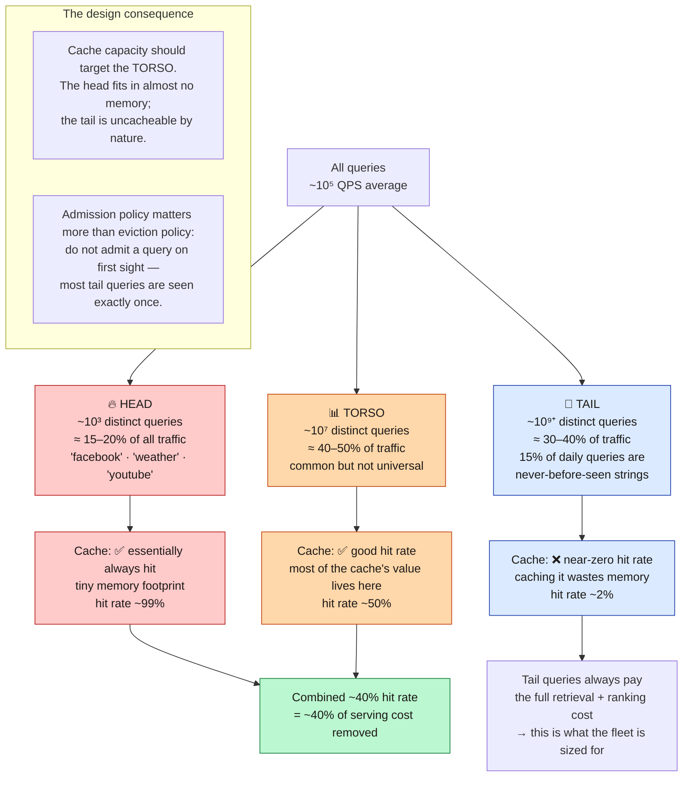
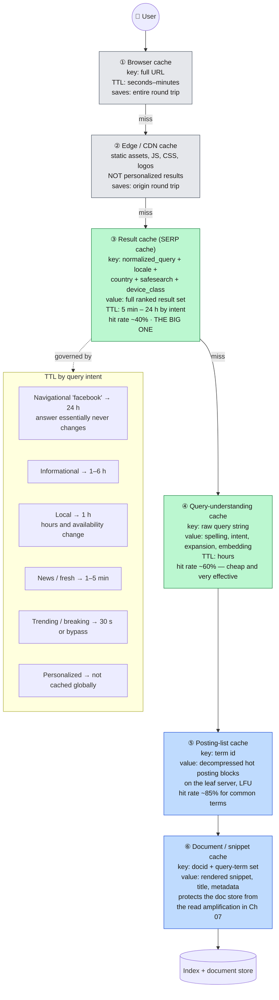
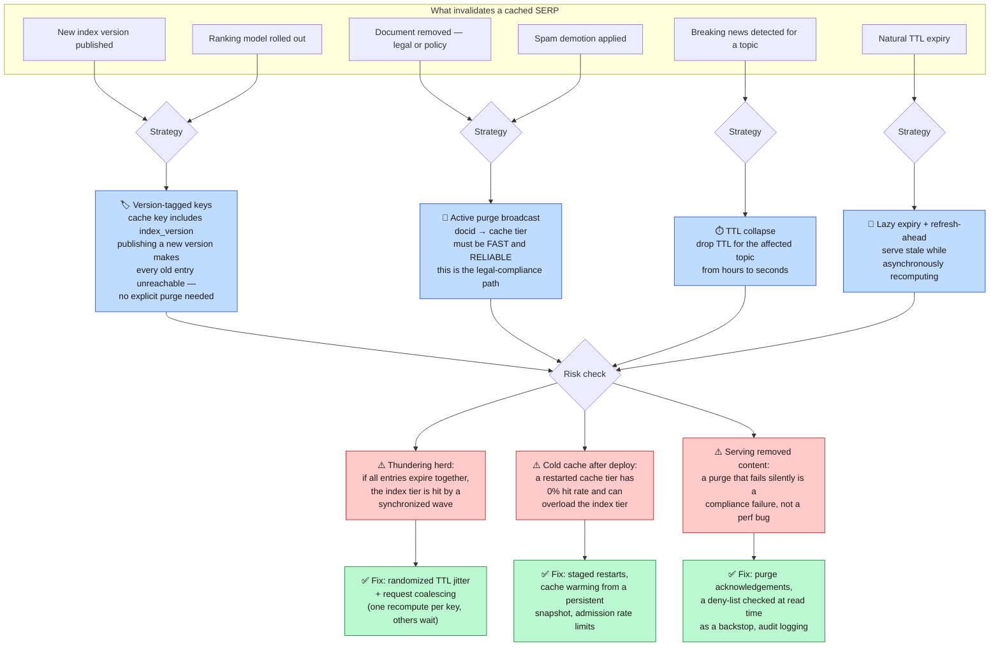
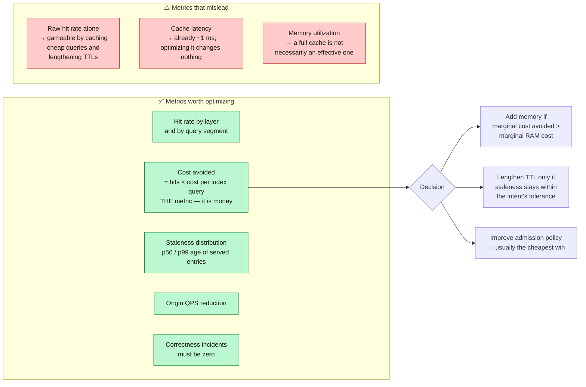

**[🇸🇦 اقرأ بالعربية](../ar/10-caching.md)**

# Chapter 10 · Caching Strategy

**← [09 · Storage](09-storage.md)** · [🏠 Home](../../README.md) · **[11 · Freshness](11-freshness.md) →**

---

## 10.1 Why caching is an economic decision, not a latency one

The instinct is that caches make things fast. In this system they mostly make things **cheap**, and the distinction changes how you design them.

From [Chapter 03](03-capacity-estimation.md): peak traffic is 3 × 10⁵ QPS, and a 40 % result-cache hit rate means only 1.8 × 10⁵ QPS reach the index. Without that cache the serving fleet would need to be ~67 % larger. The cache is not shaving milliseconds off an already-fast path — it is deleting two-thirds of a fleet's worth of hardware.

This reframes the design question. It is not "how do we make cached queries faster?" but **"how do we maximise the fraction of traffic that never touches the index, without ever serving something wrong?"**

---

## 10.2 Query traffic is extremely skewed — and that is what makes caching work

> **Diagram D-51 — Query popularity distribution and cacheability**

**The second insight box is the practically important one.** A naïve LRU cache admits every query on first request. Since ~15 % of daily queries have never been seen before and will likely never be seen again, a naïve cache spends a large share of its memory on entries that will never be read. Requiring a query to be seen twice within a window before admitting it (a "TinyLFU"-style admission filter) can raise effective hit rate substantially at zero extra memory.

---

## 10.3 The cache hierarchy

There is no single cache. There are six, at different layers, with different keys, sizes and TTLs.

> **Diagram D-52 — Multi-layer cache hierarchy**

### The cache key is the hardest part

Every dimension added to the key multiplies the key space and divides the hit rate:

| Key | Approximate distinct keys | Hit rate impact |
|---|---|---|
| `query` | 10⁹ | Baseline |
| `query + country` | 10⁹ × 200 | Necessary — results genuinely differ |
| `+ language` | × 50 | Necessary |
| `+ safesearch` | × 2 | Necessary — correctness |
| `+ device_class` | × 3 | Justifiable — layout differs |
| `+ city` | × 10⁴ | ❌ Destroys the cache |
| `+ user_id` | × 10⁹ | ❌ Cache becomes pointless |

This is the concrete mechanism behind the warning in [Chapter 08](08-ranking.md): **personalisation is expensive because it destroys cacheability**, not because personalising is computationally hard. The standard resolution is a **two-stage design** — cache the globally-computed result set under a coarse key, then apply light per-user reordering after the cache read. The expensive 200 ms of retrieval and ranking is shared; only the cheap final adjustment is per-user.

---

## 10.4 Invalidation

> **Diagram D-53 — Cache coherence and invalidation paths**

**Version-tagged keys are the elegant solution and should be the default.** Because index segments are immutable ([Chapter 06](06-indexing.md)), the live index has a version number. Including it in the cache key means a new index publish atomically invalidates the entire cache without sending a single purge message — old entries simply become unreachable and age out naturally. Immutability pays off a third time.

**But version tagging is not sufficient for legal removals.** Those cannot wait for the next index publish. They need the active purge path *and* a read-time deny-list backstop, because a purge message that is dropped silently produces a compliance violation rather than a stale result. This is a case where defence in depth is genuinely warranted: the fast path is the purge, and the correctness guarantee is the read-time check.

---

## 10.5 What must never be cached

| Data | Why not |
|---|---|
| Personalised result ordering | Serving one user's results to another is a privacy incident |
| Authenticated / private content | Never enters the public index in the first place |
| Legally removed URLs | Must disappear immediately and verifiably |
| Real-time data (live scores, stock prices) | Staleness is the failure, not an optimisation |
| Anything keyed on partial user identity | Cache poisoning becomes cross-user data leakage |

**Cache key collisions are a security vulnerability, not a bug.** If two different logical requests can map to the same cache key, one user can receive another's results. This is why the cache key must include *every* dimension that affects the response — including SafeSearch state and country, which are correctness dimensions rather than performance ones. The safe design principle: **when in doubt, add the dimension to the key and accept the lower hit rate.**

---

## 10.6 Measuring cache effectiveness

> **Diagram D-54 — Metrics that actually matter**

**Hit rate alone is a trap.** You can raise it trivially by extending TTLs, which trades a metric improvement for silently staler results. The metric that cannot be gamed is **cost avoided per unit of staleness introduced** — and it must always be evaluated alongside the correctness-incident count, which has a hard target of zero.

---

**← [09 · Storage](09-storage.md)** · [🏠 Home](../../README.md) · **[11 · Freshness](11-freshness.md) →** · [🇸🇦 العربية](../ar/10-caching.md)

