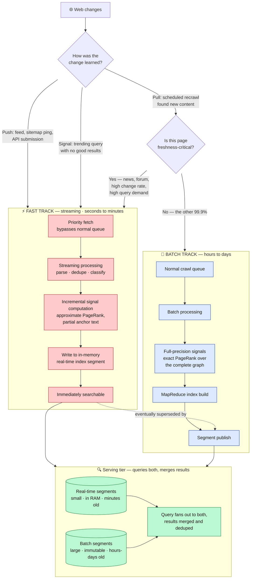
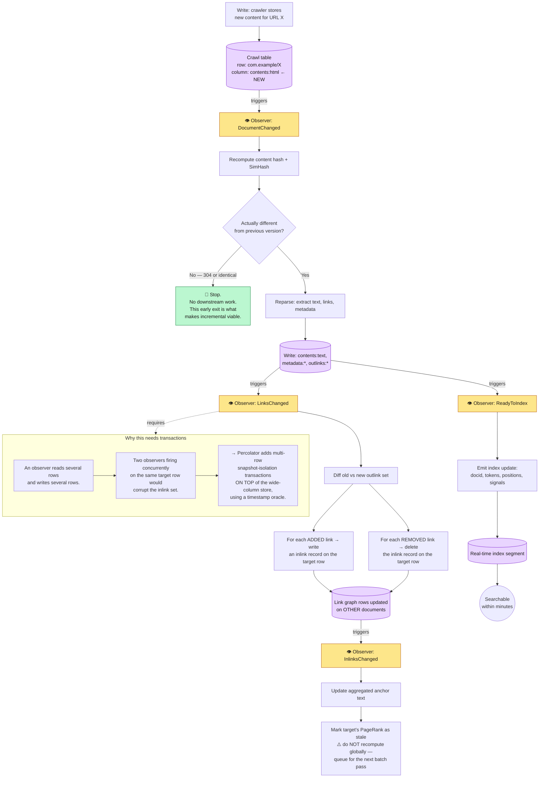
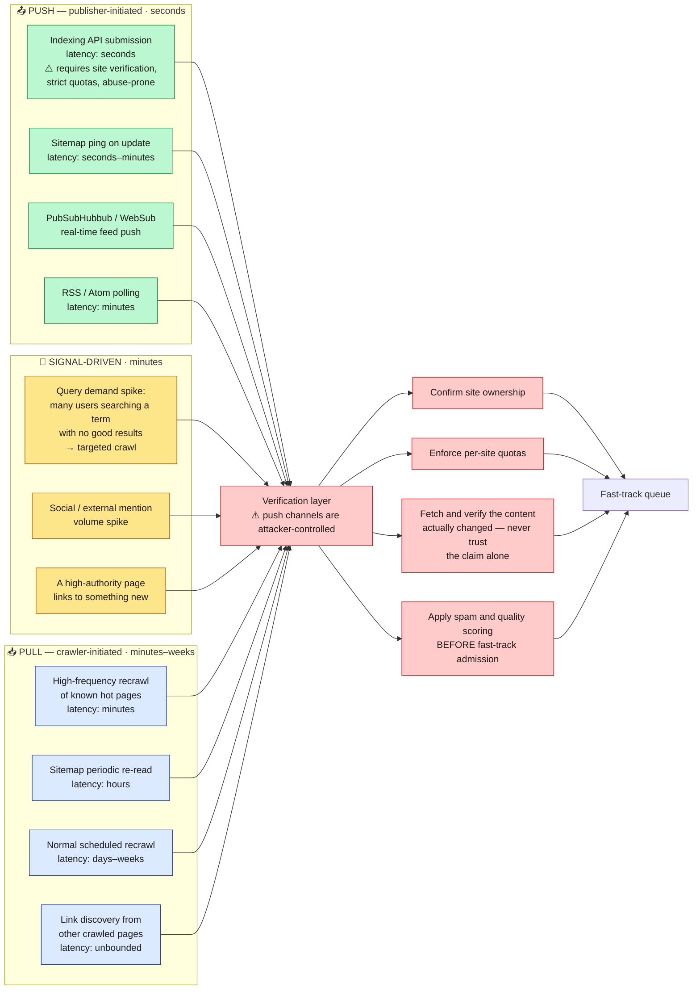
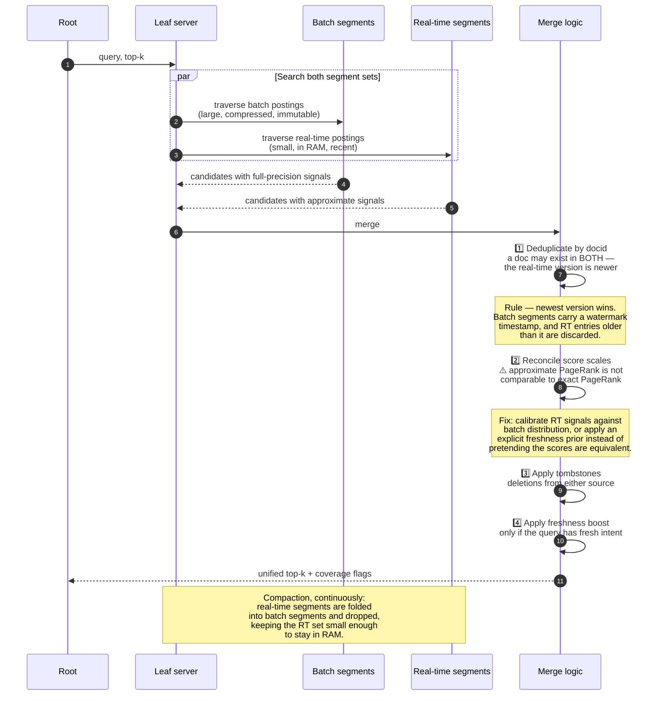

**[🇸🇦 اقرأ بالعربية](../ar/11-freshness.md)**

# Chapter 11 · Freshness & Real-Time Indexing

**← [10 · Caching](10-caching.md)** · [🏠 Home](../../README.md) · **[12 · Reliability](12-reliability.md) →**

---

## 11.1 The problem batch indexing cannot solve

[Chapter 06](06-indexing.md) described index construction as a MapReduce over the whole corpus — 1 PB of text, ~14 hours. That is perfectly adequate for the ordinary web. It is completely useless for an earthquake.

The requirement from [Chapter 02](02-requirements.md) is *median time-to-index under 5 minutes for the hot set*. A full rebuild cannot deliver that at any cost, because the bottleneck is not compute — it is the fact that a full rebuild recomputes **10¹¹ documents to reflect changes in 10⁶ of them**. The write amplification is 100,000×.

The answer is not to make the batch job faster. It is to **stop rebuilding what did not change** — which is precisely the insight behind Google's Percolator paper (2010) and the Caffeine indexing system it enabled.

> **Diagram D-55 — Two-track indexing**

**The key structural idea: the fast track trades accuracy for latency, and the batch track corrects it later.** A document indexed via the fast path has approximate ranking signals — PageRank computed from a partial graph, anchor text from whatever links happen to be known. It is *findable* within minutes but not perfectly *ranked*. When the batch pipeline catches up hours later, the accurate version supersedes it. Users get a fast, slightly-wrong answer immediately rather than a perfect answer tomorrow, which for breaking news is unambiguously the right trade.

---

## 11.2 Incremental processing — the Percolator model

Batch processing recomputes everything. Incremental processing computes only what changed, and propagates consequences. The mechanism is **observers**: triggers that fire when a specific column of a specific row changes.

> **Diagram D-56 — Observer-driven incremental indexing**

### Why this is genuinely hard

The wide-column store from [Chapter 09](09-storage.md) deliberately offers **only single-row atomicity**. But an observer that adds an inlink must read the target row, modify it, and write it back — and two observers doing this concurrently on a popular target will lose updates.

Percolator's contribution was adding **multi-row snapshot-isolation transactions on top of** a Bigtable-class store, using a centralised timestamp oracle and two-phase commit encoded in extra columns. The cost is significant: a transactional write is several times more expensive than a plain one. The benefit is that incremental indexing becomes *correct*, which is what makes it usable in production rather than a source of subtly corrupted link data.

**The `STOP` node deserves attention too.** The early exit when content is unchanged is not an optimisation detail — it is the property that makes the whole approach viable. Most recrawls find nothing new ([Chapter 04](04-crawling.md)), so most observer chains terminate at the first step. Without that early exit, incremental processing would do batch-scale work at streaming-scale frequency.

---

## 11.3 Discovery: push beats pull for freshness

Waiting to *discover* a change by recrawling is the slowest possible path. Publishers who want to be indexed quickly can tell you directly.

> **Diagram D-57 — Change discovery channels, ranked by latency**

**Every push channel is an attack surface.** A "notify me when you update" API is, from a spammer's perspective, a way to jump the crawl queue. The verification layer is therefore not optional plumbing: ownership must be proven, quotas must be enforced per verified site, the claimed change must be confirmed by actually fetching the page, and quality scoring must run *before* the document enters the fast path — not after. A fast track without a verification gate is simply a fast track for spam.

**The signal-driven channel is the clever one.** If thousands of users suddenly search for a term and the index has no good results, that is direct evidence the corpus is missing something important right now. Turning unmet query demand into crawl priority closes the loop from [Diagram D-01](../../README.md) — user behaviour steering the crawler — and it catches events no publisher thought to announce.

---

## 11.4 Serving a corpus split across two indexes

The serving tier must query batch segments and real-time segments together and produce one coherent ranking.

> **Diagram D-58 — Merging real-time and batch results**

**Step 2 is where naïve implementations break.** A document in the real-time index has an approximate PageRank computed from a partial link graph — typically an *underestimate*, since most of its inbound links have not been discovered yet. If you merge those scores directly with exact batch scores, fresh documents are systematically penalised, and your expensive freshness pipeline produces content nobody sees.

The correct handling is to treat the two score distributions as different and calibrate between them, or — more robustly — to keep freshness as an *explicit* ranking prior applied by the ranker for freshness-intent queries, rather than hoping it emerges implicitly from mixed-precision signals.

---

## 11.5 The freshness/cost trade-off

Freshness is not free, and its cost is not evenly distributed.

| Corpus slice | Share | Recrawl interval | Path | Relative cost per doc |
|---|---:|---|---|---:|
| Breaking news, live feeds | ~0.001 % | seconds–minutes | Push + fast track | **~1000×** |
| Active news sites, forums | ~0.1 % | minutes–hours | Fast track | ~100× |
| Frequently updated sites | ~1 % | hours–daily | Mixed | ~10× |
| Ordinary web pages | ~20 % | weekly–monthly | Batch | 1× |
| Static archives, PDFs | ~79 % | quarterly or never | Batch, low priority | ~0.1× |

**Concentrating almost all freshness spending on ~0.1 % of the corpus is the entire strategy.** Applying fast-track treatment uniformly would multiply indexing cost by roughly two orders of magnitude while improving results for almost nobody, because the other 99.9 % of documents were not going to change anyway.

This is the same shape as the tiering decision in [Chapter 06](06-indexing.md) and the caching decision in [Chapter 10](10-caching.md), and it is worth naming explicitly as a recurring pattern:

> **Web-scale systems are made affordable by exploiting extreme skew. Identify the small subset that matters, spend lavishly on it, and treat the rest cheaply and in bulk.**

Every major cost decision in this repository is an instance of that one idea.

---

**← [10 · Caching](10-caching.md)** · [🏠 Home](../../README.md) · **[12 · Reliability](12-reliability.md) →** · [🇸🇦 العربية](../ar/11-freshness.md)

