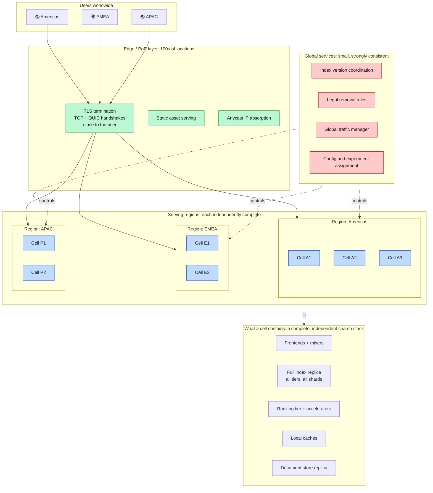
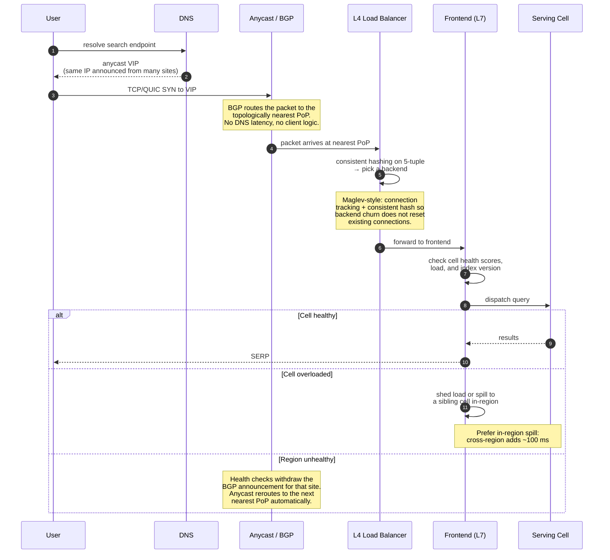
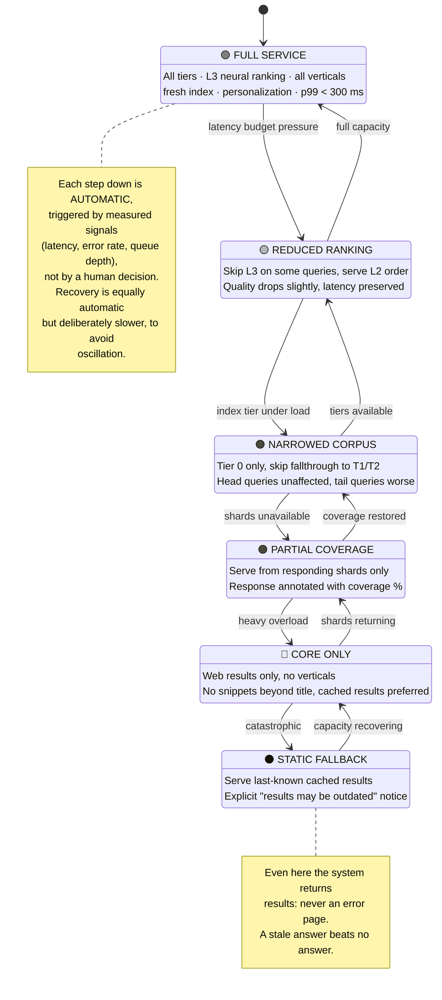
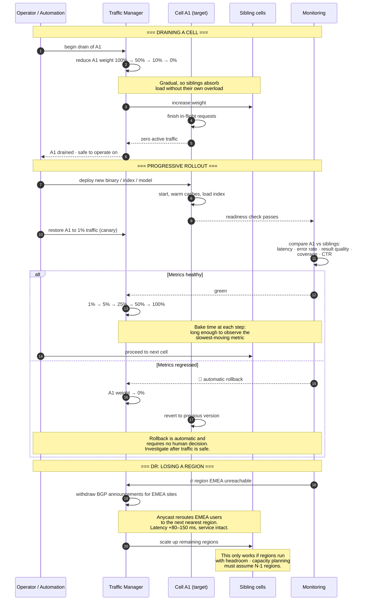

**[🇸🇦 اقرأ بالعربية](../ar/12-reliability.md)**

# Chapter 12 · Reliability & Global Topology

**← [11 · Freshness](11-freshness.md)** · [🏠 Home](../../README.md) · **[13 · Observability](13-observability.md) →**

---

## 12.1 Geography is a hard constraint

[Chapter 03](03-capacity-estimation.md) established the fact that dictates the entire deployment topology: a round trip from California to the Netherlands is ~150 ms. The p99 SLO is 300 ms. **A single global datacenter cannot serve the world**, no matter how fast the software is. Physics, not engineering, forces geographic replication.

> **Diagram D-59 · Global serving topology**

### The cell is the unit of everything

A **cell** is a complete, self-sufficient search stack: frontends, a full index replica, ranking, caches. This is the most important structural decision in the deployment, because a cell is simultaneously:

| The unit of… | Meaning |
|---|---|
| **Failure** | A cell can die entirely without taking down anything else |
| **Deployment** | New binaries roll out one cell at a time |
| **Capacity** | Scale by adding cells, not by growing one |
| **Experimentation** | A cell can serve a variant configuration |
| **Isolation** | A bad index or model is contained to the cells that received it |

Because a cell is complete, there are **no cross-cell dependencies in the serving path**. A query entering cell A1 is answered entirely within A1. This is what makes "drain a cell" a safe, routine operation rather than a crisis, and routine safe operations are the foundation of everything else in this chapter.

---

## 12.2 Getting the request to a healthy cell

> **Diagram D-60 · Multi-layer request routing**

**Anycast is doing something subtle and valuable here.** The same IP address is announced from many locations; BGP delivers each packet to the nearest announcement. Two consequences follow:

1. **Routing is automatic and instant**: no DNS TTL to wait out, no client-side logic, no geo-IP database to keep current.
2. **Failover is a routing withdrawal**: to take a site out of service, stop announcing the prefix. Traffic moves within seconds, without touching any client.

The trade-off is loss of fine-grained control: you cannot easily send 10 % of users to a specific site, because BGP decides. That is why anycast handles *coarse* geographic routing while the L7 frontend handles *fine-grained* decisions like experiment assignment and cell selection.

---

## 12.3 Failure modes and responses

> **Diagram D-61 · Failure domains and blast radius**

```mermaid
flowchart TB
    subgraph SMALL["🟢 Routine: invisible to users"]
        S1["Single machine dies<br/>→ replica serves, scheduler reschedules"]
        S2["Single disk fails<br/>→ checksum catches it, re-replicate"]
        S3["Process crash<br/>→ restarted in seconds"]
        S4["One leaf slow<br/>→ hedged request wins"]
    end

    subgraph MED["🟡 Notable: degraded but serving"]
        M1["Shard replica set unavailable<br/>→ serve with reduced coverage,<br/>annotate the response"]
        M2["Rack / power domain loss<br/>→ replicas elsewhere absorb"]
        M3["Ranking tier overloaded<br/>→ skip L3, serve L2 ordering"]
        M4["Cache tier restart<br/>→ index tier load spikes;<br/>admission limits protect it"]
        M5["Freshness pipeline stalled<br/>→ results go stale, still correct"]
    end

    subgraph LARGE["🟠 Serious: user-visible"]
        L1["Whole cell fails<br/>→ drain, redistribute in-region"]
        L2["Whole region fails<br/>→ anycast reroutes;<br/>latency rises for those users"]
        L3["Bad index published<br/>→ rollback to previous version"]
        L4["Bad ranking model<br/>→ automatic rollback on metric alarm"]
    end

    subgraph CRIT["🔴 Critical: needs pre-planned response"]
        C1["Coordination service quorum loss<br/>→ control plane freezes;<br/>serving continues on last-known state"]
        C2["Global config push corrupts all cells<br/>→ THE dangerous one:<br/>a global change has no blast radius limit"]
        C3["Correlated overload:<br/>every cell hits capacity at once"]
    end

    S1 & S2 & S3 & S4 --> AUTO["Handled automatically<br/>no human involved"]
    M1 & M2 & M3 & M4 & M5 --> DEGRADE["Graceful degradation<br/>alert raised, no page"]
    L1 & L2 & L3 & L4 --> PAGE["On-call paged<br/>runbook exists"]
    C1 & C2 & C3 --> INCIDENT["Incident response<br/>pre-planned, drilled"]

    classDef ok fill:#bbf7d0,stroke:#15803d,color:#1c1917
    classDef warn fill:#fef08a,stroke:#a16207,color:#1c1917
    classDef bad fill:#fed7aa,stroke:#c2410c,color:#1c1917
    classDef crit fill:#fecaca,stroke:#b91c1c,color:#1c1917
    class S1,S2,S3,S4,AUTO ok
    class M1,M2,M3,M4,M5,DEGRADE warn
    class L1,L2,L3,L4,PAGE bad
    class C1,C2,C3,INCIDENT crit
```

**C2 is the failure mode worth losing sleep over.** Every other entry has a natural blast-radius limit: a machine affects one machine, a cell affects one cell, a region affects one region. A *global configuration push* has no such limit: it reaches every cell simultaneously by design. Historically, across the industry, most large-scale outages have come from configuration and control-plane changes rather than from hardware failure or code bugs.

The defences are therefore procedural rather than architectural:

- Configuration changes roll out **like binaries**: canary, staged, with automatic rollback on metric regression.
- The system validates configuration **before** applying it, and refuses to apply a config that fails schema or sanity checks.
- Every service keeps its **last-known-good configuration** and continues on it if the new one is rejected.
- There is a **rate limit on global changes**: you cannot push two global changes within the observation window of the first.

---

## 12.4 Graceful degradation: the core design stance

From [Chapter 02](02-requirements.md): *availability means "returned a useful SERP", not "returned HTTP 200"*. The system therefore has explicit, ordered degradation levels rather than a binary up/down state.

> **Diagram D-62 · Degradation ladder**

**Recovery is deliberately slower than degradation.** Degrading quickly protects the system; recovering quickly risks flapping: restoring full service, immediately overloading again, degrading again. Asymmetric hysteresis (fast down, slow up) is what keeps a degradation ladder stable rather than oscillating.

---

## 12.5 Load shedding and overload

When demand exceeds capacity, something must be dropped. The only question is *what*, and answering it badly turns overload into a full outage.

| Strategy | Behaviour | Verdict |
|---|---|---|
| Do nothing: queue everything | Queues grow, latency explodes, everything times out, retries amplify the load | ❌ **Catastrophic**: this is how overload becomes outage |
| Drop randomly | Fair but wasteful; work already partly done is discarded | ⚠️ Better than nothing |
| Drop at the edge, before work begins | Cheapest possible rejection; no wasted downstream work | ✅ Correct |
| Drop by priority | Shed cheap/bot/prefetch traffic first, protect interactive users | ✅ Best |
| Degrade instead of dropping | Serve everyone a cheaper result | ✅ Best where possible |

**The retry-amplification trap deserves special mention.** When a service becomes slow, clients time out and retry, which increases load, which makes it slower: a positive feedback loop that turns a transient blip into a sustained outage. The mitigations are non-negotiable in any large system:

- **Retry budgets**: a client may spend at most ~10 % of its request volume on retries, tracked globally rather than per-request.
- **Exponential backoff with jitter**: never retry immediately, and never let many clients retry in lockstep.
- **Circuit breakers**: after repeated failures, stop calling the failing dependency entirely and serve degraded results immediately.
- **Deadline propagation**: a request whose deadline has already passed must not be retried at all; it is dead work.

---

## 12.6 Draining, rollouts and disaster recovery

> **Diagram D-63 · Cell drain and progressive rollout**

**The N-1 rule is the capacity-planning consequence of all of this.** If losing a region must not cause an outage, then the remaining regions must be able to absorb its traffic. That means running every region at meaningfully less than full utilisation during normal operation: paying for idle capacity as insurance. Any capacity plan that sizes for exactly the expected load has quietly decided that a regional failure is an acceptable outage.

---

## 12.7 Reliability practices summary

| Practice | Purpose |
|---|---|
| **Cells as failure domains** | Bound the blast radius of every class of failure |
| **No cross-cell serving dependencies** | Make drain and rollout routine and safe |
| **Progressive rollout with automatic rollback** | Catch bad releases at 1 % of traffic, not 100 % |
| **Config treated as code** | Config pushes cause more outages than code does |
| **Graceful degradation ladder** | Never return an error when a worse answer exists |
| **Retry budgets and circuit breakers** | Prevent retry amplification from converting blips into outages |
| **Deadline propagation** | Stop doing work nobody is waiting for |
| **N-1 regional capacity** | Survive losing a region without an outage |
| **Regular DR drills** | An untested failover procedure does not work; it only appears to |
| **Blameless postmortems** | Fix systems, not people: the goal is that the same failure cannot recur |

The last one is not decoration. In a system this size, every serious outage is the result of a *system* that permitted a mistake, not of an individual who made one. Postmortems that produce durable system changes are the mechanism by which reliability actually improves over time.

---

**← [11 · Freshness](11-freshness.md)** · [🏠 Home](../../README.md) · **[13 · Observability](13-observability.md) →** · [🇸🇦 العربية](../ar/12-reliability.md)

