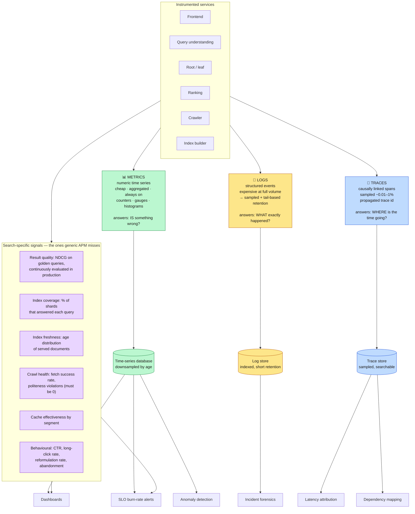
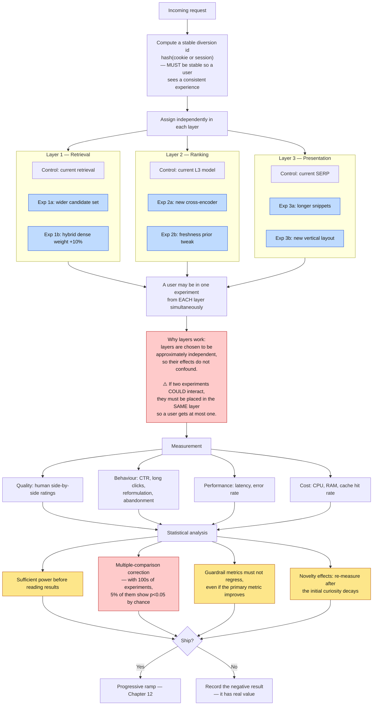
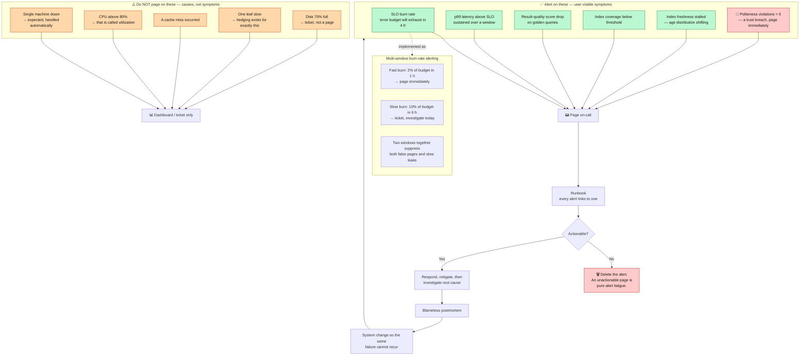

**[🇸🇦 اقرأ بالعربية](../ar/13-observability.md)**

# Chapter 13 · Observability & Experimentation

**← [12 · Reliability](12-reliability.md)** · [🏠 Home](../../README.md) · **[14 · Spam & Security](14-security-abuse.md) →**

---

## 13.1 You cannot debug what you cannot see

A query touches thousands of machines across a dozen services. When it is slow, "which one was it?" is not answerable by logging into a box. Observability is not an operational afterthought here — it is a functional requirement of the architecture, because the architecture made single-machine debugging impossible.

> **Diagram D-64 — The observability stack**

**The QUALITY box is what distinguishes search observability from generic monitoring.** A search engine can be perfectly healthy by every infrastructure metric — 100 % availability, p99 within SLO, zero errors — while returning terrible results. Latency and error rate cannot detect a bad ranking model or a corrupted index. Continuous quality evaluation against a fixed golden-query set is the only monitor that catches that class of failure, and it deserves the same alerting severity as an availability breach.

---

## 13.2 Distributed tracing

> **Diagram D-65 — A single query's trace**

```mermaid
gantt
    title Distributed trace: one slow query (units: milliseconds)
    dateFormat X
    axisFormat %s

    section frontend
    HandleSearch (root span)          :active, fe, 0, 340
    parseRequest                      :fe1, 2, 6

    section query-understanding
    understand                        :qu, 6, 34
    spellCheck                        :qu1, 8, 18
    intentClassify                    :qu2, 18, 28
    embedQuery                        :qu3, 28, 34

    section cache
    resultCacheLookup (MISS)          :ca, 34, 37

    section retrieval
    rootFanout                        :active, rt, 37, 195
    intermediate-07                   :im, 39, 193
    leaf-0712 (normal)                :lf1, 41, 96
    leaf-0713 (normal)                :lf2, 41, 92
    leaf-0714 SLOW - GC pause         :crit, lf3, 41, 191
    leaf-0714-hedge (replica)         :done, lf4, 130, 188

    section ranking
    L2 rescore                        :l2, 195, 228
    L3 neural rerank                  :l3, 228, 288

    section assembly
    snippetGeneration                 :sn, 288, 322
    blendAndSerialize                 :bl, 322, 338
```

Reading this trace, the diagnosis is immediate and unambiguous: **`leaf-0714` took 150 ms instead of ~55 ms**, and because the root must wait for all shards, that single leaf set the latency of the entire query. The hedged request fired at ~130 ms but its replica did not return early enough to help much.

Without tracing, this appears in metrics only as "p99 latency is up" — with a thousand candidate leaves and no way to attribute it. This is exactly the problem Dapper (2010) was built to solve, and its three design decisions are worth stating because they are what make tracing affordable at this scale:

| Decision | Why |
|---|---|
| **Sample aggressively** (0.01–1 %) | Tracing every request would cost more than serving it. Rare events still appear at high volume. |
| **Propagate a trace id through every RPC** | Causality cannot be reconstructed after the fact; it must be carried. |
| **Instrument the RPC layer, not the application** | Developers get tracing for free and cannot forget to add it. This is why coverage is complete. |

**Adaptive sampling** improves on uniform sampling significantly: always trace slow requests, errors, and a small uniform baseline. That way the traces you actually keep are disproportionately the interesting ones.

---

## 13.3 Experimentation

Every ranking change, UI change and infrastructure change is validated by controlled experiment. At any moment a large search engine is running *hundreds* of concurrent experiments — which creates a problem: there is not enough traffic to give each one an exclusive slice.

> **Diagram D-66 — Overlapping layered experiments**

### The two statistical traps that matter most

**Multiple comparisons.** Running 400 experiments at p < 0.05 means ~20 will appear significant purely by chance. Without correction (Benjamini–Hochberg or similar), an organisation systematically ships noise and slowly degrades its own product while every individual decision looked justified. This is not a theoretical concern; it is the default outcome of running many experiments without correction.

**Guardrail metrics.** A change that improves CTR by 2 % while increasing latency by 30 ms and reducing long-click rate is a *loss*, not a win. Every experiment must declare guardrails in advance — latency, error rate, human-rated quality, revenue-neutral checks — and a guardrail regression blocks the launch regardless of how good the primary metric looks. Declaring them *in advance* is the part that matters: post-hoc guardrails are indistinguishable from rationalisation.

---

## 13.4 Alerting on symptoms, not causes

> **Diagram D-67 — SLO-based alerting**

**"CPU above 80 %" is the canonical bad alert.** In a system designed for graceful degradation, high utilisation is *the goal* — idle capacity is wasted money. Users do not experience CPU; they experience latency and result quality. Alert on what users experience, and let the system handle causes automatically.

**The `DELETE` node is the most under-used tool in operations.** Every alert that fires without a clear action trains the on-call engineer to ignore alerts. Alert fatigue is not a personal failing; it is a predictable consequence of unactionable alerts, and the fix is deletion, not discipline.

---

## 13.5 The metrics that matter, by audience

| Audience | Primary metrics |
|---|---|
| **On-call** | SLO burn rate · error rate · p99 latency · coverage |
| **Search quality** | NDCG on golden set · side-by-side wins · long-click rate · reformulation rate |
| **Crawl** | Fetch success rate · politeness violations (0) · discovery latency · frontier depth |
| **Index** | Build success · publish latency · index size · freshness age distribution |
| **Capacity** | QPS vs provisioned · cache hit rate · cost per 1,000 queries · N-1 headroom |
| **Leadership** | Availability · task success rate · cost per query trend |

**Politeness violations get a hard zero target** and belong on the paging list, which is unusual for a metric with no direct user impact. The justification: crawling is a privilege extended by the entire web on the assumption that the crawler behaves. A violation is a breach of that trust, it damages the operator's ability to crawl at all, and unlike a latency regression it cannot be fixed retroactively.

---

**← [12 · Reliability](12-reliability.md)** · [🏠 Home](../../README.md) · **[14 · Spam & Security](14-security-abuse.md) →** · [🇸🇦 العربية](../ar/13-observability.md)

