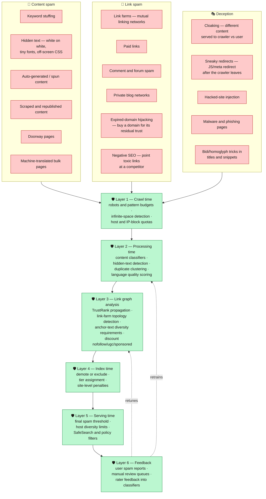
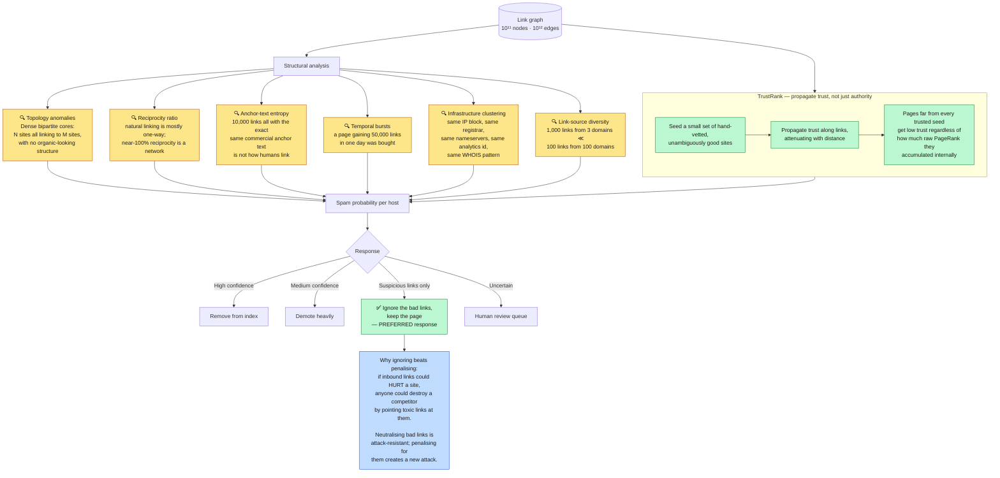
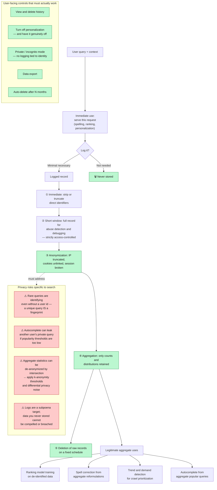

**[🇸🇦 اقرأ بالعربية](../ar/14-security-abuse.md)**

# Chapter 14 · Web Spam, Abuse & Security

**← [13 · Observability](13-observability.md)** · [🏠 Home](../../README.md) · **[15 · Trade-offs](15-tradeoffs.md) →**

---

## 14.1 The adversarial premise

Every other chapter assumed the web is merely *large*. This one assumes it is *hostile*. A meaningful fraction of all pages exist for no purpose other than to rank for queries they do not deserve, and behind them are well-resourced actors with direct financial incentive.

This changes the engineering discipline in a specific way:

> **Any signal that an outside party controls will eventually be manipulated. Therefore the trustworthiness of a signal is inversely proportional to how easily its subject can influence it.**

| Signal | Who controls it | Manipulation resistance |
|---|---|---|
| On-page keywords, meta tags | The page owner, completely | ⚫ Almost none |
| Outbound links from the page | The page owner | ⚫ Almost none |
| Inbound links | Third parties — but purchasable | 🔴 Low |
| Anchor text | Third parties — but purchasable | 🔴 Low |
| Links from *already-trusted* sites | Hard to obtain fraudulently | 🟡 Moderate |
| Aggregate user behaviour at scale | Requires large-scale fraud to fake | 🟢 High |
| Human rater judgements | Not externally controllable | 🟢 Very high |

Notice that the ordering here directly explains the historical arc of search ranking: purely on-page signals (1990s) → link-based signals (PageRank, 1998) → behavioural and learned signals (2000s onward). **Each move was forced by the previous generation of signals being successfully gamed.**

---

## 14.2 Spam taxonomy and layered defence

> **Diagram D-68 — Web spam techniques and where each is caught**

**Defence in depth is mandatory here, for an economic reason.** Any single classifier can be reverse-engineered by an adversary with enough attempts — they can observe their own rankings and iterate. Six independent layers mean an attacker must defeat all six simultaneously, and each layer they defeat raises their cost while the defender's cost stays roughly constant. Spam fighting is not about building a perfect filter; it is about making the attack more expensive than the reward.

**Cloaking (K1) deserves specific mention** because it defeats every content-based classifier by construction: the classifier never sees the spam. The only reliable detection is to fetch the page a second time from a residential-looking client, without the crawler's user-agent, and compare the two renders. This is expensive, so it is applied selectively — to pages that rank well but have suspicious behavioural signals.

---

## 14.3 Link spam and graph-based detection

Link spam is the hardest category, because links are simultaneously the most valuable authority signal ([Chapter 08](08-ranking.md)) and the most purchasable one.

> **Diagram D-69 — Link graph anomaly detection**

**The `WHY` box captures a design principle that generalises well beyond search.** When defending against manipulation, prefer to *neutralise* the manipulated signal rather than *penalise* the entity it points at — because penalties can be weaponised by third parties. If bad inbound links reduced a site's ranking, "negative SEO" would become a cheap and effective attack on competitors. Discounting the bad links instead makes the attack pointless: the attacker spends money and achieves nothing.

**TrustRank inverts PageRank's weakness.** PageRank measures how much link authority flows *into* a page, and a link farm can manufacture that internally. TrustRank measures distance from a hand-vetted trusted seed set — and no amount of self-linking moves you closer to a seed you have no genuine connection to. Combining "how much authority" with "how close to known-good" is far more robust than either alone.

---

## 14.4 Security of the search infrastructure itself

Separate from web spam: the system is itself a target.

> **Diagram D-70 — Attack surfaces and controls**

```mermaid
flowchart TB
    subgraph SURFACES["Attack surfaces"]
        S1["🌐 Public query endpoint<br/>the only unauthenticated<br/>public entry point"]
        S2["🕷️ Crawler fetching<br/>hostile content<br/>— we execute attacker input"]
        S3["🖥️ Headless rendering<br/>we run attacker JavaScript"]
        S4["📤 Push/indexing APIs<br/>authenticated but<br/>attacker-operated"]
        S5["🔧 Internal control plane"]
        S6["📊 Logs containing<br/>user queries"]
    end

    S1 --> C1["Rate limiting per IP, subnet, ASN<br/>Bot detection and challenges<br/>Query complexity limits<br/>Strict input validation<br/>DDoS absorption at the edge"]

    S2 --> C2["Parse in a sandbox — assume<br/>every parser has bugs<br/>Size and depth caps<br/>Decompression-bomb limits<br/>Aggressive timeouts<br/>No credentials in the fetcher<br/>Egress restrictions — a crawler<br/>must never reach internal networks"]

    S3 --> C3["Strong isolation: separate VM/container<br/>per render, destroyed after use<br/>No network access to internal services<br/>Hard CPU/memory/time budgets<br/>Treat as fully compromised by default"]

    S4 --> C4["Verify domain ownership<br/>Per-site quotas<br/>Never trust a submission —<br/>always fetch and verify independently<br/>Full audit log"]

    S5 --> C5["Mutual TLS between services<br/>Least-privilege service identity<br/>Two-person review for global changes<br/>Immutable audit trail"]

    S6 --> C6["Data minimization<br/>Rapid IP anonymization<br/>Aggregation before analysis<br/>Strict access control + audit<br/>Time-bounded retention"]

    subgraph SSRF["⚠️ The crawler-as-SSRF problem"]
        X1["A crawler is, by design, a service that<br/>fetches arbitrary attacker-supplied URLs."]
        X2["That is the exact definition of a<br/>server-side request forgery primitive."]
        X3["Mandatory controls:<br/>• deny RFC1918 and link-local ranges<br/>• deny cloud metadata endpoints<br/>• re-validate the IP AFTER DNS resolution<br/>  (defeats DNS rebinding)<br/>• run fetchers in a network segment with<br/>  no route to internal services"]
        X1 --> X2 --> X3
    end

    S2 -.critical.-> SSRF

    classDef surface fill:#fecaca,stroke:#b91c1c,color:#1c1917
    classDef control fill:#bbf7d0,stroke:#15803d,color:#1c1917
    class S1,S2,S3,S4,S5,S6 surface
    class C1,C2,C3,C4,C5,C6 control
```

**The SSRF box is the one most often overlooked in system design discussions.** A crawler fetches URLs supplied by untrusted parties — which is structurally identical to an SSRF vulnerability, except it is the product's core function rather than a bug. If a crawler can be induced to fetch `http://169.254.169.254/` (cloud metadata) or an internal service address, an attacker gains a request primitive inside your network simply by publishing a link.

Note particularly the **re-validate after DNS resolution** control. Checking that a hostname is not internal *before* resolving it is insufficient: an attacker can serve a public IP on the first DNS lookup and an internal IP on the second (DNS rebinding). The validation must happen on the resolved address actually being connected to.

---

## 14.5 Privacy

Search queries are among the most sensitive data any system holds. People search for medical symptoms, legal trouble, and things they would tell no one.

> **Diagram D-71 — Query data lifecycle and privacy controls**

**R1 is the risk that surprises engineers most.** "We removed the user id, so it is anonymous" is false for search logs. A query like *"lawyer specialising in [rare condition] in [small town]"* identifies a person as effectively as a name. Genuine anonymisation of query logs requires k-anonymity thresholds — suppressing queries that too few distinct users issued — not merely stripping identifiers.

**R4 is the strongest privacy control available and the easiest to skip.** Data that was never collected cannot be leaked, subpoenaed, misused by an insider, or exposed by a future bug. Every retention decision should start from "what is the minimum we need, for the shortest time?" rather than "what might be useful someday?"

---

## 14.6 The arms race is permanent

| Property | Consequence for design |
|---|---|
| Adversaries adapt within days | Static rules decay; classifiers must be retrained continuously |
| Detection reveals detection | Publishing exactly what you detect teaches evasion |
| False positives destroy livelihoods | A wrongly-demoted legitimate business is real harm — appeals and human review are required, not optional |
| Attackers probe with real traffic | Their experiments look like normal usage; detection must work on aggregates |
| Defence must scale to 10¹¹ pages | Manual review handles only the highest-impact cases |
| Some categories need extra care | Health, finance, safety and civic information warrant stricter authority requirements |

**The false-positive point is an ethical constraint, not just an engineering one.** At this scale, a classifier with 99.9 % precision still mislabels 10⁸ pages. Behind some of those pages are small businesses whose income depends on being findable. That is why a mature system pairs automated enforcement with a genuine appeals path and human review for consequential decisions — and why "the model said so" is never an adequate justification for a penalty that affects someone's livelihood.

---

**← [13 · Observability](13-observability.md)** · [🏠 Home](../../README.md) · **[15 · Trade-offs](15-tradeoffs.md) →** · [🇸🇦 العربية](../ar/14-security-abuse.md)

