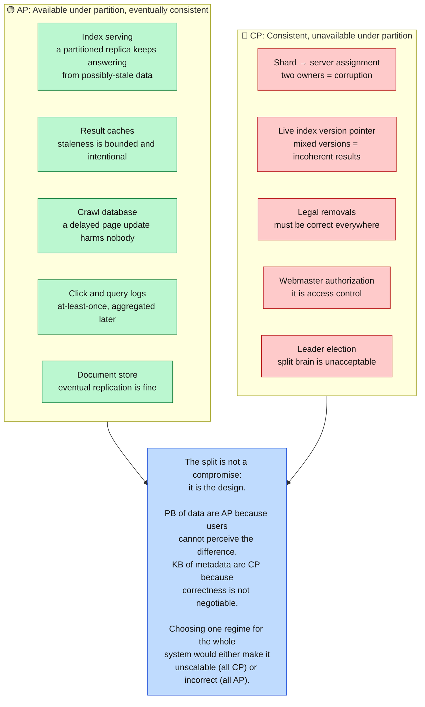
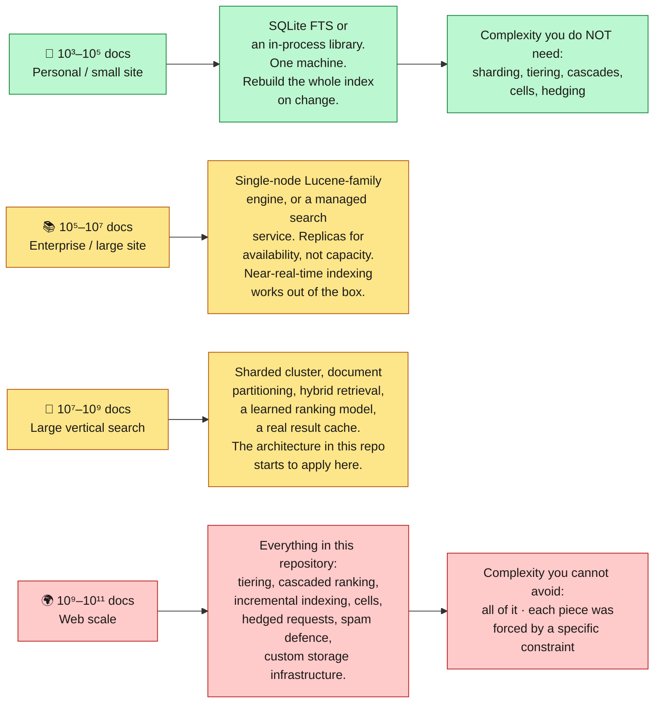

**[🇸🇦 اقرأ بالعربية](../ar/15-tradeoffs.md)**

# Chapter 15 · Trade-offs & Alternatives

**← [14 · Spam & Security](14-security-abuse.md)** · [🏠 Home](../../README.md) · **[16 · Interview Guide](16-interview-guide.md) →**

---

## 15.1 Every decision in one table

A system design is defined less by what it does than by what it *refused* to do. Here is the complete ledger.

| # | Decision | Chosen | Rejected alternative | Why | Cost accepted |
|:--:|---|---|---|---|---|
| 1 | Data layout | Inverted index | Full scan / forward index only | Only structure that answers term queries sub-linearly | Index build cost, write amplification |
| 2 | Sharding | By document | By term | Zipf term distribution makes term-sharding permanently hot-spotted | Total fan-out on every query |
| 3 | Segment mutability | Immutable + merge | In-place update | Lock-free reads, trivial replication, trivial rollback | Read amplification until compaction |
| 4 | Deletion | Tombstones | Immediate rewrite | Preserves immutability | Space held until major merge |
| 5 | Index residency | RAM (tiered) | Disk | 300 ms SLO is unreachable from disk | RAM is the dominant system cost |
| 6 | Corpus coverage per query | Tiered, with fallthrough | Flat, search everything | ~100× fleet cost reduction | Rare queries occasionally under-served |
| 7 | Ranking | Cascade L0→L3 | Single model on all candidates | L3 is 10⁵× costlier than L1 | Early recall errors are unrecoverable |
| 8 | Retrieval type | Hybrid lexical + dense | Lexical only, or dense only | Complementary failure modes | Two systems to build and keep in sync |
| 9 | Consistency (data plane) | Eventual | Strong | Nobody notices a 90-second delay | Readers must be idempotent |
| 10 | Consistency (control plane) | Strong | Eventual | Two servers owning one shard is a correctness bug | Consensus round trip, bounded capacity |
| 11 | Failure behaviour | Degrade | Fail fast | A partial SERP beats an error page | Silent quality loss must be monitored |
| 12 | Tail latency | Hedged + tied requests | Just wait | 1,600-way fan-out guarantees a slow server | ~5 % extra load |
| 13 | Freshness | Two-track: batch + streaming | Batch only, or streaming only | 99.9 % of pages do not need minutes | Two indexes to merge, score-scale mismatch |
| 14 | Caching | Multi-layer, coarse keys | No cache, or per-user keys | Removes ~40 % of serving cost | Bounded staleness; limits personalisation |
| 15 | Personalisation | Light post-ranking adjustment | Per-user retrieval | Per-user keys destroy the cache | Less tailored results |
| 16 | Deployment | Independent cells | One global cluster | Bounded blast radius; safe rollouts | Duplicated capacity per cell |
| 17 | Regional capacity | N-1 headroom | Size for expected load | A region must be able to fail | Paying for idle capacity |
| 18 | Link spam response | Neutralise bad links | Penalise the target | Penalties become a weapon (negative SEO) | Some spam benefit survives |
| 19 | JS rendering | Rationed by page value | Render everything, or nothing | 100–1000× cost ratio | JS-heavy sites indexed later |
| 20 | Stopwords | Kept, cheaply stored | Removed | Removal breaks phrase queries | Larger index |

---

## 15.2 Where each subsystem sits on CAP

CAP is often applied to a system as a whole, which is a category error. **CAP applies per data flow**, and this system deliberately makes different choices in different places.

> **Diagram D-72 · CAP positioning by subsystem**

---

## 15.3 Architectures that would have been wrong

Being able to say *why* an alternative fails is more valuable than knowing the chosen answer.

> **Diagram D-73 · Rejected architectures and their failure points**

```mermaid
flowchart TB
    subgraph ALT1["❌ Alternative A: Relational database"]
        A1["Store pages in a RDBMS,<br/>use full-text search extensions"]
        A2["Fails at: 10¹¹ rows, PB-scale text,<br/>10⁹ writes/day, and full-text<br/>extensions are not designed<br/>for web-scale ranking"]
        A3["Would work for: 10⁶–10⁷ documents<br/>an enterprise or site search"]
        A1 --> A2 --> A3
    end

    subgraph ALT2["❌ Alternative B: Pure vector database"]
        B1["Embed everything, ANN search only,<br/>no inverted index"]
        B2["Fails at: exact identifiers, rare<br/>proper nouns, negation, and freshness<br/>new entities are absent from the<br/>embedding model until it is retrained"]
        B3["Would work for: semantic search over<br/>a curated, slow-changing corpus"]
        B1 --> B2 --> B3
    end

    subgraph ALT3["❌ Alternative C: Term-partitioned index"]
        C1["Shard by term so each query<br/>touches only a few servers"]
        C2["Fails at: Zipf distribution creates<br/>permanent hot spots, and intersecting<br/>lists across the network moves<br/>gigabytes per query"]
        C3["Would work for: never, at web scale"]
        C1 --> C2 --> C3
    end

    subgraph ALT4["❌ Alternative D: Single global cluster"]
        D1["One enormous datacenter,<br/>no geographic replication"]
        D2["Fails at: physics:<br/>150 ms cross-continent RTT<br/>against a 300 ms p99 SLO,<br/>plus a single point of failure"]
        D3["Would work for: a single-region product"]
        D1 --> D2 --> D3
    end

    subgraph ALT5["❌ Alternative E: Rebuild the index on every change"]
        E1["Run the full MapReduce build<br/>whenever anything changes"]
        E2["Fails at: 10⁵× write amplification:<br/>recomputing 10¹¹ documents to<br/>reflect 10⁶ changes"]
        E3["Would work for: a corpus that<br/>changes in scheduled batches"]
        E1 --> E2 --> E3
    end

    subgraph ALT6["❌ Alternative F: Per-user index"]
        F1["Fully personalized retrieval:<br/>every user gets their own ranking<br/>computed from scratch"]
        F2["Fails at: cache hit rate → 0,<br/>multiplying serving cost by ~2×,<br/>with severe privacy exposure"]
        F3["Would work for: a small, high-value<br/>user base · enterprise search"]
        F1 --> F2 --> F3
    end

    classDef bad fill:#fecaca,stroke:#b91c1c,color:#1c1917
    classDef ok fill:#bbf7d0,stroke:#15803d,color:#1c1917
    class A2,B2,C2,D2,E2,F2 bad
    class A3,B3,D3,E3,F3 ok
```

**Notice the pattern in the "would work for" column.** Almost every rejected alternative is the *correct* design at a smaller scale. A relational database with full-text search is exactly right for 10⁶ documents. A pure vector database is exactly right for a curated semantic corpus. A single cluster is exactly right for a single-region product.

This is the most transferable lesson in the whole repository: **there is no such thing as a good architecture in the abstract; only an architecture that is appropriate to a specific scale and set of constraints.** Applying web-scale patterns to a 10⁶-document corpus is over-engineering just as surely as applying a single-database design to 10¹¹ documents is under-engineering.

---

## 15.4 What would change at different scales

> **Diagram D-74 · Architecture by corpus size**

---

## 15.5 The five ideas worth carrying elsewhere

Strip away search-specific detail and five principles remain, each applicable to almost any large system.

| Principle | In this system | Elsewhere |
|---|---|---|
| **Exploit skew** | Tiering, caching, freshness: all spend lavishly on a tiny hot subset and cheaply on the rest | Any workload with a power-law access distribution |
| **Cascade cheap → expensive** | L0 touches 10¹¹ docs, L3 touches 10¹ | Fraud detection, content moderation, recommendation, compilation |
| **Immutability turns consistency into distribution** | Immutable segments make global replication, caching and rollback trivial | Event sourcing, content-addressed storage, build artifacts |
| **Degrade, never fail** | Six explicit degradation levels rather than up/down | Any user-facing system where a worse answer beats no answer |
| **Push work offline** | Ranking features precomputed at index time; the query path only combines them | Anything with an asymmetric read/write ratio |

And one meta-principle that the whole repository demonstrates:

> **Every architectural decision should be traceable to a specific constraint.** If you cannot name the constraint that forces a piece of complexity, that complexity is probably not earning its keep. Conversely, complexity that *is* forced by a real constraint is not over-engineering: it is the minimum viable design.

---

**← [14 · Spam & Security](14-security-abuse.md)** · [🏠 Home](../../README.md) · **[16 · Interview Guide](16-interview-guide.md) →** · [🇸🇦 العربية](../ar/15-tradeoffs.md)

