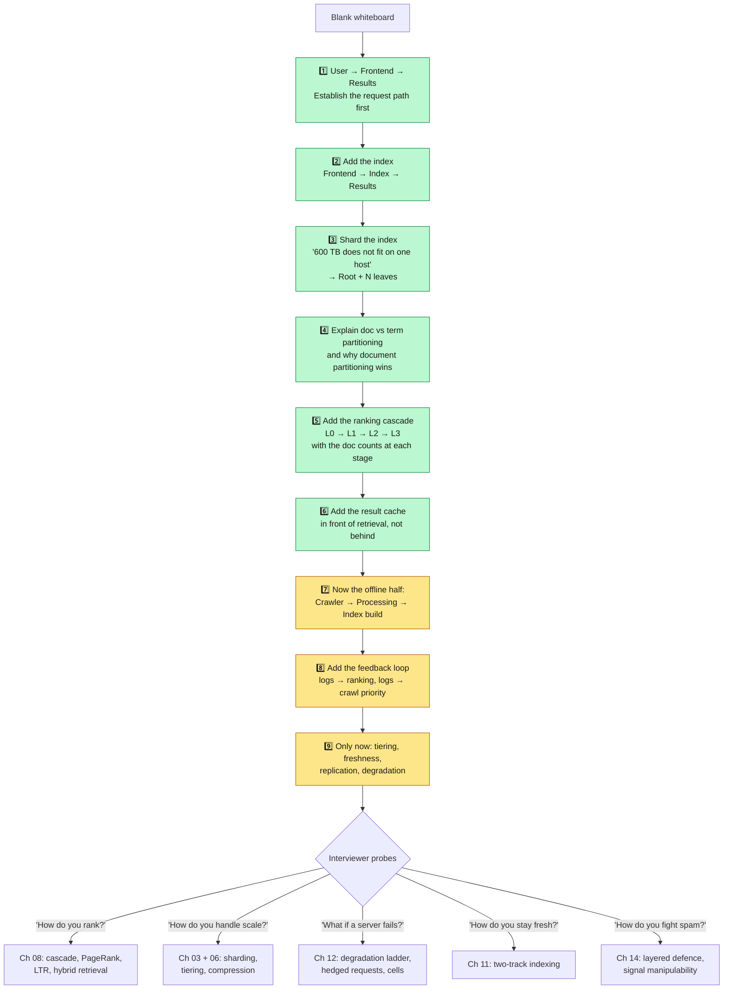
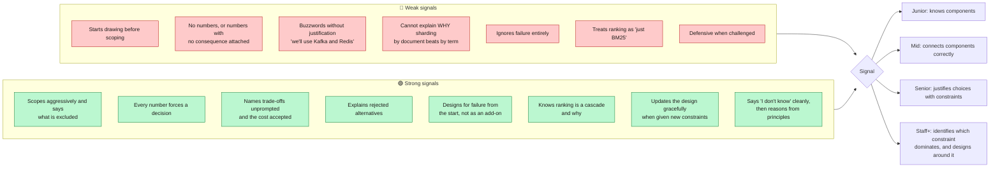

**[🇸🇦 اقرأ بالعربية](../ar/16-interview-guide.md)**

# Chapter 16 · System Design Interview Guide

**← [15 · Trade-offs](15-tradeoffs.md)** · [🏠 Home](../../README.md) · **[17 · Glossary](17-glossary.md) →**

---

## 16.1 "Design Google Search" in 45 minutes

You cannot present this entire repository in an interview. The skill being assessed is **choosing what to cover**, driving the conversation, and justifying every decision with a constraint.

> **Diagram D-75 · A 45-minute plan**

```mermaid
gantt
    title Interview time allocation (units: minutes)
    dateFormat X
    axisFormat %s

    section Scope
    Clarify requirements and cut scope    :crit, a1, 0, 5
    State assumptions out loud            :a2, 5, 7

    section Estimate
    Back-of-envelope capacity             :b1, 7, 13

    section Design
    High-level architecture (the 3 loops) :crit, c1, 13, 20
    Crawling and the frontier             :c2, 20, 26
    Indexing and sharding                 :crit, c3, 26, 33
    Serving path and ranking cascade      :crit, c4, 33, 40

    section Close
    Bottlenecks, trade-offs, failure modes :d1, 40, 44
    Questions for the interviewer          :d2, 44, 45
```

**Notice what is missing from the plan.** Storage internals, freshness pipelines, spam defence, observability, security: all absent from the baseline. They belong in your back pocket, deployed only if the interviewer steers there or you finish early. Trying to cover everything guarantees covering nothing well.

---

## 16.2 The five phases

### Phase 1: Scope (0–7 min): earn the right to design

Do not start drawing. Start by cutting the problem down to something answerable.

**Questions to ask:**
- "Web-scale public search, or a bounded corpus like enterprise search?"
- "Text only, or images, video and news too?"
- "Are ads, the Knowledge Graph and generative answers in scope?" *(Propose excluding them.)*
- "Should I optimise for relevance quality, latency, or cost?"
- "How fresh must results be: minutes or days?"

**Then state your assumptions explicitly:**

> "I will design for ~10¹¹ documents and ~10⁵ QPS with a 3× peak. Target p99 under 300 ms. Scope is text web search with a freshness path for news. Ads, Knowledge Graph and generative answers are out of scope. Tell me if you would rather I go somewhere else."

That paragraph alone signals seniority: bounded scope, named numbers, explicit exclusions, and an invitation to redirect.

### Phase 2: Estimate (7–13 min): make the numbers force the design

Do the arithmetic from [Chapter 03](03-capacity-estimation.md) out loud, and (this is the part most candidates miss) **say what each number forces**:

> "10¹¹ docs × ~1,500 tokens ≈ 1.5 × 10¹⁴ postings. At ~1.5 bytes compressed, that is ~225 TB for the inverted index, and roughly 600 TB with attachments and vectors. **That single number tells us the index cannot live on one machine and cannot be read from disk within 300 ms, so it must be sharded across thousands of RAM-resident servers. The rest of the design follows from that.**"

The estimate is not a ritual. It is the argument that justifies every box you are about to draw.

### Phase 3: High-level design (13–20 min): the three loops

Draw [Diagram D-02](01-overview.md) (discovery, freshness, query), and explain that they run at completely different clock speeds. This framing immediately demonstrates that you understand a search engine is not one pipeline, which is the single most common conceptual error.

Then draw the context diagram: crawler → processing → index build → serving, with the log feedback loop closing back to ranking and crawl priority.

### Phase 4: Deep dives (20–40 min): go where the difficulty is

Cover indexing and serving properly; treat crawling more briefly unless prompted.

> **Diagram D-76 · Whiteboard drawing order**

**Draw incrementally, and narrate the constraint before each addition.** Do not produce a finished architecture in one stroke: nobody can follow that, and it hides your reasoning. "We have 600 TB and one machine holds 512 GB, so we need about 1,200 machines; here is how the query reaches all of them" is a far stronger moment than a pre-drawn diagram with "Index Shards" already on it.

### Phase 5: Close (40–45 min): name the weaknesses yourself

Volunteer the bottlenecks before you are asked:

> "The main bottlenecks are: RAM cost for the index (which tiering addresses; tail latency from 1,600-way fan-out), which hedged requests address; and full index rebuild latency, which the incremental path addresses. The weakest part of what I have described is score reconciliation between the real-time and batch indexes; I would want to prototype that carefully."

Naming your own design's weakest point is one of the strongest signals available.

---

## 16.3 What separates strong candidates

> **Diagram D-77 · Evaluation dimensions**

---

## 16.4 Questions you should expect, with the shape of a good answer

| Question | Where to go | The one-line core |
|---|---|---|
| "How do you store 10¹¹ documents?" | [Ch 09](09-storage.md) | Separate the archive (wide-column, PB) from what you serve (inverted index, TB) |
| "Why an inverted index?" | [Ch 06](06-indexing.md) | Term-keyed lookup is sub-linear; scanning documents is not |
| "Shard by document or by term?" | [Ch 06](06-indexing.md) | By document: Zipf makes term-sharding permanently hot-spotted |
| "How do you get to 300 ms?" | [Ch 07](07-serving.md) | RAM-resident sharded index, parallel fan-out, cascaded ranking, caching |
| "One shard is slow: now what?" | [Ch 12](12-reliability.md) | Hedged requests, deadline propagation, degrade with a coverage flag |
| "How do you rank?" | [Ch 08](08-ranking.md) | A cascade: cheap scoring on many docs, expensive on few |
| "How do you index breaking news in minutes?" | [Ch 11](11-freshness.md) | A separate streaming track with approximate signals, merged at serve time |
| "How do you avoid crawling the same page forever?" | [Ch 04](04-crawling.md) | Change-rate model × value, with a feedback loop from each fetch |
| "How do you fight spam?" | [Ch 14](14-security-abuse.md) | Layered defence; trust signals inversely with how easily they are controlled |
| "What breaks first if traffic 10×?" | [Ch 03](03-capacity-estimation.md) | Index-tier QPS capacity; mitigate by more replicas of tier 0 and higher cache hit rate |
| "What would you build differently for 10⁶ docs?" | [Ch 15](15-tradeoffs.md) | Almost all of it: one machine and an off-the-shelf engine |

**That last question is a trap worth recognising.** The interviewer is checking whether you apply web-scale complexity reflexively. The correct answer is enthusiastic simplification: "At 10⁶ documents I would use a single-node search engine and no sharding at all. Everything we just discussed would be over-engineering."

---

## 16.5 A 60-second summary you should be able to deliver

> "A search engine is three loops at different speeds. A **crawler** discovers and refetches pages: the hard part is not bandwidth but prioritisation, because we know a trillion URLs and can fetch a few billion a day, and we must be polite to every host. **Processing** turns HTML into clean tokens, a link graph, and precomputed quality signals. **Index construction** inverts that into term-to-document posting lists, compressed to about 1.5 bytes per posting and sharded by document across thousands of RAM-resident servers, split into hot, warm and cold tiers because 1 % of documents answer 85 % of queries.
>
> At **query time** we understand the query, check a result cache that absorbs about 40 % of traffic, then fan out through a root and intermediate tree to every shard. Each leaf does cheap BM25-style scoring and returns its top candidates; results merge upward and pass through a ranking cascade: gradient-boosted trees on a thousand documents, then a neural cross-encoder on a hundred, because the expensive model is a hundred thousand times costlier per document than the cheap one.
>
> Everything is replicated into independent cells across regions, because a cross-continent round trip alone would consume half our latency budget. We degrade rather than fail: a missing shard means a partial result set, never an error. And every signal that site owners control is assumed to be adversarially manipulated, so ranking leans on signals they cannot easily fake."

If you can say that fluently, you understand the system. Everything else in this repository is the supporting detail.

---

**← [15 · Trade-offs](15-tradeoffs.md)** · [🏠 Home](../../README.md) · **[17 · Glossary](17-glossary.md) →** · [🇸🇦 العربية](../ar/16-interview-guide.md)

