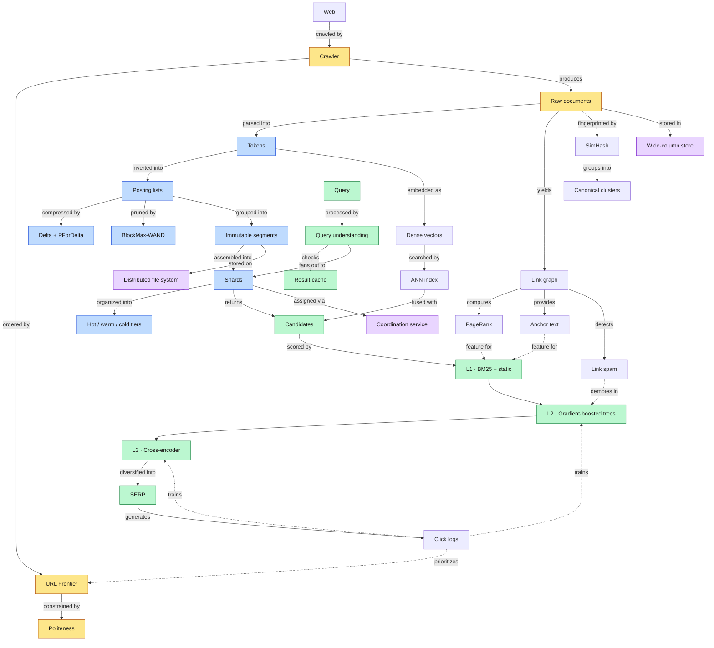

**[🇸🇦 اقرأ بالعربية](../ar/17-glossary.md)**

# Chapter 17 · Bilingual Glossary & Sources

**← [16 · Interview Guide](16-interview-guide.md)** · [🏠 Home](../../README.md)

---

## 17.1 How the concepts connect

> **Diagram D-78 · Concept map**

---

## 17.2 Glossary: English ⇄ العربية

### Crawling

| English | العربية | Meaning |
|---|---|---|
| Crawler / Spider | زاحف / عنكبوت | Program that fetches web pages automatically |
| URL Frontier | حدود الروابط | Prioritised queue of URLs waiting to be fetched |
| Politeness | التهذيب | Limiting request rate to any one host or IP |
| Crawl budget | ميزانية الزحف | Fetch capacity allocated to a site or pattern |
| `robots.txt` | ملف الروبوتات | Site-declared crawling permissions |
| Conditional GET | الطلب الشرطي | Fetch using `If-Modified-Since` / `ETag` |
| Recrawl scheduling | جدولة إعادة الزحف | Deciding when to refetch a known page |
| Change rate (λ) | معدل التغيّر | Estimated frequency of page modification |
| Crawler trap | مصيدة الزاحف | URL space designed or accidentally able to trap a crawler |
| Cloaking | التمويه | Serving different content to crawlers than to users |
| Canonicalization | التوحيد القياسي | Reducing URL variants to one canonical form |
| SimHash | سِمهاش | Locality-sensitive fingerprint for near-duplicate detection |
| Bloom filter | مرشّح بلوم | Probabilistic set-membership structure, no false negatives |

### Indexing

| English | العربية | Meaning |
|---|---|---|
| Inverted index | الفهرس المقلوب | Map from term to the list of documents containing it |
| Forward index | الفهرس الأمامي | Map from document to its content and attributes |
| Posting / Posting list | مدخلة / قائمة ترحيل | One entry per term occurrence; the list for one term |
| Lexicon / Term dictionary | المعجم / قاموس المصطلحات | All distinct terms with their statistics and pointers |
| Document frequency (df) | تكرار الوثائق | Number of documents containing a term |
| Term frequency (tf) | تكرار المصطلح | Occurrences of a term within one document |
| IDF | تكرار الوثائق العكسي | Inverse document frequency: rarity weighting |
| BM25 | بي‑إم ٢٥ | Standard probabilistic term-scoring function |
| Delta encoding | ترميز الفروق | Storing gaps between sorted values instead of values |
| Variable-byte / PForDelta | بايت متغير / بي‑فور‑دلتا | Integer compression codecs for posting lists |
| Skip pointers | مؤشرات القفز | Jump table enabling sub-linear seeks in a posting list |
| BlockMax-WAND | بلوك‑ماكس واند | Exact top-k pruning using per-block score bounds |
| Shard | شظية | A partition of the index held by one server set |
| Segment | مقطع | An immutable unit of index data |
| Compaction / Merge | الدمج | Combining small segments into larger ones |
| Tombstone | شاهد قبر | Deletion marker applied at read time |
| Index tiering | طبقات الفهرس | Splitting the index into hot, warm and cold tiers |
| LSM tree | شجرة الدمج المهيكلة بالسجل | Write-optimised structure: memtable + immutable sorted files |

### Serving & Ranking

| English | العربية | Meaning |
|---|---|---|
| Fan-out | التوزيع | Sending one request to many servers in parallel |
| Root / Leaf server | خادم الجذر / الأوراق | Aggregator and shard-holding servers |
| Mixer / Blender | الخالط / المُدمِج | Component that combines verticals into one SERP |
| SERP | صفحة نتائج البحث | Search engine results page |
| Tail latency | زمن الذيل | High-percentile latency, p99 and beyond |
| Hedged request | الطلب المُحوَّط | Duplicate request to another replica after a delay |
| Tied request | الطلب المربوط | Two replicas race; each cancels the other on start |
| Deadline propagation | تمرير الموعد النهائي | Passing remaining time budget down each hop |
| Ranking cascade | تتالي الترتيب | Successive stages, each costlier and on fewer docs |
| Learning to rank (LTR) | التعلم للترتيب | Training a model to order results |
| LambdaMART | لامدا‑مارت | Listwise LTR algorithm optimising NDCG directly |
| NDCG | إن‑دي‑سي‑جي | Normalised discounted cumulative gain: ranking quality metric |
| Bi-encoder | المشفّر الثنائي | Encodes query and document separately; enables retrieval |
| Cross-encoder | المشفّر التقاطعي | Encodes query and document together; more accurate re-ranking |
| ANN search | بحث الجيران التقريبيين | Approximate nearest-neighbour vector search |
| HNSW | إتش‑إن‑إس‑دبليو | Graph-based ANN index structure |
| Hybrid retrieval | الاسترجاع الهجين | Combining lexical and dense retrieval |
| Reciprocal Rank Fusion | دمج الرتب المتبادل | Rank-based fusion needing no score calibration |
| Position bias | تحيز الموضع | Users click higher results regardless of relevance |
| Query-biased snippet | مقتطف منحاز للاستعلام | Passage selected because it matches the query |

### Infrastructure

| English | العربية | Meaning |
|---|---|---|
| Distributed file system | نظام ملفات موزّع | Append-optimised storage across many machines |
| Wide-column store | مخزن أعمدة عريضة | Sparse, versioned, row-key-sorted table store |
| Tablet | لوحة | A contiguous row-key range in a wide-column store |
| SSTable | جدول مرتَّب ثابت | Immutable sorted file of key-value pairs |
| Coordination service | خدمة التنسيق | Consensus-backed store for locks, config and election |
| Paxos / Raft | باكسوس / رافت | Consensus algorithms |
| Erasure coding | ترميز المحو | Redundancy with lower overhead than full replication |
| Cell | خلية | A complete, independent serving stack |
| Anycast | إنيكاست | One IP announced from many locations |
| Consistent hashing | التجزئة المتسقة | Mapping that minimises remapping when nodes change |
| Load shedding | إسقاط الحمل | Deliberately rejecting work under overload |
| Circuit breaker | قاطع الدارة | Stops calling a failing dependency |
| Retry budget | ميزانية الإعادة | Cap on the share of traffic spent on retries |
| Graceful degradation | التدهور التدريجي | Reducing quality instead of failing |
| Blast radius | نطاق الانفجار | Scope of impact of a single failure |
| SLI / SLO / Error budget | مؤشر / هدف / ميزانية الخطأ | Measure, promise, and allowance for failure |
| Write amplification | تضخيم الكتابة | Bytes written to storage per byte of logical change |
| Read amplification | تضخيم القراءة | Reads performed per logical read |

### Trust & Safety

| English | العربية | Meaning |
|---|---|---|
| Web spam | سبام الويب | Content or links created to manipulate ranking |
| Link farm | مزرعة روابط | Network of sites cross-linking to inflate authority |
| TrustRank | ترست رانك | Trust propagated from hand-vetted seed sites |
| Negative SEO | السيو السلبي | Attacking a competitor with toxic links |
| Keyword stuffing | حشو الكلمات المفتاحية | Excessive repetition of terms to manipulate scoring |
| Doorway page | صفحة مدخلية | Page built only to capture traffic and redirect |
| SSRF | تزوير الطلبات من جانب الخادم | Inducing a server to fetch attacker-chosen addresses |
| DNS rebinding | إعادة ربط DNS | Changing an IP between validation and connection |
| k-anonymity | إخفاء الهوية بـk | Each record indistinguishable from k−1 others |
| Differential privacy | الخصوصية التفاضلية | Adding calibrated noise to protect individuals |
| Data minimization | تقليل البيانات | Collecting and retaining as little as possible |

---

## 17.3 Annotated sources

All publicly available. This repository is a synthesis of these; none of it is internal information.

| Paper | Year | Contribution used here | Chapters |
|---|:--:|---|:--:|
| Brin & Page, *The Anatomy of a Large-Scale Hypertextual Web Search Engine* | 1998 | Original architecture, PageRank, anchor text | 01, 08 |
| Barroso, Dean, Hölzle, *Web Search for a Planet* | 2003 | Commodity hardware, replication over reliability | 01, 12 |
| Ghemawat, Gobioff, Leung, *The Google File System* | 2003 | Chunked append-oriented DFS, at-least-once semantics | 09 |
| Dean & Ghemawat, *MapReduce* | 2004 | Batch index construction, the shuffle as the cost centre | 06 |
| Chang et al., *Bigtable* | 2006 | Wide-column model, row-key design, tablets | 09 |
| Burrows, *The Chubby Lock Service* | 2006 | Coordination, leader election, watch/notify | 09, 12 |
| Manku, Jain, Sarma, *Detecting Near-Duplicates for Web Crawling* | 2007 | SimHash at web scale, permuted-table lookup | 04 |
| Dean, *Challenges in Building Large-Scale IR Systems* (WSDM keynote) | 2009 | Index tiering, serving-system evolution | 03, 06 |
| Peng & Dabek, *Large-scale Incremental Processing Using Distributed Transactions and Notifications* (Percolator) | 2010 | Observers, incremental indexing, transactions over Bigtable | 11 |
| Sigelman et al., *Dapper* | 2010 | Sampled distributed tracing, RPC-layer instrumentation | 13 |
| Corbett et al., *Spanner* | 2012 | Globally consistent transactions with bounded clock uncertainty | 09 |
| Dean & Barroso, *The Tail at Scale* | 2013 | Hedged and tied requests, tail-tolerant design | 07, 12 |
| Verma et al., *Large-scale cluster management at Google with Borg* | 2015 | Cluster scheduling, task churn as normal | 09, 12 |
| Singh et al., *Jupiter Rising* | 2015 | Clos datacenter fabric, bisection bandwidth | 09 |
| Eisenbud et al., *Maglev* | 2016 | Software L4 load balancing, consistent hashing | 12 |
| Gyöngyi, Garcia-Molina, Pedersen, *Combating Web Spam with TrustRank* | 2004 | Trust propagation from vetted seeds | 14 |
| Manning, Raghavan, Schütze, *Introduction to Information Retrieval* | 2008 | Frontier design, index compression, IR fundamentals | 04, 06, 08 |
| Broder et al., *Efficient Query Evaluation using a Two-Level Retrieval Process* (WAND) | 2003 | Dynamic pruning during posting traversal | 06 |
| Ding & Suel, *Faster Top-k Document Retrieval Using Block-Max Indexes* | 2011 | Block max-scores, exact pruning | 06 |
| Charikar, *Similarity Estimation Techniques from Rounding Algorithms* | 2002 | SimHash construction | 04 |

### Suggested reading order for the papers

1. *Web Search for a Planet*: the cheapest way to absorb the overall philosophy
2. *The Anatomy of a Large-Scale Hypertextual Web Search Engine*: the original design, still remarkably readable
3. *The Google File System* → *Bigtable* → *MapReduce*: the storage and compute foundation, in dependency order
4. *The Tail at Scale*: short, and it changes how you think about distributed latency permanently
5. *Percolator*: how batch systems become incremental
6. *Introduction to Information Retrieval*: the textbook to consult when a detail is unclear

---

**← [16 · Interview Guide](16-interview-guide.md)** · [🏠 Home](../../README.md) · [📐 Diagram index](../../diagrams/README.md) · [🇸🇦 العربية](../ar/17-glossary.md)

**🎉 You have reached the end. If this was useful, a ⭐ helps others find it.**

